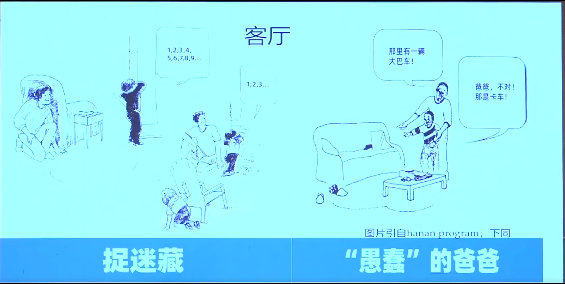
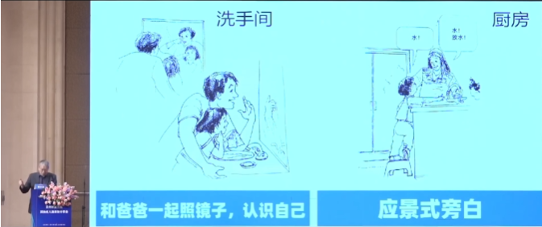
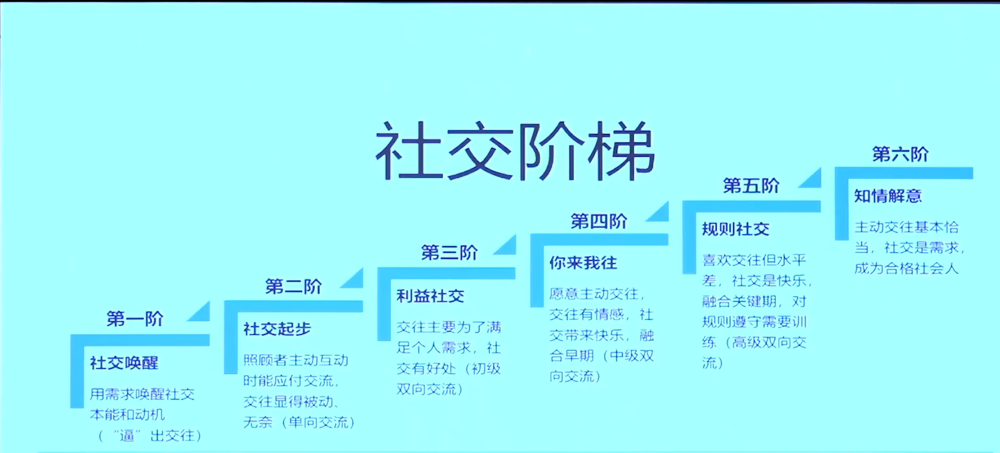
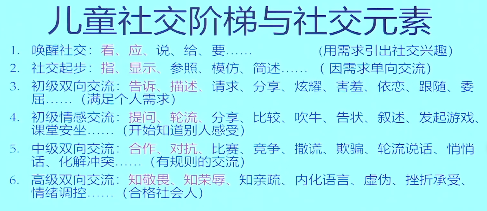
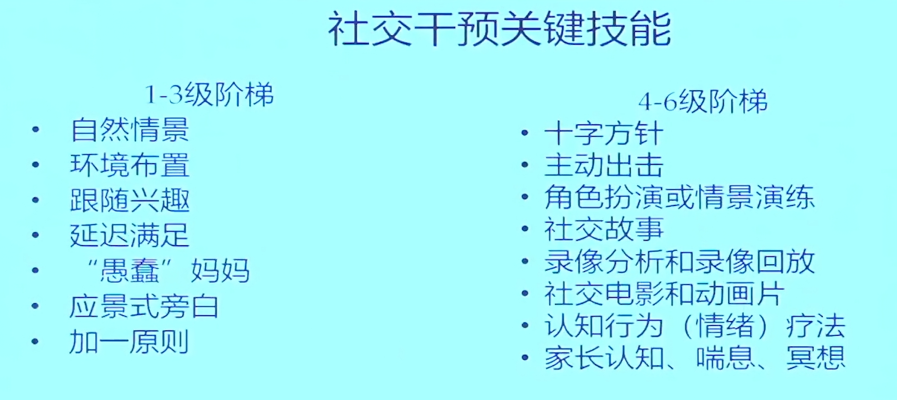
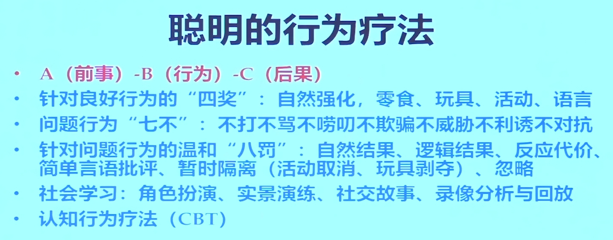
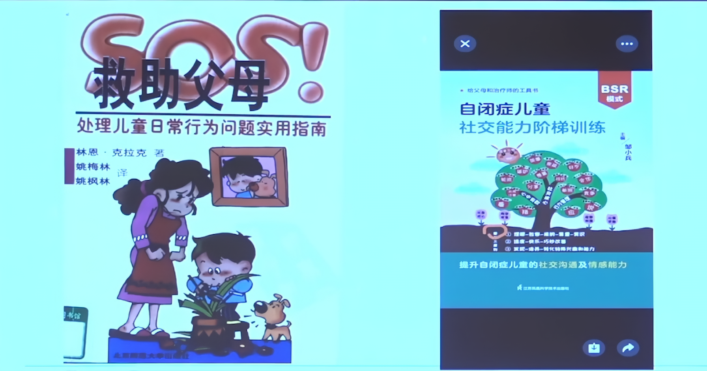

# 干预三原则
1. 理解包容接纳尊重赏识
2. 快乐适度巧妙的提升社交能力，改善情绪和行为问题
3. 发现培养转化兴趣和能力
# 家庭干预
以行为疗法为主要手段
以结构化教育模式为基本框架
以社会交往和情绪调控为核心内容
# 实践

- 自然情景：家庭、小区、幼儿园：快乐有趣，应景式旁白
	- 客厅
		- 捉迷藏，找东西，愚蠢的爸爸
		- 
	- 小区
		- 滑滑梯，荡秋千，交流最重要
	- 洗手间，厨房
		- 
# 社交核心
- 社交阶梯：处在哪个社交阶梯
- 社交元素：这个阶梯有哪些社交元素
- 社交游戏：可以改善社交元素的游戏
- 关键技术：应景旁白，角色扮演，录像回放
## 社交阶梯

## 社交元素

