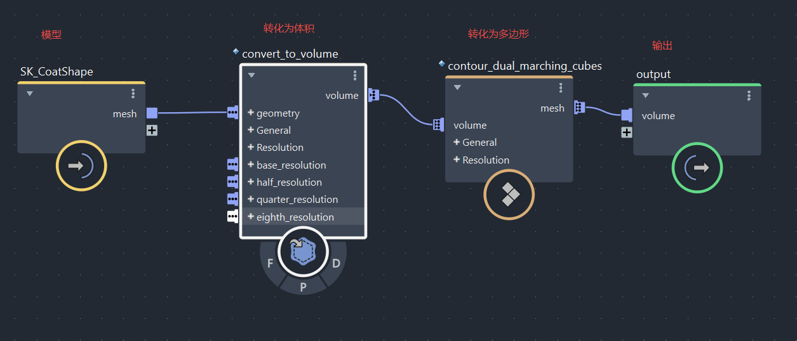
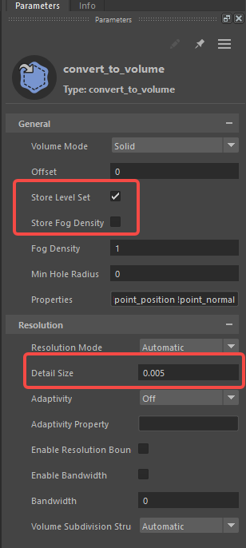
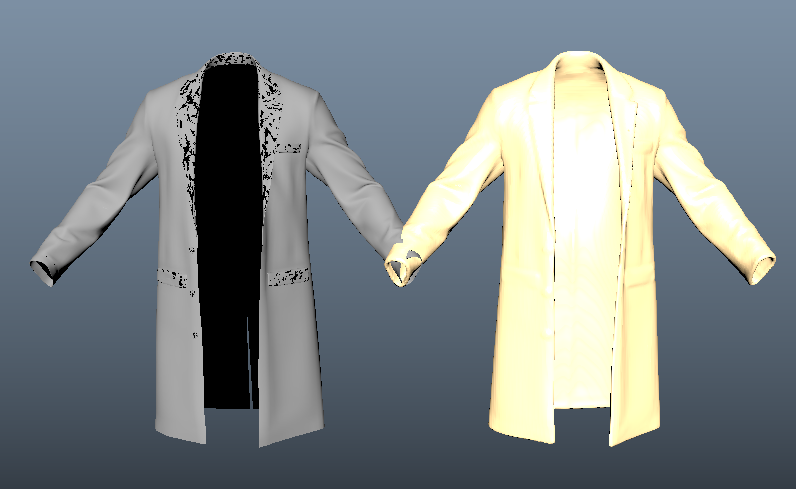
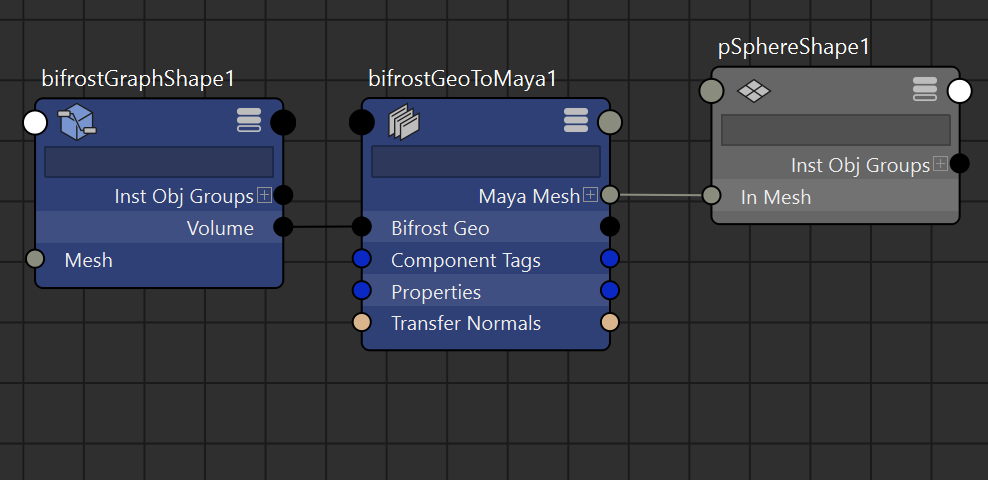
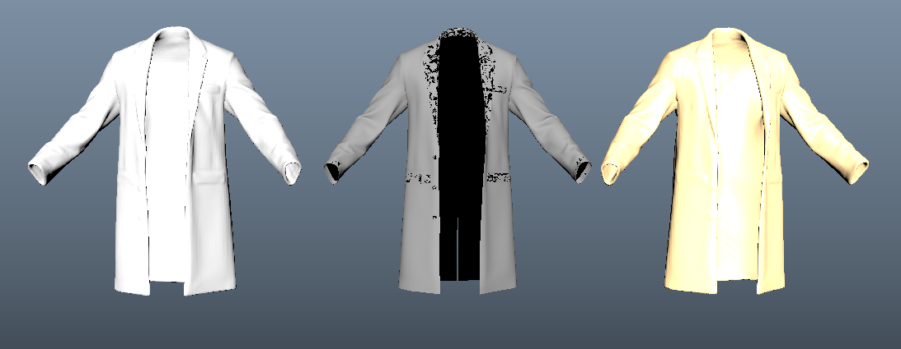
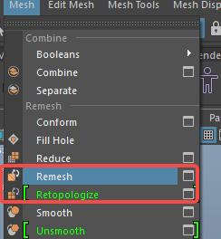
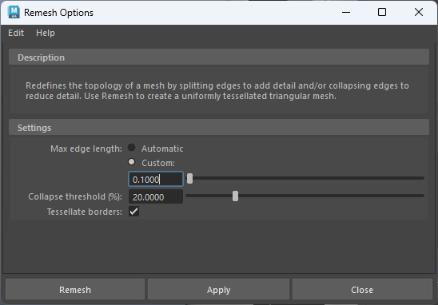
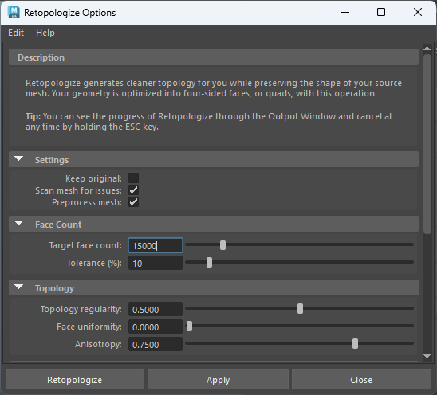
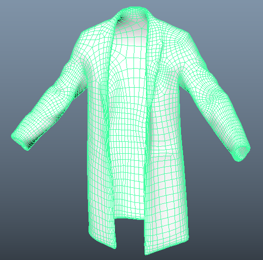

https://www.youtube.com/watch?v=p6EuH5o_CuQ
# Bifrost逻辑编写
- 在BifrostGraphEditor中，将模型中键拖入，然后链接节点如下
- 
- convert_to_volume节点：把 输入的几何体（geometry，通常是 polygon mesh 多边形网格） 转换成一个 Bifrost volume（体积数据），最常见的是生成 signed distance field（有符号距离场，level set）。
- 
- 关键参数（最常调节的几个）
	- **detail size** / **voxel size** 体素大小，越小精度越高（但内存和计算量爆炸式增长）。这是决定最终质量的最重要参数。
	- **adaptivity** 自适应分辨率（0=均匀网格，1=最激进的自适应）。值越大，在平坦区域用更粗的 voxel，尖锐/细节处保留高分辨率。常设 0.6~0.9。
	- **offset distance** / **thickness** 向内/外偏移距离，常用来给薄片加厚度，或创建“壳”效果。
	- **output type**
	    - Level set（signed distance，最推荐，后续 meshing 质量最好）
	    - Fog volume（密度场，用于烟雾、云等渲染）
	- **properties to carry over** 可以选择把输入网格的 point 属性（如 Cd 颜色、velocity）也转换成对应的 volume field。
- 此时场景中便有了代理模型
- 
- contour_dual_marching_cubes：把 signed distance field（有符号距离场） 或其他 level set 体积数据（通常是 voxel 体积），转换成一个 Bifrost 多边形网格（polygon mesh）。
# 节点编辑器

- 加入创建的Bifrost节点并连接一个bifrostGeoToMaya节点
- 创建一个polySphere，删除历史，并将 MayaMesh 连接的 InMesh
- 这样小球就变成了代理模型，删除他的历史，就可以用来重新拓扑了
- 
# 重新拓扑

- Remesh
- 
- Retopologize
- 
- 根据自己的需求调整数值
- 
- 