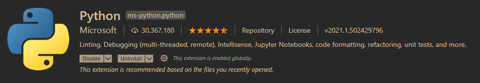
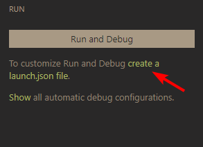
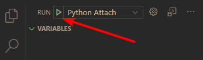

 Dec 25, 2020  Aleksandar Kocić

Debugging your python code in Maya is particularly painful subject, for sure.

> Proper debugging. With a debugger…

I’ve tried many times and gave up. Setting it all up and making it work is just way too much of a hassle. I know some people have made it work with [pycharm](https://www.jetbrains.com/pycharm/) but

- a) I dont use pycharm and
- b) I still think there are some issues there (more info [here](https://github.com/juggernate/PyCharm-Maya-Debugging), [here](https://discourse.techart.online/t/debugging-maya-tools-with-pycharm-2020-1/12594), and [here](https://plugins.jetbrains.com/plugin/8218-mayacharm)).

This post is about [vscode](https://code.visualstudio.com/) and for a long time a “go to” debugger was [ptvsd](https://github.com/microsoft/ptvsd). Here are quick instructions how to use it to debug python in maya: [link](https://iwonderwhatjoeisworkingon.blogspot.com/2017/04/debugging-maya-using-visual-studio-code.html) and [link](https://gist.github.com/nafeesb/19a1d07fe35fb018d23779fe7c8865e5).

However, Microsoft has since deprecated ptvsd in favor of [debugpy](https://github.com/microsoft/debugpy). The way to use it is pretty much the same with minor difference in code that needs to be run so here it is (replicating Joseph Yu’s steps for comparison):

1. Download and install [Visual Studio Code](https://code.visualstudio.com/download)
2. Install the official [Python Extension](https://marketplace.visualstudio.com/items?itemName=ms-python.python)
3. Grab the latest release of [debugpy as a zip](https://github.com/microsoft/debugpy/releases/)
4. Extract `scr/debugpy` into `documents/maya/scripts/debugpy`
5. Open Maya and run:
    
    ```
    import os
    import debugpy
    mayapy_exe = os.path.join(os.environ.get("MAYA_LOCATION"), "bin", "mayapy")
    debugpy.configure(python=mayapy_exe)
    debugpy.listen(5678)
    ```
    
6. Open your project in vscode and create `launch.json` (you can do this manually really):
7. Open `.vscode/launch.json` and replace the default content with:
    
    ```
    {
     "version": "0.2.0",
     "configurations": [
         {
             "name": "Python Attach",
             "type": "python",
             "request": "attach",
             "port": 5678,
             "host": "127.0.0.1",
         }
     ]
    }
    ```
    
8. Click `Start Debugging`:

You may now place your breakpoints and call the code from Maya.

#### [](https://www.aleksandarkocic.com/2020/12/25/debugging-in-maya-with-debugpy-and-vscode/#useful-links)Useful links

- [relevant github issue](https://github.com/microsoft/debugpy/issues/262)
- [debugpy on pypi](https://pypi.org/project/debugpy/)
- [Debugging in Maya with debugpy and VSCode - Aleksandar Kocic | Pipeline TD](https://www.aleksandarkocic.com/2020/12/25/debugging-in-maya-with-debugpy-and-vscode/)