原官方文档参考地址：[Help (autodesk.com)](https://help.autodesk.com/view/MAYAUL/2024/ENU/?guid=Maya_SDK_Setting_up_your_build_Windows_environment_64_bit_html)
# 开发环境搭载
## 下载maya SDK
- 首先，要开发Maya插件，必须先下载Maya的SDK，在下面这个链接：[https://aps.autodesk.com/developer/overview/maya](https://aps.autodesk.com/developer/overview/maya)
- 找到maya对应版本的DevKit并下载
- 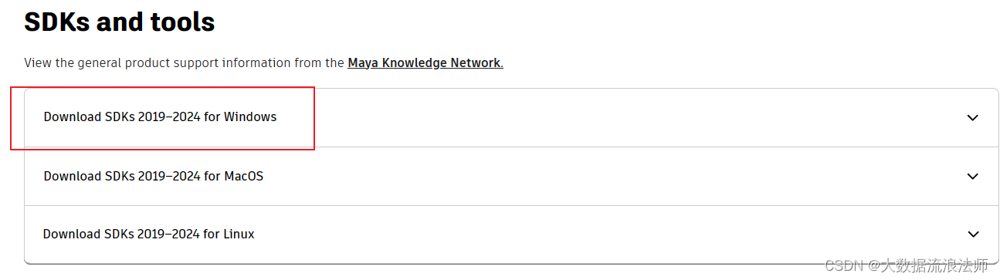
- 下载完成后解压可得到devkitBase文件夹，将其放置到`C:\Users\<Username>`路径下
- 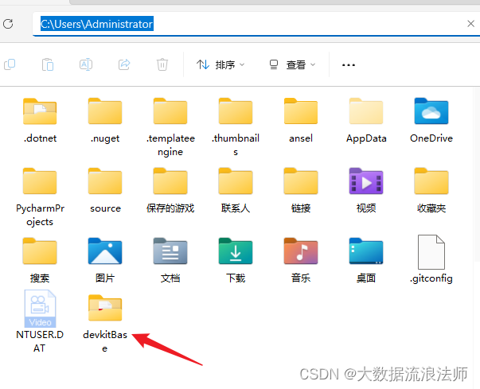
- 接下来需要你在这个`devkitBase`里创建一个空文件夹，叫做`plug-ins`，这个`plug-ins`文件夹就是我们存储创建好的插件和脚本的地方。在`plug-ins`文件夹，依次创建三个新的文件夹，名字分别叫做`plug-ins`, `scripts`, `icons`。
- 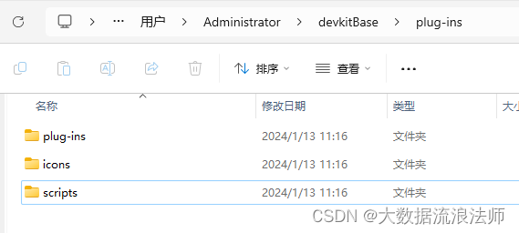
## 设置maya环境变量
- 在对应版本的maya文档中找到`Maya.env`文件，此文件一般在`C:\Users\<Username>\Documents\maya\<maya version>\Maya.env`
- 添加三个环境变量，格式如下:
```
MAYA_PLUG_IN_PATH=C:\Users\<Username>\devkitBase\plug-ins\plug-ins
MAYA_SCRIPT_PATH=C:\Users\<Username>\devkitBase\plug-ins\scripts
XBMLANGPATH=C:\Users\<Username>\devkitBase\plug-ins\icons
```
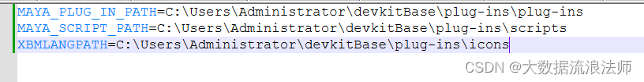
这样设置之后，Maya就会自动的从这些目录里找我们开发好的插件，如果你不设置的话，你就只能在Maya的`Plug-ins Manager`里手动找插件和脚本的位置然后加载了
## 设置系统环境变量
- 如果你安装了不止一个版本的Maya，那设置电脑上的全局环境变量，会导致多个Maya之间的变量冲突，所以如果你安装了多个Maya，这几个环境变量需要`在你打开你编译你的插件和应用的地方的CMD窗口里`设置`临时环境变量`。也就是`set` 的方式。
```
 set DEVKIT_LOCATION=C:\Users\<Username>\devkitBase\
 set MAYA_LOCATION="C:\Program Files\Autodesk\<maya_version>"
 set PATH=%PATH%;%MAYA_LOCATION%\bin
```
这里注意如果路径里有空格，则整个路径都要用 `" "` 包裹起来，就像这样，如果不包裹，那后面的步骤`CMAKE`的时候就会报错
- 如果只安装了一个版本的maya,则直接设置全局环境变量
	- 第一个是`DEVKIT_LOCATION`，这个是你的`Maya devkit`的安装位置，对于我来说这个值应该是这个目录：`C:\Users\Administrator\devkitBase\`,这里要注意结尾必须有`"\"`。
	- 第二个是`MAYA_LOCATION`，这个必须直接指向你的Maya对应版本的安装位置，`C:\Program Files\Autodesk\<maya version>`。
	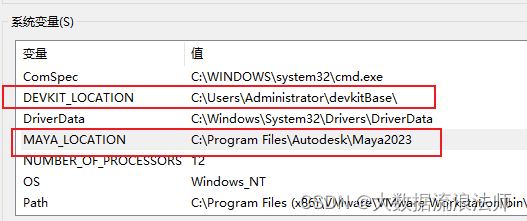
	- 第三个就是Maya的bin目录了，刚才我们设置了`MAYA_LOCATION`这个变量，它指向的目录下面就有一个Maya的bin目录，如下图所示，路径为：`C:\Program Files\Autodesk\<maya version>\bin`。所以我们要在我们的`PATH`环境变量里添加这个：`%MAYA_LOCATION%\bin`
	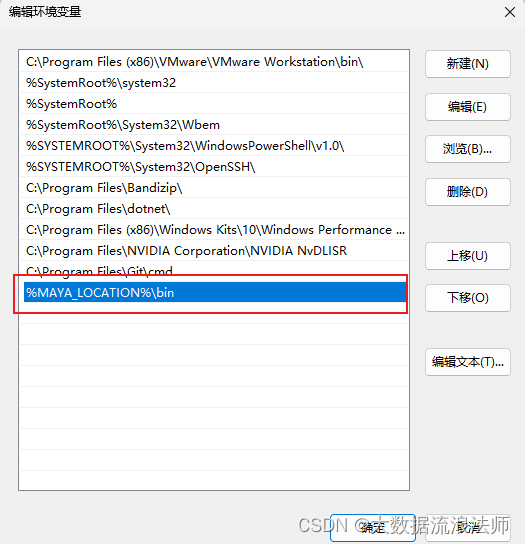
# 编译测试插件
## 安装CMake
- 下载并安装CMake，地址：[Download CMake](https://cmake.org/download/)
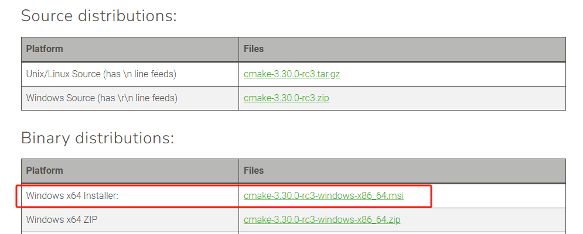
## 创建CMakeList
- 详细参数解释参见[MAYA的MakeLists文件解析](MAYA的MakeLists文件解析.md)
- 在 `C:\Users\Administrator\devkitBase\plug-ins\plug-ins\` 文件夹下面创建`CMakeLists.txt`，输入以下内容：
```cmake
cmake_minimum_required(VERSION 3.22.1)

set(PROJECT_NAME helloWorld)
project(${PROJECT_NAME})

include($ENV{DEVKIT_LOCATION}/cmake/pluginEntry.cmake)

set(SOURCE_FILES
    helloWorld.cpp
    helloWorld.h
)

set(LIBRARIES
    OpenMaya Foundation
)

build_plugin()
```
## 创建C++代码
- 创建一个`helloWorld.cpp`，输入以下内容
```cpp
#include <stdio.h>
#include <maya/MString.h>
#include <maya/MArgList.h>
#include <maya/MFnPlugin.h>
#include <maya/MPxCommand.h>
#include <maya/MIOStream.h>

class helloWorld : public MPxCommand
{
    public:
        MStatus doIt( const MArgList& args );
        static void* creator();
};

MStatus helloWorld::doIt( const MArgList& args ) {
    cout << "Hello World " << args.asString( 0 ).asChar() << endl;
    return MS::kSuccess;
}

void* helloWorld::creator() {
    return new helloWorld;
}

MStatus initializePlugin( MObject obj ) {
    MFnPlugin plugin( obj, "Autodesk", "1.0", "Any" );
    plugin.registerCommand( "HelloWorld", helloWorld::creator );
    return MS::kSuccess;
}

MStatus uninitializePlugin( MObject obj ) {
    MFnPlugin plugin( obj );
    plugin.deregisterCommand( "HelloWorld" );
    return MS::kSuccess;
}
```
## 创建编译环境
- 如果没有设置系统全局变量，请先设置临时全局变量
```
MAYA_PLUG_IN_PATH=C:\Users\<Username>\devkitBase\plug-ins\plug-ins
MAYA_SCRIPT_PATH=C:\Users\<Username>\devkitBase\plug-ins\scripts
XBMLANGPATH=C:\Users\<Username>\devkitBase\plug-ins\icons
```
- 打开CMD命令控制台，切换到这个目录，运行这个命令：

```
cmake . -Bbuild -G "Visual Studio 17 2022"
```
> [!INFO]说明
> cmake后面的 . 代表当前目录， -B代表构建目录的名称，后面可以紧跟着也可以空格隔开你指定的构建目录的名称，这里我们指定的是build，-G选项用于指定生成器（Generator）或构建系统的名称，这里指的是使用VisualStudio构建，C++标准为C++17，版本号为Visual Studio 2022版本。

- 运行后会在当前目录下生成一个`build`目录，目录下面就是一个VisualStudio项目。
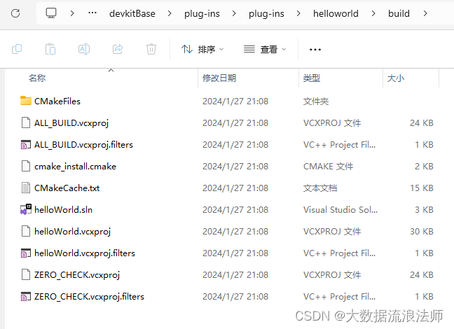
- 现在我们就可以打开这个`helloWorld.sln`进行编译了。  切换到Release X64，进行编译。
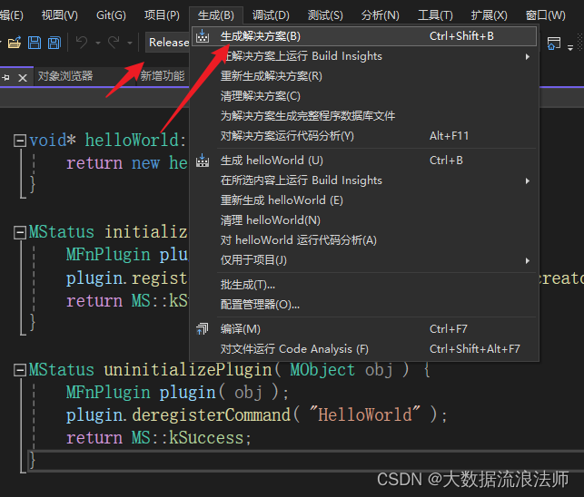
- 编译完成后目录下出现`Release`目录，下面有个`.mll`文件，这就是编译好的插件
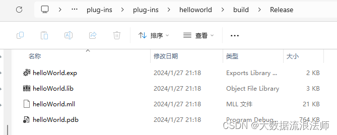
- 当然你选Debug也行，只不过出来的文件是在Debug目录下面，不要死按步骤来，灵活学习这个过程的本质）
# 使用插件
- 进入Maya，使用Plug-in Manager（插件管理器）导入插件，或者把插件复制到plug-ins目录下面。
原理就是maya运行时会自动加载你之前设置好的plug-ins目录下面的插件，如果不直接放在plug-ins目录下，那就加载不到。
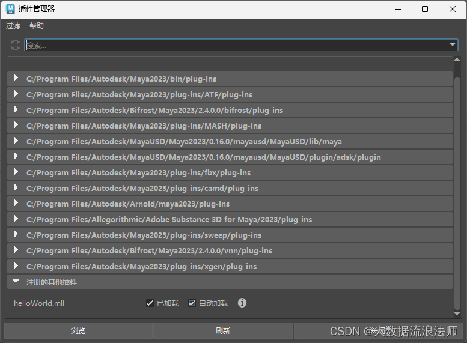
- 打开script editor，输入命令：`HelloWorld`
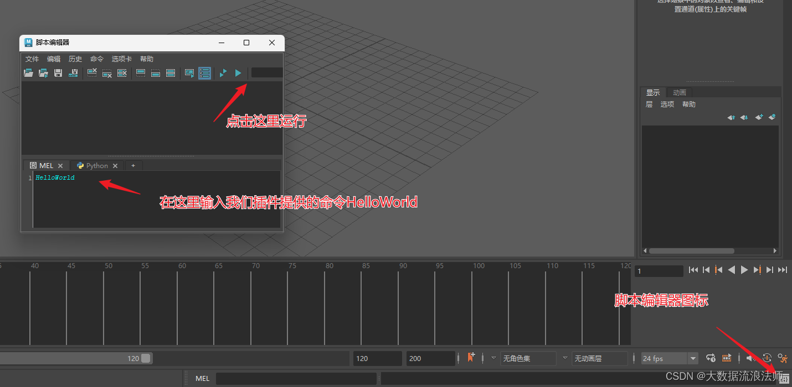
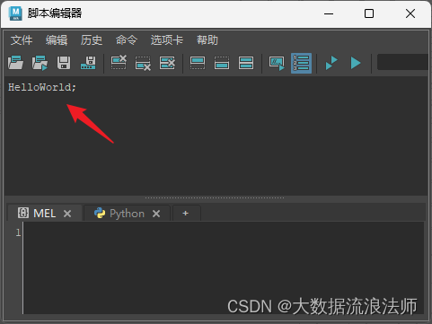
# 代码解释
1. 首先就是`doIt()`函数，它的作用是解析传递过来的参数列表，然后把它输出到Maya的output窗口
```cpp
MStatus helloWorld::doIt( const MArgList& args ) {
    cout << "Hello World " << args.asString( 0 ).asChar() << endl;
    return MS::kSuccess;
}
```
-  `MArgList` 会收集传递过来的参数并把它们放到一个列表里，它就和C++的`main`方法里接收的`argc`和`argv`的概念比较类似，就是纯用来接收参数的这么一个数据类型。
- `asString()`会把参数列表转换为一个`MString`对象，然后`asChar()`把`MString`又转换为C++的`char *`类型，这样才能交给`cout`进行输出。
- Maya的官方文档提到，在更加复杂的插件里，`doIt()`的作用一般是解析参数，设置内部变量的值，或者做其他准备性的工作，`doIt()`会在调用`redoIt()`之前完成这些工作，然后`redoIt()`才是真正调用command命令的地方。
>[!INFO] 解释
>- 可能突然又出现个redoIt()你不知道这是干嘛的，这里就不得不提到Maya的设计了，如果你设计的这个插件的这个命令是可以被撤销的，那doIt()里只能放准备工作的代码，真正执行命令的代码要放到redoIt()，然后你还得额外提供一个undoIt()来撤销redoIt()里干的事情，这个就是Maya的一种设计规范，还是有点麻烦的不如Blender封装的好，不过更低的粒度意味着我们有更多的空间来开发出更强大的插件，所以其实是好事儿。
>- 当然，如果你的插件提供的命令是不可撤销的，那就不用实现`redoIt()`和`undoIt()`了，比如只是简单的打印几个字符串输出之类的，但是大部分对数据对象的操作我们都需要提供可以撤销的命令，不然不小心用错了没法撤销是很严重的事情。
2. 接下来看插件的命令，插件的命令是使用`creator()`来实例化的。
```cpp
void* helloWorld::creator() 
{
return new helloWorld; 
}
```
3. 然后是初始化插件和取消插件的初始化
```cpp
MStatus initializePlugin( MObject obj ) {
    MFnPlugin plugin( obj, "Autodesk", "1.0", "Any" );
    plugin.registerCommand( "HelloWorld", helloWorld::creator );
    return MS::kSuccess;
}

MStatus uninitializePlugin( MObject obj ) {
    MFnPlugin plugin( obj );
    plugin.deregisterCommand( "HelloWorld" );
    return MS::kSuccess;
}
```
- 所有的Maya插件都需要实现`initializePlugin()`和`uninitializePlugin()`函数，如果`initializePlugin()`函数运行失败了，则整个插件都无法成功加载，`initializePlugin()`函数里会调用`registerCommand()`来注册一个新的命令，`uninitializePlugin()`函数会调用`deregisterCommand()`来取消一个命令的注册。
- 可以说`initializePlugin()`和`uninitializePlugin()`函数就是Maya插件的入口点，`initializePlugin()`函数一般会注册比如命令，节点，工具，以及其它额外的东西，`uninitializePlugin()`函数则是在插件卸载的时候要执行的操作，他会把插件在加载时注册的东西全部取消注册一遍。
- 对于一个命令类插件，`initializePlugin()`必须得调用`registerCommand()`，`uninitializePlugin()`函数必须得调用`deregisterCommand()`。
- 对于一个依赖节点类型插件(dependency node)，`initializePlugin()`必须调用`registerNode()`来注册命令，同样，`uninitializePlugin()`函数必须得调用`deregisterNode()`
- 因为`initializePlugin()`和`uninitializePlugin()`函数就是Maya插件的入口点，所以如果你的Maya插件代码里不提供这俩函数的话，基本上插件是无法被Maya加载的。