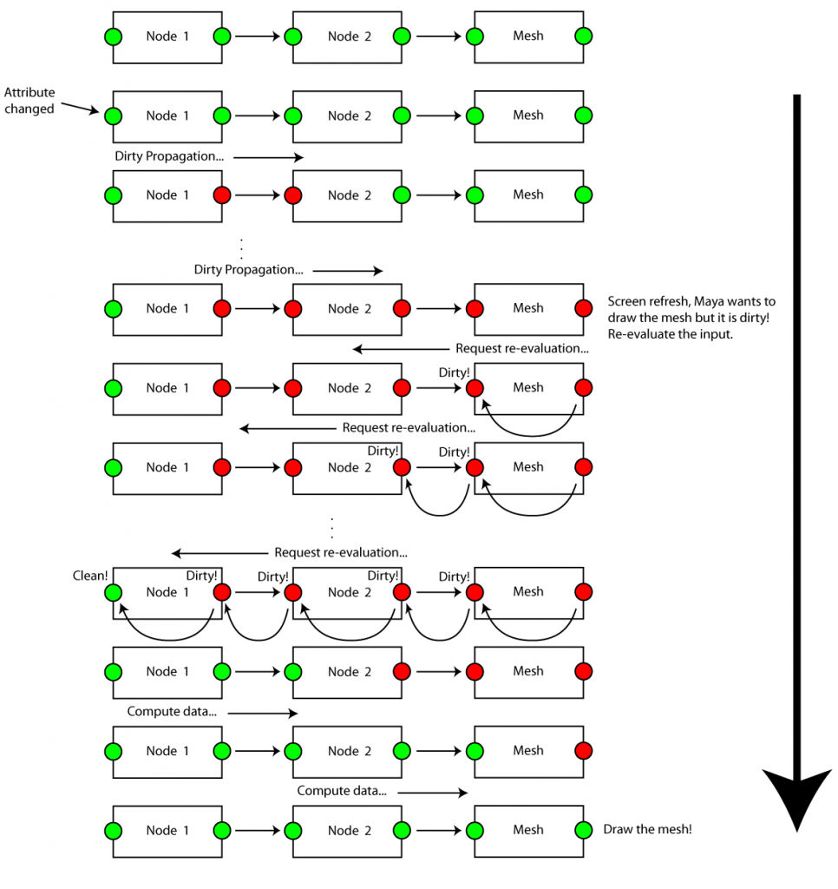
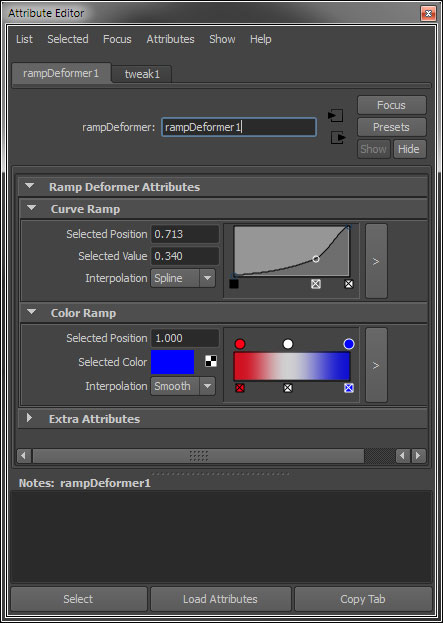

From [Chad Vernon](https://chadvernon.com/):[Maya API Programming | Chad Vernon](https://www.chadvernon.com/maya-api-programming/)
# Maya API Programming 玛雅API编程 

Check out my Introduction to the Maya API video series at [CGCircuit](http://www.cgcircuit.com/course/introduction-to-the-maya-api?affid=ef44e69526a3d370b2fdcd141b5e0e2710ed9c1ed68109c0d58e39a516ec0cb16af1166111d27e654aca6abdfecc0a850cc048bbf30827c68fc655f3f465b707):请观看我在 CGCircuit 上介绍的 Maya API 视频系列：

## Introduction 介绍 

本研讨会面向想要学习如何使用 Maya API 扩展和自定义 Maya 的个人。个人应具有现有的 C++ 和/或 Python 经验以及中级到高级的 Maya 知识。充分理解面向对象编程 (OOP) 非常有帮助，因为 Maya API 大量使用 OOP。您不会从本次研讨会中学到有关 Maya API 的所有内容。本研讨会的目的不是让您成为专业的 Maya 程序员，而是为您进一步学习 Maya API 奠定坚实的基础。

此工作流程中包含的技术和代码可能并不完美，也可能不被精英 Maya API 程序员接受为使用 API 的最佳方式。这里介绍的代码和知识基于我在大型工作室制作动画和特效大片时使用 C++ 和 Python 中的 Maya API 创建数十个节点、变形器和工具集的经验。如果您认为有什么不正确的地方，请告诉我。  Maya API 学习资源有限，因此希望这些注释能够帮助您添加到您的工具集中。

### 什么是玛雅 API？

Maya API 是 C++/Python API，允许程序员和脚本编写人员访问 Maya 的内部库。借助 Maya API，程序员可以使用新技术自定义 Maya 并创建工具来帮助将软件集成到工作室制作流程中。使用 Maya API 编写的任务的执行速度比使用 MEL 编写的相同任务快几倍。

### 使用 Maya API 可以实现什么？

Maya API 传统上用于制作插件，插件是 Maya 在运行时加载的动态库。插件包含要添加到 Maya 的许多不同类型对象的实现。当我在这里提到“对象”时，我指的是面向对象编程意义上的对象。 Maya API 提供了几个基类，程序员可以继承这些基类并填充所需的实现。一些可能的对象类型是：

- Rendering viewports. 渲染视口。 
- Texture baking engines. 纹理烘焙引擎。 
- Commands 命令 
- Constraints 约束 
- Deformers 变形器 
- Particle and fluid emitters 粒子和流体发射器 
- Shaders 着色器 
- IK solvers IK 解算器 
- Dependency nodes 依赖节点 
- OpenGL locators OpenGL 定位器 
- File exporters 文件导出器 
- Tools 工具 

从 Maya 8.5 开始，Maya API 可以通过 Python 访问。使用Python，我们不仅可以如上所述制作插件，还可以访问脚本中的API命令，这为现有工具集带来了显着的性能提升。

###  C++ 与 Python 

插件可以使用 C++ 和 Python 制作。那么您应该使用哪一个呢？两者都很有用，但在某些情况下应该使用其中一种而不是另一种。

出于速度考虑，任何复杂的或需要处理较大数据集（例如变形器）的内容都应该使用 C++ 进行。对于性能要求不高的简单节点，Python 工作得很好。任何涉及 OpenGL 的内容（例如视口和定位器）都应该使用 C++ 来完成，因为我已经看到 Python 实现的速度显着减慢。

此外，Python 中的一些 API 调用在语法方面非常痛苦，因为 API 需要大量 C++ 指针和引用，而这些指针和引用是用 Python 中一个非常神秘的模块 (MScriptUtil) 包装的，该模块没有很好的文档记录。

我在开发插件时使用过C++和Python。当我编写新节点时，有时我会从 Python 开始计算算法细节。由于 Python 不像 C++ 那样编译，因此迭代时间更快。由于数组索引和内存错误而导致 Maya 崩溃的可能性也较小。

大多数时候，我坚持使用 C++ 只是因为这就是最终产品。不过，我在脚本中经常使用该 API 和 Python，因此它仍然值得学习。所有的API调用都是一样的；这只是语法上的差异。

### 设置您的开发环境

学习 API 的第一步是设置构建环境。 Maya API 打包为一组您需要访问的库。从文档来看，这些库是：

- OpenMaya -  包含用于定义节点和命令以及将它们组装到插件中的基本类。
- OpenMayaUI -  包含创建新用户界面元素（例如操纵器、上下文和定位器）所需的类。
- OpenMayaAnim -  包含动画类，包括变形器和逆运动学。
- OpenMayaFX -  包含 Autodesk Dynamics 的类。
- OpenMayaRender - 包含用于执行渲染功能的类。

#### Python 

如果您使用 Python，访问这些库就像将它们导入到您的代码中一样简单：

```python
import maya.OpenMaya
import maya.OpenMayaUI
import maya.OpenMayaAnim
import maya.OpenMayaFX
import maya.OpenMayaRender
```

#### C++ 

我建议使用 CMake 来帮助在 Windows、Linux 和 OSX 上创建构建环境。您可以观看我创建的视频系列，了解如何将 [CMake with Maya](https://www.youtube.com/watch?v=2mUOt_F2ywo&list=PL_RMNSHxKvdUFTdl12WumiqnNWLn4LDQj) 结合使用。相应的CMake模块可以在我的[github project](https://github.com/chadmv/cgcmake)项目中找到。

## The Maya Dependency Graph Maya 依赖关系图 

从 Maya 2016 开始，Maya 引入了新的多线程评估模型。要了解有关此模型的更多信息，请阅读此处[链接](https://knowledge.autodesk.com/support/maya/learn-explore/caas/simplecontent/content/using-parallel-maya.html)的论文。
本页的其余部分描述了具有脏传播的旧版 Maya 2016 之前的评估模型。

编写大多数 Maya 插件时，需要了解 Maya 依赖关系图架构。  大多数 Maya 书籍和[文档](http://help.autodesk.com/view/MAYAUL/2018/ENU//?guid=__files_Dependency_graph_plugins_Dependency_Graph_DG_nodes_htm)中都可以找到 Maya DG 的说明。  它基本上是一个节点网络，将信息从一个节点传递到下一个节点。  对于开发人员来说，了解 DG 最重要的方面是 Maya 如何以及何时通过图形重新计算和传播数据。

节点有一组输入和输出。  输出取决于输入的值。  这些输出被认为依赖于它们相应的输入，并且输入被认为影响相应的输出。   作为一项优化，Maya 的 DG 被设计为仅在需要时计算数据。  它通过节点的输入和输出上的脏标志来实现这一点。  当输入值更改时，任何相关输出都会被标记为脏。  实际上并没有重新计算输出。  与此输出的任何连接都被标记为脏，并且脏传播将继续，直到到达图的末尾。  尚未发生数据重新计算；只有脏标志已通过 DG。  当 Maya 请求重新评估 DG 时（例如在屏幕刷新时），Maya 将检查节点输出是否脏。  如果是，Maya 会告诉节点评估自身。   当该节点评估时，它发现其输入是脏的，因此要求任何连接的输入节点重新评估。  此过程会一直发生，直到重新评估图中的数据并将输入和输出标记为干净为止。

当试图找出节点未被计算的原因时，这些知识非常有用。  如果未计算节点，则不会请求其输出。

由于 Maya DG 架构的描述已经在其他地方进行了深入讨论，因此我不会在这里重现。  我建议阅读文档以及其他各种 Maya 书籍和白皮书中有关 Maya 依赖图架构的更多信息。



## Maya API 简介

### Object Types 对象类型 

The Maya API consists of four types of C++ objects: wrappers, objects, function sets, and proxies.Maya API 由四种类型的 C++ 对象组成：包装器、对象、函数集和代理。

#### Wrappers 包装器

包装器只是数据或数学结构的便利类。 Maya API 包括数组、向量、矩阵、四元数等的包装器。包装器还包括实用工具，例如选择列表、DAG 路径、视口等。这些类以“M”前缀开头。示例包括 MIntArray、MFloatArray、MMatrix、MVector、MQuaternion、MPlane、MPointArray、MSelectionList 等。

包装器还包括迭代器，它们是用于遍历数据序列的类。有迭代器可以遍历 Maya 的依赖图，迭代网格顶点、边和面，迭代曲面 cvs 等。迭代器类以“MIt”为前缀，包括 MItMesh、MItDependencyGraph、MItKeyFrame、MItMeshEdge、MItSurfaceCV、 ETC。

#### Objects 对象 

称为 [MObject](http://docs.autodesk.com/MAYAUL/2014/ENU/Maya-API-Documentation/files/API_MObject.htm) 的对象是表示所有 Maya 对象（曲线、曲面、DAG 节点、DG 节点、灯光、着色器、纹理、IK 解算器、动态场等）的通用基类。这个公共基础允许许多不同类型的 MObject 通过 API 传递，并允许 API 开发人员利用 Maya 中所有节点的继承结构。 MObject 的每个实例代表一个节点或节点上的一个属性。然而，MObject 实际上并不是实际的节点或属性，而是节点或属性的句柄。这样 Maya 就可以维护节点和属性的所有权，并确保它运行所有必要的例程以保持 Maya 平稳运行。由于 MObject 是指向内部 Maya 对象的指针，因此您不应在插件调用之间保留 MObject，因为 Maya 可能会在内存中移动这些内部对象，从而使您的 MObject 无效。为了访问 MObject 所表示的数据的特定功能，我们使用函数集。

#### Function Sets 函数集 

由于 MObject 是所有节点的基类，因此在 MObject 类中包含与节点交互所需的所有函数是不切实际的。对特定类型节点进行操作的函数被分解为称为函数集的 C++ 类。例如，有用于相机、皮肤簇、IK 手柄、网格、曲面、变换等的函数集。函数集在 MObject 上运行。对象和函数集的一般工作流程是使用 MFn::Type 枚举来确定对象与哪个函数集兼容，然后将该函数集附加到对象：

```cpp
if (obj.hasFn(MFn::kMesh)) {
  MFnMesh fnMesh(obj);
}
```

```python
if obj.hasFn(OpenMaya.MFn.kMesh):
    fnMesh = OpenMaya.MFnMesh(obj)
```

通常，您已经知道 MObject 表示的数据类型，并且不需要显式检查数据类型。函数集类以“MFn”为前缀。示例包括 MFnMesh、MFnNurbsCurve、MFnDagNode、MFnLatticeDeformer、MFnRenderPass 等。

对象/函数集工作流创建了数据与功能的分离，这与经典的 OOP 不同，在经典的 OOP 中，类通常封装数据和对数据进行操作的功能。在 Maya 中，数据通过 MObject 表示，功能通过函数集实现。

#### Proxies 代理 

代理是插件开发人员用来实现新类型的 Maya 对象（例如自定义节点、变形器、ik 解算器、命令、变换等）的抽象类。在开发新对象时，我们创建一个继承自以下对象之一的新类：这些代理类然后实现所有需要的功能。代理类以“MPx”为前缀，包括 MPxNode、MPxDeformerNode、MPxConstraint、MPxCommand、MPxIkSolver 等。

### Error Checking 错误检查 

C++ 中的错误检查是通过 [MStatus](http://docs.autodesk.com/MAYAUL/2014/ENU/Maya-API-Documentation/files/API_MStatus_class.htm) 类完成的。 API 中的大多数函数接受或返回 MStatus 变量。我们可以查询这个变量来确定特定函数是否成功。如果函数失败，MStatus 变量包含有关函数失败原因的信息。检查这些错误非常重要，因为当 Maya API 中的函数失败时，它们会默默地失败。不会有警告，其余代码可能无法工作，或者 Maya 可能会崩溃。因此，您应该始终使用 MStatus 检查函数是否成功。

```cpp
// oMesh is an MObject for a mesh object and so can’t be used with
// the NURBS surface function set
MFnNurbsSurface fnSurface(oMesh, &status);
if (status.error()) {
  std::cerr << "nAPI error detected in " << __FILE__ << " at line " << __LINE__ << endl;
  status.perror("Something went wrong!");
}
```

Maya API 附带了几个有用的宏来检查 MStatus 变量。这些都是：

```cpp
CHECK_MSTATUS(status);
CHECK_MSTATUS_AND_RETURN_IT(status);
```

`CHECK_MSTATUS` 宏执行与上面相同的功能。 `CHECK_MSTATUS_AND_RETURN_IT` 宏与 `CHECK_MSTATUS` 相同，只是它会在失败时返回状态。

MStatus 不适用于 Python。将 Maya API 与 Python 结合使用时，失败的函数将引发异常，您可以使用 Python 的内置错误处理来处理它。

```python
try:
    fnSurface = OpenMaya.MFnNurbsSurface(oMesh)
except:
    print("Something went wrong!")
```

## Your First Plug-in 你的第一个插件 

作为对 Maya API 的介绍，我们将创建一个简单的命令插件。  这将向您显示所有插件中常见的模板代码，并显示前面讨论的各种 Maya API 概念。  该命令将简单地将文本打印到脚本编辑器中。

在所有插件中，需要实现3个常用功能：

- [initializePlugin](http://download.autodesk.com/us/maya/2011help/files/Command_plugins_initializePlugin.htm)  – 加载插件时调用。  用于向 Maya 注册新命令、工具、节点等。
- [uninitializePlugin](http://download.autodesk.com/us/maya/2011help/files/Command_plugins_uninitializePlugin.htm) – 卸载插件时调用。  用于取消注册在initializedPlugin 中注册的任何内容。
- [creator](http://download.autodesk.com/us/maya/2011help/files/Command_plugins_Creator_methods.htm)  – Maya 调用此函数来创建对象的新实例，例如在调用 createNode 或调用命令时。

这些函数在我们的 HelloWorld 命令中如下所示：

```cpp
void* HelloWorld::creator() {
  return new HelloWorld;
}

MStatus initializePlugin(MObject obj) {
  MFnPlugin plugin(obj, "Chad Vernon", "1.0", "Any");
  MStatus status = plugin.registerCommand("helloWorld", HelloWorld::creator);
  CHECK_MSTATUS_AND_RETURN_IT(status);
  return status;
}

MStatus uninitializePlugin(MObject obj) {
  MFnPlugin plugin(obj);
  MStatus status = plugin.deregisterCommand("helloWorld");
  CHECK_MSTATUS_AND_RETURN_IT(status);
  return status;
}
```

这是样板代码，通常会复制并粘贴到我的所有插件中，并稍加修改以包含插件中包含的所有节点/命令/变形器。  该代码只是注册和注销我们的插件包含的任何新节点、命令等。  这也是我们告诉 Maya 我们正在创建什么类型的节点的地方，例如它是否是普通依赖节点、变形器、自定义定位器、ik 解算器、约束等。

您可以在文档中阅读有关这些函数的详细信息，但我们可以在此处指定插件版本号、所需的 Maya 版本、插件作者等。

由于我们正在实现一个新命令，因此我们需要创建一个继承代理类 MPxCommand 的类：

```cpp
#ifndef HELLOWORLD_H
#define HELLOWORLD_H

#include <maya/MArgList.h>
#include <maya/MObject.h>
#include <maya/MGlobal.h>
#include <maya/MPxCommand.h>

class HelloWorld : public MPxCommand {
public:
  HelloWorld() {};
  virtual MStatus doIt(const MArgList&);
  static void* creator();
};
#endif
```

上面的代码显示了 HelloWorld 命令的标头声明。  我们首先包含必要的头文件。  Maya 中的每个类都有自己的头文件，因此如果您在插件中使用特定类，则需要包含其头文件才能使用它。

MPxCommand 的文档列出了我们可以选择实现的许多不同功能。由于这是我们的第一个插件，因此我们将仅实现命令的一个必需函数：doIt 函数。  当我们最终在 Maya 中调用新命令时，Maya 将创建新的 HelloWorld 对象，然后调用该对象的 doIt 函数。  doIt 函数如下所示：

```cpp
MStatus HelloWorld::doIt(const MArgList&) {
  MGlobal::displayInfo("Hello World!");
  return MS::kSuccess;
}
```

MPxCommand::doIt 接受一个 MArgList 对象，该对象用于传入命令参数。  我们将在后面的部分中学习如何使用它。  此函数中唯一感兴趣的是 MGlobal::displayInfo 调用。  [MGlobal](http://download.autodesk.com/us/maya/2011help/API/class_m_global.html) 是一个提供许多有用功能的类，例如打印文本和选择对象。  在这里，我们只是打印一些文本。

编译并加载插件后，我们可以使用以下命令调用命令：

```python
import maya.cmds as cmds
cmds.helloWorld()
```

整个插件如下所示：

```cpp
// HelloWorldCmd.h

#ifndef HELLOWORLD_H
#define HELLOWORLD_H

#include <maya/MArgList.h>
#include <maya/MObject.h>
#include <maya/MGlobal.h>
#include <maya/MPxCommand.h>

class HelloWorld : public MPxCommand {
public:
  HelloWorld() {};
  virtual MStatus doIt(const MArgList&);
  static void* creator();
};
#endif
```

```cpp
// HelloWorldCmd.cpp

#include "include/HelloWorldCmd.h"
#include <maya/MFnPlugin.h>
void* HelloWorld::creator() {
  return new HelloWorld;
}

MStatus HelloWorld::doIt(const MArgList& argList) {
  MGlobal::displayInfo("Hello World!");
  return MS::kSuccess;
}

MStatus initializePlugin(MObject obj) {
  MFnPlugin plugin(obj, "Chad Vernon", "1.0", "Any");
  MStatus status = plugin.registerCommand("helloWorld", HelloWorld::creator);
  CHECK_MSTATUS_AND_RETURN_IT(status);
  return status;
}

MStatus uninitializePlugin(MObject obj) {
  MFnPlugin plugin(obj);
  MStatus status = plugin.deregisterCommand("helloWorld");
  CHECK_MSTATUS_AND_RETURN_IT(status);
  return status;
}
```

需要记住的一件事是，maya/MFnPlugin.h 只能在您的插件中包含一次。  此头文件是向 Maya 注册插件所必需的。  如果将其包含在插件的多个源文件中，则会出现错误。  如果您的插件有多个节点和命令，您可能会将initializePlugin和uninitializePlugin函数放在单独的文件中，因此只需在该文件中包含MFnPlugin即可。

该命令的相同 Python 实现是：

```python
import maya.OpenMaya as OpenMaya
import maya.OpenMayaMPx as OpenMayaMPx

class HelloWorld(OpenMayaMPx.MPxCommand):
        
    def doIt(self, argList):
        print("Hello World!")
        
def creator():
    return OpenMayaMPx.asMPxPtr(HelloWorld())

def initializePlugin(obj):
    plugin = OpenMayaMPx.MFnPlugin(obj, "Chad Vernon", "1.0", "Any")
    try:
        plugin.registerCommand("helloWorld", creator)
    except:
        raise RuntimeError("Failed to register command")

def uninitializePlugin(obj):
    plugin = OpenMayaMPx.MFnPlugin(obj)
    try:
        plugin.deregisterCommand("helloWorld")
    except:
    raise RuntimeError("Failed to unregister command")
```

在Python中，我们可以使用MGlobal类来打印文本，也可以只使用内置的Python打印命令。

现在我们已经介绍了Maya API，我们可以开始学习如何实现更有趣、更有用的插件了。

## Introduction to Dependency Graph Plug-ins依赖图插件简介

依赖图插件是最常见的插件类型。开发人员通常创建自定义节点来执行某种数学计算或几何运算。在继续之前，您应该阅读 Maya 文档的依赖关系图插件部分[Dependency Graph Plug-ins](http://download.autodesk.com/us/maya/2011help/files/Dependency_graph_plugins.htm)。它包含许多有关 Maya 依赖关系图架构和节点创建工作流程的有用信息。一旦您阅读了该信息，在我们创建第一个依赖图节点时就会更容易理解。我们的第一个节点将是一个简单节点，它接受输入浮点值，将其加倍，并将加倍后的值设置为输出。这是一个相当无用的节点，但它将向我们介绍节点插件的结构，并为更多有趣的节点奠定基础。

为了创建依赖图节点，我们创建一个继承自代理类 MPxNode 的类：

```cpp
// DoublerNode.h

#ifndef DOUBLERNODE_H
#define DOUBLERNODE_H
#include <maya/MDataBlock.h>
#include <maya/MDataHandle.h>
#include <maya/MStatus.h>
#include <maya/MFnNumericAttribute.h>
#include <maya/MPxNode.h>
class DoublerNode : public MPxNode {
 public:
  DoublerNode() {}
  virtual MStatus compute(const MPlug& plug, MDataBlock& data);
  static void* creator();
  static MStatus initialize();
  
  static MTypeId id;
  static MObject aInput;
  static MObject aOutput;
};
#endif
```

这应该看起来与我们之前创建的命令非常相似。我们正在实现一个计算函数，而不是 doIt 函数。我们还有一些静态成员变量。 MObject 表示节点将具有的属性。 “a”前缀只是我遵循的表示节点属性的 MObject 的命名约定。

MTypeId 成员变量是您创建的所有节点中必需的 id 值。 Maya 中的所有节点都需要唯一的十六进制 ID 号。来自玛雅文档：

> 对于节点的本地测试，您可以使用 0x00000000 到 0x0007ffff 之间的任何标识符，但对于您计划用于更永久目的的任何节点，您应该从 Autodesk 技术支持获取通用唯一 ID。您将被分配一个可以自行管理的独特范围。

如果您在工作室创建节点，则应向 Autodesk 请求 ID 范围。如果您仅使用随机 id 值，则它有可能与现有节点 id 值冲突，并且您将在 Maya 中看到不良行为。 您可以在此处[here](http://mayaid.autodesk.io/)请求节点 ID 块

### Attributes 属性 

节点可以具有许多不同类型的输入和输出属性，从整数、浮点数和布尔值等数字属性到网格、曲线、数值数组等更复杂的类型。在实现新节点时，我们需要定义所有属性该节点的属性以及哪些属性将触发脏标志传播。我们在向 Maya 注册节点时指定的初始化函数中执行此操作。这是 DoublerNode 的初始化函数：

```cpp
MStatus DoublerNode::initialize() {
  MFnNumericAttribute nAttr;
 
  aOutput = nAttr.create("output", "out", MFnNumericData::kFloat);
  nAttr.setWritable(false);
  nAttr.setStorable(false);
  addAttribute(aOutput);
 
  aInput = nAttr.create("input", "in", MFnNumericData::kFloat);
  nAttr.setKeyable(true);
  addAttribute(aInput);
  attributeAffects(aInput, aOutput);
 
  return MS::kSuccess;
}
```

由于我们的节点仅包含数字属性，因此我们使用 [MFnNumericAttribute](http://download.autodesk.com/us/maya/2011help/API/class_m_fn_numeric_attribute.html) 创建它们。有不同的类来创建不同类型的属性；这些包括：

- [MFnCompoundAttribute MFn复合属性](http://download.autodesk.com/us/maya/2011help/API/class_m_fn_compound_attribute.html) 
- [MFnEnumAttribute MFnEnum属性](http://download.autodesk.com/us/maya/2011help/API/class_m_fn_enum_attribute.html) 
- [MFnGenericAttribute MFn通用属性](http://download.autodesk.com/us/maya/2011help/API/class_m_fn_generic_attribute.html) 
- [MFnLightDataAttribute MFnLightData属性](http://download.autodesk.com/us/maya/2011help/API/class_m_fn_light_data_attribute.html) 
- [MFnMatrixAttribute MFn矩阵属性](http://download.autodesk.com/us/maya/2011help/API/class_m_fn_matrix_attribute.html) 
- [MFnMessageAttribute MFn消息属性](http://download.autodesk.com/us/maya/2011help/API/class_m_fn_message_attribute.html) 
- [MFnNumericAttribute MFn数字属性](http://download.autodesk.com/us/maya/2011help/API/class_m_fn_numeric_attribute.html) 
- [MFnTypedAttribute MFn类型属性](http://download.autodesk.com/us/maya/2011help/API/class_m_fn_typed_attribute.html) 
- [MFnUnitAttribute MFnUnit属性](http://download.autodesk.com/us/maya/2011help/API/class_m_fn_unit_attribute.html) 

我们将在后面的章节中逐一讨论遇到的情况。

创建属性时，我们需要为属性指定各种选项，例如属性是输入还是输出、是否可设置键、是否为数组、是否已缓存、保存文件时存储等。在上面的示例中，通过将 aOutput 属性设置为不可写，我们指定它永远不能使用 setAttr 命令设置，并且不能用作目标连接；基本上，该属性是输出属性，只有节点本身应该设置其值。通过将 storable 设置为 false，我们告诉 Maya 在保存场景时不要将此值存储在 .mb 或 .ma 文件中。这是有道理的，因为由于它是输出属性，因此无论如何都会计算该值，因此无需将其存储到磁盘。

然后创建 aInput 属性并将其设置为可设置关键帧。当某个属性可设定关键帧时，当选择该节点时，该属性会出现在通道框中。要了解可以为属性设置的所有选项，请参阅 [MFnAttribute](http://download.autodesk.com/us/maya/2011help/API/class_m_fn_attribute.html) 文档。创建 aInput 属性并将其添加到节点后，我们就可以通过调用  [attributeAffects](http://download.autodesk.com/us/maya/2011help/API/class_m_px_node.html#c7eddfe936bc124fdc1902f16098aaba) 来指定 aInput 属性影响 aOutput 属性。这将创建输入/输出关系，告诉 Maya 当 aInput 更改时，它应将 aOutput 标记为脏，并且 Maya 需要在下次请求时重新评估它。您需要为节点中的每个属性依赖项调用此函数。

### Plugs 插头 

Maya API 具有属性和插头的概念。脚本编写者可能熟悉属性，即节点上可用的值和选项的集合。在 API 中，属性是指定义节点并在相同类型的节点之间共享的数据接口。例如，所有 PolySphere 节点都有半径属性。属性的实际数据或值存储在插件中。实际的 C++ 类是 [MPlug](http://download.autodesk.com/us/maya/2011help/API/class_m_plug.html)。因此，属性在同一类型的所有节点之间共享，并且插头对于节点的单个实例是唯一的。在整个研讨会中讨论属性和插件时，我可能会互换使用它们，但从技术上讲，两者之间是有区别的。

### Data Blocks and Data Handles数据块和数据句柄

创建新节点时，我们需要注意两个对象。它们是 [MDataBlock](http://download.autodesk.com/us/maya/2011help/API/class_m_data_block.html) 和 [MDataHandle](http://download.autodesk.com/us/maya/2011help/API/class_m_data_handle.html)。数据块是计算输出属性所需的所有数据的节点存储对象。当计算节点输出时，所有属性值、输入和输出都通过数据块进行管理。该数据块对象仅在计算节点输出时有效，因此不应存储指向数据块的指针。

为了访问数据块内部的数据，我们使用数据句柄。数据句柄是指向数据块内部数据的指针对象。使用数据块和句柄的一般工作流程是：

1. 请求从数据块到特定属性的数据句柄。 Maya 提供数据块。
2. 从数据句柄中读取数据。
3. 执行我们的计算。 
4. 请求输出数据句柄，以便我们可以将输出存储到数据块中。
5. 使用输出数据句柄将计算出的数据存储到数据块中。

在某些情况下，我们会从属性中读取数组数据。在这些情况下，我们使用  [MArrayDataHandle](http://download.autodesk.com/us/maya/2011help/API/class_m_array_data_handle.html) 对象。我们将在后面的部分中了解有关此类的更多信息。

当计算输出属性时，我们应该只使用通过节点的数据块提供给节点的数据。这包括任何输入属性和连接。我们永远不应该从节点外部寻找计算所需的数据。例如，假设我们编写一个节点，并且需要标准化绘制的权重图，例如在皮肤集群节点上。在计算节点中的输出插件时，我们不应该在 DG 中找到皮肤簇节点并查询其权重值。如果您需要这些权重值，您应该使用单独的命令将这些权重复制到节点数据块中，创建您自己的绘制权重标准化算法，或者将所有绘制权重插头连接到您的节点。如果在节点计算时查看节点外部，则可能会触发不需要的节点评估。节点应该表现为黑匣子并且只知道其输入和输出。

### The Compute Function 计算函数 

通过初始化函数中定义的节点属性接口，我们现在可以实现输出值的实际计算。这是在节点计算方法中完成的。每当 Maya 从节点请求输出值并且输出值是脏的时，Maya 将调用该节点计算函数来重新计算输出值。在我们的节点中，我们只需获取输入值，将其加倍，然后将其设置为输出：

```cpp
MStatus DoublerNode::compute(const MPlug& plug, MDataBlock& data) {
  if (plug != aOutput) {
    return MS::kUnknownParameter;
  }
  // Get the input
  float inputValue = data.inputValue(aInput).asFloat();
 
  // Double it
  inputValue *= 2.0f;
 
  // Set the output
  MDataHandle hOutput = data.outputValue(aOutput);
  hOutput.setFloat(inputValue);
  data.setClean(plug);
  return MS::kSuccess;
}
```

此计算函数执行前面概述的相同工作流程步骤。我们在同一行获取输入数据句柄和输入值。然后我们执行计算，获取输出数据句柄，然后将结果存储回数据块。计算并存储输出后，我们需要将输出插头标记为干净，以便 Maya 知道不再计算其值。

初始条件语句检查 Maya 当前请求的输出插头。这是为了确保我们不会执行不必​​要的计算，并让我们在节点具有多个输出属性时过滤计算。当所有内容都被计算并存储回数据块时，我们返回一个成功代码，告诉 Maya 没有出现任何问题。

DoublerNode 的完整插件如下所示：

```cpp
// DoublerNode.h

#ifndef DOUBLERNODE_H
#define DOUBLERNODE_H
#include <maya/MDataBlock.h>
#include <maya/MDataHandle.h>
#include <maya/MStatus.h>
#include <maya/MFnNumericAttribute.h>
#include <maya/MPxNode.h>
class DoublerNode : public MPxNode {
 public:
  DoublerNode() {}
  virtual MStatus compute(const MPlug& plug, MDataBlock& data);
  static void* creator();
  static MStatus initialize();
  
  static MTypeId id;
  static MObject aInput;
  static MObject aOutput;
};
#endif
```

```cpp
// DoublerNode.cpp

#include "include/DoublerNode.h"
#include <maya/MFnPlugin.h>
 
MTypeId DoublerNode::id(0x00000001);
MObject DoublerNode::aInput;
MObject DoublerNode::aOutput;
 
void* DoublerNode::creator() { return new DoublerNode; }
MStatus DoublerNode::compute(const MPlug& plug, MDataBlock& data) {
  if (plug != aOutput) {
    return MS::kUnknownParameter;
  }
  // Get the input
  float inputValue = data.inputValue(aInput).asFloat();
 
  // Double it
  inputValue *= 2.0f;
 
  // Set the output
  MDataHandle hOutput = data.outputValue(aOutput);
  hOutput.setFloat(inputValue);
  data.setClean(plug);
  return MS::kSuccess;
}
 
MStatus DoublerNode::initialize() {
  MFnNumericAttribute nAttr;
 
  aOutput = nAttr.create("output", "out", MFnNumericData::kFloat);
  nAttr.setWritable(false);
  nAttr.setStorable(false);
  addAttribute(aOutput);
 
  aInput = nAttr.create("input", "in", MFnNumericData::kFloat);
  nAttr.setKeyable(true);
  addAttribute(aInput);
  attributeAffects(aInput, aOutput);
 
  return MS::kSuccess;
}
 
MStatus initializePlugin(MObject obj) {
  MStatus status;
  MFnPlugin plugin(obj, "Chad Vernon", "1.0", "Any");
 
  status = plugin.registerNode("doublerNode", DoublerNode::id, DoublerNode::creator, DoublerNode::initialize);
  CHECK_MSTATUS_AND_RETURN_IT(status);
 
  return status;
}
 
MStatus uninitializePlugin(MObject obj) {
  MStatus status;
  MFnPlugin plugin(obj);
 
  status = plugin.deregisterNode(DoublerNode::id);
  CHECK_MSTATUS_AND_RETURN_IT(status);
 
  return status;
}
```

这是相应的 Python 实现：

```python
import maya.OpenMayaMPx as OpenMayaMPx
import maya.OpenMaya as OpenMaya
 
class DoublerNode(OpenMayaMPx.MPxNode):
    kPluginNodeId = OpenMaya.MTypeId(0x00000001)
 
    aInput = OpenMaya.MObject()
    aOutput = OpenMaya.MObject()
 
    def __init__(self):
        OpenMayaMPx.MPxNode.__init__(self)
 
    def compute(self, plug, data):
        if plug != DoublerNode.aOutput:
            return OpenMaya.MStatus.kUnknownParameter
 
        inputValue = data.inputValue(DoublerNode.aInput).asFloat()
        inputValue *= 2.0
        hOutput = data.outputValue(DoublerNode.aOutput)
        hOutput.setFloat(inputValue)
        data.setClean(plug)
 
        return OpenMaya.MStatus.kSuccess
 
def creator():
    return OpenMayaMPx.asMPxPtr(DoublerNode())
 
def initialize():
    nAttr = OpenMaya.MFnNumericAttribute()
 
    DoublerNode.aOutput = nAttr.create('output', 'out', OpenMaya.MFnNumericData.kFloat)
    nAttr.setWritable(False)
    nAttr.setStorable(False)
    DoublerNode.addAttribute(DoublerNode.aOutput)
 
    DoublerNode.aInput = nAttr.create('input', 'in', OpenMaya.MFnNumericData.kFloat)
    nAttr.setKeyable(True)
    DoublerNode.addAttribute(DoublerNode.aInput)
    DoublerNode.attributeAffects(DoublerNode.aInput, DoublerNode.aOutput)
 
def initializePlugin(obj):
    plugin = OpenMayaMPx.MFnPlugin(obj, 'Chad Vernon', '1.0', 'Any')
    try:
        plugin.registerNode('doublerNode', DoublerNode.kPluginNodeId, creator, initialize)
    except:
        raise RuntimeError('Failed to register node')
 
def uninitializePlugin(obj):
    plugin = OpenMayaMPx.MFnPlugin(obj)
    try:
        plugin.deregisterNode(DoublerNode.kPluginNodeId)
    except:
        raise RuntimeError('Failed to register node')
```

当插件编译并加载后，我们可以使用以下代码进行测试：

```python
import maya.cmds as cmds
node = cmds.createNode('doublerNode')
locator = cmds.spaceLocator()[0]
cmds.connectAttr('{}.output'.format(node), '{}.ty'.format(locator))
```

此代码创建一个 douberNode 并将其连接到定位器的 translateY 值。对 doublerNode 的输入进行动画显示可以显示我们节点的效果。

## Deformers 变形器 

变形器是依赖图节点的子集，它对输入几何体执行变形算法，并将变形后的几何体输出到变形器的输出属性。  当您考虑在网格或曲面上移动点或 cv 的算法时，您通常需要创建变形器。  我过去实现的变形器示例包括包裹、抖动、位移、混合形状和蒙皮滑动变形器。  为了创建变形器节点，我们创建一个继承自代理类  [MPxDeformerNode](http://download.autodesk.com/us/maya/2011help/API/class_m_px_deformer_node.html) 的类。

由于变形器是依赖节点的子集，因此可以像所有其他节点一样使用 createNode 命令创建它们，但是变形器具有许多特殊功能，这些功能取决于对变形器节点进行的附加连接。  当您使用变形器命令 [deformer](http://download.autodesk.com/us/maya/2011help/CommandsPython/deformer.html)时，会为您建立这些连接。  此功能包括成员资格编辑和变形历史记录的重新排序。

变形器具有与普通依赖节点相同的结构，只是我们实现了变形函数而不是计算函数。  为了展示制作变形器所涉及的一些过程，我们将创建一个简单的混合形状节点，将一个网格混合到另一个网格。

作为变形器的输入，我们需要一个目标网格和一个混合权重值：

```cpp
MStatus BlendNode::initialize() {
  MFnTypedAttribute tAttr;
  MFnNumericAttribute nAttr;
     
  aBlendMesh = tAttr.create("blendMesh", "blendMesh", MFnData::kMesh);
  addAttribute(aBlendMesh);
  attributeAffects(aBlendMesh, outputGeom);
  
  aBlendWeight = nAttr.create("blendWeight", "bw", MFnNumericData::kFloat);
  nAttr.setKeyable(true);
  addAttribute(aBlendWeight);
  attributeAffects(aBlendWeight, outputGeom);
 
  // Make the deformer weights paintable
  MGlobal::executeCommand( "makePaintable -attrType multiFloat -sm deformer blendNode weights;" );
 
  return MS::kSuccess;
}
```

Above is our deformers initialize function where we specify all the attributes for our deformer.  To create a mesh attribute, we use [MFnTypedAttribute](http://download.autodesk.com/us/maya/2011help/API/class_m_fn_typed_attribute.html).  A typed attribute is used to create most attributes of non-simple types like meshes, surfaces, curves, arrays, etc.  After the mesh attribute is added, we set it to affect the output geometry attribute, outputGeom.  All deformers have an outputGeom attribute which is part of the MPxDeformerNode class.  Once the mesh attribute is finished, we create the blend weight attribute which is identical to the float attributes we added in the dependency node example.上面是我们的变形器初始化函数，我们在其中指定变形器的所有属性。  为了创建网格属性，我们使用 MFnTypedAttribute。  类型化属性用于创建非简单类型的大多数属性，例如网格、曲面、曲线、数组等。添加网格属性后，我们将其设置为影响输出几何属性 outputGeom。  所有变形器都有一个outputGeom 属性，它是MPxDeformerNode 类的一部分。  网格属性完成后，我们将创建混合权重属性，该属性与我们在依赖节点示例中添加的浮动属性相同。

The last code of interest in the initialize function is the [makePaintable](http://download.autodesk.com/us/maya/2011help/Commands/makePaintable.html) call.  makePaintable is a MEL (and Python) command used to make a particular attribute paintable.  All deformers come with a per-vertex weight attribute so we are simple activating the paintability of that attribute.   With our deformer initialized, we can move on to the deform function.初始化函数中最后一个值得关注的代码是 makePaintable 调用。  makePaintable 是一个 MEL（和 Python）命令，用于使特定属性可绘制。  所有变形器都带有每个顶点的权重属性，因此我们可以简单地激活该属性的可绘制性。   初始化变形器后，我们可以继续使用变形函数。

```cpp
MStatus BlendNode::deform(MDataBlock& data, MItGeometry& itGeo,
                          const MMatrix &localToWorldMatrix,
                          unsigned int mIndex) {
  MStatus status;
 
  // Get the envelope and blend weight
  float env = data.inputValue(envelope).asFloat();
  float blendWeight = data.inputValue(aBlendWeight).asFloat();
  blendWeight *= env;
 
  // Get the blend mesh
  MObject oBlendMesh = data.inputValue(aBlendMesh).asMesh();
  if (oBlendMesh.isNull()) {
    // No blend mesh attached so exit node.
    return MS::kSuccess;
  }
 
  // Get the blend points
  MFnMesh fnBlendMesh(oBlendMesh, &status);
  CHECK_MSTATUS_AND_RETURN_IT(status);
  MPointArray blendPoints;
  fnBlendMesh.getPoints(blendPoints);
 
  MPoint pt;
  float w = 0.0f;
  for (; !itGeo.isDone(); itGeo.next()) {
    // Get the input point
    pt = itGeo.position();
    // Get the painted weight value
    w = weightValue(data, mIndex, itGeo.index());
    // Perform the deformation
    pt = pt + (blendPoints[itGeo.index()] - pt) * blendWeight * w;
    // Set the new output point
    itGeo.setPosition(pt);
  }
 
  return MS::kSuccess;
}
```

The deform function is where all the deformation implementation code occurs.  The workflow is similar to normal dependency nodes where we:变形函数是所有变形实现代码发生的地方。  工作流程类似于普通的依赖节点，其中我们：

1. Get our inputs from the data block从数据块中获取我们的输入
2. Perform the deformation 执行变形 
3. Store the deformed geometry back into the data block.将变形的几何体存储回数据块中。

Our deform function begins with getting the envelope and blend weight input values from the data block.  The envelope is a built-in deformer attribute that you can use as a magnitude multiplier for your deformation.  After we grab the numeric attribute values, we get the blend target mesh.  We need to check if the data is valid because if there is no target mesh connected to the deformer, the MObject will be null and we cannot perform the deformation.  Once we have a valid MObject representing our target mesh, we need to extract its point positions.  We do this by attaching an [MFnMesh](http://download.autodesk.com/us/maya/2011help/API/class_m_fn_mesh.html) function set to the MObject.  MFnMesh is the function set used to query, edit, and create polygonal meshes.  Now that we have all the inputs, we can begin the deformation algorithm.我们的变形函数首先从数据块获取包络和混合权重输入值。  包络是一个内置变形器属性，您可以将其用作变形的幅度乘数。  获取数字属性值后，我们得到混合目标网格。  我们需要检查数据是否有效，因为如果没有目标网格连接到变形器，则 MObject 将为空，我们无法执行变形。  一旦我们有了代表目标网格的有效 MObject，我们就需要提取它的点位置。  我们通过将 MFnMesh 函数集附加到 MObject 来实现此目的。  MFnMesh 是用于查询、编辑和创建多边形网格的函数集。  现在我们有了所有输入，我们可以开始变形算法。

The deform function comes with an [MItGeometry](http://download.autodesk.com/us/maya/2011help/API/class_m_it_geometry.html) parameter that is used to iterate over the components of the input mesh.  If you want to take advantage of deformer set membership, you must use this iterator as it only iterates over the vertices or cvs included in the deformer membership.  You can query the current vertex id with MItGeometry::index().变形函数附带一个 MItGeometry 参数，用于迭代输入网格的组件。  如果要利用变形器集成员资格，则必须使用此迭代器，因为它仅迭代变形器成员资格中包含的顶点或 cv。  您可以使用 MItGeometry::index() 查询当前顶点 id。

As we iterate over each vertex, we grab the painted weight value for that vertex.  MPxDeformerNode has a built-in convenience function, [weightValue](http://download.autodesk.com/us/maya/2011help/API/class_m_px_deformer_node.html#2d4d2d66ff6da150f30d9438e2f36e24), which we can use to query each painted weight value.  The multiIndex attribute passed into this function is the index of the input geometry.  Some deformers can affect multiple meshes at the same time, each having their own painted weight value map.  This index specifies which index to use.  Most of the time, this is 0.  It is for this reason that all paintable attributes need a parent compound array attribute, which we will learn about in later sections.当我们迭代每个顶点时，我们获取该顶点的绘制权重值。  MPxDeformerNode有一个内置的方便函数weightValue，我们可以用它来查询每个绘制的权重值。  传入此函数的 multiIndex 属性是输入几何体的索引。  某些变形器可以同时影响多个网格，每个网格都有自己绘制的权重值贴图。  该索引指定要使用哪个索引。  大多数情况下，该值为 0。正是由于这个原因，所有可绘制属性都需要一个父复合数组属性，我们将在后面的部分中了解该属性。

After we have the weight value, we can perform the actual deformation, which is on one line.  The blend shape deformation is a simple weighted vector delta addition to the current vertex.  With the new point position calculated, we put it back into the geometry iterator.  Notice we do not have to do any setClean calls.  Unless we add any custom outputs to a deformer, MPxDeformerNode automatically handles that for us when we use the deform function.获得权重值后，我们就可以进行实际的变形，这是在一条线上。  混合形状变形是对当前顶点的简单加权向量增量加法。  计算出新的点位置后，我们将其放回几何迭代器中。  请注意，我们不必执行任何 setClean 调用。  除非我们向变形器添加任何自定义输出，否则当我们使用变形函数时，MPxDeformerNode 会自动为我们处理该输出。

You’ll notice that out of all that code, the actual deformation algorithm is just one line.  This is the common case when making plug-ins in the Maya API.  Most of the code is usually all the node setup, event handling, and clean up.  Coming up with the algorithm is almost the easy part.您会注意到，在所有代码中，实际的变形算法只有一行。  这是在 Maya API 中制作插件时的常见情况。  大多数代码通常都是节点设置、事件处理和清理。  提出算法几乎是最容易的部分。

And here is the full code listing for the blendNode deformer.  Notice when we register the node with Maya, we also specify that it is a deformer node.这里是 BlendNode 变形器的完整代码清单。  请注意，当我们向 Maya 注册节点时，我们还指定它是变形器节点。

```cpp
// BlendNode.h

#ifndef BLENDNODE_H
#define BLENDNODE_H
 
#include <maya/MDataBlock.h>
#include <maya/MDataHandle.h>
#include <maya/MGlobal.h>
#include <maya/MItGeometry.h>
#include <maya/MMatrix.h>
#include <maya/MPointArray.h>
#include <maya/MStatus.h>
 
#include <maya/MFnMesh.h>
#include <maya/MFnNumericAttribute.h>
#include <maya/MFnTypedAttribute.h>
 
#include <maya/MPxDeformerNode.h>
 
class BlendNode : public MPxDeformerNode {
 public:
  BlendNode() {};
  virtual MStatus deform(MDataBlock& data, MItGeometry& itGeo,
                         const MMatrix &localToWorldMatrix, unsigned int mIndex);
  static void* creator();
  static MStatus initialize();
 
  static MTypeId id;
  static MObject aBlendMesh;
  static MObject aBlendWeight;
};
#endif
```

```cpp
// BlendNode.cpp

#include "include/BlendNode.h"
#include <maya/MFnPlugin.h>
 
MTypeId BlendNode::id(0x00000002);
MObject BlendNode::aBlendMesh;
MObject BlendNode::aBlendWeight;
 
void* BlendNode::creator() { return new BlendNode; }
 
MStatus BlendNode::deform(MDataBlock& data, MItGeometry& itGeo,
                          const MMatrix &localToWorldMatrix, unsigned int mIndex) {
  MStatus status;
 
  // Get the envelope and blend weight
  float env = data.inputValue(envelope).asFloat();
  float blendWeight = data.inputValue(aBlendWeight).asFloat();
  blendWeight *= env;
 
  // Get the blend mesh
  MObject oBlendMesh = data.inputValue(aBlendMesh).asMesh();
  if (oBlendMesh.isNull()) {
    // No blend mesh attached so exit node.
    return MS::kSuccess;
  }
 
  // Get the blend points
  MFnMesh fnBlendMesh(oBlendMesh, &status);
  CHECK_MSTATUS_AND_RETURN_IT(status);
  MPointArray blendPoints;
  fnBlendMesh.getPoints(blendPoints);
 
  MPoint pt;
  float w = 0.0f;
  for (; !itGeo.isDone(); itGeo.next()) {
    // Get the input point
    pt = itGeo.position();
    // Get the painted weight value
    w = weightValue(data, mIndex, itGeo.index());
    // Perform the deformation
    pt = pt + (blendPoints[itGeo.index()] - pt) * blendWeight * w;
    // Set the new output point
    itGeo.setPosition(pt);
  }
 
  return MS::kSuccess;
}
 
MStatus BlendNode::initialize() {
  MFnTypedAttribute tAttr;
  MFnNumericAttribute nAttr;
   
  aBlendMesh = tAttr.create("blendMesh", "blendMesh", MFnData::kMesh);
  addAttribute(aBlendMesh);
  attributeAffects(aBlendMesh, outputGeom);
  
  aBlendWeight = nAttr.create("blendWeight", "bw", MFnNumericData::kFloat);
  nAttr.setKeyable(true);
  addAttribute(aBlendWeight);
  attributeAffects(aBlendWeight, outputGeom);
 
  // Make the deformer weights paintable
  MGlobal::executeCommand("makePaintable -attrType multiFloat -sm deformer blendNode weights;");
 
  return MS::kSuccess;
}
 
MStatus initializePlugin(MObject obj) {
  MStatus status;
  MFnPlugin plugin(obj, "Chad Vernon", "1.0", "Any");
 
  // Specify we are making a deformer node
  status = plugin.registerNode("blendNode", BlendNode::id, BlendNode::creator,
                               BlendNode::initialize, MPxNode::kDeformerNode);
  CHECK_MSTATUS_AND_RETURN_IT(status);
 
  return status;
}
 
MStatus uninitializePlugin(MObject obj) {
  MStatus     status;
  MFnPlugin plugin(obj);
 
  status = plugin.deregisterNode(BlendNode::id);
  CHECK_MSTATUS_AND_RETURN_IT(status);
 
  return status;
}
```

And here is the corresponding Python implementation:这是相应的 Python 实现：

```python
import maya.OpenMayaMPx as OpenMayaMPx
import maya.OpenMaya as OpenMaya
import maya.cmds as cmds
 
class BlendNode(OpenMayaMPx.MPxDeformerNode):
    kPluginNodeId = OpenMaya.MTypeId(0x00000002)
     
    aBlendMesh = OpenMaya.MObject()
    aBlendWeight = OpenMaya.MObject()
     
    def __init__(self):
        OpenMayaMPx.MPxDeformerNode.__init__(self)
 
    def deform(self, data, itGeo, localToWorldMatrix, mIndex):
        envelope = OpenMayaMPx.cvar.MPxDeformerNode_envelope
        env = data.inputValue(envelope).asFloat()
        blendWeight = data.inputValue(BlendNode.aBlendWeight).asFloat()
        blendWeight *= env
 
        oBlendMesh = data.inputValue(BlendNode.aBlendMesh).asMesh()
        if oBlendMesh.isNull():
            return OpenMaya.MStatus.kSuccess
 
        fnBlendMesh = OpenMaya.MFnMesh(oBlendMesh)
        blendPoints = OpenMaya.MPointArray()
        fnBlendMesh.getPoints(blendPoints)
 
        while not itGeo.isDone():
            pt = itGeo.position()
            w = self.weightValue(data, mIndex, itGeo.index())
            pt = pt + (blendPoints[itGeo.index()] - pt) * blendWeight * w
            itGeo.setPosition(pt)
            itGeo.next()
 
        return OpenMaya.MStatus.kSuccess
 
def creator():
    return OpenMayaMPx.asMPxPtr(BlendNode())
 
def initialize():
    tAttr = OpenMaya.MFnTypedAttribute()
    nAttr = OpenMaya.MFnNumericAttribute()
     
    BlendNode.aBlendMesh = tAttr.create('blendMesh', 'bm', OpenMaya.MFnData.kMesh)
    BlendNode.addAttribute( BlendNode.aBlendMesh )
     
    outputGeom = OpenMayaMPx.cvar.MPxDeformerNode_outputGeom
    BlendNode.attributeAffects(BlendNode.aBlendMesh, outputGeom)
 
    BlendNode.aBlendWeight = nAttr.create('blendWeight', 'bw', OpenMaya.MFnNumericData.kFloat)
    nAttr.setKeyable(True)
    BlendNode.addAttribute(BlendNode.aBlendWeight)
    BlendNode.attributeAffects(BlendNode.aBlendWeight, outputGeom)
 
    # Make deformer weights paintable
    cmds.makePaintable('blendNode', 'weights', attrType='multiFloat', shapeMode='deformer')
 
def initializePlugin(obj):
    plugin = OpenMayaMPx.MFnPlugin(obj, 'Chad Vernon', '1.0', 'Any')
    try:
        plugin.registerNode('blendNode', BlendNode.kPluginNodeId, creator, initialize, OpenMayaMPx.MPxNode.kDeformerNode)
    except:
        raise RuntimeError('Failed to register node')
 
def uninitializePlugin(obj):
    plugin = OpenMayaMPx.MFnPlugin(obj)
    try:
        plugin.deregisterNode(BlendNode.kPluginNodeId)
    except:
        raise RuntimeError('Failed to deregister node')
```

The only difference besides syntax here is the access of the built-in static variables, outputGeom and envelope, of the proxy class, MPxDeformerNode.  We cannot just use self.outputGeom or self.envelope; instead, we can use similar code:这里除了语法之外的唯一区别是对代理类 MPxDeformerNode 的内置静态变量、outputGeom 和 Envelope 的访问。  我们不能只使用 self.outputGeom 或 self.envelope；相反，我们可以使用类似的代码：

```python
outputGeom = OpenMayaMPx.cvar.MPxDeformerNode_outputGeom
envelope = OpenMayaMPx.cvar.MPxDeformerNode_envelope
```

You can read more about scripted plug-in workflow in the [Maya Python API](https://help.autodesk.com/view/MAYAUL/2020/ENU/?guid=Maya_SDK_MERGED_Maya_Python_API_html) section of the documentation.您可以在文档的 Maya Python API 部分中阅读有关脚本化插件工作流程的更多信息。

### Getting the Input Geometry MObject获取输入几何MObject

Often when we are writing a deformer, we want access to the input geometry MObject in order to get information such as vertex normals, uvs, etc. In the MPxDeformerNode::deform function, all we have available is the MItGeometry iterator which only gives us positional information. We can get the MObject from the datablock but we have to be careful not to trigger any unnecessary dependency graph calculations.通常，当我们编写变形器时，我们希望访问输入几何体 MObject，以便获取顶点法线、uvs 等信息。在 MPxDeformerNode::deform 函数中，我们可用的是 MItGeometry 迭代器，它只为我们提供位置信息。我们可以从数据块中获取MObject，但我们必须小心不要触发任何不必要的依赖图计算。

```cpp
MStatus SomeDeformer::deform( MDataBlock& data, MItGeometry& itGeo, const MMatrix &localToWorldMatrix, unsigned int geomIndex )
{
    MStatus status;
    MArrayDataHandle hInput = data.outputArrayValue(input, &status);
    CHECK_MSTATUS_AND_RETURN_IT( status )
    status = hInput.jumpToElement(geomIndex);
    CHECK_MSTATUS_AND_RETURN_IT(status)
    MObject oInputGeom = hInput.outputValue().child(inputGeom).asMesh();
    MFnMesh fnInputMesh(oInputGeom);
}
```

```python
def deform(self, data, itGeo, localToWorldMatrix, geomIndex ):
    inputAttribute = OpenMayaMPx.cvar.MPxDeformerNode_input
    inputGeom = OpenMayaMPx.cvar.MPxDeformerNode_inputGeom
    hInput = data.outputArrayValue(inputAttribute)
    hInput.jumpToElement(geomIndex)
    oInputGeom = hInput.outputValue().child(inputGeom).asMesh()
    fnInputMesh = OpenMaya.MFnMesh(oInputGeom)
```

In MPxDeformerNode, the compute method is already implemented for us. The compute method gets the input geometry for us, creates the geometry interator, and calls the deform method, which is what we implement. Notice when I get the data handles, I use outputArrayValue and outputValue. This prevents Maya from triggering a dirty propagation. If I were to use inputArrayValue and inputValue, Maya would recalculate the input geometry, causing an unnecessary graph evaluation since this was already done in the compute method.在 MPxDeformerNode 中，compute 方法已经为我们实现了。计算方法为我们获取输入几何体，创建几何体迭代器，并调用变形方法，这就是我们实现的。请注意，当我获取数据句柄时，我使用了outputArrayValue 和outputValue。这可以防止 Maya 触发脏传播。如果我要使用 inputArrayValue 和 inputValue，Maya 将重新计算输入几何体，从而导致不必要的图形评估，因为这已经在计算方法中完成了。

## Attribute Editor Templates 属性编辑器模板 

Often when we create a node, we want to customize the attribute editor display of the node to be more user friendly. We do this through attribute editor templates. Attribute editor templates are MEL files describing the attribute editor interface for your node. By default, Maya will automatically arrange the attributes of a node in the attribute editor. Attribute editor templates allow us to customize this display. To create an attribute editor template, create a MEL file called AE{nodeName}Template.mel with an AE{nodeName}Template function inside and place the file in your MAYA_SCRIPT_PATH. The AE{nodeName}Template function contains editorTemplate commands that instruct the attribute editor how to alter the default layout for the attributes in the node. Below is a sample attribute editor template for an imaginary node with 4 attributes, one of which is a ramp attribute.通常，当我们创建节点时，我们希望自定义节点的属性编辑器显示，以更加用户友好。我们通过属性编辑器模板来完成此操作。属性编辑器模板是描述节点属性编辑器界面的 MEL 文件。默认情况下，Maya 将自动在属性编辑器中排列节点的属性。属性编辑器模板允许我们自定义此显示。要创建属性编辑器模板，请创建一个名为 AE{nodeName}Template.mel 的 MEL 文件，其中包含 AE{nodeName}Template 函数，并将该文件放置在 MAYA_SCRIPT_PATH 中。 AE{nodeName}Template 函数包含 editorTemplate 命令，指示属性编辑器如何更改节点中属性的默认布局。下面是一个具有 4 个属性的虚构节点的示例属性编辑器模板，其中之一是渐变属性。

```fallback
global proc AEsampleNodeTemplate( string $nodeName )
{
    editorTemplate -beginScrollLayout;
 
    editorTemplate -beginLayout "Sample Node Attributes" -collapse 0;
        editorTemplate -addControl "magnitude";
        editorTemplate -addControl "offset";
        editorTemplate -addControl "distance";
 
        AEaddRampControl ($nodeName + ".rampAttribute");
 
    editorTemplate -endLayout;
 
    AEdependNodeTemplate $nodeName;
 
    editorTemplate -addExtraControls;
    editorTemplate -endScrollLayout;
}
```

## MScriptUtil 脚本工具 

MScriptUtil is the cumbersome class we must use when using the Maya API with Python. Since the Maya API is designed as a C++ library, it has many pointers and references that are passed into and returned from various functions. Since Python has no pointers or references to simple types, we must use MScriptUtil when we encounter these in the Maya API. Note if you use the Python API 2.0, you don't have to use MScriptUtil. The [documentation](http://download.autodesk.com/us/maya/2011help/API/class_m_script_util.html) contains useful information about general usage of MScriptUtil, so I will not reproduce it here.  What I will show are various code samples that demonstrate how to use MScriptUtil in various situations since at the time of this writing, the code examples for MScriptUtil are quite limited.  Luckily, I don't need to use MScriptUtil often, but when I do encounter it, I will put a snippet on this page to build up a useful reference.MScriptUtil 是我们在 Python 中使用 Maya API 时必须使用的繁琐类。由于 Maya API 被设计为 C++ 库，因此它具有许多传递到各种函数并从各种函数返回的指针和引用。由于Python没有指向简单类型的指针或引用，因此当我们在Maya API中遇到这些时，我们必须使用MScriptUtil。请注意，如果您使用Python API 2.0，则不必使用MScriptUtil。该文档包含有关 MScriptUtil 一般用法的有用信息，因此我不会在这里重现它。  我将展示各种代码示例，演示如何在各种情况下使用 MScriptUtil，因为在撰写本文时，MScriptUtil 的代码示例非常有限。  幸运的是，我不需要经常使用 MScriptUtil，但是当我遇到它时，我会在此页面上放置一个片段以构建有用的参考。

### Pass by Reference 通过引用传递 

#### int 整数 

```python
# MStatus MItMeshPolygon::setIndex(int index, int& prevIndex)
itPoly = OpenMaya.MItMeshPolygon(pathShape)
util = OpenMaya.MScriptUtil()
util.createFromInt(0)
pInt = util.asIntPtr()
itPoly.setIndex(faceId, pInt)
```

```python
# MStatus MImage::getDepthMapSize(unsigned int& width, unsigned int& height) const

utilWidth = OpenMaya.MScriptUtil()
utilWidth.createFromInt(0)
ptrWidth = utilWidth.asUintPtr()
utilHeight = OpenMaya.MScriptUtil()
utilHeight.createFromInt(0)
ptrHeight = utilHeight.asUintPtr()
mimage.getDepthMapSize(ptrWidth, ptrHeight)
width = OpenMaya.MScriptUtil.getUint(ptrWidth)
height = OpenMaya.MScriptUtil.getUint(ptrHeight)
```

#### float2 浮动2 

```python
# MStatus MItMeshPolygon::getUVAtPoint(MPoint &pt, float2& uvPoint, MSpace::Space space=MSpace::kObject, const MString*uvSet=NULL)

util = OpenMaya.MScriptUtil()
util.createFromList([0.0, 0.0], 2)
uvPoint = util.asFloat2Ptr()
itPoly.getUVAtPoint(closestPoint, uvPoint, OpenMaya.MSpace.kWorld)
u = OpenMaya.MScriptUtil.getFloat2ArrayItem(uvPoint, 0, 0)
v = OpenMaya.MScriptUtil.getFloat2ArrayItem(uvPoint, 0, 1)
```

### Accessing Arrays 访问数组 

```python
# MMatrix::operator[] (unsigned int row)

#Doesn't work!
matrix[3][1] = 2.2
 
# Do this instead
OpenMaya.MScriptUtil.setDoubleArray(matrix[3], 1, 2.2)
```

```python
# float* MImage::depthMap(MStatus* ReturnStatus=NULL) const

ptrDepthMap = mimage.depthMap()
OpenMaya.MScriptUtil.getFloatArrayItem(ptrDepthMap, index)
```

## MRampAttribute MRamp属性 

MRampAttribute allows you to create an adjustable curve or color attribute where users can insert and adjust the interpolation of points along the ramp.MRampAttribute 允许您创建可调整的曲线或颜色属性，用户可以在其中插入和调整沿渐变的点的插值。



To create ramp attributes, we call the convenient classes contained in MRampAttribute:为了创建渐变属性，我们调用 MRampAttribute 中包含的便捷类：

```cpp
MStatus RampAttributeDeformer::initialize() {
  // Create the curve ramp attribute
  aCurveRamp = MRampAttribute::createCurveRamp("curveRamp", "cur");
  addAttribute(aCurveRamp);
  attributeAffects(aCurveRamp, outputGeom);
 
  // Create the color ramp attribute
  aColorRamp = MRampAttribute::createColorRamp("colorRamp", "cor");
  addAttribute(aColorRamp);
  attributeAffects(aColorRamp, outputGeom);
  
  return MS::kSuccess;
}
```

To access the ramp attribute values inside a node or deformer:要访问节点或变形器内的渐变属性值：

```cpp
MStatus RampAttributeDeformer::deform(MDataBlock& data, 
                          MItGeometry& itGeo, 
                          const MMatrix &localToWorldMatrix, 
                          unsigned int geomIndex) {
  MStatus status;
 
  // Get the ramp attributes
  MObject oThis = thisMObject();
  MRampAttribute curveAttribute(oThis, aCurveRamp, &status);
  CHECK_MSTATUS_AND_RETURN_IT(status);
  MRampAttribute colorAttribute(oThis, aColorRamp, &status);
  CHECK_MSTATUS_AND_RETURN_IT(status);
 
  float rampPosition = 0.25f, curveRampValue;
  MColor color;
 
  // Get the corresponding value on the curve ramp attribute
  curveAttribute.getValueAtPosition(rampPosition, curveRampValue, &status);
  CHECK_MSTATUS_AND_RETURN_IT(status);
 
  // Get the corresponding value on the color ramp attribute
  colorAttribute.getColorAtPosition(rampPosition, color, &status);
  CHECK_MSTATUS_AND_RETURN_IT(status);
 
  // Do your calculation with the values
 
  return MS::kSuccess;
}
```

You will also need to make sure the attribute is set correctly in your attribute editor template for the node:您还需要确保在节点的属性编辑器模板中正确设置属性：

```fallback
global proc AErampDeformerTemplate( string $nodeName )
{
    editorTemplate -beginScrollLayout;
 
        editorTemplate -beginLayout "Ramp Deformer Attributes" -collapse 0;
            AEaddRampControl( $nodeName + ".curveRamp" );
            AEaddRampControl( $nodeName + ".colorRamp" );
        editorTemplate -endLayout;
 
    editorTemplate -addExtraControls;
    editorTemplate -endScrollLayout;
}
```

## Additional Resources 其他资源 

Below are additional resources to learn the Maya API.以下是学习 Maya API 的其他资源。

- Maya Documentation (Developer Resources > API Guide)Maya 文档（开发人员资源 > API 指南）
- Maya DevKit samples in MayaInstallPath/devkit/plug-insMaya DevKit 示例位于 MayaInstallPath/devkit/plugins
- [Complete Maya Programming (Volume I)](http://www.davidgould.com/Books/CMP1/) by David Gould完整的 Maya 编程（第一卷）作者：David Gould
- Robert Bateman’s [notes](http://nccastaff.bournemouth.ac.uk/jmacey/RobTheBloke/www/). 罗伯特·贝特曼的笔记。 
- Bryan Ewert’s [notes](http://ewertb.soundlinker.com/maya.php). 布莱恩·埃沃特的笔记。 
- Michael Comet’s [notes](http://www.comet-cartoons.com/3ddocs/mayaAPI/index.html). 迈克尔·科梅特的笔记。 
- The [python_inside_maya](http://groups.google.com/group/python_inside_maya) Google email list.python_inside_maya Google 电子邮件列表。
- CGTalk [Maya Programming](http://forums.cgsociety.org/forumdisplay.php?f=89) forum. CGTalk Maya 编程论坛。 
- Maya API [White Paper](http://images.autodesk.com/adsk/files/maya_api_whitepaper.pdf) Maya API 白皮书 
- [DevTV: Introduction to Maya Dependency Graph ProgrammingDevTV：Maya 依赖图编程简介](http://download.autodesk.com/media/adn/DevTV_Introduction_to_Maya_Dependency_Graph_Programming/DevTV%20-%20Introduction%20to%20Maya%20Dependency%20Graph%20Programming.html)
- [Autodesk Developer Network](http://usa.autodesk.com/adsk/servlet/index?siteID=123112&id=723353) (not free).Autodesk 开发者网络（非免费）。