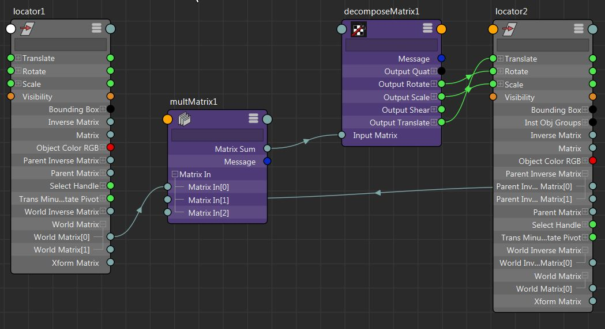
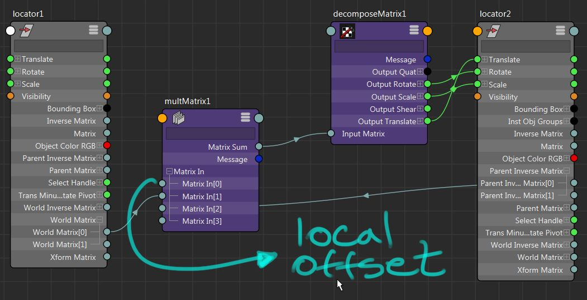
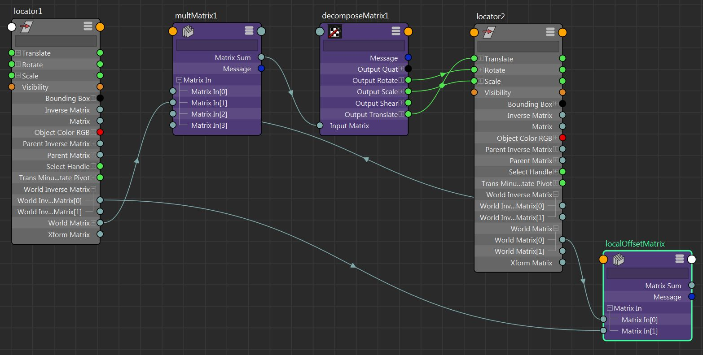
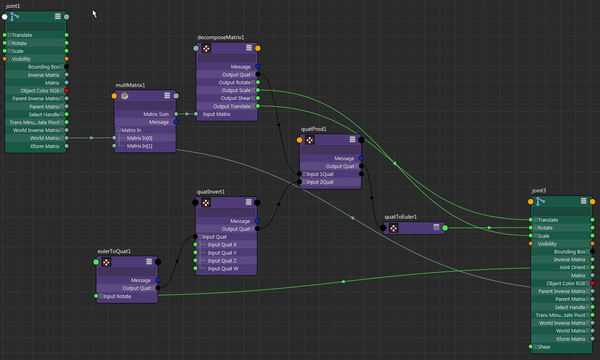

最近在 Cult of rig 之后，我意识到我在我的 Rig 中的约束非常浪费。我一直都知道它们比直接连接和父子关系慢，但后来我认为这是实现 Broken hierarchy Rigs 的唯一方法。尽管我在大学里学过矩阵数学，但我从未在 maya 中使用过它，因为我奇怪地认为矩阵节点是坏的或有限的。我总是可以选择编写自己的节点，但因为我想让人们尽可能轻松地使用我的装备，所以我宁愿把所有东西都放在原版 maya 中。

因此，当 Raffaele 使用 `matrixMult` 和 `decomposeMatrix` 节点重新设置转换的父级时，我受到了非常愉快的启发。从那时起，我尝试将这个概念应用于其他一些索具功能，例如扭曲计算和铆钉，它一直给我带来良好的效果。因此，在这篇文章中，我们将看看如何使用他在 Stream 中展示的技术来模拟 parent + scale 约束，而无需约束的性能开销，从而有效地创建基于节点的矩阵约束。

## 局限性

但是，使用此方法存在一些限制。其中一些并不复杂，但问题是这会向图形中添加额外的节点，这反过来又会导致性能开销和混乱。话虽如此，约束加起来会使大纲视图变得混乱，因此我认为这可能是一个偏好问题。

### 关节

用 `jointOrient` 值约束关节将不起作用，因为 `jointOrient` 矩阵是在旋转之前应用的。有一种方法可以解决这个问题，但它涉及创建许多其他节点，这会增加一些开销，对我来说，使用设置而不是方向约束变得不合理。

如果你想看看我们是如何解决`jointOrient`问题的，只是出于好奇，可以看看联合定向部分..

### 权重和多个目标

权重和多个目标也不完全适合这种方法。同样，这绝对不是不可能的，因为我们始终可以混合矩阵分解的输出值，但这也将涉及我们需要的每个转换属性的额外 `blendColors` 节点 - `translate` 、 `rotate` 和 `scale` 。与前一个类似，这意味着额外的开销和更多的节点图混乱。如果有一种简单的方法可以将矩阵与maya的原生节点混合，那就太好了..

### 轮换订单

奇怪的是，即使分解矩阵具有 `rotateOrder` 属性，它似乎也没有任何作用，因此此方法仅适用于 `xyz` 旋转顺序。上周我收到了一封来自maya_he3d邮件列表的电子邮件，关于这个问题，看起来它已经被标记给Autodesk进行修复，这太好了..

## 建设

这种基于节点的矩阵约束的构造在节点和数学方面都相当简单。我们将构建图表，如 Cult of Rig 流 所示，因此请随时查看它以获得更直观的方法。我要对它进行的唯一补充是支持 maintainOffset 功能。此外，Raffaele 在他的其他视频中也谈到了很多关于数学的内容，所以也请看一下。

所有的数学运算都在 `matrixMult` 节点内部进行。从本质上讲，我们取目标对象的 `worldMatrix`，然后通过乘以约束对象的 `parentInverseMatrix` 将其转换为相对空间。之后的 `decomposeMatrix` 将矩阵分解为我们实际上可以连接到转换的属性 - `translate` 、 `rotate` 、 `scale` 和 `shear` 。如果我们能直接连接到一个输入矩阵属性就好了，但这可能会产生它自己的一系列问题。

这是基本的基于节点的矩阵约束。不过，保持偏移量怎么样？

## 保持偏移

为了能够保持偏移量，我们只需要先计算它，然后将其放在其他两个矩阵之前的 `multMatrix` 节点中。

### 计算偏移量

我们计算局部矩阵偏移量的方法是将对象的 `worldMatrix` 乘以父对象（对象相对于）的 `worldInverseMatrix`。结果是局部矩阵偏移量..

#### 使用 multMatrix 节点

完全可以使用另一个 `matrixMult` 节点来执行此作，然后执行 `getAttr` 的输出，并通过执行 `setAttr` 并将其设置为主 `matrixMult` 并将其设置为主 18-10248-2 `"matrix"` 。然后，可以自由删除本地 `matrixMult`。我们获取并设置属性的原因是，而不是连接它，否则我们就会创建一个循环。

#### 使用 Maya API

不过，我更喜欢做的是通过 API 获取本地偏移量，因为它不涉及创建节点然后删除它们，这在您需要编码时要好得多。让我们来看看。

`:::python import maya.OpenMaya as om  def getDagPath(node=None):     sel = om.MSelectionList()     sel.add(node)     d = om.MDagPath()     sel.getDagPath(0, d)     return d  def getLocalOffset(parent, child):     parentWorldMatrix = getDagPath(parent).inclusiveMatrix()     childWorldMatrix = getDagPath(child).inclusiveMatrix()      return childWorldMatrix * parentWorldMatrix.inverse()`

`getDagPath` 函数只是为了给我们一个对传递对象的 `MDagPath` 实例的引用。然后，在 `getLocalOffset` 中，我们得到对象的 `inclusiveMatrix`，这是等效于 `worldMatrix` 属性的完整世界矩阵。最后，我们将本地偏移量作为 `MMatrix` 实例返回..

然后，我们需要做的就是将 `multMatrix.matrixIn[0]` 属性设置为我们的本地偏移矩阵。我们执行此作的方法是使用 `MMatrix` 的 `()` 运算符，该运算符返回由行和列索引指定的矩阵元素。所以，我们可以这样写..

`:::python localOffset = getLocalOffset(parent, child) mc.setAttr("multMatrix1.matrixIn[0]", [localOffset(i, j) for i in range(4) for j in range(4)], type="matrix")`

本质上，我们正在计算 `parent` 和 `child` 对象之间的差异，并且我们在 `multMatrix` 节点中的其他两个矩阵之前应用它，以便在我们自己的基于节点的矩阵约束中实现 `maintainOffset` 功能。

## 东关节

最后，让我们看看如何解决我在 限制 部分提到的关节方向问题。

我们需要做的是考虑关节上的 `jointOrient` 属性。困难在于 `jointOrient` 是一个单独的矩阵，在 `rotation` 矩阵之后应用。这意味着，我们需要做的就是，在矩阵链的末端旋转 `jointOrient` 的倒数。我尝试通过矩阵做几次，但我无法让它工作。然后我决定编写一个节点并测试如何从内部执行此作。这真的很简单，通过 API 来完成，因为我们需要做的就是使用 `MTransformationMatrix` 类的 `rotateBy` 函数，而 `jointOrient` 属性的倒数则为 `MQuaternion` ..

然后，我认为这在原版 maya 中也应该不难实现，因为也有四元数节点。是的，但老实说，我不认为那个图表看起来一点也不好。看一看。

如您所见，我们所做的是从关节方向创建一个四元数，然后将其反转并将其应用于 `multMatrix` 的计算输出矩阵。我们应用它的方法是做一个四元数积。之后我们所做的就是将其转换为 euler 并将其连接到关节的旋转。请记住，`quatToEuler` 节点支持轮换订单，所以它非常有用。

当然，您仍然可以通过此方法使用 `maintainOffset` 功能。正如我所说，将此与仅朝向约束相比，方向约束似乎每次都执行得更快，因此我认为除了保持大纲视图更干净之外，没有其他理由这样做。

此外，我假设可能有一种更简单的方法来执行此作，但我找不到它。如果你有什么想法，请给我大声喊叫。

## 结论

使用这个基于节点的约束，我能够从我的身体装备中删除父级、点和方向约束，使其执行速度比以前快得多，而且大纲视图也更好看。请继续关注本矩阵系列的第 2 部分和第 3 部分，其中我将介绍如何仅使用矩阵节点来创建扭曲计算器和铆钉。