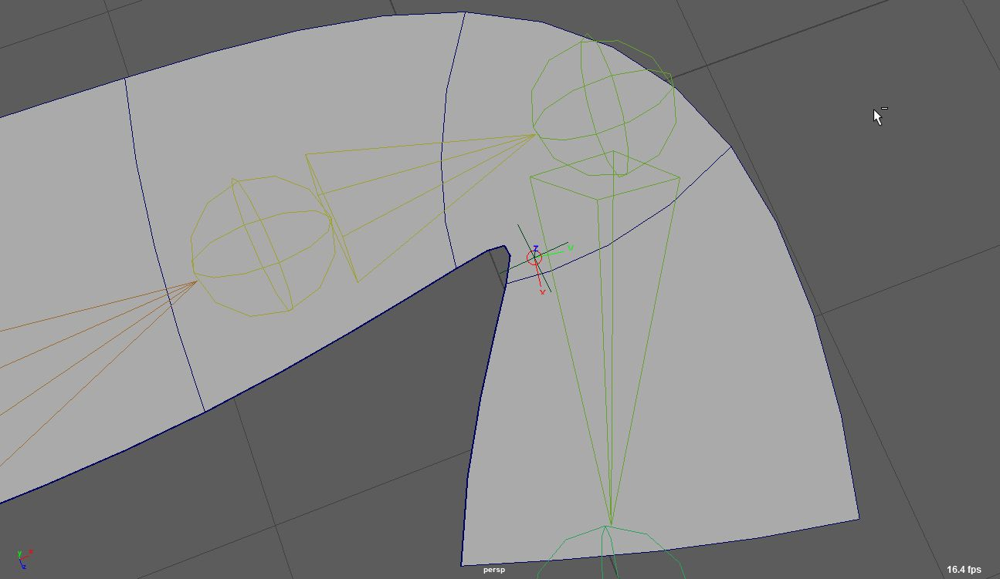
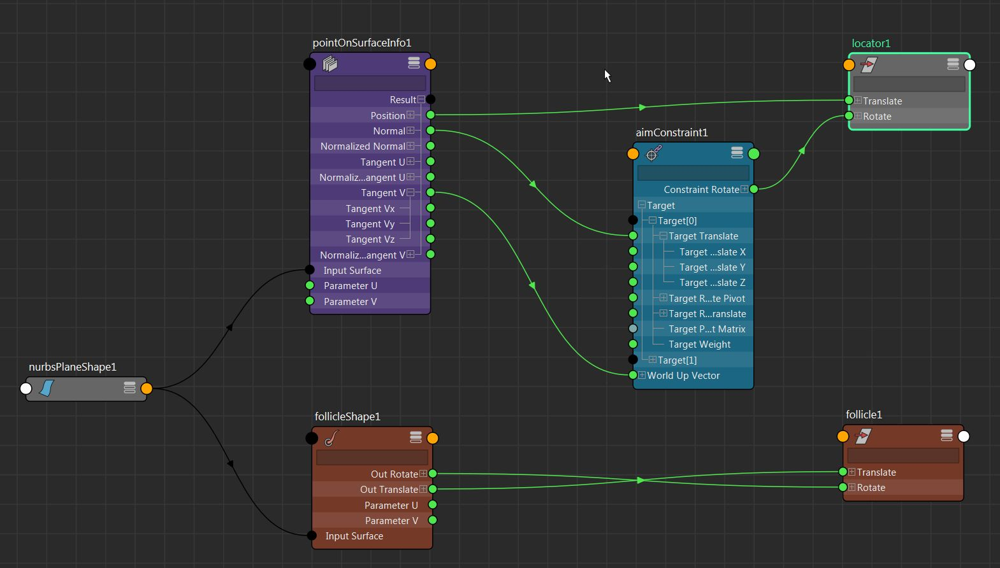
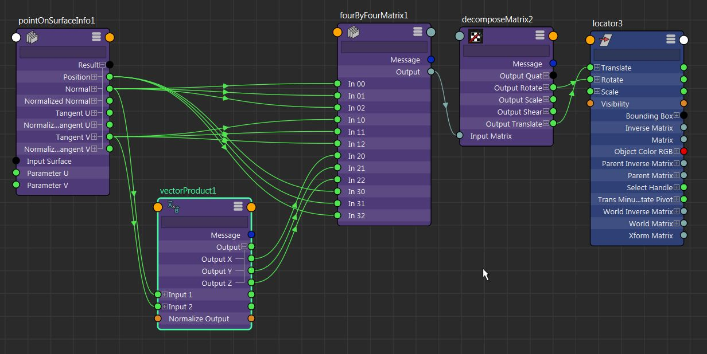
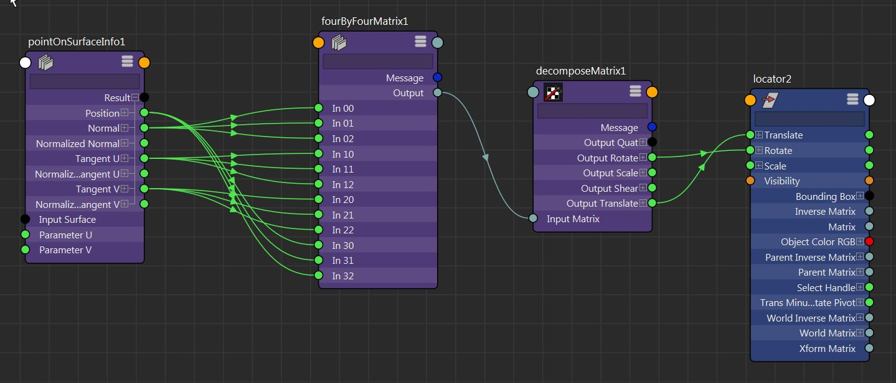

铆钉是我第一次听说它们时让我大吃一惊的东西之一。老实说，在当时，将对象粘附到几何体的变形组件上的能力似乎几乎是神奇的。不过，您对几何体在 Maya 中的工作原理了解得越多，铆钉就越有意义。然而，围绕他们的耻辱一直是他们有点慢，因为他们必须等待底层几何体进行评估，然后才能进行评估。即使情况仍然存在，但似乎自从引入并行以来，性能已显着提高。

考虑到铆钉对于索具设置的便利性，尝试简化和清理铆钉是值得的，例如： - 扭曲分布带 - 弯曲/弯曲的肢体 - 挤压和拉伸后将物体粘在几何形状上 - 将控件粘在几何形状上 - 驱动关节在表面上滑动

和其他。

_当我提到经典铆钉或 `aimConstraint` 铆钉时，我说的就是这个。我见过很多装配工和很多打火机都在使用它.._

这种方法的目的是摆脱驱动铆钉旋转的 `aimConstraint`。此外，我还看到使用了 `pointConstraint`，以解释父逆矩阵，它也将被此设置取代。即使我们正在剥离约束，性能提升并不是很大，因此矩阵铆钉的主要好处是图形更清晰。

_TL;DR：我们将把`pointOnSurfaceInfo`节点的信息直接插入到`fourByFourMatrix`节点中，试图从我们的设备中移除约束。_

_免责声明 ： 请记住，我只会考虑将对象铆接到 NURBS 表面。铆接 poly geo 需要通过相同的旧阁楼设置来完成。_

_限制 ：由于我们使用 `decomposeMatrix` 节点提取最终变换值，因此我们无法选择使用 XYZ 以外的任何旋转顺序，因为目前 `decomposeMatrix` 节点不支持其他顺序。不过，一种解决方法是将 `outputQuat` 属性插入到实际上支持不同轮换顺序的 `quatToEuler` 节点中。_

## 毛囊和 aimConstraint 铆钉的区别

定位仪使用 `aimConstraint` 铆接。你可以看到毛囊和定位器的旋转有很小的差异。为什么？。

经典铆钉设置将 `pointOnSurface` 的 `tangentV` 和 `normal` 属性连接到 `aimConstraint` 。第三个轴是这两个轴的叉积。但是看起来毛囊实际上使用的是`tangentU`向量进行计算，因为我们在两种设置之间得到了这个差异。

选择将 `tangentU` 插入 `aimConstraint` 而不是 `tangentV` ，会产生与卵泡相同的 `behaviour`。老实说，我不确定哪一个更可取。然而，在我们的矩阵铆钉的构造中，我们可以完全控制这个..

## 为什么不是毛囊？

正如我已经说过的，同时，毛囊很快！老实说，对于我的大部分铆接需求，我不介意使用毛囊。不过，我真正不喜欢毛囊的一个方面是它通过形状节点运行。我知道它不是用来绑定的，在大纲视图和视口中都能清楚地识别对象很重要，但就我而言，它只会增加混乱。理想情况下，我喜欢避免不必要的 DAG 节点，因为它们只会妨碍。

此外，您是否查看过 follicle shape 节点？我的意思是，有很多与头发相关的属性，只用`parameterU`和`parameterV`真是可惜。

因此，如果我们可以使用由简单节点组成的非 DAG 网络来完成相同的工作，而不会增加任何开销，那么我们为什么要弄乱我们的钻机呢？

## 构建基体铆钉

因此，矩阵在 Maya 中的工作方式是，矩阵的前三行描述 X、Y 和 Z 轴，第四行是位置。由于这过于简单化了，如果您想了解有关矩阵的更多信息，我强烈建议您查看一些矩阵数学资源，并且一定要观看 Cult of Rig 流。

不过，这对我们来说意味着，如果我们有两个向量和一个位置，我们总是可以从它们中构造一个矩阵，因为两个向量的叉积会给我们第三个向量。所以这是我们的矩阵构造在图中的样子。

因此，如您所见，我们正在利用 `fourByFourMatrix` 节点来构造矩阵。此外，我们使用设置为叉积的 `vectorProduct` 节点从 `normal` 和所选切线（在本例中为 `tangentV`）构建第三个轴，这为我们提供了与使用经典 `aimConstraint` 铆钉相同的结果。如果我们选择使用 `tangentU`，我们将得到 `follicle` 的行为。然后，显然我们分解矩阵并将其插入到我们的铆接变换中。

或者，与本系列的第一篇文章类似，如果需要，我们可以使用 `multMatrix` 节点来反转父级的转换。不过，我通常会做的是将它们放在一个关闭了 `inheritTransform` 属性的变换下，这样我们就可以直接插入世界变换了。

需要注意的是，在这种情况下，我们绝对确定输出矩阵是正交的，因为我们知道 `normal` 垂直于两条切线。因此，将其与任何切线交叉，将产生第三个垂直向量。

## 跳过向量积

最初，当我想到制造这样的铆钉时，我将 `normal`、`tangentU` 和 `tangentV` 直接从 `pointOnSurfaceInfo` 插入 `fourByFourMatrix` 。这意味着我们有一个不一定是正交的矩阵，因为切线很可能不是垂直的。这会产生剪切基体。话虽如此，它仍然给我带来了适当的结果..

然后，我将其添加到我的模块化系统中，在几个字符上对其进行测试，它一直给我带来稳定的好结果 - 1 比 1 与 `follicle` 或 `aimConstraint` 铆钉的行为，具体取决于我插入切线的顺序。

那么，这意味着 `decomposeMatrix` 节点将所有剪切与矩阵分开，从而返回正确的旋转，就好像矩阵实际上是正交的一样。

如果是这样的话，那么我们可以安全地跳过`vectorProduct`，并且仍然有一个工作铆钉，考虑到我们完全忽视了`decomposeMatrix`的`outputShear`属性。

不过，由于我不明白这些剪切是如何提取的，因此我将密切关注我的钻机中铆钉的行为，看看它是否有任何可疑之处。到目前为止，它已被证明与其他任何东西一样稳定。

## 结论

如果你和我一样，你真的会喜欢这个图的简单性，因为我们实际上是自己处理完整的矩阵构造。更重要的是，大纲中没有约束，也没有毛囊形状，我再次发现这看起来要好看得多。

这个矩阵系列对我来说写起来很有趣，所以我肯定会尝试想出其他我们可以使用矩阵的有趣函数。