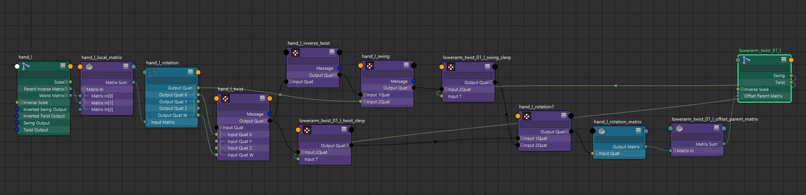

将旋转分解为单独的 swing 和 twist 组件有许多有用的应用。Maya 的姿势插值器工具集允许使用旋转的孤立扭曲和/或摆动组件驱动形状。这使得由手臂抬起驱动的胸肌矫正形状独立于手臂的扭转运动。此外，扭曲组件可用于比单独使用 Euler 扭曲轴更可靠地驱动扭曲关节

在本文中，我将介绍如何使用 Maya 2020 的新 offsetParentMatrix 属性创建摆动/扭曲旋转分解以驱动辅助关节。

[](https://www.youtube.com/channel/UCYO_jab_esuFRV4b17AJtAw)首先，我们需要对四元数有一个基本的了解。我推荐 3Blue1Brown 的视频：

1. [使用立体投影可视化四元数 （4D 数字）](https://www.youtube.com/watch?v=d4EgbgTm0Bg)
2. [四元数和 3D 旋转，以交互方式解释](https://www.youtube.com/watch?v=zjMuIxRvygQ)

四元数的 x、y 和 z 分量控制旋转轴（交互式视频中的 i、j、k）。如果我们隔离 x、y 或 z 分量，我们最终会得到围绕相应的 x、y 或 z 轴的旋转：

```cpp
MQuaternion twist(rotation);

// Get the reference twist vector
switch (twistAxis) {
  case 0:  // X axis
    twist.y = 0.0;
    twist.z = 0.0;
    break;
  case 1:  // Y axis
    twist.x = 0.0;
    twist.z = 0.0;
    break;
  case 2:  // Z axis
    twist.x = 0.0;
    twist.y = 0.0;
    break;
}
twist.normalizeIt();
```

这意味着我们需要驱动程序变换的局部旋转才能计算扭曲。 我们可以在计算中只使用 `driver.matrix` 属性，但我将增加一些复杂性以使其更加可靠。使用 `driver.matrix` 的问题在于它没有考虑关节方向或旋转轴。我希望无论是否使用关节定向，该解决方案都能正常工作。这允许将数学运算转移到其他包，例如游戏引擎。关节定向严格来说是 Maya 范例。要获取包含关节方向影响的局部矩阵，我将使用：。

不过，仅使用 local matrix 存在问题。我希望驾驶员关节静止旋转是系统中的标识摆动和扭曲旋转。如果驾驶员关节在绑定时包含关节方向或局部旋转，则我在静止时不会有标识四元数。为了解决这个问题，我需要删除任何本地静止旋转，以确保绑定时间旋转是恒等四元数：

```cpp
// restMatrix is the stored local matrix at creation time
MMatrix localMatrix = matrix * restMatrix.inverse();
MQuaternion rotation = MTransformationMatrix(localMatrix).rotation();
```

此时，我们得到了分解的扭曲四元数。现在计算摆动分量很容易。

rotation=twist∗swingr o t a t i o n =t w i s t ∗s w i n g

我们知道完整的旋转，也知道扭曲，所以求解 swing：

swing=twist−1∗rotations w i n g =t在我st− 1∗R o t a t i o n

```cpp
MQuaternion swing = twist.inverse() * rotation;
```

[](https://en.wikipedia.org/wiki/Slerp)现在，我们有了旋转的分解的 swing 和 twist 组件。但是，如果我们不想要完全扭转或全开呢？或者如果我们想要倒转怎么办？在本文顶部的视频中，由于肩部扭转关节是肩关节的父项，我想消除主要肩关节扭转的影响，因此我使用了 -75% 的肩部扭转来驱动扭转关节。我们可以通过 slerping 来缩放和插值分解的 swing 和 twist 组件：

```cpp
if (twistWeight < 0.0f) {
  twist.invertIt();
  twistWeight = -twistWeight;
}
if (swingWeight < 0.0f) {
  swing.invertIt();
  swingWeight = -swingWeight;
}

// Scale by the input weights
MQuaternion rest;
swing = slerp(rest, swing, swingWeight);
twist = slerp(rest, twist, twistWeight);
```

现在我们有了缩放和/或反转的摆动和扭曲旋转。要创建最终矩阵，我们需要将它们组合回单个旋转中。由于我们将驱动从动节点的 offsetParentMatrix，因此我们将其转换为矩阵。

```cpp
MQuaternion outRotation = twist * swing;
MMatrix outMatrix = outRotation.asMatrix();
```

不过有一个问题。OffsetParentMatrix 是与父级的偏移量。我们要驱动的节点的 twist axis 可能没有与其父 twist axis 完全对齐。例如，如果我们从手腕驱动前臂扭转关节，则手腕在绑定时可能会略微弯曲前臂轴线。如果现在应用我们计算的分解旋转矩阵，则扭曲将沿父扭曲轴发生，而不是从动节点扭曲轴发生。要解决这个问题，我们需要将本地 rest offset 添加到旋转中：

```cpp
// targetRestMatrix is the stored (target.worldMatrix * target.parentInverseMatrix) at creation time
MQuaternion outRotation = twist * swing;
MMatrix outMatrix = outRotation.asMatrix() * targetRestMatrix;
```

现在，我们有了可以连接到目标节点 offsetParentMatrix 的最终矩阵。但是，还有最后一个问题。从动节点上的任何本地变换值都将在 offsetParentMatrix 之前应用：

xform=local∗offset∗parentx f o r m =l o c a l ∗o f f s e t ∗p a r e n t

由于我们在 offsetParentMatrix 中计算旋转，如果关节在 tx、ty、tz 中有任何值，则会导致关节偏离轴旋转。此外，由于 offsetParentMatrix 将包含平移值，因此我们最终会得到一个 double 转换。解决方案是在网络设置后将本地通道归零：

```cpp
std::string attributes[] = {"translateX",
                            "translateY",
                            "translateZ",
                            "rotateX",
                            "rotateY",
                            "rotateZ"
                            "jointOrientX",
                            "jointOrientY",
                            "jointOrientZ"};
for (auto attribute : attributes) {
  MPlug plug = fnDriven.findPlug(attribute.c_str(), false, &status);
  if (!MFAIL(status)) {
    dgMod_.newPlugValueDouble(plug, 0.0);
  }
}
```

[](https://github.com/chadmv/cmt/blob/master/src/swingTwistNode.cpp)在我的 GitHub 上查看完整的源代码

[](https://github.com/chadmv/cmt/blob/master/scripts/cmt/rig/swingtwist.py)如果您不想使用编译的插件，您仍然可以使用 vanilla 节点创建此设置。我已经编写了设置脚本，您也可以在我的 GitHub 上查看它。我不会在这篇文章中列出脚本，因为它有点长。但是本文中描述的所有数学和四元数运算都可以作为 vanilla maya 节点使用。请注意，在撰写本文时，Python 脚本中的某些文档已过时，与 UI 和选项框的集成需要更新。这将很快更新......希望。

