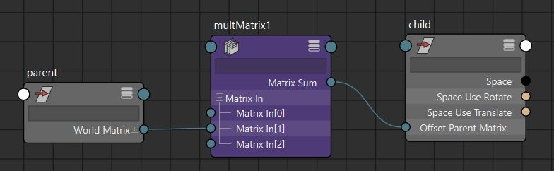
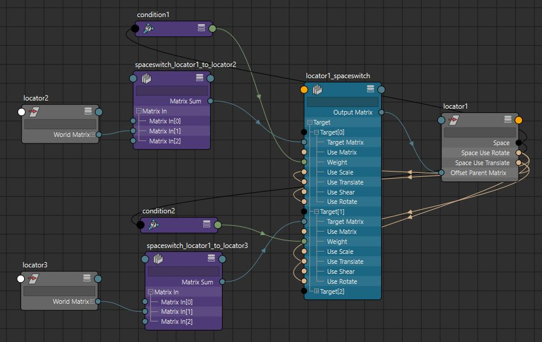

Maya 2020 引入了 offsetParentMatrix 属性来变换节点。此属性允许直接使用矩阵驱动变换，并且可以减少设置中的节点和连接数。在这篇文章中，我将展示如何使用 offsetParentMatrix 属性而不是约束和额外的转换节点来设置空间切换。

父子关系是一个简单的矩阵乘法，可以用 multMatrix 节点进行复制：



为了在创建设置时保持偏移量，我们需要创建一个相对于父级的偏移矩阵：

```python
offset = (
    OpenMaya.MMatrix(cmds.getAttr("{}.worldMatrix[0]".format(child)))
    * OpenMaya.MMatrix(cmds.getAttr("{}.matrix".format(child))).inverse()
    * OpenMaya.MMatrix(cmds.getAttr("{}.worldInverseMatrix[0]".format(parent)))
)
```

我们还需要从 offset 中删除任何现有的本地转换，以便在连接 offsetParentMatrix 属性时不会获得双重转换。

由于 offsetParentMatrix 应用于局部空间，因此我们需要将结果乘以子级的父级逆矩阵。但是，在使用节点的 parentInverse 计算 offsetParentMatrix 时，似乎存在循环评估问题，因此您可以改用实际父级的世界逆矩阵。 我不确定 parentInverse 评估问题是否是错误，但我们有一个解决方法。 这是设计使然。来自 Maya 高级产品所有者 Will Telford：“parentMatrix 输出将 OPM 与 parentMatrix 连接起来。这允许现有约束等内容继续发挥作用。 以下是编写的 multMatrix 设置：

```python
mult = cmds.createNode("multMatrix")

offset = matrix_to_list(
    OpenMaya.MMatrix(cmds.getAttr("{}.worldMatrix[0]".format(node)))
    * OpenMaya.MMatrix(cmds.getAttr("{}.matrix".format(node))).inverse()
    * OpenMaya.MMatrix(cmds.getAttr("{}.worldInverseMatrix[0]".format(driver)))
)
cmds.setAttr("{}.matrixIn[0]".format(mult), offset, type="matrix")

cmds.connectAttr("{}.worldMatrix[0]".format(driver), "{}.matrixIn[1]".format(mult))

parent = cmds.listRelatives(node, parent=True, path=True)
if parent:
    cmds.connectAttr("{}.worldInverseMatrix[0]".format(parent[0]), "{}.matrixIn[2]".format(mult))

cmds.connectAttr(
    "{}.matrixSum".format(mult), "{}.offsetParentMatrix".format(node)
)
```

要创建空间切换，我们可以将多个 multMatrix 节点的输出连接到一个 blendMatrix 节点中，并使用 enum 属性和条件节点控制每个目标矩阵的权重，以便在空间之间切换。



blendMatrix 节点的另一个好处是能够禁用矩阵的组件。这允许您拥有仅平移或仅旋转的空间开关，甚至可以动态切换组件。

[](https://github.com/chadmv/cmt/blob/master/scripts/cmt/rig/spaceswitch.py)要查看整个过程的脚本，请参阅我的 Github 。