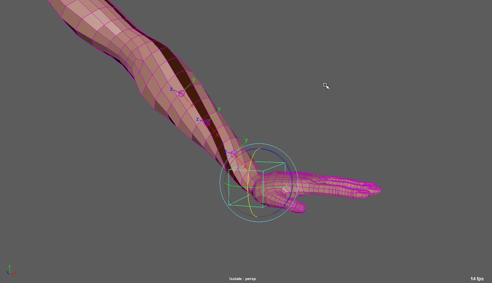
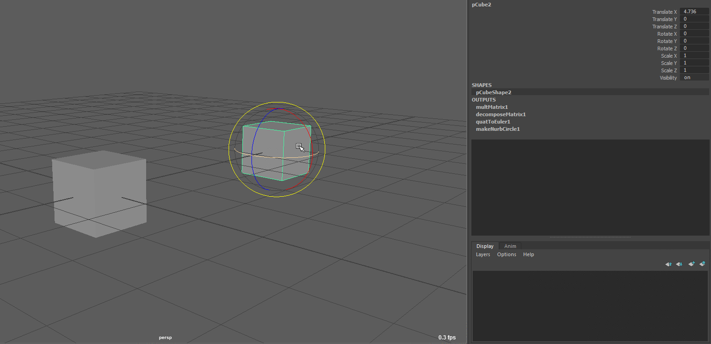
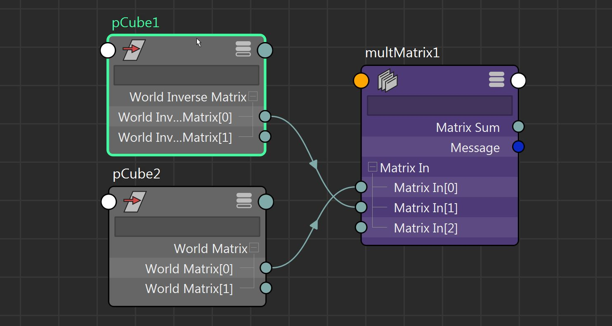
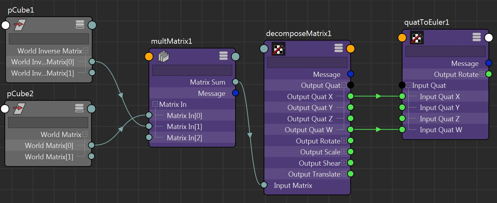

[Maya matrix nodes - Part 2: Node based matrix twist calculator | bindpose](https://bindpose.com/maya-matrix-nodes-part-2-node-based-matrix-twist-calculator/)
计算扭曲是一种流行的绑定必要条件，因为通常我们宁愿沿着关节链平滑地插入它，而不是只在它的末端应用它。经典的例子是四肢，我们需要在前臂/胫骨区域进行一些扭转，以支持手腕或脚的旋转。一些流行的实现使用 ik 手柄或目标约束，但我发现它们对于这项任务来说有点矫枉过正。因此，今天我们将看看创建一个矩阵扭曲计算器，它既干净又快速评估。

除了矩阵节点之外，我将使用几个四元数节点，但我保证它会非常简单，因为即使是我自己也不真正习惯使用它们。

_tl;dr： 我们将获得两个对象之间的矩阵偏移量 - 相对矩阵 ，然后提取该矩阵的四元数，只得到 X 和 W 分量，当转换为欧拉角时，将导致两个矩阵之间沿所需轴的扭曲。_

## 期望的行为

_请原谅蒙皮，我刚刚做了一个测地线体素绑定_

正如你所看到的，我们正在做的是计算两个对象之间的扭曲量（通常也从偏航、俯仰和滚动表示法中称为滚动）。即，沿关节链向下瞄准的轴上的旋转差。

## 局限性

您可以注意到的一个不良影响是当角度达到 180 度时翻转。现在，据我所知，这个问题没有合理的解决方案，它不涉及对前一个轮换的某种缓存。我相信，这就是 No flip`interpType` on constraints 的作用。有一个，在无侧倾关节和滚动关节之间使用方向约束，然后将结果角度乘以 2，这在简单的情况下是有效的，但我发现它有点不直观，而且并不总是可预测的。此外，大多数动画师都熟悉这个问题，并且对此很合理。在极少数情况下，这个问题会让你的制作感到痛苦，你总是可以添加对扭曲矩阵的控制，这样动画师就可以调整它们了。

要记住的另一件事是始终使用旋转顺序的第一个轴来计算扭曲，因为其他轴可能会以 90 度而不是 180 度翻转。这就是为什么，我将考虑计算 X 扭曲，因为默认旋转顺序是 XYZ 。

说完这些，让我们看一下设置。

## 矩阵扭曲计算器

我将研究以相同方式取向的两个立方体之间的扭曲的简单情况。现在，您可能会认为这个例子太简单了，但实际上这正是我在我的设备中所做的。我创建了两个定位器，它们的方向是 X 轴与我感兴趣的轴对齐。然后，我将它们分别设置为我想在其之间找到扭曲的两个对象的父子关系。这意味着，找到定位符轴上的扭曲，将得到两个对象之间的扭曲。

_当然，我不使用实际的定位器或立方体，而只是创建矩阵来表示它们，因此我保持了我的大纲视图更简洁。但是，目前这并不重要。_

### 相对矩阵

现在，由于我们要比较两个矩阵以获得它们之间的扭曲角，因此我们需要首先让其中一个矩阵位于另一个矩阵的相对空间中。如果你看过我的基于节点的矩阵约束文章，或者你已经熟悉矩阵，你就会知道我们可以通过子矩阵简单地乘以父矩阵的倒数来做到这一点。这将为我们提供子对象的矩阵相对于父对象的矩阵。

我们需要它的原因是，该相对矩阵现在包含两个对象之间变换的所有差异，而我们对此感兴趣，即瞄准轴上的差异。

这是图表中的样子。

### 四元数

因此，如果我们有相对矩阵，我们可以继续从中提取旋转。3D 空间中的旋转问题在于它们看起来有点混乱，主要是因为我们通常根据 欧拉角 ，因为这就是 maya 在变换的 `.rotation` 属性中给我们的。不过，有一个叫做 四元数 的东西，它也表示 3D 空间中的旋转，我敢说，使用起来要好得多。更好的是，主要是因为我们不关心旋转顺序，当使用四元数时，因为它们只表示一次旋转。这给我们的是一个可靠的角度表示，只沿一个轴..

实际上，这意味着，取四元数的 X 和 W 分量，并将 Y 和 Z 分量归零，将仅在 X 轴上为我们提供所需的旋转。

在 maya 术语中，我们将使用 `decomposeMatrix` 从矩阵中得到四元数，然后使用 `quatToEuler` 节点将该四元数转换为欧拉旋转，这将保持矩阵之间的扭曲。

这是完整的图表，其中 `quatToEuler` 节点的 10248-0 是实际的扭曲值。

## 结论

就是这样！如您所见，这是一个非常简单的过程，但已被证明可以给出稳定的结果，这实际上与使用 ik 手柄或瞄准约束 100% 相同，但几乎没有开销，因为矩阵和四元数节点的计算效率非常高。

请继续关注本矩阵系列的第 3 部分，我将介绍如何仅使用矩阵节点创建铆钉。