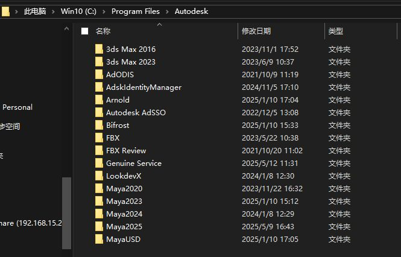
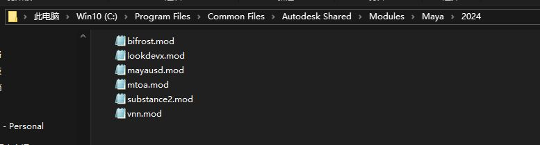
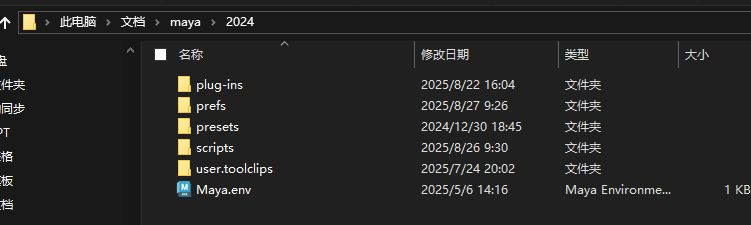

# maya安装路径
- C:\Program Files\Autodesk
- [Open: Pasted image 20250827101159.png](attachments/17ddb76977bd23c5443e709003ce27a0_MD5.jpeg)

# maya 自身模块路径
- C:\Program Files\Common Files\Autodesk Shared\Modules\Maya\2024
- [Open: Pasted image 20250827101342.png](attachments/e1b130976e0cb983ecfde8bd94c22383_MD5.jpeg)


# maya 用户路径
- D:\Backup\Documents\maya\2024
- [Open: Pasted image 20250827101614.png](attachments/0f3b21f0c5f19dec54b7f40308ad05fb_MD5.jpeg)

- plug-ins：存储用户安装的 Maya 插件（.mll、.py 或其他格式）。
- prefs：存储 Maya 的用户偏好设置（Preferences），包括界面布局、快捷键、工具设置等。
- presets：存储 Maya 的预设文件（Presets），通常是 .mel 文件
- scripts：存储用户创建或安装的 MEL（Maya Embedded Language）或 Python 脚本。
- Maya.env：纯文本文件，用于设置 Maya 的环境变量，控制 Maya 在启动时加载的资源、路径和配置。
# 环境变量

Autodesk Maya 的环境变量是用于修改 Maya 软件行为和路径配置的设置，可以自定义脚本、插件、预设等资源的查找路径，以及调整 Maya 的运行方式。环境变量可以通过操作系统命令或编辑 `Maya.env` 文件来设置。推荐使用 `Maya.env` 文件，因为它能将 Maya 特定的配置与系统环境变量分开，便于管理和共享（如分布式渲染时使用漫游配置文件）。[](https://help.autodesk.com/cloudhelp/2015/CHS/Maya/files/Environment_Variables_Setting_environment_variables_using_Maya.env.htm)[](https://knowledge.autodesk.com/zh-hans/support/maya/learn-explore/caas/CloudHelp/cloudhelp/2018/CHS/Maya-EnvVar/files/GUID-8EFB1AC1-ED7D-4099-9EEE-624097872C04-htm.html)

以下是 Maya 环境变量的详细说明及常用变量列表，基于官方文档和相关资源。需要注意的是，Maya 支持用户自定义变量，但变量名不能包含空格、制表符或特殊字符（如 `/ : * " < > |`）。路径分隔符在 Windows 使用分号 `;`，在 Linux 和 Mac OS X 使用冒号 `:`。变量替换使用 `$variable`（Linux/Mac）或 `%variable%`（Windows）。[](https://help.autodesk.com/cloudhelp/2015/CHS/Maya/files/Environment_Variables_Setting_environment_variables_using_Maya.env.htm)[](https://help.autodesk.com/cloudhelp/2016/CHS/Maya/files/GUID-8EFB1AC1-ED7D-4099-9EEE-624097872C04.htm)

---

### **设置 Maya 环境变量的方式**
* * **通过 Maya.env 文件**：
   - 在默认路径（如 Windows: `C:\Users\<username>\Documents\maya\<version>`，Linux: `~/maya/<version>`，Mac OS X: `~/Library/Preferences/Autodesk/maya/<version>`）创建或编辑 `Maya.env` 文件。
   - 使用纯文本编辑器（如 Notepad 或 TextEdit，需保存为 ASCII 文本格式，避免 RTF 格式）。
   - 每行设置一个变量，格式为 `VARIABLE_NAME = value`。
   - 示例（Windows）：
     ```bash
     MAYA_SCRIPT_PATH = %MAYA_APP_DIR%\scripts\test;C:\MyPath
     MAYA_PLUG_IN_PATH = %MAYA_LOCATION%\devkit\plug-ins;%MAYA_LOCATION%\devkit\test
     TMPDIR = D:\tempspace
     ```
   - 示例（Linux/Mac）：
     ```bash
     SHARED_MAYA_DIR = /usr/localhome/public/maya/2022
     MAYA_SCRIPT_PATH = $SHARED_MAYA_DIR/scripts:$MAYA_APP_DIR/scripts/custom
     MAYA_PLUG_IN_PATH = $SHARED_MAYA_DIR/plug-ins
     TMPDIR = /disk2/tempspace
     ```
   - 注意：`MAYA_APP_DIR`、`HOME`（Linux/Mac）、`USERPROFILE`（Windows）无法在 `Maya.env` 中设置，需通过操作系统设置。[](https://help.autodesk.com/cloudhelp/2015/CHS/Maya/files/Environment_Variables_Setting_environment_variables_using_Maya.env.htm)[](https://knowledge.autodesk.com/zh-hans/support/maya/learn-explore/caas/CloudHelp/cloudhelp/2018/CHS/Maya-EnvVar/files/GUID-8EFB1AC1-ED7D-4099-9EEE-624097872C04-htm.html)
- 通过userSetup.py文件：
	- 在 Autodesk Maya 中，userSetup.py 是一个特殊的 Python 脚本文件，用于在 Maya 启动时自动执行用户自定义的初始化代码。它允许用户自定义 Maya 的环境、界面、脚本路径、插件加载等，是 Maya 脚本开发中常用的个性化配置工具
	- 在 Maya 启动后，初始化图形用户界面（GUI）之前，Maya 会执行 userSetup.py。晚于 Maya.env 的环境变量加载，因此可以覆盖或修改环境变量。
	- userSetup.py文件可以放在任何`PYTHONPATH`路径下
	- 可以有多个userSetup.py文件在maya初始化的时候执行
	- userSetup.py文件可用于导入库，设置环境变量等等
	- 因为userSetup.py文件在maya初始化的早期执行，因此很多功能不能使用
		- UI无法使用
		- maya很多环境变量需要在userSetup.py被调用之前设置，MAYA_PLUG_IN_PATH，MAYA-SCRIPT_PATH可以使用。PYTHON_PATH无法使用
		- userSetup.py文件的错误不会在脚本编辑器中输出，因为UI还没有初始化
		- 在maya开启的情况下编辑 userSetup.py文件，关闭maya时会有警告
```python
import inspect
import os
import sys
import maya.cmds as cmds

# 打印 userSetup.py文件所在的路径
user_setup_path = os.path.dirname(
    os.path.abspath(inspect.getfile(inspect.currentframe()))
)
print(f"Reading userSetup.py file from {user_setup_path}")
# 添加环境变量，并防止覆盖环境变量
os.environ["MAYA_PLUG_IN_PATH"] = (
    "D:/TestPlugins" + os.pathsep + os.environ["MAYA_PLUG_IN_PATH"]
)
os.environ["MAYA_SCRIPT_PATH"] = (
    "D:/TestScripts" + os.pathsep + os.environ["MAYA_SCRIPT_PATH"]
)
# 设置 maya 命令端口
cmds.commandPort(name=":20240", sourceType="mel")
cmds.commandPort(name=":20241", sourceType="python")
```
*  **通过操作系统设置**：
	 - 右键“此电脑” → “属性” → “高级系统设置” → “环境变量”，添加或编辑系统/用户变量。
	 - 示例命令（命令提示符）：`set MAYA_SCRIPT_PATH=C:\custom\scripts`。

* 在maya中直接设置
	* MEL：
		* 获取环境变量：`getenv MAYA_LOCATION`，获取环境变量的值
		* 设置环境变量：`putenv MY_ENV_VAR "Temp Value"`，如果没有该环境变量，则创建；如果有则修改
	* Python：
		* 使用 os库获取环境变量
```python
import os
# 打印系统中所有环境变量
for key, value in os.environ.items():
	print(f"{key}: {value}")
# 输出单个环境变量
os.environ["MAYA_PLUG_IN_PATH"]
# 设置环境变量
os.environ[MY_ENV_VAR] = "Updated Value"
# 当环境变量的值有多个时os.environ会输出一个长字符串，
# 每个值之间用";"分割,路径分割用"\\"
os.pathsep # 是用于分隔多个路径的字符";"
os.path.sep # 是用于分隔文件路径中目录层级的字符'\'或"\\"
# 在环境变量中添加值
os.environ[MAYA_PLUG_IN_PATH] += os.pathsep + "C:/MyNewPath"
# 通过环境变量查看
paths = os.environ["PYTHONPATH"].split(";")
for path in paths:
	print(path)
```
* 通过 userSetup.py文件设置
* 使用软件启动器设置

---

### **Maya 常用环境变量列表**
以下是 Maya 的常用环境变量，结合官方文档和社区资源（如 Autodesk Knowledge Network 和 GitHub），分为官方记录的变量和部分未记录但实用的变量。[](https://help.autodesk.com/cloudhelp/2015/CHS/Maya/files/Environment_Variables_Setting_environment_variables_using_Maya.env.htm)[](https://www.cnblogs.com/ibingshan/p/9786721.html)[](https://github.com/mottosso/Maya-Environment-Variables)

#### **1. 文件路径相关变量**
这些变量用于指定 Maya 查找脚本、插件、预设、工具架等资源的路径。
- **MAYA_APP_DIR**：
  - 描述：指定 Maya 用户配置文件的根目录（包括 `Maya.env`、脚本、偏好设置等）。
  - 默认值：Windows: `C:\Users\<username>\Documents\maya`；Linux: `~/maya`；Mac: `~/Library/Preferences/Autodesk/maya`。
  - 注意：只能通过操作系统设置，不能在 `Maya.env` 中设置，且需在 Maya 启动前设置。
  - 示例：`MAYA_APP_DIR=D:\MayaCustomConfig`[](https://www.cnblogs.com/ibingshan/p/9786721.html)[](https://download.autodesk.com/global/docs/maya2013/zh_cn/files/Environment_Variables_File_path_variables.htm)
- MAYA_ENV_DIR:
	- 用于指定 Maya 在启动时加载 Maya.env 文件的目录。
- **MAYA_SCRIPT_PATH**：
  - 描述：指定查找 MEL 或 Python 脚本的路径。常用于加载自定义脚本。
  - 示例：`MAYA_SCRIPT_PATH=%MAYA_APP_DIR%\scripts\test;C:\custom\scripts`（Windows）或 `MAYA_SCRIPT_PATH=$MAYA_APP_DIR/scripts/custom:/custom/scripts`（Linux/Mac）。
  - 默认值：包括 `%MAYA_APP_DIR%\<version>\scripts` 等。[](https://help.autodesk.com/cloudhelp/2015/CHS/Maya/files/Environment_Variables_Setting_environment_variables_using_Maya.env.htm)[](https://knowledge.autodesk.com/zh-hans/support/maya/learn-explore/caas/CloudHelp/cloudhelp/2022/CHS/Maya-EnvVar/files/GUID-925EB3B5-1839-45ED-AA2E-3184E3A45AC7-htm.html)
- **MAYA_PLUG_IN_PATH**：
  - 描述：指定查找插件（如 `.mll` 文件）的路径，插件会显示在“插件管理器”（Plug-in Manager）中。
  - 示例：`MAYA_PLUG_IN_PATH=%MAYA_LOCATION%\devkit\plug-ins`（Windows）或 `MAYA_PLUG_IN_PATH=/usr/localhome/maya/plug-ins`（Linux/Mac）。
  - 注意：多个路径在 Windows 用 `;` 分隔，Mac/Linux 用 `:` 分隔。[](https://download.autodesk.com/global/docs/maya2013/zh_cn/files/Environment_Variables_File_path_variables.htm)[](https://www.csdn.net/tags/MtjaIg4sOTMyMDQtYmxvZwO0O0OO0O0O.html)
- **MAYA_PRESET_PATH**：
  - 描述：指定 Maya 属性预设（attrPresets）的路径。
  - 示例：`MAYA_PRESET_PATH=%MAYA_APP_DIR%\presets`。
  - 注意：模块的 `presets` 子目录会自动添加到此路径。[](https://download.autodesk.com/global/docs/maya2013/zh_cn/files/Environment_Variables_File_path_variables.htm)[](https://download.autodesk.com/global/docs/maya2012/zh-cn/files/Environment_Variables_File_path_variables.htm)
- **MAYA_SHELF_PATH**：
  - 描述：指定工具架（shelf）文件（如 `shelf_xxx.mel`）的路径。
  - 示例：`MAYA_SHELF_PATH=%MAYA_APP_DIR%\prefs\shelves`。
  - 默认值：`%MAYA_APP_DIR%\<version>\prefs\shelves`。[](https://www.cnblogs.com/ibingshan/p/9786721.html)[](https://www.csdn.net/tags/MtjaIg4sOTMyMDQtYmxvZwO0O0OO0O0O.html)
- **MAYA_MODULE_PATH**：
  - 描述：指定 Maya 模块文件（描述插件安装位置）的搜索路径，自动附加到 `MAYA_PLUG_IN_PATH`、`MAYA_SCRIPT_PATH` 等。
  - 示例：`MAYA_MODULE_PATH=C:\custom\modules`。
  - 默认值：包括 Maya 安装目录下的模块路径。[](https://download.autodesk.com/global/docs/maya2013/zh_cn/files/Environment_Variables_File_path_variables.htm)[](https://download.autodesk.com/global/docs/maya2014/zh_cn/files/Environment_Variables_File_path_variables.htm)
- **XBMLANGPATH**：
  - 描述：指定图标或图像文件的路径，用于界面控件的图标。
  - 示例：`XBMLANGPATH=%MAYA_APP_DIR%\icons`。
  - 注意：路径中避免使用空格，否则可能导致图标无法显示。[](https://download.autodesk.com/global/docs/maya2013/zh_cn/files/Environment_Variables_File_path_variables.htm)
- **MAYA_PROJECT**：
  - 描述：指定默认项目文件夹，覆盖“首选项”中的项目设置。
  - 示例：`MAYA_PROJECT=D:\MyProjects`。
  - 注意：设置后无法通过界面更改项目路径，需修改或删除变量。[](https://www.csdn.net/tags/MtjaIg4sOTMyMDQtYmxvZwO0O0OO0O0O.html)
- **MAYA_PROJECTS_DIR**：
  - 描述：指定项目文件夹的默认位置，显示在“首选项 > 文件/项目 > 项目设置”中。
  - 示例：`MAYA_PROJECTS_DIR=D:\Projects`。[](https://www.csdn.net/tags/MtjaIg4sOTMyMDQtYmxvZwO0O0OO0O0O.html)
- **MAYA_LOCATION**：
  - 描述：指定 Maya 安装目录。
  - 默认值：Windows: `C:\Program Files\Autodesk\Maya<version>`；Linux: `/usr/autodesk/maya<version>`。
  - 注意：在 Mac OS X 上不建议使用，因架构限制，建议使用替代路径。[](https://download.autodesk.com/global/docs/maya2013/zh_cn/files/Environment_Variables_File_path_variables.htm)[](https://download.autodesk.com/global/docs/maya2012/zh-cn/files/Environment_Variables_File_path_variables.htm)
- **TEMP** 或 **TEMPDIR**：
  - 描述：指定临时渲染缓存文件的存储路径，适合指向更大磁盘空间的区域。
  - 示例：`TMPDIR=D:\tempspace`（Windows）或 `TMPDIR=/disk2/tempspace`（Linux/Mac）。[](https://help.autodesk.com/cloudhelp/2015/CHS/Maya/files/Environment_Variables_Setting_environment_variables_using_Maya.env.htm)[](https://knowledge.autodesk.com/zh-hans/support/maya/learn-explore/caas/CloudHelp/cloudhelp/2022/CHS/Maya-EnvVar/files/GUID-925EB3B5-1839-45ED-AA2E-3184E3A45AC7-htm.html)

#### **2. 界面与行为相关变量**
这些变量用于控制 Maya 的界面显示或运行行为。
- **MAYA_UI_LANGUAGE**：
  - 描述：设置 Maya 的界面语言。
  - 值：`zh_CN`（简体中文），`en_US`（英文），`ja_JP`（日文）等。
  - 示例：`MAYA_UI_LANGUAGE=zh_CN`。
  - 注意：需在 Maya 启动前设置，建议通过操作系统或 `.bat` 文件设置。[](https://www.cnblogs.com/ibingshan/p/9786721.html)[](https://www.csdn.net/tags/MtjaIg4sOTMyMDQtYmxvZwO0O0OO0O0O.html)
- **MAYA_IGNORE_DIALOGS**：
  - 描述：禁止打开场景时的警告对话框。
  - 值：设为 `1` 启用。
  - 示例：`MAYA_IGNORE_DIALOGS=1`。[](https://github.com/mottosso/Maya-Environment-Variables)[](https://lingyunfx.com/maya_environment_variable/)
- **MAYA_DISABLE_CLIC_IPM**：
  - 描述：禁用云登录实用程序。
  - 值：设为 `1` 启用。
  - 示例：`MAYA_DISABLE_CLIC_IPM=1`。[](https://github.com/mottosso/Maya-Environment-Variables)[](https://lingyunfx.com/maya_environment_variable/)

#### **3. 渲染与性能相关变量**
这些变量影响渲染或硬件性能。
- **MAYA_VP2_DEVICE_OVERRIDE**：
  - 描述：覆盖 Viewport 2.0 的渲染引擎。
  - 值：如 `VirtualDeviceDx11`。
  - 示例：`MAYA_VP2_DEVICE_OVERRIDE=VirtualDeviceDx11`。[](https://github.com/mottosso/Maya-Environment-Variables)
- **MAYA_VP2_MEMORY_LIMIT**：
  - 描述：设置 Viewport 2.0 的内存限制（单位：MB），用于为其他 3D 应用保留 GPU 内存。
  - 示例：`MAYA_VP2_MEMORY_LIMIT=1024`。[](https://github.com/mottosso/Maya-Environment-Variables)
- **MAYA_OFFSCREEN_RENDER_ENABLE**：
  - 描述：控制离屏硬件渲染。
  - 值：设为 `1` 启用。
  - 示例：`MAYA_OFFSCREEN_RENDER_ENABLE=1`。[](https://github.com/mottosso/Maya-Environment-Variables)
- **MAYA_ENABLE_LEGACY_VIEWPORT**：
  - 描述：启用旧版视图（Legacy Viewport），可在视图右上角显示导航器（ViewCube）。
  - 值：设为 `1` 启用。
  - 示例：`MAYA_ENABLE_LEGACY_VIEWPORT=1`。[](https://www.cnblogs.com/ibingshan/p/9786721.html)
- MAYA_DEBUG_ENABLE_CRASH_REPORTING
	- maya崩溃时是否向Autodesk公司发送报告
- MAYA_ENABLE_LEGACY_VIEWPORT
	- 用于启用 Maya 的旧版视图（Legacy Viewport），即 Maya 2016 及更早版本使用的传统视口渲染模式。

#### **4. 调试与日志相关变量**
- **MAYA_CMD_FILE_OUTPUT**：
  - 描述：启用 `cmdFileOutput` 命令，将脚本编辑器的内容输出到指定文件，便于调试启动崩溃问题。
  - 示例：`MAYA_CMD_FILE_OUTPUT=C:\logs\maya_output.txt`。
  - 注意：若未指定文件，错误会输出到标准错误（如终端窗口）。[](https://download.autodesk.com/global/docs/maya2013/zh_cn/files/Environment_Variables_File_path_variables.htm)[](https://download.autodesk.com/global/docs/maya2012/zh-cn/files/Environment_Variables_File_path_variables.htm)

#### **5. 其他未记录变量（部分来源于社区）**
以下变量来自社区资源（如 GitHub），未在官方文档中明确记录，需谨慎使用，可能随 Maya 版本变化。[](https://github.com/mottosso/Maya-Environment-Variables)
- **MAYA_TEXTURE_SCULPT_CONTROLS**：
  - 描述：启用/禁用纹理雕刻变形器控件，默认关闭。
  - 值：设为 `1` 启用。
  - 示例：`MAYA_TEXTURE_SCULPT_CONTROLS=1`。
- **MAYA_HW_INSTANCING**：
  - 描述：控制硬件实例化（Hardware Instancing）。
  - 值：设为 `1` 启用，其他值禁用。
  - 示例：`MAYA_HW_INSTANCING=1`。
- **MAYA_VECTOR_RENDER_PER_SHAPE**：
  - 描述：控制每个形状的矢量渲染模式。
  - 示例：`MAYA_VECTOR_RENDER_PER_SHAPE=1`。

---

### **注意事项**
- **未记录变量**：部分变量（如 `MAYA_TEXTURE_SCULPT_CONTROLS`）未在官方文档中列出，可能不稳定或仅适用于特定版本，建议测试后再使用。[](https://github.com/mottosso/Maya-Environment-Variables)
- **路径中的空格**：避免在路径中使用空格，可能导致图标或资源加载失败。[](https://download.autodesk.com/global/docs/maya2013/zh_cn/files/Environment_Variables_File_path_variables.htm)
- **Mac OS X 特殊性**：在 Mac 上，`MAYA_APP_DIR` 需通过终端设置，且 Maya 需从终端启动以应用设置。[](https://download.autodesk.com/global/docs/maya2013/zh_cn/files/Environment_Variables_File_path_variables.htm)[](https://download.autodesk.com/global/docs/maya2012/zh-cn/files/Environment_Variables_File_path_variables.htm)
- **版本兼容性**：某些变量可能仅适用于特定 Maya 版本（如 2015 或更高版本），请参考对应版本的官方文档。[](https://github.com/mottosso/Maya-Environment-Variables)[](https://lingyunfx.com/maya_environment_variable/)
- **调试建议**：若需列出所有以 `MAYA` 开头的环境变量，可在 Windows 命令提示符中运行 `set MAYA`，或在 Linux/Mac 终端运行 `env | grep MAYA`。[](https://www.csdn.net/tags/MtjaIg4sOTMyMDQtYmxvZwO0O0OO0O0O.html)

---

### **完整性说明**
由于 Maya 的环境变量可能随版本更新或社区发现而扩展，以上列表涵盖了官方文档中的常见变量及部分未记录变量（如 GitHub 上的 `mottosso/Maya-Environment-Variables`）。若需获取最新或特定版本的变量列表，建议：
1. 查阅 Autodesk 官方文档（`help.autodesk.com`）。
2. 检查 `MAYA_APP_DIR` 下的 `Maya.env` 示例文件。
3. 参考社区资源（如 GitHub 或 Autodesk 论坛）。[](https://github.com/mottosso/Maya-Environment-Variables)[](https://forums.autodesk.com/)

如果需要针对某一变量的详细配置方法或特定用例，请告诉我，我可以进一步提供示例或步骤！