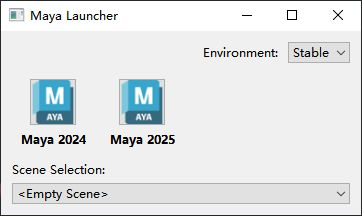

# 概述
- 因为Maya.env 文件和userSetup.py文件都有各自的限制
	- Maya.env 文件
		- 只能设置环境变量
		- 不是所有的环境都能被设置，仅限于maya的环境
		- 静态的，不能动态修改
	- userSetup.py文件
		- 在 Maya 启动后，初始化图形用户界面（GUI）之前执行，有很多环境变量不能设置：MAYA_APP_DIR，MAYA_ENV_DIR，PYTHON_PATH。
- 因此我们需要maya一个外部启动脚本，达到以下目的
	- 可在启动前设置和配置环境变量
	- 可为maya可执行文件传递参数
	- 提供比Maya.env 文件更强大的灵活性，并且通常完全取代他
	- 可以与userSetup.py文件结合使用，进行启动前和启动后的处理
# 原理
```python
import os
import subprocess

# 获取maya可执行文件路径
MAYA_PATH = r"C:\Program Files\Autodesk\Maya2024\bin\maya.exe"
# 所有环境变量副本，防止误修改环境变量
env_copy = os.environ.copy()
# 指定 Maya 用户配置文件的根目录（包括 `Maya.env`、脚本、偏好设置等）
env_copy["MAYA_APP_DIR"] = r"D:\Backup\Documents\maya_dev"
# 指定 maya Python 路径，只保留 maya 基础 Python 路径和本路径，覆盖其他自定义路径
env_copy["PYTHONPATH"] = r"D:\Backup\Documents\python_dev"

# 构造运行参数,使用maya2024打开skin_test文件
maya_args = [MAYA_PATH, "-file", "F:/Work/skin_test.mb"]
# 启动maya进程，异步执行，不会阻塞脚本。返回一个 Popen 对象，允许更灵活的进程管理。
subprocess.Popen(maya_args, env=env_copy)

```
# 案例
[Open: Pasted image 20250827182146.png](attachments/ceac1d126fa3e8d3ac019db4533cf365_MD5.jpeg)

```python
import sys
import os
import subprocess
from PySide6 import QtCore, QtWidgets, QtGui


class ApplicationButtonWdg(QtWidgets.QWidget):
    """软件按钮类"""

    BUTTON_SIZE = QtCore.QSize(48, 48)  # 按钮大小
    clicked = QtCore.Signal(str)  # 按钮信号

    def __init__(self, name, application_path, parent=None):
        """构造函数"""
        super().__init__(parent)
        # 实例变量
        self.app_path = application_path  # 软件可执行程序路径
        self.button = self.create_button()  # 创建按钮
        self.label = QtWidgets.QLabel(f"<b>{name}</b>")  # 按钮名称标签
        # 按钮布局
        button_layout = QtWidgets.QHBoxLayout()  # 横向布局
        button_layout.setAlignment(QtCore.Qt.AlignmentFlag.AlignCenter)  # 居中摆放
        button_layout.addWidget(self.button)  # 添加按钮控件
        # 主布局
        main_layout = QtWidgets.QVBoxLayout(self)  # 纵向布局
        main_layout.addLayout(button_layout)  # 添加按钮布局
        main_layout.addWidget(self.label)  # 添加标签控件
        main_layout.addStretch()  # 添加拉伸

    def create_button(self):
        """创建按钮"""
        button = QtWidgets.QToolButton()  # 创建按钮
        button.setFixedSize(ApplicationButtonWdg.BUTTON_SIZE)  # 按钮大小
        # QFileInfo类储存文件路径信息
        file_info = QtCore.QFileInfo(self.app_path)
        # QFileIconProvider 是一个用于提供文件和目录图标的类
        # 主要用于根据文件类型或路径获取系统相关的图标
        file_icon_provider = QtWidgets.QFileIconProvider()
        icon = file_icon_provider.icon(file_info)  # 获取软件的icon
        icon = self.get_scaled_icon(icon)  # 调整icon大小

        button.setIcon(icon)  # 按钮设置icon
        button.setIconSize(ApplicationButtonWdg.BUTTON_SIZE)  # 设置按钮大小
        button.clicked.connect(self.on_click)  # 连接函数
        return button

    def get_scaled_icon(self, icon: QtGui.QIcon):
        """缩放图标大小"""
        pixmap = icon.pixmap(ApplicationButtonWdg.BUTTON_SIZE)
        return QtGui.QIcon(pixmap)

    def on_click(self):
        """发射按钮信号（str）"""
        self.clicked.emit(self.app_path)


class MayaLauncher(QtWidgets.QWidget):
    """maya 启动器UI"""

    # 类属性
    MAYA_2024_PATH = "C:/Program Files/Autodesk/Maya2024/bin/maya.exe"
    MAYA_2025_PATH = "C:/Program Files/Autodesk/Maya2025/bin/maya.exe"

    EMPTY_SCENE = "<Empty Scene>"

    def __init__(self, parent=None):
        """构造函数"""
        super().__init__(parent)

        self.setWindowTitle("Maya Launcher")
        self.setMinimumWidth(360)

        self.create_widgets()
        self.create_layout()
        self.create_connections()

    def create_widgets(self):
        self.env_select_cmb = QtWidgets.QComboBox()
        self.env_select_cmb.addItems(["Stable", "Dev"])

        self.maya_2024_btn = ApplicationButtonWdg(
            "Maya 2024", MayaLauncher.MAYA_2024_PATH
        )
        self.maya_2025_btn = ApplicationButtonWdg(
            "Maya 2025", MayaLauncher.MAYA_2025_PATH
        )

        self.scene_select_cmb = QtWidgets.QComboBox()
        self.scene_select_cmb.addItems(
            [MayaLauncher.EMPTY_SCENE, "F:/Work/skin_test.mb"]
        )

    def create_layout(self):
        env_select_layout = QtWidgets.QHBoxLayout()
        env_select_layout.addStretch()
        env_select_layout.addWidget(QtWidgets.QLabel("Environment: "))
        env_select_layout.addWidget(self.env_select_cmb)

        maya_button_layout = QtWidgets.QHBoxLayout()
        maya_button_layout.addWidget(self.maya_2024_btn)
        maya_button_layout.addWidget(self.maya_2025_btn)
        maya_button_layout.addStretch()

        scene_select_layout = QtWidgets.QVBoxLayout()
        scene_select_layout.addWidget(QtWidgets.QLabel("Scene Selection: "))
        scene_select_layout.addWidget(self.scene_select_cmb)

        main_layout = QtWidgets.QVBoxLayout(self)
        main_layout.addLayout(env_select_layout)
        main_layout.addLayout(maya_button_layout)
        main_layout.addLayout(scene_select_layout)
        main_layout.addStretch()

    def create_connections(self):
        self.maya_2024_btn.clicked.connect(self.open_application)
        self.maya_2025_btn.clicked.connect(self.open_application)

    def open_application(self, app_path: str):
        """启动maya

        Args:
            app_path (str): maya启动程序路径
        """
        print(f"Opening Application: {app_path}")

        # 储存 Python脚本路径，环境变量 PYTHONPATH的值
        selected_env_path = ""
        # 储存启动maya所需参数
        # ["C:/Program Files/Autodesk/Maya2024/bin/maya.exe", "-file", "F:/Work/skin_test.mb"]
        # 意思是：使用 maya2024 打开 skin_test.mb 文件
        maya_args = []
        # 从控件中获取用户选择的Python脚本路径
        selected_env = self.env_select_cmb.currentText()
        if selected_env == "Stable":
            selected_env_path = "D:/PythonStable"
        elif selected_env == "Dev":
            selected_env_path = "D:/PythonDev"
        # 从控件中获取用户选择的打开文件路径
        scene_path = self.scene_select_cmb.currentText()
        if scene_path != MayaLauncher.EMPTY_SCENE:
            maya_args = ["-file", scene_path]
        # 启动 maya
        self.open_app_python(app_path, selected_env_path, maya_args)

    def open_app_python(self, app_path: str, selected_env_path: str, maya_args: list):
        """使用Python启动maya

        Args:
            app_path (str): maya启动程序路径
            selected_env_path (str): Python脚本路径
            maya_args (list): 储存启动maya所需参数
        """
        # 复制一个系统环境变量的副本
        maya_env = os.environ.copy()
        # 设置该环境变量
        maya_env["PYTHONPATH"] = selected_env_path
        # 在maya启动参数列表中插入maya启动程序路径
        maya_args.insert(0, app_path)
        # 启动maya
        subprocess.Popen(maya_args, env=maya_env)


if __name__ == "__main__":
    # 创建了一个 QApplication 实例，
    # 这是 PySide/PyQt 应用程序的核心，用于初始化和管理 GUI 应用程序的全局设置。
    # 这是一个从 Python 的 sys 模块传递的参数列表，
    # 包含命令行参数。QApplication 需要它来处理可能的命令行输入（例如启动时指定的选项）。
    app = QtWidgets.QApplication(sys.argv)
    # 创建了一个 MayaLauncher 类的实例
    window = MayaLauncher()
    # 窗口在屏幕上显示
    window.show()
    # 启动应用程序的事件循环，进入 GUI 程序的主循环。
    app.exec()

```