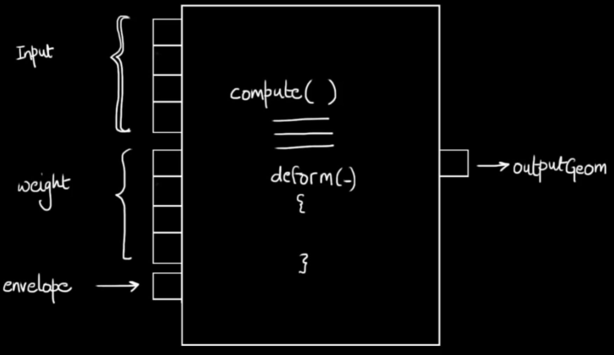
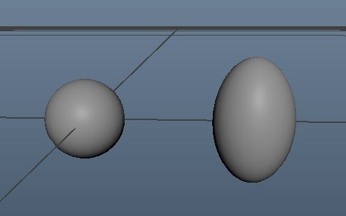
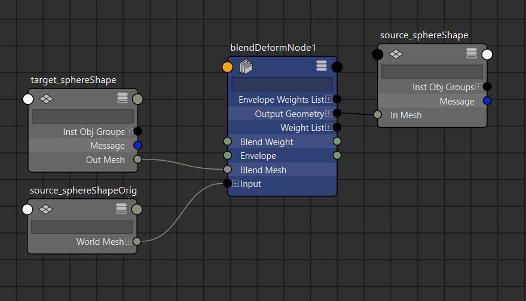

# 概述
- MPxDeformerNode类在Maya Python API2.0中不可用，Python插件必须使用原始Maya Python API 1.0
- 变形器通常只在Python中原型化，Python在快速开发方面非常出色，但在速度上并不那么优秀，涉及大量数据集的复杂计算的变形器更适合使用C++。

在 Autodesk Maya 中，**变形节点（Deformer Node）** 是 Dependency Graph (DG) 节点的一种特殊类型，用于对几何体（通常是网格、曲线或曲面）应用非破坏性的形变操作。变形节点通过修改几何体的顶点位置、方向或其他属性来实现形变效果，而不直接改变几何体的基础数据。以下是对 Maya 变形节点的组成、工作原理以及如何使用 Maya Python API 1.0 编写自定义变形节点的详细介绍。

---

### 一、变形节点的组成

变形节点是 Maya 节点系统中的一种，继承自 `OpenMaya.MPxDeformerNode`（在 Maya Python API 1.0 中）。父类是 MPxGeometryFilter 和 MPxNode。 它与普通的 Dependency Graph 节点类似，但专门用于处理几何体的形变。变形节点的组成包括：
[Open: Pasted image 20250730110459.png](attachments/ed7fc3adf9b2b2e97fd12bc92ad81b3b_MD5.jpeg)

1. **输入几何体（Input Geometry）**：
   - 变形节点通常接收一个输入几何体（`geometry` 属性），如多边形网格（`polyMesh`）、NURBS 曲面或曲线。
   - 输入几何体通过 `input` 属性（一个数组属性）传递，存储在 `MDataBlock` 中。
   - 每个数组元素有两个属性：groupId 和inputGeom，我们主要使用inputGeom 属性来实现变形

2. **输出几何体（Output Geometry）**：
   - 变形节点计算后的结果输出到一个新的几何体（`outputGeom` 属性），保留原始几何体不变。
   - 输出几何体与输入几何体类型相同，但包含形变后的顶点位置或其他修改。

3. **变形参数（Deformer Parameters）**：
   - 变形节点通常具有用户可调的参数（如 `weight`、`envelope` 或自定义属性），控制形变的效果。
   - `envelope` 是一个内置的浮点属性（范围通常为 0.0 到 1.0），用于控制形变的强度。

4. **权重（Weights）**：
   - 变形节点支持每个顶点的权重值（`weightList` 和 `weights` 属性），允许用户为几何体的不同部分指定不同的形变强度。
   - 权重可以通过权重画笔（Paint Weights）在 Maya 界面中调整。

5. **计算逻辑（Compute Method）**：
   - 变形节点的计算逻辑在 `deform` 方法中实现，负责根据输入几何体、参数和权重计算输出几何体的顶点位置。

---

### 二、变形节点的工作原理

变形节点是 Maya Dependency Graph 的一部分，遵循“拉取”模型（Pull Model），其工作原理如下：

1. **数据流**：
   - 变形节点接收输入几何体（通过 `input` 属性），并通过 `deform` 方法处理几何体的顶点、控制点或其他数据。
   - 输出几何体通过 `outputGeom` 属性传递给下游节点（如渲染或进一步的形变）。

2. **权重与影响**：
   - 每个顶点可以有独立的权重值，存储在 `weightList` 数组中。权重值影响形变的强度，允许局部控制。
   - `envelope` 属性全局缩放形变效果，通常用于动画或快速调整。

3. **惰性求值（Lazy Evaluation）**：
   - 只有当输出几何体被请求时（如渲染或视口更新），Maya 才会调用 `deform` 方法计算形变。
   - 如果输入几何体、权重或参数发生变化，相关属性会被标记为“脏”（Dirty），触发重新计算。

4. **并行计算**：
   - 变形节点支持多线程计算，`deform` 方法需要设计为线程安全的。
   - Maya 提供 `MItGeometry` 迭代器，用于高效遍历几何体的顶点或控制点。

5. **与 Maya 界面的交互**：
   - 变形节点可以通过 Maya 的界面（如 Attribute Editor 或 Node Editor）调整参数。
   - 权重可以通过权重画笔工具（Paint Weights）在几何体上直观编辑。

---

### 三、变形节点的常见类型

Maya 提供了多种内置的变形节点，每种节点实现特定的形变效果，例如：

- **Bend（弯曲）**：使几何体沿某一轴弯曲。
- **Twist（扭曲）**：围绕某一轴扭曲几何体。
- **Lattice（晶格）**：通过控制点网格调整几何体形状。
- **SkinCluster（蒙皮）**：用于绑定几何体到骨骼，实现角色动画。
- **Cluster（簇）**：通过一组控制点影响局部顶点。

自定义变形节点可以扩展这些功能，实现特定的形变效果，例如波浪形变、膨胀效果或基于数学公式的形变。

---

### 四、使用 Maya Python API 1.0 编写自定义变形节点

以下是一个简单的自定义变形节点示例，实现一个“正弦波形变”效果，将几何体的顶点沿 Y 轴按正弦函数移动。代码基于 Maya Python API 1.0，使用 `OpenMaya.MPxDeformerNode`。
#### 0. 代码结构
- `Node Class`
	- `__init__()`
	- `deform()`：相当于命令中的`doIt ()`或节点中的`compute()`
		- 在dataBlock中为inputArray添加一个句柄，用于获取inputArray元素
		- 获取到元素后，为元素附加句柄，用于获取元素的groupId 和inputGeom
		- 使用句柄的`.child`属性获取到inputGeom
	- `creator()`
	- `initialize()`
- initialize plugin：加载插件
- uninitialize plugin：卸载插件

#### 1. 示例代码：正弦波变形节点

```python
import math
import sys
import maya.OpenMaya as om
import maya.OpenMayaMPx as ommpx # <<< 修正：建议导入 ommpx 以使用 asMPxPtr

# 定义节点名称和唯一 ID
kPluginNodeName = "sineDeformer"
kPluginNodeId = om.MTypeId(0x87001) # 确保 ID 唯一

class SineDeformer(ommpx.MPxDeformerNode):
    # 节点属性
    amplitude = om.MObject()
    frequency = om.MObject()

    def __init__(self):
        super(SineDeformer, self).__init__() # <<< 修正：使用 super() 更符合 Python 风格

    @staticmethod
    def creator():
        # <<< 修正：creator 方法必须返回一个 MPxPtr 指针
        return ommpx.asMPxPtr(SineDeformer())

    @staticmethod
    def initialize():
        # --- 创建振幅属性 ---
        # <<< 修正：为每个属性创建一个新的 MFnNumericAttribute 实例
        nAttrAmp = om.MFnNumericAttribute()
        SineDeformer.amplitude = nAttrAmp.create("amplitude", "amp", om.MFnNumericData.kFloat, 0.1)
        nAttrAmp.setStorable(True)
        nAttrAmp.setKeyable(True)

        # --- 创建频率属性 ---
        # <<< 修正：为每个属性创建一个新的 MFnNumericAttribute 实例
        nAttrFreq = om.MFnNumericAttribute()
        SineDeformer.frequency = nAttrFreq.create("frequency", "freq", om.MFnNumericData.kFloat, 1.0)
        nAttrFreq.setStorable(True)
        nAttrFreq.setKeyable(True)

        # --- 添加属性到节点 ---
        SineDeformer.addAttribute(SineDeformer.amplitude)
        SineDeformer.addAttribute(SineDeformer.frequency)

        # --- 定义属性依赖关系 ---
        # <<< 修正：必须通过基类来引用继承的静态属性
        outputGeom = ommpx.MPxDeformerNode.outputGeom
        SineDeformer.attributeAffects(SineDeformer.amplitude, outputGeom)
        SineDeformer.attributeAffects(SineDeformer.frequency, outputGeom)
        # inputGeom 和 envelope 对 outputGeom 的影响已经由基类自动处理，无需手动添加。
        # 但如果需要，正确的写法是：
        # inputGeom = ommpx.MPxDeformerNode.inputGeom
        # SineDeformer.attributeAffects(inputGeom, outputGeom)

    def deform(self, dataBlock, geomIter, matrix, multiIndex):
        """
        实现形变逻辑
        """
        # --- 获取属性值 ---
        # 获取 envelope，这是变形器整体强度的控制器
        # <<< 修正：使用 self.envelopeAttribute() 来获取 envelope 的 MObject
        envelope = dataBlock.inputValue(self.envelopeAttribute()).asFloat()
        if envelope == 0.0: # 如果 envelope 为0，直接返回，无需计算
            return

        # 获取自定义属性值
        amplitude = dataBlock.inputValue(SineDeformer.amplitude).asFloat()
        frequency = dataBlock.inputValue(SineDeformer.frequency).asFloat()

        # --- 遍历几何体的顶点 ---
        while not geomIter.isDone():
            # <<< 修正：在对象空间(kObject)中进行所有计算
            point = geomIter.position() # 默认返回 kObject 空间位置

            # <<< 修正：获取当前顶点的权重
            weight = self.weightValue(dataBlock, multiIndex, geomIter.index())
            
            # 如果权重为0，跳过此顶点
            if weight == 0.0:
                geomIter.next()
                continue

            # --- 应用正弦波形变 ---
            # 计算偏移量，并乘以 envelope 和顶点权重
            offset = amplitude * math.sin(frequency * point.x) * envelope * weight
            point.y += offset

            # --- 设置新位置 ---
            geomIter.setPosition(point) # 在 kObject 空间中设置回去
            geomIter.next()

# ======================================================================
# 插件注册与卸载 (Boilerplate)
# ======================================================================
def initializePlugin(mobject):
    mplugin = ommpx.MFnPlugin(mobject, "Your Name", "1.0", "Any")
    try:
        mplugin.registerNode(kPluginNodeName, kPluginNodeId, SineDeformer.creator,
                             SineDeformer.initialize, ommpx.MPxNode.kDeformerNode)
    except:
        sys.stderr.write("Failed to register node: %s\n" % kPluginNodeName)
        raise

def uninitializePlugin(mobject):
    mplugin = ommpx.MFnPlugin(mobject)
    try:
        mplugin.deregisterNode(kPluginNodeId)
    except:
        sys.stderr.write("Failed to deregister node: %s\n" % kPluginNodeName)
        raise
```

#### 2. 代码说明

1. **节点类型**：
   - 继承自 `OpenMaya.MPxDeformerNode`，表明这是一个变形节点。
   - 在 `initializePlugin` 中，使用 `MPxNode.kDeformerNode` 注册为变形节点类型。

1. **属性定义**：
   - 定义了两个自定义节点属性：`amplitude`（振幅）和 `frequency`（频率），用于控制正弦波形变。
   - 使用 `MFnNumericAttribute` 创建浮点数属性，并通过 `attributeAffects` 定义它们对 `outputGeom` 的影响。
   - `input` 和 `outputGeom` 是 `MPxDeformerNode` 的内置属性，分别表示输入和输出几何体。
   - `envelope` 是内置属性，用于全局缩放形变效果。
1. 内置属性
  - 在 Maya Python API 1.0 中，`OpenMayaMPx.MPxDeformerNode` 提供了以下内置属性，用于自定义变形器的开发。这些属性maya早期通过`OpenMayaMPx.cvar`(control variable) 访问：
	- `input`: 输入几何体数组（MPlug 类型），用于连接上游节点的输出几何体。
		- 访问方式：`OpenMayaMPx.cvar.MPxDeformerNode_input`
	- `inputGeom`: 输入几何体数据（MDataHandle 类型），表示具体的输入几何体（如 MFnMesh 或 MFnNurbsCurve）。
		- 访问方式：`OpenMayaMPx.cvar.MPxDeformerNode_inputGeom`
	- `envelope`: 浮点型属性（MPlug 类型，范围 0.0 到 1.0），用于控制变形器的整体强度或开关效果。
		- 访问方式：`OpenMayaMPx.cvar.MPxDeformerNode_envelope`
	- `outputGeom`: 输出几何体数据（MDataHandle 类型），用于存储变形后的几何体。
		- 访问方式：`OpenMayaMPx.cvar.MPxGeometryFilter_outputGeom
	- weights：用于储存顶点的变形权重
	- weightList：用于储存顶点的变形权重
	- groupId：
- 这些属性在 `deform` 方法中通过 `MDataBlock` 访问和操作，用于实现自定义变形逻辑。
   

2. **形变逻辑**：
   - 在 `deform` 方法中实现形变逻辑，接收以下参数：
     - `dataBlock`：存储属性数据（如 `amplitude`、`frequency` 和 `envelope`）。
     - `geomIter`：`MItGeometry` 迭代器，用于遍历几何体的顶点。
     - `matrix`：输入几何体的世界变换矩阵。
     - `multiIndex`：输入几何体的索引（用于处理多个输入几何体）。
   - 代码遍历每个顶点，根据其 X 坐标计算正弦波偏移（`sin(frequency * x)`），并乘以 `amplitude` 和 `envelope` 调整 Y 坐标。

4. **线程安全**：
   - `deform` 方法通过 `MItGeometry` 访问顶点数据，确保线程安全。
   - 不直接修改全局状态，仅操作 `dataBlock` 和 `geomIter` 提供的数据。

#### 3. 使用方法

1. **保存代码**：
   - 将代码保存为 `sineDeformer.py`，放置在 Maya 的插件路径（如 `~/maya/plug-ins`）。

2. **加载插件**：
   - 在 Maya 的 Script Editor 中运行：
     ```python
     import maya.cmds as cmds
     cmds.loadPlugin("sineDeformer.py")
     ```

3. **应用变形节点**：
   - 创建一个几何体（例如一个平面）：
     ```python
     cmds.polyPlane(w=10, h=10, sx=20, sy=20)
     ```
   - 应用变形节点：
     ```python
     cmds.deformer(type="sineDeformer")
     ```
   - 调整属性：
     ```python
     cmds.setAttr("sineDeformer1.amplitude", 0.5)
     cmds.setAttr("sineDeformer1.frequency", 2.0)
     cmds.setAttr("sineDeformer1.envelope", 1.0)
     ```

4. **编辑权重**：
   - 使用 Maya 的 Paint Weights 工具（`ArtPaintSkinWeightsTool`）调整每个顶点的权重：
     ```python
     cmds.select("pPlane1")
     cmds.artPaintSkinWeightsTool()
     ```

#### 4. 调试与注意事项

- **线程安全**：确保 `deform` 方法不访问全局变量或非线程安全资源，仅依赖 `dataBlock` 和 `geomIter`。
- **权重处理**：如果需要支持权重，使用 `dataBlock.inputArrayValue(self.weightList)` 获取权重值。
- **性能优化**：对于大型几何体，尽量减少不必要的计算，使用 `geomIter` 高效遍历顶点。
- **错误处理**：检查 `geomIter` 的有效性，处理空几何体或非法输入。
- **属性依赖**：确保所有影响输出的属性都在 `initialize` 中通过 `attributeAffects` 注册。
#### 5. 另一个案例
```python
import maya.OpenMaya as om
import maya.OpenMayaMPx as ommpx
import sys

# 节点名称和ID
kNodeName = "pushDeformer"
kNodeId = om.MTypeId(0x12345) # 替换为你自己的唯一ID

# ======================================================================
# Deformer Node Definition
# ======================================================================
class PushDeformer(ommpx.MPxDeformerNode):
    """
    一个简单的变形器，沿着顶点法线方向推动顶点。
    """
    # 自定义属性对象
    # aPushDistance (pushDistance) 将是我们的自定义属性，用于控制变形强度。
    aPushDistance = om.MObject()

    def __init__(self):
        """
        构造函数
        """
        super(PushDeformer, self).__init__()

    def deform(self, dataBlock, geoIterator, matrix, multiIndex):
        """
        核心变形方法。
        当节点需要计算时，Maya 会调用此方法。

        参数:
            dataBlock (MDataBlock): 节点的数据块，用于获取属性值。
            geoIterator (MItGeometry): 几何体迭代器，用于遍历所有顶点。
            matrix (MMatrix): 变形器的变换矩阵。
            multiIndex (int): inputGeom 的逻辑索引。
        """
        # 1. 获取自定义属性 'pushDistance' 的值
        # =================================================
        # 从数据块中获取 pushDistance 属性的句柄 (handle)
        pushDistanceHandle = dataBlock.inputValue(self.aPushDistance)
        # 从句柄中获取 float 值
        pushDistanceValue = pushDistanceHandle.asFloat()

        # 2. 获取 envelope 属性的值
        # =================================================
        # 注意：我们使用 self.envelopeAttribute() 来获取父类定义的 envelope 属性。
        # 这是从 MPxDeformerNode 继承而来的标准属性。
        envelopeHandle = dataBlock.inputValue(self.envelopeAttribute())
        envelopeValue = envelopeHandle.asFloat()
        
        # 如果 pushDistance 或 envelope 非常小，则无需计算，提前返回。
        if pushDistanceValue < 0.001 or envelopeValue < 0.001:
            return

        # 3. 遍历顶点并修改位置
        # =================================================
        # 重置迭代器，准备开始遍历
        geoIterator.reset()
        while not geoIterator.isDone():
            # 获取当前顶点位置
            pt = geoIterator.position()
            # 获取当前顶点的法线
            normal = geoIterator.normal()
            
            # 计算权重
            # weight 是每个顶点受影响的权重，通常通过绘制权重贴图来控制。
            # 我们从迭代器中获取当前索引下的权重值。
            weight = self.weightValue(dataBlock, multiIndex, geoIterator.index())

            # 计算最终的推动量
            # 最终效果 = 自定义距离 * 全局envelope * 单个顶点权重
            finalPush = pushDistanceValue * envelopeValue * weight
            
            # 沿着法线方向移动顶点
            # 新位置 = 原位置 + 法线向量 * 推动量
            pt += normal * finalPush
            
            # 更新顶点位置
            geoIterator.setPosition(pt)

            # 移动到下一个顶点
            geoIterator.next()


# ======================================================================
# 插件的初始化和注册
# ======================================================================
def nodeCreator():
    """
    创建 PushDeformer 实例的工厂函数。
    """
    return ommpx.asMPxPtr(PushDeformer())

def nodeInitializer():
    """
    初始化节点属性。
    """
    # 1. 创建我们的自定义属性: pushDistance
    # ==================================
    # 使用 MFnNumericAttribute 来创建一个 float 类型的属性
    nAttr = om.MFnNumericAttribute()
    PushDeformer.aPushDistance = nAttr.create("pushDistance", "pd", om.MFnNumericData.kFloat, 0.0)
    nAttr.setKeyable(True)       # 让它在通道盒中可见并且可以设置关键帧
    nAttr.setMin(0.0)            # 设置最小值
    nAttr.setMax(10.0)           # 设置最大值
    nAttr.setStorable(True)      # 确保该值可以被存储到场景文件中

    # 2. 将新属性添加到节点定义中
    # ==================================
    PushDeformer.addAttribute(PushDeformer.aPushDistance)

    # 3. 建立属性影响关系
    # ==================================
    # 这一步至关重要！它告诉 Maya，当 aPushDistance 属性发生变化时，
    # outputGeom 属性也需要被重新计算。
    # self.outputGeomAttribute() 是从父类继承的标准输出属性。
    PushDeformer.attributeAffects(PushDeformer.aPushDistance, PushDeformer.outputGeomAttribute())


def initializePlugin(mobject):
    """
    插件加载时调用的函数。
    """
    mplugin = ommpx.MFnPlugin(mobject, "Your Name", "1.0", "Any")
    try:
        mplugin.registerNode(kNodeName, kNodeId, nodeCreator, nodeInitializer, ommpx.MPxNode.kDeformerNode)
    except:
        sys.stderr.write("Failed to register node: %s\n" % kNodeName)
        raise

def uninitializePlugin(mobject):
    """
    插件卸载时调用的函数。
    """
    mplugin = ommpx.MFnPlugin(mobject)
    try:
        mplugin.deregisterNode(kNodeId)
    except:
        sys.stderr.write("Failed to deregister node: %s\n" % kNodeName)
        raise
```
---

### 五、变形节点的高级功能

1. **支持多几何体**：
   - 变形节点可以通过 `input` 数组属性处理多个输入几何体，`multiIndex` 参数指定当前处理的几何体索引。

2. **权重管理**：
   - 使用 `weightList` 和 `weights` 属性支持每个顶点的独立权重。
   - 示例代码中未实现权重处理，但可以通过以下方式获取：
     ```python
     weightHandle = dataBlock.inputArrayValue(self.weightList)
     weightHandle.jumpToElement(geomIter.index())
     weight = weightHandle.inputValue().asFloat()
     ```

3. **自定义参数**：
   - 可以添加更多属性（如偏移量、方向向量）来增强形变效果。
   - 使用 `MFnCompoundAttribute` 创建复合属性，组织多个相关参数。

4. **与动画集成**：
   - 属性（如 `amplitude` 和 `frequency`）可以设置关键帧，支持动画驱动。
   - 例如：
     ```python
     cmds.setKeyframe("sineDeformer1.amplitude", t=1, v=0.5)
     cmds.setKeyframe("sineDeformer1.amplitude", t=10, v=1.0)
     ```

---

### 六、总结

- **变形节点**是 Maya 中用于非破坏性修改几何体的 Dependency Graph 节点，继承自 `OpenMaya.MPxDeformerNode`。
- **组成**包括输入/输出几何体、变形参数（如 `envelope`）、权重和计算逻辑（`deform` 方法）。
- **工作原理**基于 Maya 的“拉取”模型，支持多线程计算和权重管理，集成到 Dependency Graph 中。
- **实现方式**通过 Maya Python API 1.0 定义自定义节点，覆盖 `deform` 方法处理几何体顶点。
- **应用场景**包括波浪形变、角色蒙皮、局部调整等，广泛用于动画、建模和特效。

# 案例
## 变形器：每隔一个定点，位置上移2个单位
```python
import maya.OpenMaya as om
import maya.OpenMayaMPx as mpx


class BasicDeformerNode(mpx.MPxDeformerNode):
    """ """

    TYPE_NAME = "basicDeformNode"
    TYPE_ID = om.MTypeId(0x0007F7FC)

    def __init__(self):
        """构造函数"""
        super().__init__()

    def deform(
        self,
        data_block: om.MDataBlock,
        geo_iter: om.MItGeometry,
        obj_matrix: om.MMatrix,
        multi_index: int,
    ) -> None:
        """变形器变形逻辑:
        每隔一个顶点，顶点位置上移2
        Args:
            data_block (om.MDataBlock): 存储属性数据
            geo_iter (om.MItGeometry): 几何体迭代器
            matrix (om.MMatrix): 输入几何体的世界变换矩阵
            index (int): 输入几何体的索引（用于处理多个输入几何体）
        """
        # 从dataBlock中获取 内置的 envelope 属性,用来表示变形强度
        envelope = data_block.inputValue(self.envelope).asFloat()
        # 如果envelope = 0，什么都不做，返回
        if envelope == 0:
            return
        # 重置迭代器使其指向第一个顶点
        geo_iter.reset()
        # 使用迭代器迭代顶点
        while not geo_iter.isDone():
            # 如果顶点索引是偶数则上移2个单位
            if geo_iter.index() % 2 == 0:
                point = geo_iter.position()  # 获取顶点位置
                point.z += 2 * envelope
                geo_iter.setPosition(point)  # 设置顶点位置
            # 迭代器继续迭代
            geo_iter.next()

    @classmethod
    def creator(cls):
        """返回类的实例"""
        return cls()

    @classmethod
    def initialize(cls):
        pass


def initializePlugin(plugin):
    """加载插件并注册命令"""
    vendor = "Charles Tian"
    version = "1.0.0"
    plugin_fn = mpx.MFnPlugin(plugin, vendor, version)
    try:
        plugin_fn.registerNode(
            BasicDeformerNode.TYPE_NAME,
            BasicDeformerNode.TYPE_ID,
            BasicDeformerNode.creator,
            BasicDeformerNode.initialize,
            mpx.MPxNode.kDeformerNode,
        )
    except Exception as e:
        om.MGlobal.displayError(
            f"Failed to register command {BasicDeformerNode.TYPE_NAME}: {e}"
        )


def uninitializePlugin(plugin):
    """卸载插件，并取消注册命令"""
    plugin_fn = mpx.MFnPlugin(plugin)
    try:
        plugin_fn.deregisterNode(BasicDeformerNode.TYPE_ID)
    except Exception as e:
        om.MGlobal.displayError(
            f"Failed to deregister command {BasicDeformerNode.COMMAND_NAME}: {e}"
        )

```
## 变形器：混合变形
### 描述
[Open: Pasted image 20250813165911.png](attachments/1f38cf8e340a93249132bdfffc27371f_MD5.jpeg)

- 一个源模型，一个目标模型，一个自定义变形器节点：blendDeformNode
- 将目标模型 outMesh属性连接到blendDeformNode节点的blendMesh属性
- 将blendDeformNode节点的outGeometry属性连接到源模型的inMesh属性
### 原理
- 核心原理：
- 最终顶点位置 = 源模型顶点位置 + （目标模型顶点位置 - 源模型顶点位置）* blend_weight属性 * envelope属性 * source_weight属性（绘制权重）
### 使用
[Open: Pasted image 20250813165855.png](attachments/22b5545d5d4c523c0399b12db1acb174_MD5.jpeg)

- 加载插件
- 选中源模型，执行`pm.deformer(type="blendDeformNode")`
- 连接目标模型和变形器属性，执行`pm.connectAttr("target_sphereShape.outMesh", "blendDeformNode1.blendMesh")`
- 即可实现变形器
```python
import maya.OpenMaya as om
import maya.OpenMayaMPx as mpx
import pymel.core as pm


class BlendDeformerNode(mpx.MPxDeformerNode):
    """ """

    # 变形器名称和编号
    TYPE_NAME = "blendDeformNode"
    TYPE_ID = om.MTypeId(0x0007F7FD)
    # 变形器所需属性
    inBlendMesh = om.MObject
    inBlendWeight = om.MObject

    def __init__(self):
        """构造函数"""
        super().__init__()

    def deform(
        self,
        dataBlock: om.MDataBlock,
        geoIter: om.MItGeometry,
        objMatrix: om.MMatrix,
        multIndex: int,
    ) -> None:
        """变形器变形逻辑:
        Args:
            dataBlock (om.MDataBlock): 存储属性数据
            geoIter (om.MItGeometry): 几何体迭代器
            objMatrix (om.MMatrix): 输入几何体的世界变换矩阵
            multIndex (int): 输入几何体的索引（用于处理多个输入几何体）
        """
        # 从dataBlock中获取属性
        envelope = dataBlock.inputValue(self.envelope).asFloat()
        if envelope == 0:
            return
        blend_weight = dataBlock.inputValue(BlendDeformerNode.inBlendWeight).asFloat()
        if blend_weight == 0:
            return
        target_mesh = dataBlock.inputValue(BlendDeformerNode.inBlendMesh).asMesh()
        if target_mesh.isNull():
            return
        # 获取目标模型点位置
        target_points = om.MPointArray()
        target_mesh_fn = om.MFnMesh(target_mesh)
        target_mesh_fn.getPoints(target_points)

        # 重置迭代器使其指向第一个顶点
        geoIter.reset()
        # 通过blend_weight * envelope获取全局变形权重
        global_weight = blend_weight * envelope
        # 使用迭代器迭代顶点
        while not geoIter.isDone():
            source_point = geoIter.position()
            target_point = target_points[geoIter.index()]
            # 支持绘制权重
            source_weight = self.weightValue(dataBlock, multIndex, geoIter.index())
            # 计算变形插值
            final_point = (
                source_point
                + (target_point - source_point) * global_weight * source_weight
            )
            # 设置最终顶点位置
            geoIter.setPosition(final_point)
            # 迭代器继续迭代
            geoIter.next()

    @classmethod
    def creator(cls):
        """返回类的实例"""
        return cls()

    @classmethod
    def initialize(cls):
        """设置属性"""
        typedAttr = om.MFnTypedAttribute()
        cls.inBlendMesh = typedAttr.create("blendMesh", "bm", om.MFnData.kMesh)

        numericAttr = om.MFnNumericAttribute()
        cls.inBlendWeight = numericAttr.create(
            "blendWeight", "bw", om.MFnNumericData.kFloat, 0.0
        )
        numericAttr.setKeyable(True)
        numericAttr.setMin(0.0)
        numericAttr.setMax(1.0)
        # 添加属性
        cls.addAttribute(cls.inBlendMesh)
        cls.addAttribute(cls.inBlendWeight)
        # 获得outputGeom属性
        outputGeom = mpx.cvar.MPxGeometryFilter_outputGeom
        # 添加属性影响
        cls.attributeAffects(cls.inBlendMesh, outputGeom)
        cls.attributeAffects(cls.inBlendWeight, outputGeom)


def initializePlugin(plugin):
    """加载插件并注册命令"""
    vendor = "Charles Tian"
    version = "1.0.0"
    plugin_fn = mpx.MFnPlugin(plugin, vendor, version)
    try:
        plugin_fn.registerNode(
            BlendDeformerNode.TYPE_NAME,
            BlendDeformerNode.TYPE_ID,
            BlendDeformerNode.creator,
            BlendDeformerNode.initialize,
            mpx.MPxNode.kDeformerNode,
        )
    except Exception as e:
        om.MGlobal.displayError(
            f"Failed to register command {BlendDeformerNode.TYPE_NAME}: {e}"
        )
    # 开启变形节点支持权重绘制
    pm.makePaintable(
        BlendDeformerNode.TYPE_NAME,
        "weights",
        attrType="multiFloat",
        shapeMode="deformer",
    )


def uninitializePlugin(plugin):
    """卸载插件，并取消注册命令"""
    # 关闭变形节点支持权重绘制
    pm.makePaintable(BlendDeformerNode.TYPE_NAME, "weights", remove=True)
    # 卸载插件
    plugin_fn = mpx.MFnPlugin(plugin)
    try:
        plugin_fn.deregisterNode(BlendDeformerNode.TYPE_ID)
    except Exception as e:
        om.MGlobal.displayError(
            f"Failed to deregister command {BlendDeformerNode.COMMAND_NAME}: {e}"
        )


if __name__ == "__main__":
    pm.openFile(r"H:/Project_PJX/test.ma", force=True)

    plugin_name = "blend_deformer_node"
    pm.unloadPlugin(plugin_name)
    pm.loadPlugin(plugin_name)

    pm.select("source_sphere")
    pm.deformer(type="blendDeformNode")

    pm.connectAttr("target_sphereShape.outMesh", "blendDeformNode1.blendMesh")

```