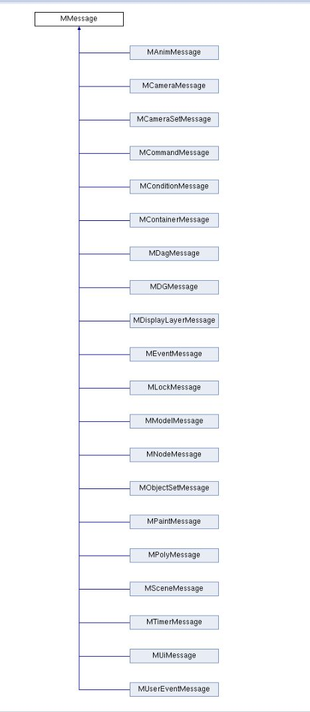

在 Maya Python API 1.0 中，回调（Callback）机制允许开发者在特定事件发生时执行自定义的 Python 代码。回调通常用于响应 Maya 内部的事件，例如场景更改、节点操作或用户交互等。通过使用 `OpenMaya.MSceneMessage` 和其他相关类，可以注册回调来监听这些事件。

以下是对 Maya Python API 1.0 中回调机制的详细介绍：

---

### 1. **回调的基本概念**
回调是 Maya 提供的一种机制，用于在特定事件触发时调用用户定义的函数。Maya Python API 1.0 通过 `OpenMaya` 模块提供了对回调的支持，主要依赖于 `MSceneMessage` 类来管理场景相关的事件。回调函数通常需要以特定的方式定义，并通过 Maya 的 API 注册。

- **用途**：
  - 监听场景变化（如保存、打开、新建场景等）。
  - 响应节点的操作（如添加、删除、属性更改）。
  - 自定义工具或工作流程的自动化。

- **常用类**：
- [Open: Pasted image 20250813171149.png](attachments/2a0981a59ae509114ef10ce59dae87cf_MD5.jpeg)

  - `OpenMaya.MMessage`：基类，提供了基本的回调功能。
	  - `OpenMaya.MSceneMessage`：用于注册与场景相关的事件回调（如保存、打开场景等）。
		  - New scene
		  - Open exist scene
		  - Reference is loaded - unloaded
		  - Maya is initilazed / existed
	  - `OpenMaya.MDGMessage`：用于监听节点和属性的变化。
		  - For Dependency Graph Message
		  - Node added/remove
		  - Connection link/remove
	  - `OpenMaya.MDagMessage`: 用于监听DAG节点的变化
		  - parent / child
		  - add / remove
	  - `OpenMaya.MNodeMessage`：用于监听节点行为
		  - For Dependency Node
		  - Attribute add / remove
		  - Plug of node is dirty
		  - name of node change
	  - `OpenMaya.MEventMessage`：用于处理全局或交互事件（选择改变，时间改变等）。
		  - 类似MEL 语言的`scriptJob
		  - `OpenMaya.MEventMessage.getEventNames()`函数可获取事件名称列表
	  - `OpenMaya.MLockMessage`：
		  - 用于查看Node或Plug是否被锁定
		  - Plug被锁定，他的值无法被修改
		  - Node被锁定，无法被编辑
	  - `OpenMaya.MAnimMessage`: 用于处理动画交互事件
		  - Animation Curve Editing
		  - Keyframe Editing
		  - Baked Result Change
	  - OpenMaya.MCommandMessage：处理命令回调
		  - MEL Command Execute
	  - `OpenMaya.MTimerMessage`：时间栏变化添加回调函数
	  - `OpenMaya.MUserEventMessage`：用于处理用户自定义事件
	  - `OpenMayaUI.MUiMessage`：用于处理UI变化
#### 举例
- 以MEventMessage举例，它有两个方法
	- `addEventCallback(eventName, function, clientData=None) -> id`
		- 该函数用于添加事件回调
		- 三个参数分别是：事件名称，回调函数和用户数据，其中用户数据是用户的自定义数据用于传递到回调函数
	- `getEventName() -> [string...]`
		- 返回所有事件名称列表

---

### 2. **回调的注册与使用**
在 Maya Python API 1.0 中，回调通过特定的方法注册到事件上。以下是注册回调的典型步骤：

#### **步骤**
1. **定义回调函数**：
   回调函数需要符合特定的事件签名，通常接收特定参数（如事件相关的上下文信息）。例如：
   ```python
   import maya.OpenMaya as om

   def myCallback(clientData):
       print("Callback triggered! User data:", clientData)
   ```

2. **注册回调**：
   使用 `MSceneMessage.addCallback` 或其他相关方法注册回调函数，并指定触发回调的事件类型。常见的事件类型包括：
   - `OpenMaya.MSceneMessage.kBeforeSave`：保存场景前。
   - `OpenMaya.MSceneMessage.kAfterSave`：保存场景后。
   - `OpenMaya.MSceneMessage.kBeforeOpen`：打开场景前。
   - `OpenMaya.MSceneMessage.kAfterOpen`：打开场景后。

   示例：
   ```python
   import maya.OpenMaya as om

   def myCallback(clientData):
       print("Scene is being saved!")

   # 注册保存场景前的回调
   callbackId = om.MSceneMessage.addCallback(om.MSceneMessage.kBeforeSave, myCallback)
   ```

3. **管理回调**：
   - 每个回调注册后会返回一个 `callbackId`，用于后续管理（如移除回调）。
   - 为了避免内存泄漏或重复触发，建议在适当的时候移除回调。

4. **移除回调**：
   使用 `MMessage.removeCallback` 移除已注册的回调，传入回调的 `callbackId`：
   ```python
   om.MMessage.removeCallback(callbackId)
   ```

---

### 3. **回调函数的参数**
回调函数通常会接收一个 `clientData` 参数（或其他特定参数，取决于事件类型）。`clientData` 是一个用户自定义的对象，可以在注册回调时传递，用于存储额外的信息。

示例：
```python
import maya.OpenMaya as om

def myCallback(clientData):
    print("Callback triggered with data:", clientData)

# 注册回调并传递自定义数据
callbackId = om.MSceneMessage.addCallback(om.MSceneMessage.kBeforeSave, myCallback, "My custom data")
```

在上述例子中，`clientData` 的值将是 `"My custom data"`。

---

### 4. **常见事件类型**
以下是一些常用的 `MSceneMessage` 事件类型，适用于场景相关操作：
- `kBeforeNew` / `kAfterNew`：新建场景前后。
- `kBeforeOpen` / `kAfterOpen`：打开场景前后。
- `kBeforeSave` / `kAfterSave`：保存场景前后。
- `kBeforeExport` / `kAfterExport`：导出场景前后。
- `kSceneUpdate`：场景更新时触发。

对于节点相关的回调，可以使用 `MDGMessage` 类，例如：
- `MDGMessage.addNodeAddedCallback`：监听新节点添加。
- `MDGMessage.addNodeRemovedCallback`：监听节点删除。

---

### 5. **注意事项**
- **内存管理**：回调在注册后会持续存在，直到显式移除。未移除的回调可能导致内存泄漏或意外行为，尤其是在脚本重复运行时。
- **线程安全**：Maya 的回调运行在主线程中，因此回调函数中应避免执行耗时操作，以免影响 Maya 的性能。
- **异常处理**：在回调函数中应添加适当的异常处理，避免因错误导致 Maya 崩溃。
  ```python
  def myCallback(clientData):
      try:
          print("Callback triggered!")
      except Exception as e:
          print("Error in callback:", e)
  ```

- **回调的生命周期**：回调与 Maya 会话相关联，当 Maya 关闭时，回调会自动失效。但在脚本开发中，建议手动管理回调的注册和移除。

---

### 6. **完整示例**
以下是一个完整的示例，展示如何在保存场景时触发回调：
```python
import maya.OpenMaya as om

# 定义回调函数
def onBeforeSave(clientData):
    try:
        print("Saving scene... Custom data:", clientData)
    except Exception as e:
        print("Error in callback:", e)

# 存储回调 ID 的全局变量
callbackId = None

# 注册回调
def registerCallback():
    global callbackId
    if callbackId is None:
        callbackId = om.MSceneMessage.addCallback(om.MSceneMessage.kBeforeSave, onBeforeSave, "My custom data")
        print("Callback registered!")

# 移除回调
def removeCallback():
    global callbackId
    if callbackId is not None:
        om.MMessage.removeCallback(callbackId)
        callbackId = None
        print("Callback removed!")

# 测试：注册回调
registerCallback()

# 测试：移除回调（在需要时调用）
# removeCallback()
```

---

### 7. **其他相关功能**
- **节点回调**：使用 `OpenMaya.MDGMessage` 监听节点或属性的变化。例如：
  ```python
  def nodeAddedCallback(node, clientData):
      print("New node added:", om.MFnDependencyNode(node).name())

  callbackId = om.MDGMessage.addNodeAddedCallback(nodeAddedCallback, "transform")
  ```
  上述代码监听类型为 `transform` 的节点添加事件。

- **UI 事件回调**：使用 `OpenMayaUI.MEventMessage` 监听 UI 事件（如窗口创建、按钮点击等）。

---

### 8. **限制与建议**
- **API 1.0 的限制**：Maya Python API 1.0 功能较为基础，某些复杂事件可能需要结合 API 2.0 或 MEL 命令实现。
- **调试**：建议在回调函数中添加日志或调试信息，以便跟踪回调的触发情况。
- **性能**：避免在回调中执行复杂逻辑，必要时可将任务分派到后台线程（需自行实现线程管理）。

---

### 总结
Maya Python API 1.0 的回调机制通过 `MSceneMessage`、`MDGMessage` 等类提供了一种强大的方式来响应 Maya 的事件。开发者可以通过注册回调函数，监听场景、节点或 UI 事件，从而实现自定义功能。关键点是正确管理回调的注册与移除，确保代码的健壮性和性能。
