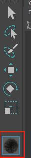

在 Autodesk Maya 的 Python API 2.0（`maya.api.OpenMaya` 和 `maya.api.OpenMayaUI`）中，**Contexts** 是用于创建和管理交互式工具的核心机制。它们允许开发者捕获用户输入（例如鼠标点击、拖动、键盘事件）并将其映射到 Maya 场景的操作，例如选择对象、修改变换或编辑几何体。Contexts 是实现自定义工具（如移动、旋转、选择工具）的关键，广泛用于扩展 Maya 的交互功能。以下是对 Maya Python API 2.0 中 Contexts 的全面介绍，涵盖 `MPxContext`、`MPxSelectionContext`、`MPxContextCommand` 和 `MPxToolCommand` 的功能、用法、关键方法以及它们之间的协作关系。

---

### 1. **什么是 Contexts？**
- **定义**：Contexts 是 Maya API 中用于定义交互式工具行为的对象，负责处理用户输入（如鼠标、键盘事件）并将其转换为场景操作。它们是 Maya 交互系统的核心，允许开发者创建自定义工具，与 Maya 的 3D 视图交互。
- **作用**：
  - 捕获用户输入（如鼠标点击、拖动、键盘按键）。
  - 定义工具的行为（例如选择对象、移动节点、绘制几何体）。
  - 支持交互式操作的实时反馈和撤销/重做功能。
- **典型应用场景**：
  - 自定义选择工具（如框选、画刷选择）。
  - 交互式变换工具（如拖动对象进行平移、旋转、缩放）。
  - 几何体编辑工具（如调整顶点、权重或 UV）。
  - 在视图中绘制临时图形（如选择框或路径）。
- **相关模块**：
  - Contexts 主要位于 `maya.api.OpenMayaUI`（用于视图交互和上下文管理）和 `maya.api.OpenMaya`（用于场景操作）。
  - 常与 `M3dView`（视图管理）、`MEvent`（事件处理）、`MDagPath` 和 `MFnDagNode`（节点操作）等类协作。

---

### 2. **核心类概述**
Maya Python API 2.0 提供了以下四个与 Contexts 相关的核心类：

#### 2.1 **`MPxContext`**
- **描述**：`MPxContext` 是交互式工具的基类，用于定义自定义工具的行为，捕获用户输入并执行相应的操作。
- **用途**：适合创建通用交互工具，例如在视图中捕获鼠标事件、绘制临时图形或执行自定义逻辑。
- **关键方法**：
  - `doPress(event)`：处理鼠标按下事件。
  - `doDrag(event)`：处理鼠标拖动事件。
  - `doRelease(event)`：处理鼠标释放事件。
  - `doEnterRegion()`：鼠标进入视图时触发。
  - `doLeaveRegion()`：鼠标离开视图时触发。
  - `helpStateHasChanged(event)`：工具状态变化时触发（例如按下修饰键）。
  - `stringClassName()`：返回工具的名称（用于注册）。
  - `setTitleString(title)`：设置工具的标题（显示在 Maya 界面中）。
  - `setImage(imagePath, imageType)`：设置工具的图标。
- **示例用途**：创建一个工具，捕获鼠标点击并在视图中打印坐标。
- 注意：事件仅支持鼠标：左键和中间，修饰键为：键盘的Shift键和Ctrl键。右键和Alt键被maya保留使用

#### 2.2 **`MPxSelectionContext`**
- **描述**：`MPxSelectionContext` 是 `MPxContext` 的子类，专门用于处理选择相关的交互工具。
- **用途**：适合实现自定义选择逻辑，例如框选、画刷选择或基于距离的选择。
- **关键方法**（继承并扩展自 `MPxContext`）：
  - `doPress(event)`：开始选择操作。
  - `doDrag(event)`：更新选择区域。
  - `doRelease(event)`：完成选择并更新 `MSelectionList`。
  - `isSelecting()`：检查是否处于选择状态。
  - `addManipulator(manipulator)`：添加自定义操纵器（manipulator）以辅助选择。
- **示例用途**：实现一个框选工具，允许用户拖动鼠标选择场景中的对象。

#### 2.3 **`MPxContextCommand`**
- **描述**：继承自 MPxCommand。`MPxContextCommand` 是用于创建和管理 `MPxContext` 或 `MPxSelectionContext` 的命令类，负责实例化上下文并将其注册到 Maya。
	- MPxContext 是一个交互式工具类，负责定义工具的行为（如鼠标事件的处理），但它本身不直接与 Maya 的命令系统交互。为了将 MPxContext 实例注册为 Maya 的工具并使其可被用户激活，Maya 使用了命令-上下文分离的设计模式。
- **用途**：每个自定义上下文都需要一个 `MPxContextCommand` 来初始化工具并与 Maya 的命令系统集成。
- **关键方法**：
  - `makeObj()`：创建并返回 `MPxContext` 或 `MPxSelectionContext` 实例。
  - `doEditFlags()`：处理编辑模式的标志（例如设置工具参数）。
  - `doQueryFlags()`：处理查询模式的标志（例如查询工具状态）。
  - `appendSyntax()`：定义命令的语法（用于 MEL 或 Python 调用）。
- **示例用途**：注册一个上下文工具并绑定到 Maya 的工具栏或快捷键。

#### 2.4 **`MPxToolCommand`**
- **描述**：`MPxToolCommand` 是用于定义交互式命令的基类，负责执行具体的操作逻辑，通常在 `MPxContext` 或 `MPxSelectionContext` 中调用，支持撤销和重做。
- **用途**：适合在交互式上下文中执行需要撤销支持的操作，例如移动对象、修改属性或编辑几何体。
- **关键方法**：
  - `doIt(argList)`：执行命令的主要逻辑。
  - `undoIt()`：撤销命令的操作。
  - `redoIt()`：重做命令的操作。
  - `finalize()`：完成命令并添加到撤销队列。
  - `isUndoable()`：返回是否支持撤销（默认 `False`）。
  - `cancel()`：取消命令的执行。
- **示例用途**：实现一个移动工具，记录初始位置并在拖动后支持撤销。

---

### 3. **工作原理**
Contexts 的工作流程涉及用户输入、上下文管理、命令执行和场景操作的协作：
1. **注册工具**：
   - 使用 `MPxContextCommand` 创建并注册一个上下文工具（`MPxContext` 或 `MPxSelectionContext`）。
   - 通过 `maya.cmds.loadPlugin` 和 `setToolTo` 激活工具。

2. **捕获用户输入**：
   - `MPxContext` 或 `MPxSelectionContext` 捕获鼠标和键盘事件（通过 `MEvent`）。
   - 使用 `M3dView` 将屏幕坐标转换为世界坐标，或获取视图信息。

3. **执行命令**：
   - 在交互过程中，上下文调用 `MPxToolCommand` 执行具体操作（如移动节点、修改属性）。
   - `MPxToolCommand` 保存初始状态，支持撤销和重做。

4. **更新场景**：
   - 操作通过 `MDagPath`, `MFnDagNode` 或 `MSelectionList` 应用于场景中的节点。
   - 临时图形（如选择框）通过 `M3dView` 绘制。

5. **完成交互**：
   - 在 `doRelease` 或 `finalize` 中，工具完成操作并将命令添加到 Maya 的撤销队列。

---
### 4. **与 MPxContext 和 MPxContextCommand 的关系**

- **MPxContext**：
    - 定义交互式工具的行为，捕获用户输入（如鼠标按下、拖动、释放）。
    - 通常在 doPress, doDrag, doRelease 等方法中调用 MPxToolCommand 来执行具体操作。
    - 示例：MPxContext 捕获鼠标拖动路径，然后调用 MPxToolCommand 更新节点位置。
- **MPxContextCommand**：
    - 负责创建和管理 MPxContext 实例，并将其注册到 Maya。
    - 可以选择性地创建 MPxToolCommand 实例，以便在上下文中执行命令。
    - 示例：MPxContextCommand 激活一个上下文工具，并通过 MPxToolCommand 处理交互结果。
- **MPxToolCommand**：
    - 专注于执行具体的命令逻辑（如修改节点属性、变换或几何体）。
    - 提供 doIt, undoIt, redoIt 等方法，支持命令的执行和撤销。
    - 通常由 MPxContext 在交互过程中调用。
### 5. **典型用法**
以下是一个完整的示例，展示如何结合 `MPxContext`, `MPxContextCommand` 和 `MPxToolCommand` 创建一个交互式移动工具，用户可以拖动选定对象，并在释放鼠标时支持撤销。

```python
import maya.api.OpenMaya as om
import maya.api.OpenMayaUI as omui
import maya.cmds as cmds

class MoveToolCommand(om.MPxToolCommand):
    def __init__(self):
        super(MoveToolCommand, self).__init__()
        self.initial_pos = None
        self.final_pos = None
        self.dag_path = None

    def doIt(self, argList):
        # 初始化命令，保存初始状态
        selection_list = om.MGlobal.getActiveSelectionList()
        if not selection_list.isEmpty():
            self.dag_path = selection_list.getDagPath(0)
            transform_fn = om.MFnTransform(self.dag_path)
            self.initial_pos = transform_fn.translation(om.MSpace.kWorld)
        return self.redoIt()

    def redoIt(self):
        # 应用移动
        if self.dag_path and self.final_pos:
            transform_fn = om.MFnTransform(self.dag_path)
            transform_fn.setTranslation(self.final_pos, om.MSpace.kWorld)

    def undoIt(self):
        # 恢复初始位置
        if self.dag_path and self.initial_pos:
            transform_fn = om.MFnTransform(self.dag_path)
            transform_fn.setTranslation(self.initial_pos, om.MSpace.kWorld)

    def isUndoable(self):
        return True

    def finalize(self):
        # 完成命令，添加到撤销队列
        om.MGlobal.executeCommand("undoInfo -state 1")

    def setTranslation(self, translation):
        # 设置新的位置（由上下文调用）
        self.final_pos = translation

    @staticmethod
    def creator():
        return MoveToolCommand()

class MoveToolContext(omui.MPxContext):
    def __init__(self):
        super(MoveToolContext, self).__init__()
        self.setTitleString("Move Tool")
        self.tool_command = None
        self.start_pos = None

    def doPress(self, event):
        # 创建工具命令并保存初始鼠标位置
        self.tool_command = MoveToolCommand.creator()
        self.tool_command.doIt(None)
        self.start_pos = event.position

    def doDrag(self, event):
        # 计算鼠标移动的偏移
        current_pos = event.position
        delta_x = current_pos[0] - self.start_pos[0]
        delta_y = current_pos[1] - self.start_pos[1]

        # 将屏幕坐标转换为世界坐标偏移
        view = omui.M3dView.active3dView()
        world_delta = om.MVector(delta_x * 0.01, -delta_y * 0.01, 0)  # 简单缩放
        initial_pos = self.tool_command.initial_pos
        new_pos = initial_pos + world_delta

        # 实时更新位置
        self.tool_command.setTranslation(new_pos)
        self.tool_command.redoIt()

    def doRelease(self, event):
        # 完成命令
        if self.tool_command:
            self.tool_command.finalize()

    def stringClassName(self):
        return "moveToolContext"

class MoveToolContextCommand(omui.MPxContextCommand):
    def __init__(self):
        super(MoveToolContextCommand, self).__init__()

    def makeObj(self):
        return MoveToolContext()

    @staticmethod
    def creator():
        return MoveToolContextCommand()

def maya_useNewAPI():
    pass

if __name__ == "__main__":
    # 注册插件
    plugin_name = "moveToolPlugin"
    try:
        cmds.unloadPlugin(plugin_name)
    except:
        pass
    cmds.loadPlugin(plugin_name)
    cmds.pluginInfo(plugin_name, edit=True, autoload=True)

    # 注册上下文
    cmds.nameCommand("moveToolCmd", annotation="Move Tool", command="moveToolContext")
    cmds.contextInfo("moveToolContext", exists=True, edit=True, title="Move Tool")
    cmds.setToolTo("moveToolContext")
```

**运行效果**：
- 用户选择一个对象，激活工具后可以通过拖动鼠标移动对象。
- 拖动时实时更新对象位置，释放鼠标后操作可通过 Maya 的 `undo` 命令撤销。

---

### 6. **详细方法说明**
以下是各核心类的关键方法及其用途：

#### **MPxContext**
- **`doPress(event)`**：捕获鼠标按下事件，初始化交互（如记录起始位置）。
- **`doDrag(event)`**：捕获鼠标拖动事件，实时更新操作（如移动对象）。
- **`doRelease(event)`**：完成交互，调用 `MPxToolCommand.finalize` 保存操作。
- **`doEnterRegion()` / `doLeaveRegion()`**：处理鼠标进入或离开视图的行为。
- **`helpStateHasChanged(event)`**：响应工具状态变化（如按下 Shift 键）。
- **`setCursor(cursor)`**：设置自定义光标（如 `M3dView.kCursorMove`）。

#### **MPxSelectionContext**
- **扩展方法**：
  - `isSelecting()`：检查是否处于选择状态。
  - `addManipulator(manipulator)`：添加操纵器以辅助选择。
  - `processNumericalInput(...)`：处理数字输入（如键盘输入的坐标）。
- **用途**：专门处理选择逻辑，适合框选或画刷工具。

#### **MPxContextCommand**
- **`makeObj()`**：创建上下文实例。
- **`appendSyntax()`**：定义命令的 MEL/Python 语法，允许通过命令行调用工具。
- **`setResult(result)`**：设置命令的返回结果（如工具状态）。
- **示例**：
  ```python
  def appendSyntax(self):
      syntax = self.syntax()
      syntax.addFlag("-m", "-mode", om.MSyntax.kString)
  ```

#### **MPxToolCommand**
- **`doIt(argList)`**：初始化命令，解析参数并保存初始状态。
- **`undoIt()`**：恢复初始状态，支持撤销。
- **`redoIt()`**：重新应用命令。
- **`finalize()`**：将命令添加到撤销队列。
- **`isUndoable()`**：启用撤销功能。

---

### 7. **与相关类的协作**
- **`M3dView`**：
  - 提供视图信息（如相机位置、屏幕坐标）。
  - 方法如 `viewToWorld` 和 `worldToView` 用于坐标转换。
  - 示例：
    ```python
    view = omui.M3dView.active3dView()
    world_pos = view.viewToWorld(event.position[0], event.position[1])
    ```

- **`MEvent`**：
  - 提供用户输入信息，如鼠标位置（`position`）、按键（`mouseButton`）、修饰键（`modifiers`）。
  - 示例：
    ```python
    if event.mouseButton() == omui.MEvent.kLeftMouse:
        print("Left mouse pressed")
    ```

- **`MSelectionList` 和 `MDagPath`**：
  - 用于获取或设置当前选择的对象。
  - 示例：
    ```python
    selection_list = om.MGlobal.getActiveSelectionList()
    dag_path = selection_list.getDagPath(0)
    ```

- **`MFnTransform`**：
  - 用于操作变换节点的属性（如平移、旋转）。
  - 示例：
    ```python
    transform_fn = om.MFnTransform(dag_path)
    transform_fn.setTranslation(om.MVector(1, 0, 0), om.MSpace.kWorld)
    ```

---

### 8. **注意事项**
1. **插件注册**：
   - 所有 Contexts 必须通过 `MPxContextCommand` 注册为插件，使用 `maya.cmds.loadPlugin`。
   - 确保插件名称唯一，避免冲突。
   - 示例：
     ```python
     cmds.loadPlugin("myPlugin")
     cmds.setToolTo("myContext")
     ```

2. **状态管理**：
   - 在 `MPxToolCommand` 中保存初始状态（如节点位置、属性），以支持 `undoIt`。
   - 在 `MPxContext` 中跟踪交互状态（如鼠标起始位置）。

3. **性能优化**：
   - 避免在 `doDrag` 或 `redoIt` 中执行复杂计算，可能导致视图卡顿。
   - 使用缓存存储中间结果（如变换矩阵或选择列表）。

4. **线程安全**：
   - Maya API 不是线程安全的，Contexts 操作必须在主线程执行（通常在 Script Editor 或插件环境中）。

5. **错误处理**：
   - 检查选择列表是否为空、节点是否有效。
   - 使用 `try-except` 捕获潜在异常。
   - 示例：
     ```python
     try:
         dag_path = selection_list.getDagPath(0)
     except RuntimeError:
         print("No valid selection")
     ```

6. **视图绘制**：
   - 使用 `M3dView` 的方法（如 `beginGL`, `endGL`）在视图中绘制临时图形。
   - 示例：
     ```python
     view.beginGL()
     # OpenGL 绘制代码
     view.endGL()
     ```

---

### 9. **常见应用场景**
- **自定义选择工具**：实现框选、画刷选择或基于距离的选择。
- **交互式变换工具**：拖动鼠标移动、旋转或缩放对象。
- **几何体编辑**：调整顶点、权重或 UV。
- **视图交互**：绘制临时图形（如选择框、路径）或响应鼠标悬停。
- **复杂工具**：结合 `MPxToolCommand` 实现支持撤销的交互操作。

---

### 10. **总结**
Maya Python API 2.0 中的 Contexts 提供了强大的机制，用于创建交互式工具。`MPxContext` 和 `MPxSelectionContext` 处理用户输入和工具行为，`MPxContextCommand` 负责工具注册，`MPxToolCommand` 执行具体操作并支持撤销/重做。这些类通过协作实现从输入捕获到场景操作的完整流程。使用时需注意插件注册、状态管理、性能优化和线程安全。结合 `M3dView`, `MEvent`, 和 `MDagPath` 等类，Contexts 可以实现复杂而灵活的交互工具。

# 案例
## 案例：简单上下文
- 原理
	- 继承MPxContext类创建上下文，继承MPxContextCommand类返回上下文实例和注册上下文
- 简单的打印事件上下文案例
	- 按下和松开鼠标左键和中键
	- 鼠标左键按下拖拽事件
	- 按下回车键
	- 按下delete键或backSpace键
	- 按下esc键
- 激活上下文后工具栏会有图标
- [Open: Pasted image 20250815100333.png](attachments/7cfa53e4983550a250ef597da6a13716_MD5.jpeg)

```python
import maya.api.OpenMaya as om
import maya.api.OpenMayaUI as omui
import pymel.core as pm


def maya_useNewAPI():
    """告诉maya调用的是maya Python API 2.0"""
    pass


class SimpleContext(omui.MPxContext):
    """上下文插件类"""

    TITLE = "Simple Context"
    HELP_TEXT = "<Help text goes here>"

    def __init__(self):
        """构造函数"""
        super().__init__()
        # 设置插件抬头，在maya左下角显示
        self.setTitleString(SimpleContext.TITLE)
        # 设置工具栏图标
        self.setImage(
            r"D:\Backup\Documents\maya\2024\plug-ins\Racoon.png",
            omui.MPxContext.kImage1,
        )

    def helpStateHasChanged(self, event):
        """覆盖帮助状态改变函数，帮助文本在maya左下角显示"""
        self.setHelpString(SimpleContext.HELP_TEXT)

    def toolOnSetup(self, event):
        """覆盖工具激活函数，该函数在工具激活时被调用"""
        print("toolOnSetup")

    def toolOffCleanup(self):
        """覆盖工具关闭清理函数，在工具被关闭时调用"""
        print("toolOffCleanup")

    def doPress(self, event, drow_manager, frame_context):
        """覆盖鼠标按键被按下函数
        Args:
            event (maya.api.OpenMayaUI.MEvent): 包含鼠标键盘事件的详细信息
            drow_manager (MHWRender.MDrawManager): 用于在 Viewport 2.0 中进行自定义绘制
            frame_context (MHWRender.MFrameContext): 提供Viewport 2.0渲染上下文信息（如相机、灯光或视图参数）。
        """
        mouse_button = event.mouseButton()
        if mouse_button == omui.MEvent.kLeftMouse:
            print("Left mouse button pressed")
        elif mouse_button == omui.MEvent.kMiddleMouse:
            print("Middle mouse button pressed")

    def doRelease(self, event, drow_manager, frame_context):
        """覆盖鼠标按键被松开函数"""
        print("Button released")

    def doDrag(self, event, drow_manager, frame_context):
        """覆盖鼠标拖动(按住左键)函数"""
        print("Mouse drag")

    def completeAction(self):
        """覆盖按下回车键"""
        print("Enter/return key pressed")

    def deleteAction(self):
        """覆盖按下delete键或backSpace键"""
        print("Delete key pressed")

    def abortAction(self):
        """按下esc键"""
        print("escape key pressed")


class SimpleContextCmd(omui.MPxContextCommand):
    """MPxContextCommand类用于返回MPxContext类的实例"""

    COMMAND_NAME = "tcSimpleCtx"

    def __init__(self):
        super().__init__()

    def makeObj(self):
        """该方法返回MPxContext类的实例"""
        return SimpleContext()

    @classmethod
    def creator(cls):
        """该方法返回自身类MPxContextCommand的实例"""
        return cls()


def initializePlugin(plugin):
    """加载插件并注册上下文"""
    vendor = "Charles Tian"
    version = "1.0.0"
    plugin_fn = om.MFnPlugin(plugin, vendor, version)
    try:
        plugin_fn.registerContextCommand(
            SimpleContextCmd.COMMAND_NAME, SimpleContextCmd.creator
        )
    except Exception as e:
        om.MGlobal.displayError(
            f"Failed to register context command {SimpleContextCmd.COMMAND_NAME}:{e}"
        )


def uninitializePlugin(plugin):
    """卸载插件，并取消注册上下文"""
    plugin_fn = om.MFnPlugin(plugin)
    try:
        plugin_fn.deregisterContextCommand(SimpleContextCmd.COMMAND_NAME)
    except Exception as e:
        om.MGlobal.displayError(
            f"Failed to deregister context command {SimpleContextCmd.COMMAND_NAME}:{e}"
        )


if __name__ == "__main__":
    pm.newFile(force=True)  # 新建场景

    pugin_name = "simple_context"  # 插件名称

    pm.unloadPlugin(pugin_name)  # 卸载插件
    pm.loadPlugin(pugin_name)  # 加载插件

    contexe = pm.tcSimpleCtx()  # 创建上下文实例
    command_name = "tcSimpleCtx"  # 命令名称
    pm.setToolTo(contexe)  # 设置上下文实例

```
## 案例：选择上下文
```python
import maya.api.OpenMaya as om
import maya.api.OpenMayaUI as omui
import pymel.core as pm


def maya_useNewAPI():
    """告诉maya调用的是maya Python API 2.0"""
    pass


class CustomSelectContext(omui.MPxContext):
    """上下文插件类"""

    TITLE = "Custom Select Context"
    HELP_TEXT = "Ctrl to select meshes, Ctrl +Shift to select only lights"

    def __init__(self):
        """构造函数"""
        super().__init__()
        # 设置插件抬头，在maya左下角显示
        self.setTitleString(CustomSelectContext.TITLE)
        # 设置工具栏图标
        self.setImage(
            r"D:\Backup\Documents\maya\2024\plug-ins\Racoon.png",
            omui.MPxContext.kImage1,
        )

    def helpStateHasChanged(self, event):
        """覆盖帮助状态改变函数，帮助文本在maya左下角显示"""
        self.setHelpString(CustomSelectContext.HELP_TEXT)

    def toolOnSetup(self, event):
        """覆盖工具激活函数，该函数在工具激活时被调用"""
        print("toolOnSetup")

    def toolOffCleanup(self):
        """覆盖工具关闭清理函数，在工具被关闭时调用"""
        print("toolOffCleanup")

    def doPress(self, event, drawMgr, context):
        """覆盖鼠标按键被按下函数，保存初始鼠标位置
        Args:
            event (omui.MEvent): 包含鼠标键盘事件的详细信息
            drawMgr (MHWRender.MDrawManager): 用于在 Viewport 2.0 中进行自定义绘制
            context (MHWRender.MFrameContextFrame): 提供Viewport 2.0渲染上下文信息（如相机、灯光或视图参数）。
        """
        self.viewport_start_pos = event.position  # 保存初始鼠标位置

        self.light_only = False  # 只选择骨骼
        self.mesh_only = False  # 只选择模型

        if event.isModifierControl():  # 如果修饰键Ctrl已被按下
            if event.isModifierShift():  # 如果修饰键shift已被按下
                self.light_only = True  # 只选择骨骼
            else:
                self.mesh_only = True  # 只选择模型

    def doRelease(self, event, drawMgr, context):
        """覆盖鼠标按键被松开函数，执行选择逻辑"""
        self.viewport_end_pose = event.position  # 保存鼠标按钮释放时的位置

        initial_selection = om.MGlobal.getActiveSelectionList()  # 存储当前的选择列表
        """
        用于通过屏幕坐标进行对象选择，它替换当前的选择列表。
        selectFromScreen(short, short, short, short, listAdjustment=kAddToList, selectMethod=kWireframeSelectMethod) -> None
        * short: 矩形选择区域的起点（左上）坐标和终点（右下）坐标
        * listAdjustment: 用于指定选择列表的操作方式。
            MGlobal.kReplaceList (0)：替换当前选择列表。
            MGlobal.kAddToList (1)：将新选择的对象添加到当前选择列表（默认值）。
            MGlobal.kRemoveFromList (2)：从当前选择列表中移除选中的对象。
            MGlobal.kXORWithList (3)：切换选择状态（选中未选中的，取消已选中的）。
            MGlobal.kAddToHeadOfList(4):添加到列表头部
        * selectMethod：用于指定选择方法。
            MGlobal.kWireframeSelectMethod：基于线框模式选择（通常用于视口中可见的线框）。
            MGlobal.kSurfaceSelectMethod：基于表面选择（考虑对象的表面，而不是仅线框）。
        """
        om.MGlobal.selectFromScreen(
            self.viewport_start_pos[0],
            self.viewport_start_pos[1],
            self.viewport_end_pose[0],
            self.viewport_end_pose[1],
            om.MGlobal.kReplaceList,
        )

        selection_list = om.MGlobal.getActiveSelectionList()  # 检索新的选择列表

        # 如果修饰键被启用，则根据修饰键移除对应的对象
        if self.light_only or self.mesh_only:
            # 遍历选择列表，因为要移除元素所以使用reversed反向遍历，
            # 这样移除元素后列表长度变短，但是不会影响i索引的有效性
            for i in reversed(range(selection_list.length())):
                obj = selection_list.getDependNode(i)  # 获取对象的MObject
                shape = om.MFnDagNode(obj).child(0)  # 获取对象的shape节点
                # 如果仅选择灯光，而shape节点不是灯光节点，则移除对象
                if self.light_only and not shape.hasFn(om.MFn.kLight):
                    selection_list.remove(i)
                # 如果仅选择模型，而shape节点不是Mesh节点，则移除
                elif self.mesh_only and not shape.hasFn(om.MFn.kMesh):
                    selection_list.remove(i)

        # 将活动选择列表设置回原始选择列表
        om.MGlobal.setActiveSelectionList(initial_selection, om.MGlobal.kReplaceList)
        # 应用新的选择列表，选择对象，从而支持撤销和重做功能。如果执行撤销就回到初始选择列表
        om.MGlobal.selectCommand(selection_list, om.MGlobal.kReplaceList)

    def doDrag(self, event, drawMgr, context):
        """覆盖鼠标拖动(按住左键)函数,绘制选择框"""
        self.viewport_end_pose = event.position  # 保存鼠标拖拽位置
        # 绘制矩形选择框
        self.draw_selection_rectangle(
            drawMgr,
            self.viewport_start_pos[0],
            self.viewport_start_pos[1],
            self.viewport_end_pose[0],
            self.viewport_start_pos[1],
            self.viewport_end_pose[0],
            self.viewport_end_pose[1],
            self.viewport_start_pos[0],
            self.viewport_end_pose[1],
        )

    def draw_selection_rectangle(self, draw_manager, x0, y0, x1, y1, x2, y2, x3, y3):
        """绘制矩形选择框
        Args:
            draw_manager (MHWRender.MDrawManager): 绘制管理器
            x0-y3 (float): 矩形选择框四个定点坐标
        """
        draw_manager.beginDrawable()  # 开始绘制
        draw_manager.setLineWidth(1.0)  # 设置线宽
        # 设置颜色为红色（RGB）,参数为元组
        draw_manager.setColor(om.MColor((1.0, 0.0, 0.0)))
        # 绘制直线
        draw_manager.line2d(om.MPoint(x0, y0), om.MPoint(x1, y1))
        draw_manager.line2d(om.MPoint(x1, y1), om.MPoint(x2, y2))
        draw_manager.line2d(om.MPoint(x2, y2), om.MPoint(x3, y3))
        draw_manager.line2d(om.MPoint(x3, y3), om.MPoint(x0, y0))

        draw_manager.endDrawable()  # 结束绘制

    def completeAction(self):
        """覆盖按下回车键"""
        print("Enter/return key pressed")

    def deleteAction(self):
        """覆盖按下delete键或backSpace键"""
        print("Delete key pressed")

    def abortAction(self):
        """按下esc键"""
        print("escape key pressed")


class CustomSelectContextCmd(omui.MPxContextCommand):
    """MPxContextCommand类用于返回MPxContext类的实例"""

    COMMAND_NAME = "tcCustomSelectCtx"

    def __init__(self):
        super().__init__()

    def makeObj(self):
        """该方法返回MPxContext类的实例"""
        return CustomSelectContext()

    @classmethod
    def creator(cls):
        """该方法返回自身类MPxContextCommand的实例"""
        return cls()


def initializePlugin(plugin):
    """加载插件并注册上下文"""
    vendor = "Charles Tian"
    version = "1.0.0"
    plugin_fn = om.MFnPlugin(plugin, vendor, version)
    try:
        plugin_fn.registerContextCommand(
            CustomSelectContextCmd.COMMAND_NAME, CustomSelectContextCmd.creator
        )
    except Exception as e:
        om.MGlobal.displayError(
            f"Failed to register context command {CustomSelectContextCmd.COMMAND_NAME}:{e}"
        )


def uninitializePlugin(plugin):
    """卸载插件，并取消注册上下文"""
    plugin_fn = om.MFnPlugin(plugin)
    try:
        plugin_fn.deregisterContextCommand(CustomSelectContextCmd.COMMAND_NAME)
    except Exception as e:
        om.MGlobal.displayError(
            f"Failed to deregister context command {CustomSelectContextCmd.COMMAND_NAME}:{e}"
        )


if __name__ == "__main__":
    pm.newFile(force=True)  # 新建场景

    pugin_name = "custom_select_context"  # 插件名称

    pm.unloadPlugin(pugin_name)  # 卸载插件
    pm.loadPlugin(pugin_name)  # 加载插件

    context = pm.tcCustomSelectCtx()  # 创建上下文实例
    pm.setToolTo(context)  # 设置上下文实例

```
## 案例：创建骨骼
- 选择场景中的三个对象，按回车键根据三个对象的位置创建骨骼链
```python
import maya.api.OpenMaya as om
import maya.api.OpenMayaUI as omui
import pymel.core as pm


def maya_useNewAPI():
    """告诉maya调用的是maya Python API 2.0"""
    pass


class JointCreateContext(omui.MPxContext):
    """上下文插件类"""

    TITLE = "Joint Create Context"
    HELP_TEXT = [
        "Select first joint loaction",
        "Select second joint loaction",
        "Select final joint loaction",
        "Press Enter to complate",
    ]

    def __init__(self):
        """构造函数"""
        super().__init__()
        # 设置插件抬头，在maya左下角显示
        self.setTitleString(JointCreateContext.TITLE)
        # 设置工具栏图标
        self.setImage(
            r"D:\Backup\Documents\maya\2024\plug-ins\Racoon.png",
            omui.MPxContext.kImage1,
        )

        self.state = 0  # 选择步骤默认为0
        self.context_selection = om.MSelectionList()  # 上下文选择列表

    def helpStateHasChanged(self, event):
        """覆盖帮助状态改变函数，帮助文本在maya左下角显示"""
        self.update_help_string()

    def toolOnSetup(self, event):
        """覆盖工具激活函数，该函数在工具激活时被调用"""
        # 在上下文工具激活时，置空选择，重置选择步骤
        om.MGlobal.selectCommand(om.MSelectionList())  # 支持撤销和重做
        self.reset_state()

    def toolOffCleanup(self):
        """覆盖工具关闭清理函数，在工具被关闭时调用"""
        # 重置选择步骤
        self.reset_state()

    def doPress(self, event, drawMgr, context):
        """覆盖鼠标按键被按下函数
        Args:
            event (omui.MEvent): 包含鼠标键盘事件的详细信息
            drawMgr (MHWRender.MDrawManager): 用于在 Viewport 2.0 中进行自定义绘制
            context (MHWRender.MFrameContextFrame): 提供Viewport 2.0渲染上下文信息（如相机、灯光或视图参数）。
        """

    def doRelease(self, event, drawMgr, context):
        """覆盖鼠标按键被松开函数"""
        # 如果选择步骤在0-2之间
        if self.state >= 0 and self.state < 3:
            # 选择屏幕中指向的对象,鼠标开始位置和结束位置时同一位置，只允许点选不能框选
            om.MGlobal.selectFromScreen(
                event.position[0],
                event.position[1],
                event.position[0],
                event.position[1],
                om.MGlobal.kReplaceList,
            )
            # 获取活动选择列表，也就是当前的选择列表
            active_selection = om.MGlobal.getActiveSelectionList()
            # 如果选择列表中只有一个元素
            if active_selection.length() == 1:
                # 将列表合并到上下文选择列表，重复的对象不会重复添加
                self.context_selection.merge(active_selection)
            # 设置当前的上下文选择列表为活动选择列表
            om.MGlobal.setActiveSelectionList(self.context_selection)
            # 更新步骤
            self.update_state()

    def completeAction(self):
        """覆盖按下回车键"""
        selection_count = self.context_selection.length()  # 获取上下文选择列表长度
        if selection_count == 3:  # 如果长度为3
            om.MGlobal.setActiveSelectionList(om.MSelectionList())  # 置空活动选择列表
            # 遍历上下文选择列表
            for i in range(selection_count):
                obj = self.context_selection.getDependNode(i)  # 获取元素MObject
                transform_fn = om.MFnTransform(obj)  # 获取元素函数集
                # 获取元素位置
                obj_position = transform_fn.translation(om.MSpace.kTransform)
                obj_name = transform_fn.name()  # 获取元素名称
                pm.joint(position=obj_position)  # 根据元素位置创建骨骼
                pm.delete(obj_name)  # 删除元素对象
                pm.select(clear=True)  # 取消骨骼创建完成后对末端骨骼的选择
            # 重置选择步骤
            self.reset_state()
        else:
            om.MGlobal.displayError("Three object must be selected!")

    def deleteAction(self):
        """覆盖按下delete键或backSpace键，取消上一次选择"""
        # 获取当前上下文选择列表袁术数量
        selection_count = self.context_selection.length()
        # 如果数量大于0
        if selection_count > 0:
            # 移除列表最后一个元素，参数为元素索引
            self.context_selection.remove(selection_count - 1)
            # 设置为当前活动选择列表
            om.MGlobal.setActiveSelectionList(self.context_selection)
            # 更新选择步骤
            self.update_state()

    def abortAction(self):
        """按下esc键"""
        # 重置选择步骤
        self.reset_state()

    """----------------------- 一堆辅助函数 -----------------------"""

    def update_help_string(self):
        """更新帮助文本"""
        self.setHelpString(JointCreateContext.HELP_TEXT[self.state])

    def update_state(self):
        """更新选择步骤"""
        self.state = self.context_selection.length()
        self.update_help_string()

    def reset_state(self):
        # 场景选择列表置空
        om.MGlobal.setActiveSelectionList(om.MSelectionList())
        # 上下文选择列表置空
        self.context_selection.clear()
        # 更新选择步骤
        self.update_state()


class CustomSelectContextCmd(omui.MPxContextCommand):
    """MPxContextCommand类用于返回MPxContext类的实例"""

    COMMAND_NAME = "tcCustomSelectCtx"

    def __init__(self):
        super().__init__()

    def makeObj(self):
        """该方法返回MPxContext类的实例"""
        return JointCreateContext()

    @classmethod
    def creator(cls):
        """该方法返回自身类MPxContextCommand的实例"""
        return cls()


def initializePlugin(plugin):
    """加载插件并注册上下文"""
    vendor = "Charles Tian"
    version = "1.0.0"
    plugin_fn = om.MFnPlugin(plugin, vendor, version)
    try:
        plugin_fn.registerContextCommand(
            CustomSelectContextCmd.COMMAND_NAME, CustomSelectContextCmd.creator
        )
    except Exception as e:
        om.MGlobal.displayError(
            f"Failed to register context command {CustomSelectContextCmd.COMMAND_NAME}:{e}"
        )


def uninitializePlugin(plugin):
    """卸载插件，并取消注册上下文"""
    plugin_fn = om.MFnPlugin(plugin)
    try:
        plugin_fn.deregisterContextCommand(CustomSelectContextCmd.COMMAND_NAME)
    except Exception as e:
        om.MGlobal.displayError(
            f"Failed to deregister context command {CustomSelectContextCmd.COMMAND_NAME}:{e}"
        )


if __name__ == "__main__":
    pugin_name = "joint_create_context"  # 插件名称

    pm.unloadPlugin(pugin_name)  # 卸载插件
    pm.loadPlugin(pugin_name)  # 加载插件

    context = pm.tcCustomSelectCtx()  # 创建上下文实例
    pm.setToolTo(context)  # 设置上下文实例

```
