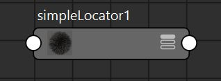

# 概述
- 请参见[9.0-MPxLocatorNode](基础知识/9.0-MPxLocatorNode.md)和[9.1-MPxDrawOverride](基础知识/9.1-MPxDrawOverride.md)
- 继承MPxLocatorNode类创建一个类locator节点：simpleLocator节点
- 该节点有一个属性shapeIndex：：0：环形，1：方框，2：三角
- 为节点在outliner和nodeEditor中添加图标
	- 在D:\Backup\Documents\maya\2024\prefs\icons路径下新增两个图标，maya可根据名称自动拾取
		- simpleLocator.png  用于nodeEditor
		- out_simpleLocator.png：用于outliner
	- [Open: Pasted image 20250818114706.png](attachments/eaa3b023b79e08c15b882514dcc9a5d7_MD5.jpeg)
 [Open: Pasted image 20250818114728.png](attachments/93738c85277234d260a0597fb6a3c6df_MD5.jpeg)

# 案例
```python
import maya.api.OpenMaya as om
import maya.api.OpenMayaUI as omui
import maya.api.OpenMayaRender as omr
import pymel.core as pm


def maya_useNewAPI():
    pass


class SimpleLocatorNode(omui.MPxLocatorNode):
    """定义一个自定义定位器节点，继承自 MPxLocatorNode"""

    TYPE_NAME = "simpleLocator"  # 节点名称
    TYPE_ID = om.MTypeId(0x0007F7FE)  # 节点ID
    # 用于注册和组织自定义定位器节点（SimpleLocatorNode）的绘制覆盖（SimpleLocatorDrawOverride）的关键常量

    """用于在 Maya 的绘制数据库 (drawdb) 中对绘制覆盖进行分类和存储。
    * drawdb：Maya 绘制数据库的根命名空间。
    * geometry：表示与几何体相关的绘制逻辑（例如定位器、网格等）。
    * simpleLocator：你的自定义节点的特定标识符，区分于其他节点。
    """
    DRAW_CLASSIFICATION = "drawdb/geometry/simpleLocator"

    """是绘制覆盖的注册标识符，用于在 Maya 的绘制注册系统中唯一标识你的绘制覆盖
    它与 DRAW_CLASSIFICATION 一起使用，作为注册绘制覆盖的“键”，确保 Maya 能够正确匹配节点和绘制逻辑。"""
    DRAW_REGISTRANT_ID = "SimpleLocatorNode"  # 绘制注册 ID，用于关联绘制覆盖

    def __init__(self) -> None:
        """构造函数"""
        super().__init__()

    @classmethod
    def creator(cls):
        """返回节点实例"""
        return cls()

    @classmethod
    def initialize(cls):
        """定义节点属性"""
        numeric_attr = om.MFnNumericAttribute()
        # shape_index属性：0：环形，1：方框，2：三角
        cls.shape_index_obj = numeric_attr.create(
            "shapeIndex", "si", om.MFnNumericData.kInt, 0
        )

        numeric_attr.setMin(0)
        numeric_attr.setMax(2)

        cls.addAttribute(cls.shape_index_obj)


class SimpleLocatorUserData(om.MUserData):
    """MUserData类用于传递绘制数据，在MPxDrawOverride中使用"""

    def __init__(self, deleteAfterUse=False):
        super().__init__(deleteAfterUse)
        # 实例属性shape_index默认为0
        self.shape_index = 0
        # 绘制颜色,默认为白色
        self.wireframe_color = om.MColor((1.0, 1.0, 1.0))


class SimpleLocatorDrawOverride(omr.MPxDrawOverride):
    """定义如何在 Maya 视口中绘制 SimpleLocatorNode，继承自 MPxDrawOverride"""

    DRAW_NAME = "simpleLocatorDrawOverride"  # 绘制覆盖的名称，用于调试和错误信息。

    def __init__(self, obj, callback=None, isAlwaysDirty=True):
        """MPxDrawOverride类构造函数
        Args:
            obj (MObject): 要绘制的对象
            callback (function):绘制过程中要调用的回调函数.
            isAlwaysDirty (bool): 永远标记为“脏”，意味着只要创建这个节点就永远绘制这个图形
        """
        super().__init__(obj, callback, isAlwaysDirty)

    def supportedDrawAPIs(self):
        """绘制支持"""
        # 指定支持的渲染 API（如 kOpenGL | kDirectX11），这里设为 kAllDevices 表示支持所有设备。
        return omr.MRenderer.kAllDevices

    def hasUIDrawables(self) -> bool:
        """返回 True，表示使用 addUIDrawables 方法绘制 UI 元素。"""
        return True

    def prepareForDraw(
        self,
        objPath: om.MDagPath,
        cameraPath: om.MDagPath,
        frameContext: omr.MFrameContext,
        oldData: om.MUserData,
    ):
        """准备绘制数据"""
        # 如果没有用户数据，则创建一个
        data = oldData
        if not data:
            data = SimpleLocatorUserData()

        # 形状索引属性
        locator_obj = objPath.node()  # 返回路径的 `MObject`
        node_fn = om.MFnDependencyNode(locator_obj)  # 获取MFnDependencyNode函数集
        data.shape_index = node_fn.findPlug("shapeIndex", False).asInt()

        # 颜色属性
        display_status = omr.MGeometryUtilities.displayStatus(objPath)  # 显示状态
        # 如果当前现实状态为：未被选择，则设置颜色为深绿色
        if display_status == omr.MGeometryUtilities.kDormant:
            data.wireframe_color = om.MColor((0.0, 0.1, 0.0))
        # 其余状态颜色显示为maya默认状态，选中为浅绿，冻结为灰色
        else:
            data.wireframe_color = omr.MGeometryUtilities.wireframeColor(objPath)

        # 返回属性数据
        return data

    def addUIDrawables(
        self,
        objPath: om.MDagPath,
        drawManager,
        frameContext: omr.MFrameContext,
        data: om.MUserData,
    ):
        """定义绘制逻辑"""
        drawManager.beginDrawable()
        drawManager.setColor(data.wireframe_color)
        if data.shape_index == 0:
            # 一个圆形（circle），中心在 (0, 0, 0)，法线为 (0, 1, 0)，半径为 1，未填充。
            drawManager.circle(
                om.MPoint(0.0, 0.0, 0.0), om.MVector(0.0, 1.0, 0.0), 1, False
            )
        elif data.shape_index == 1:
            # 绘制方框
            drawManager.rect(
                om.MPoint(0.0, 0.0, 0.0),  # 中心
                om.MVector(0.0, 0.0, 1.0),  # UpVector
                om.MVector(0.0, 1.0, 0.0),  # normalVector
                1.0,  # scaleX
                1.0,  # scaleY
                False,  # 未填充
            )
        elif data.shape_index == 2:
            # 绘制三角
            point_array = om.MPointArray(
                [
                    (-1.0, 0.0, -1.0),
                    (0.0, 0.0, 1.0),
                    (1.0, 0.0, -1.0),
                    (-1.0, 0.0, -1.0),
                ]
            )
            drawManager.lineStrip(
                point_array,  # 点数组
                False,  # 未填充
            )

        drawManager.endDrawable()

    @classmethod
    def creator(cls, obj):
        # 类方法，返回绘制覆盖实例，供 Maya 调用。
        return cls(obj)


def initializePlugin(plugin):
    """加载插件"""
    vender = "Charles Tian"
    version = "1.0.0"
    api_version = "any"
    plugin_fn = om.MFnPlugin(plugin, vender, version, api_version)
    try:
        plugin_fn.registerNode(
            SimpleLocatorNode.TYPE_NAME,
            SimpleLocatorNode.TYPE_ID,
            SimpleLocatorNode.creator,
            SimpleLocatorNode.initialize,
            om.MPxNode.kLocatorNode,
            SimpleLocatorNode.DRAW_CLASSIFICATION,
        )
    except Exception as e:
        om.MGlobal.displayError(
            f"Failed to register node: {SimpleLocatorNode.TYPE_NAME}, {e}"
        )
    # 注册绘制覆盖
    try:
        omr.MDrawRegistry.registerDrawOverrideCreator(
            SimpleLocatorNode.DRAW_CLASSIFICATION,
            SimpleLocatorNode.DRAW_REGISTRANT_ID,
            SimpleLocatorDrawOverride.creator,
        )
    except Exception as e:
        om.MGlobal.displayError(
            f"Failed to register draw override: {SimpleLocatorDrawOverride.DRAW_NAME}, {e}"
        )


def uninitializePlugin(plugin):
    """卸载插件"""
    plugin_fn = om.MFnPlugin(plugin)
    # 注册Locator节点
    try:
        plugin_fn.deregisterNode(SimpleLocatorNode.TYPE_ID)
    except Exception as e:
        om.MGlobal.displayError(
            f"Failed to deregister node: {SimpleLocatorNode.TYPE_NAME}, {e}"
        )
    # 取消注册绘制覆盖
    try:
        omr.MDrawRegistry.deregisterDrawOverrideCreator(
            SimpleLocatorNode.DRAW_CLASSIFICATION,
            SimpleLocatorNode.DRAW_REGISTRANT_ID,
        )
    except Exception as e:
        om.MGlobal.displayError(
            f"Failed to deregister draw override: {SimpleLocatorDrawOverride.DRAW_NAME}, {e}"
        )


if __name__ == "__main__":
    pm.newFile(force=True)
    plugin_name = "simple_locator_node"
    pm.unloadPlugin(plugin_name)
    pm.loadPlugin(plugin_name)
    node_name = "simpleLocator"
    pm.createNode(node_name)

```
