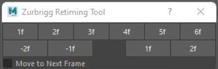

# 概述
- 该用户用于初始关键帧的时间间隔
[Open: Pasted image 20250821095740.png](attachments/7775c06631a14f3a2157a2d6080c6d91_MD5.jpeg)

- 第一排按钮用于设置关键帧之间的间隔
- 第二排按钮用于为关键帧左侧或右侧添加时间间隔
# 算法
## 使用maya命令
- 获取时间栏选择区间
- 计算新关键帧的时间位置
- 递归的处理关键帧时间位置

## 使用maya API
- 获取时间栏选择区间
- 获取动画曲线节点的列表
- 计算新关键帧的时间位置
- 递归的处理关键帧时间位置
## 使用API的优势
- 使用命令`pm.keyFrame`灵活性较差，开发者受限于基于时间或索引的单个关键帧
- 使用API 开发人员可以控制操作顺序，有更多的灵活性
- 使用API 开发效率更高，一个对象有10个属性，每个属性有100帧（逐帧），如果要处理区间内的帧，要调用`keyFrame`命令100次
- 每次调用`keyFrame`关键帧命令时，它将检索对象上的每个属性的 AnimCurveNode (10 个属性)，调用`keyFrame`命令100次将检索AnimCurveNode1000次
- 使用`keyFrame`关键帧命令无法一次性编辑一条动画曲线上的所有帧，只能逐帧编辑
- 使用API，开发者可以检索一个属性的动画节点一次，执行所有必需的操作，然后转到下一个属性。这样动画曲线节点只需被检索10次就可以了，不必检索1000次
# 案例
```python
import maya.api.OpenMaya as om
import maya.api.OpenMayaAnim as oma
import pymel.core as pm


def maya_useNewAPI():
    """告诉maya调用的是maya Python API 2.0"""
    pass


class RetimingCmd(om.MPxCommand):
    """自定义动画曲线命令
    pm.retimingCmd(v=5)：设置关键帧时间间隔
    pm.retimingCmd(v=5, i=True)：增加关键帧时间间隔
    """

    COMMAND_NAME = "retimingCmd"
    # 值标志,用于设置时间间隔
    VALUE_FLAG = ["-v", "-value", om.MSyntax.kDouble]
    # 增量标志，用于添加时间间隔
    INCREMENTAL_FLAG = ["-i", "-incremental"]

    def __init__(self):
        super().__init__()

        self.anim_curve_changed = oma.MAnimCurveChange()  # 关键帧改变栈，用于撤销和重做
        self.keys_updated_num = 0  # 关键帧改变数量
        self.max_time = om.MTime(9999999, om.MTime.uiUnit())  # 最大时间

    def doIt(self, arg_list):
        # 解析参数列表
        try:
            arg_db = om.MArgDatabase(self.syntax(), arg_list)
        except Exception:
            self.displayError("Invalid arguments")
            raise
        # 参数逻辑
        if arg_db.isFlagSet(RetimingCmd.VALUE_FLAG[0]):
            value = om.MTime(
                arg_db.flagArgumentDouble(RetimingCmd.VALUE_FLAG[0], 0),
                om.MTime.uiUnit(),
            )
            incremental = arg_db.isFlagSet(RetimingCmd.INCREMENTAL_FLAG[0])
            selection_list = arg_db.getObjectList()

            self.do_retiming(selection_list, value, incremental)  # 执行操作
            self.setResult(self.keys_updated_num)  # 返回关键帧修改数量
        else:
            raise RuntimeError("A value (-v) must be pass to the command")

    def undoIt(self):
        """撤销逻辑"""
        self.anim_curve_changed.undoIt()

    def redoIt(self):
        """重做逻辑"""
        self.anim_curve_changed.redoIt()

    def isUndoable(self):
        """是否可撤销"""
        # 如果修改的关键帧大于0，可撤销
        return self.keys_updated_num > 0

    def do_retiming(
        self,
        selection_list: om.MSelectionList,
        retiming_value: om.MTime,
        incremental: bool,
    ) -> None:
        """执行重新定时逻辑
        :param selection_list(om.MSelectionList): 选择列表
        :param retiming_value(om.MTime): 重新定时值
        :param incremental(bool): 是否增量
        """
        # 获取时间栏选择区间首末时间
        start_time, end_time = self.get_selected_range()
        # 获取选择列表元素的函数集列表
        anim_curve_fns = self.get_anim_curve_fns(selection_list)
        # 遍历函数集列表
        for anim_curve_fn in anim_curve_fns:
            # 获取帧数据
            key_data = self.calculate_retiming(
                anim_curve_fn,
                start_time,
                end_time,
                retiming_value,
                incremental,
            )
            # 如果帧数据存在，执行重定时操作
            if key_data:
                self.apply_retiming(anim_curve_fn, key_data)
                # 打印结果
                for data in key_data:
                    print(f"Index{data[0]}: {data[2]} -> {data[1]}")

    def calculate_retiming(
        self,
        anim_curve_fn: oma.MFnAnimCurve,
        start_time: om.MTime,
        end_time: om.MTime,
        retiming_val: om.MTime,
        incremental: bool,
    ) -> list[tuple]:
        # 获取当前曲线帧数量
        """
        重新计算指定动画曲线的帧时间

        :param anim_curve_fn: MFnAnimCurve，动画曲线函数集
        :param start_time: MTime，时间栏选择区间开始时间
        :param end_time: MTime，时间栏选择区间结束时间
        :param retiming_val: MTime，时间增量
        :param incremental: bool，是否使用增量算法
        :return: list[tuple] | None，[(key_index, updated_time, original_time)]，否则None
        """
        num_keys = anim_curve_fn.numKeys
        if num_keys == 0:
            return []
        # 获取时间栏选择区间开始时间最近的帧索引
        first_retime_key_index = self.find_closest_index(anim_curve_fn, start_time)
        if first_retime_key_index < 0:
            return []
        # 获取时间栏选择区间结束时间最近的帧索引
        last_retime_key_index = self.find_closest_index(anim_curve_fn, end_time)
        # 获取时间栏选择开始时间最近的帧时间
        first_retime_key_time = anim_curve_fn.input(first_retime_key_index)

        # 用来返回的第一帧帧数据：[(key_index, updated_time, original_time)]
        key_data = [
            (first_retime_key_index, first_retime_key_time, first_retime_key_time)
        ]

        current_time = first_retime_key_time  # 获取当前时间为时间栏选择区间开始时间
        time_diff = om.MTime(0, om.MTime.uiUnit())  # 时间差变量，默认为0
        one_frame = om.MTime(1, om.MTime.uiUnit())  # 1帧时间变量
        # 遍历时间栏选择区间内的帧索引，从第二帧开始到结束
        for index in range(first_retime_key_index + 1, num_keys):
            # 获取遍历第一帧的时间（区间第二帧）
            next_keyframe_time = anim_curve_fn.input(index)
            # 根据条件计算time_diff变量
            if incremental:  # 如果增量标志被采用，使用增量算法
                time_diff = next_keyframe_time - current_time  # 第二帧时间 - 第一帧时间
                # 如果索引仍然在时间栏选择区间之内
                if index <= last_retime_key_index + 1:
                    time_diff += retiming_val  # 添加时间增量
                    # 如果时间差量小于1帧，时间差量=1帧
                    if time_diff < one_frame:
                        time_diff = one_frame

            else:  # 如果增量标志未被采用，使用赋值
                # 如果帧在选择区间内，赋值时间差量
                if index <= last_retime_key_index + 1:
                    time_diff = retiming_val
                # 如果帧在选择区间外，采用之前的差量
                else:
                    time_diff = next_keyframe_time - current_time
            # 新时间为帧数据最后一个元组的第二个元素（updated_time）+ 时间差量
            new_time = key_data[-1][1] + time_diff
            # 帧数据添加元素（第二帧数据）
            key_data.append((index, new_time, next_keyframe_time))

            current_time = next_keyframe_time  # 递推current_time
        # 迭代完成后，添加最大时间元素，让函数知道何时终止递归
        next_index = key_data[-1][0] + 1
        key_data.append((next_index, self.max_time, self.max_time))

        return key_data

    def apply_retiming(self, anim_curve_fn: oma.MFnAnimCurve, key_data: list[tuple]):
        # 动画曲线上的关键帧索引按时间顺序排列,必须保持正确的顺序.在更新时间时。时间不能以会使索引顺序失效的方式改变。
        self.apply_retiming_recursive(anim_curve_fn, 0, key_data)

    def apply_retiming_recursive(
        self, anim_curve_fn: oma.MFnAnimCurve, index: int, key_data: list[tuple]
    ):
        """
        递归处理帧数据，更新动画曲线的关键帧时间

        :param anim_curve_fn: MFnAnimCurve，动画曲线函数集
        :param index: int，当前帧索引
        :param key_data: list[tuple], 帧数据

        递归处理帧数据，更新动画曲线的关键帧时间。该函数通过递归的方式来
        避免关键帧索引顺序混乱。如果当前帧的更新时间小于下一帧的初始时间,
        则直接当前更新时间，然后递归处理下一帧。如果当前帧更新时间大于等于
        下一帧的初始时间，则先处理下一帧，再处理当前帧
        """
        # 如果帧索引大于帧数据-1，说明已经递归到底，直接返回
        if index >= len(key_data) - 1:
            return
        # 从帧数据中获取数据
        key_index = key_data[index][0]  # 当前帧索引
        updated_time = key_data[index][1]  # 当前帧更新时间
        next_key_original_time = key_data[index + 1][2]  # 下一帧原始时间
        # 如果当前帧的更新时间小于下一帧的原始时间，直接更新当前帧时间，然后递归处理下一帧
        if updated_time < next_key_original_time:
            self.update_time(anim_curve_fn, key_index, updated_time)
            self.apply_retiming_recursive(anim_curve_fn, index + 1, key_data)
        # 如果当前帧更新时间大于等于下一帧的原始时间，则先处理下一帧，再处理当前帧
        else:
            self.apply_retiming_recursive(anim_curve_fn, index + 1, key_data)
            self.update_time(anim_curve_fn, key_index, updated_time)

    def update_time(
        self, anim_curve_fn: oma.MFnAnimCurve, index: int, updated_time: om.MTime
    ):
        """如果关键帧时间和更新关键帧时间不同，更新关键帧时间
        :param anim_curve_fn: MFnAnimCurve，动画曲线函数集
        :param index: int，关键帧索引
        :param updated_time: MTime，新的关键帧时间
        :return: None
        """
        if anim_curve_fn.input(index) != updated_time:  # 获取当前关键帧时间
            # 设置关键帧时间
            anim_curve_fn.setInput(index, updated_time, self.anim_curve_changed)
            # 更新关键帧数量+1
            self.keys_updated_num += 1

    def find_closest_index(self, anim_curve_fn, target_time):
        """
        通过给定的动画曲线函数集和目标时间，查找目标时间在动画曲线上的最
        近索引
        :param anim_curve_fn: MFnAnimCurve，动画曲线函数集
        :param target_time: MTime，目标时间
        :return: int，目标时间在动画曲线上的最近索引
        """
        # 查找与指定时间最接近的关键帧索引，参数为：要查找的时间
        index = anim_curve_fn.findClosest(target_time)
        closest_time = anim_curve_fn.input(index)
        if closest_time > target_time:
            index -= 1

        return index

    def get_anim_curve_fns(self, selection_list: om.MSelectionList) -> list:
        """获取选择列表中的动画曲线节点函数集
        :param selection_list(om.MSelectionList): 选择列表
        :return(list): 动画曲线节点函数集列表
        """
        anim_curve_fns: list = []  # 列表用于储存动画曲线节点函数集
        # 选择列表迭代器
        sel_iter = om.MItSelectionList(selection_list)
        # 迭代选择列表
        while not sel_iter.isDone():
            obj = sel_iter.getDependNode()  # 获取选择列表元素的依赖节点
            depend_fn = om.MFnDependencyNode(obj)  # 获取依赖节点的函数集
            # 给定的依赖节点函数集中，通过迭代连接获取动画曲线节点函数集
            self.get_anim_curve_fns_from_connection(depend_fn, anim_curve_fns)

            sel_iter.next()  # 继续迭代
        return anim_curve_fns  # 返回动画曲线列表

    def get_anim_curve_fns_from_connection(
        self, depend_fn: om.MFnDependencyNode, anim_curve_fns: list
    ) -> None:
        """
        从给定的依赖节点函数集中，通过迭代连接获取动画曲线节点函数集
        :param depend_fn: 依赖节点函数集
        :param anim_curve_fns: 储存动画曲线节点的列表
        :return: None
        """
        # 获取当前节点所有连接的插头
        plugs: list[om.MPlug] = depend_fn.getConnections()
        # 遍历所有插头
        for plug in plugs:
            # 如果插头可剋帧同时不被锁定
            if plug.isKeyable and not plug.isLocked:
                # 创建依赖图迭代器
                dg_iter = om.MItDependencyGraph(
                    plug,  # 迭代的起点，可以是 MObject（节点）或 MPlug（属性）。
                    om.MFn.kAnimCurve,  # 过滤器，指定要迭代的节点类型（如 MFn.kMesh、MFn.kShader）。
                    om.MItDependencyGraph.kUpstream,  # 遍历方向: kDownstream：下游;kUpstream：上游
                    om.MItDependencyGraph.kBreadthFirst,  # 遍历方式:.kDepthFirst：深度优先。BreadthFirst：广度优先。
                    om.MItDependencyGraph.kNodeLevel,  # 迭代级别:kNodeLevel：仅迭代节点;kPlugLevel：迭代到属性级别。
                )
                # 迭代依赖图
                while not dg_iter.isDone():
                    # 如果迭代深度大于2，跳出循环（只迭代到与plug直接连接的动画曲线节点）
                    if len(dg_iter.getNodePath()) > 2:
                        break
                    # 获取当前节点的动画曲线函数集
                    anim_curve_fn = oma.MFnAnimCurve(dg_iter.currentNode())
                    # 添加到列表，列表是可变参数，可以直接修改
                    anim_curve_fns.append(anim_curve_fn)
                    # 继续迭代
                    dg_iter.next()

    def get_selected_range(self) -> list:
        """获取时间栏选择区间"""
        playback_slider = pm.mel.eval("$tempVar = $gPlayBackSlider")
        start_frame, end_frame = pm.timeControl(
            playback_slider, q=True, rangeArray=True
        )
        end_frame -= 1

        start_time = om.MTime(start_frame, om.MTime.uiUnit())
        end_time = om.MTime(end_frame, om.MTime.uiUnit())

        return [start_time, end_time]

    @classmethod
    def creator(cls):
        """返回自身实例"""
        return cls()

    @classmethod
    def create_syntax(cls):
        """命令参数语法"""
        syntax = om.MSyntax()

        syntax.addFlag(*cls.VALUE_FLAG)
        syntax.addFlag(*cls.INCREMENTAL_FLAG)

        syntax.setObjectType(om.MSyntax.kSelectionList, 1)
        syntax.useSelectionAsDefault(True)

        return syntax


def initializePlugin(plugin):
    """加载插件并注册命令"""
    vendor = "Charles Tian"
    version = "1.0.0"

    plugin_fn = om.MFnPlugin(plugin, vendor, version)
    try:
        plugin_fn.registerCommand(
            RetimingCmd.COMMAND_NAME, RetimingCmd.creator, RetimingCmd.create_syntax
        )
    except Exception as e:
        om.MGlobal.displayError(
            f"Failed to register command: {RetimingCmd.COMMAND_NAME}, {e}"
        )


def uninitializePlugin(plugin):
    """卸载插件，并取消注册命令"""
    plugin_fn = om.MFnPlugin(plugin)
    try:
        plugin_fn.deregisterCommand(RetimingCmd.COMMAND_NAME)
    except Exception as e:
        om.MGlobal.displayError(
            f"Failed to deregister command: {RetimingCmd.COMMAND_NAME}, {e}"
        )


if __name__ == "__main__":
    pm.newFile(force=True)
    pm.polyCube()
    frame_num = 10
    for i in range(frame_num):
        pm.setKeyframe(time=i)

    plugin_name = "retiming_cmd"
    pm.unloadPlugin(plugin_name)
    pm.loadPlugin(plugin_name)

    pm.retimingCmd(v=5)  # 设置关键帧时间间隔
    pm.retimingCmd(v=5, i=True)  # 增加关键帧时间间隔

```