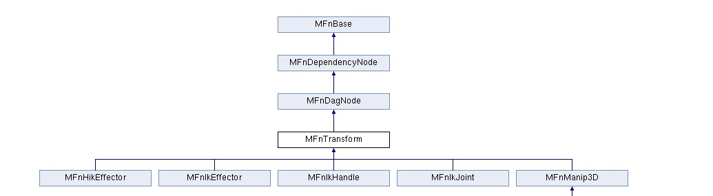

在 **Maya Python API 2.0** 中，`MFnTransform` 是 **Function Set**（功能集）的一种，专门用于操作 **transform 节点**（平移、旋转、缩放等变换数据的容器节点）。

它的定位是：**为 `transform` 类型的 DAG 节点提供读写变换数据的 API**，是 Maya API 里操作对象空间变换的主要接口之一。
继承结构：
[Open: Pasted image 20250812105806.png](attachments/17d8a039731895fb26edd5beb2fb98b5_MD5.jpeg)

---

## 1. 基本作用

在 Maya 场景中，几乎所有可见对象（模型、摄像机、灯光等）都会有一个 transform 节点来存储它的位置、旋转、缩放信息。  
`MFnTransform` 允许你通过 Python API 直接读写这些信息，而不需要依赖 `cmds.xform` 这样的命令式调用。

主要功能包括：

- 读取/设置平移（Translation）
    
- 读取/设置旋转（Rotation）
    
- 读取/设置缩放（Scale）
    
- 读取/设置变换矩阵（Transformation Matrix）
    
- 支持局部空间和世界空间的转换
    

---

## 2. 常用方法

以下都是 Python API 2.0 的方法签名（`maya.api.OpenMaya`）：

|方法|作用|备注|
|---|---|---|
|`translation(space)`|获取平移向量|`space` 可用 `MSpace.kTransform`（局部）或 `MSpace.kWorld`（世界）|
|`setTranslation(vector, space)`|设置平移向量|传入 `MVector`|
|`rotation(space)`|获取旋转值|返回 `MEulerRotation`|
|`setRotation(rotation, space)`|设置旋转值|支持 `MEulerRotation` 或 `MQuaternion`|
|`scale()`|获取缩放（tuple）|直接返回 `(sx, sy, sz)`|
|`setScale(scaleTuple)`|设置缩放|例如 `(2.0, 1.0, 1.0)`|
|`transformation()`|获取完整 `MTransformationMatrix`|可进一步分解矩阵|
|`setTransformation(matrix)`|设置完整变换矩阵|传入 `MTransformationMatrix`|
|`rotateBy(rotation, space)`|累加旋转||
|`translateBy(vector, space)`|累加平移||

---

## 3. 使用示例

```python
import maya.api.OpenMaya as om

# 1. 获取选中物体的 MObject
sel = om.MGlobal.getActiveSelectionList()
mobj = sel.getDependNode(0)

# 2. 用 MFnTransform 绑定
fn_transform = om.MFnTransform(mobj)

# 3. 获取当前平移（世界空间）
pos = fn_transform.translation(om.MSpace.kWorld)
print("World Position:", pos)

# 4. 设置平移（局部空间）
fn_transform.setTranslation(om.MVector(1, 2, 3), om.MSpace.kTransform)

# 5. 获取旋转
rot = fn_transform.rotation(om.MSpace.kTransform)
print("Rotation (Euler):", rot.asVector())

# 6. 设置缩放
fn_transform.setScale((2.0, 1.0, 1.0))
```

---

## 4. 使用注意点

1. **节点类型要求**  
    `MFnTransform` 只能绑定到 transform 类型的 `MObject`，如果传入 shape 节点会报错。  
    如果是 shape，需要先找到它的父 transform 节点（`dagPath.pop()` 或 `dagPath.transform()`）。
    
2. **空间参数**  
    API 中的 `space` 参数一般用：
    
    - `om.MSpace.kTransform`（局部空间/父空间）
        
    - `om.MSpace.kWorld`（世界空间）
        
3. **旋转顺序**  
    Maya 节点的旋转顺序会影响 `rotation()` 和 `setRotation()` 的结果，需要注意和界面中设置一致。
    
4. **矩阵方式更灵活**  
    如果要同时修改平移、旋转、缩放，可以用 `MTransformationMatrix` 一次性处理，避免多次调用。
    

---

如果你需要，我可以帮你画一张 **`MFnTransform` 与 Maya DAG 节点的关系结构图**，这样会更直观地看到它是如何操作物体的。  
你想让我画出来吗？