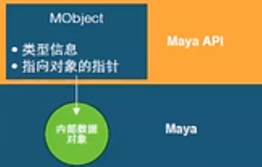

> python案例:C:\Program Files\Autodesk\Maya2023\devkit\plug-ins\python
> C++案例：C:\Program Files\Autodesk\Maya2020\devkit\plug-ins

# maya Python 模块

|                   |                       |
| ----------------- | --------------------- |
| maya              | 顶级模块                  |
| maya.cmds         | maya命令和插件命令           |
| pymel             | pymel模块               |
| maya.OpenMaya     | maya Python API 1.0模块 |
| maya.api.OpenMaya | maya Python API 2.0模块 |
| maya.utils        | 实用工具模块，不属于API或maya命令  |
| maya.standalone   | 以python形式初始化maya实例    |
| maya.app          | python编写的maya工具       |
| maya.mel.eval()   | 以字符串形式运行命令            |
| maya.stringTable  | 以字符串形式建立本地UI          |

## maya API 1.0 模块

|                   |                 |
| ----------------- | --------------- |
| OpenMaya.py       | 将节点或命令汇编成插件的基本类 |
| OpenMayaAnim.py   | 动画类，包括变形器和反向动力学 |
| OpenMayaRender.py | 渲染类             |
| OpenMayaFX.py     | 特效动力学类          |
| OpenMayaUI.py     | 窗口类，创建用户界面元素    |
| OpenMayaMPx.py    | 代理对象类，非C++对象    |
| OpenMayaCloth.py  | nCloth类，非C++对象  |

### 代理类MPx

1. 作为基类便于用户拓展功能
2. 以MPx作为类名头
3. 代理对象允许用户拓展maya结构，创建新的maya构造（命令，节点等）
4. 最常见的代理类：MPxCommond, MPxNode

### 函数集类MFn

1. 传统的面向对象设计会将数据和方法放在一起，mayaPythonAPI1.0的类设计将数据和方法分开
2. 以MFn作为类名头
3. 使用函数类时要绑定数据对象
4. 数据和类的所有权：数据对象总是被maya所有，函数集总是被开发者所有

   1. 使用MFn::Type枚举类型指定项的类型：MFn::Type MFnBase::type()
   2. 一旦函数集与MObject对象关联，你可以调用方法对对象进行查询或设置
      ```python
      myMeshFn = OpenMaya.MFnMesh(myMeshObj) 
      myMeshFn.setObject(myMeshObj2)
      ```
   3. 常用函数集：MFnDependencyNode(依赖节点), MFnDagNode（层级节点）, MFnAttribute（函数属性）
   4. MFnDependencyNode：基类提供基本的功能所有节点的依赖，包含的方法用来查询一个节点的名称，找到一个属性和解析链接。
   5. MFnDagNode：从MFnDependencyNode派生，提供一些方法来查询或修改层级中的父子关系
   6. MFnAttribute：maya DG属性的基类，提供方法在节点上创建属性或查询设置属性

### MObject



- MObject是maya对象的基本数据类型

- maya所有对象通过MObject对象访问

- MObject有以下几种方法：
  - apiType()
  - hasFn()
  - isNull

- MObject是指向maya内部数据的手柄

- maya内的数据对象是由maya创建和删除的

- 使用函数集类Mfn来操纵MObject

- 类存在的时候maya拥有数据

- MObject存在于maya.OpenMaya模块

- 调用方法：

```python
mObj = maya.OpenMaya.MObject()
```

#### MObject和MFn::Type

- 每个MObject都具有一个类型：MFn::Type，MObject::apiType()
- 是来自maya内部所有类型的枚举列表
- 对于所有maya类型的完整列表，请参考MFn.h

### 迭代类：“Mit"为名头

- MitDag
- MitDependencyGraph
- MitMeshEdge
- MitMeshVertex
- MitMeshPolygon
- MitSurfaceCV

### 包裹类

- 由一些简单的类构成，如M开头的，MVector，MPoint等，基于Python类

## maya命令架构

- 所有命令继承自MPxCommond
- 仅有两个必要函数

创建命令

```python
 def cmd_creator():
	 return OpenMayaMPx.asMPxPtr(myFirstCmd())
```

当命令执行时调用，执行命令的所有工作，解析'args'参数和执行用户定义的操作

```python
def doIt(self,argList): 
	print("Hello Wrold")
```

### MGlobal & SelectionList

- MSelectionList: 代表了由MObject构成的列表对象，当选择了一些对象后使用（显示列表，查询修改列表成员）
- MitSelectionList: 代表了由可迭代对象构成的列表，并且可以通过特定的类型对列表进行过滤处理
- MGlobal::getActiveSelectionList(MSelectionList&list): 获取当前选择对象并放入MSelectionList&list
- MGlobal::getSelectionListByName(const MString & name,MSelctionList & list): 通过名字将对象放入列表
- MGlobal::settActiveSelectionList(const MSelctionList & src, MGlobal::ListAdjustment ):

### MGlobal Selection

- MGlobal::select(const MDagPath & object, MGlobal::ListAdjustment listAdjustment)
- MGlobal::selectByName(const MString & name,MGlobal::ListAdjustment listAdjustment )
- MGlobal::setActiveSelectionList(const MSelectionList & src, MGlobal::ListAdjustment )
- MGlobal::selectCommond(const SelectionList &src, MGlobal::ListAdjustment )
- MStatus MGlobal::selectFromScreen(const short & x_pose, const short & y_pos, MGlobal::ListAdjustment)
- MGlobal::SelectionMethod

### 错误处理和调试：MStatus

- Python API 1.0中没有MStatus类
- Python 中必须使用 try和 except 来代替MStatus
- 三种特例：
  - 硬编码maya API 类的状态代码
    - OpenMaya.MStatus.kSuccess
    - OpenMaya.MStatus.kFailure
    - OpenMaya.MStatus.kUnknownParameter
- OpenMaya状态代码
  - Python API不包含MStatus类，将会返回一个不成功的方法，用raise代替MStatus抛出异常，以python方式提供更自然的错误检查方法

```python
try: 
	mplugin.registerCommand( "cgta") 
except: 
	sys.stderr.write( "Failed to deregister command: %s\n" % cgta.kPluginCmdName ) 
	raise
```

## DAG层级:

- DG（Dependency Graph）,依赖图形, maya里所有的节点都可以被认为是 DG 节点
- DAG 层次（Directed Acyclic Graph）,有向非循环图形 , 是指组成对象的所有节点的父子关系。是一种特殊的DG节点
- DAG 节点是由连接着的两个特殊种类的节点所组成： transform 节点和 shape 节点。
- 父子关系不是DG链接
- dagPath用于识别具体实例

### MObject 和 MDagPath

- MDagPath对象是描述一个节点路径的句柄

- MObject是围绕一个指向maya内部对象的指针

- 使用apiType()或hasFn去检测你是否可以使用她

- 使用isNull（）检测MObject对象是否有效

### 一些重要的API方法

- 遍历：MitDag迭代类
- 层级深度：MDagPath::length,MitDag::depth
- 获取父对象：MDagPath::pop(实际是弹出shape节点名)
- 局部矩阵：MFnTransform::transformation
- 世界矩阵：MDagPath::inclusiveMatrix, MDagPath::exclusiveMatrix

### 添加参数到自定义命令

```python
pm.sphere('sphere01', edit=True, r=5) 
# r是flag(标识符) 
# 5是flag arguments(标识符参数) 
# 'sphere01'是commond arguments (命令参数)
```

## 基本命令结构

- myCommond -myFlag

### 自定义命令

- 在编写命令时下面的命令需要用到

  - MSyntax：用于传递指定的标志和参数给命令
  - MArgDatabase：仅用于创建MArgDatabase对象，然后使用父类（MArgParser）的方法与所解析的对象一起工作
  - MArgParser：用于解析和存储所有的被传递到命令的标志，参数和对象。
  - MArgList：用于创建和保持传递给命令的参数列表，然后方便检索他们

- MSyntax和MArgParser类用于处理命令参数

- 撤销和重做
  - 要调用MPxCommond下有个函数 isUndoable(),意为是否可以撤销。

- MPxCommond注册
  - 使用plugin的registerCommand或deregisterCommand注册或取消

- maya Plug-in 结构
  - initializePlugin() ：loadPlugin 登记点

  - uninitializePlugin()： unloadPlugin退出点

#### API命令实用工具

- MGlobal

  - 查询和设置全局设置（时间，轴向，选择区等）

    - MGlobal:: mayaState(MStatus,returnStatus)  # maya状态
    - MGlobal:: viewFrame(cons MTime,time)
    - MGlobal:: setSelectionMode(MGlobal::MSelectionMode mode)
    - MGlobal::setYAxisUp(bool rotateView)
    - Etc...

- 查询哪些被选择

- 显示警告和错误

  - void MGlobal::displayInfo(const MString & theMessage)
  - void MGlobal::displayWarning(const MString & theMessage)
  - void MGlobal::displayError(const MString & theMessage)

- 使用脚本语言交互

  - 执行mel脚本

    - MGlobal::executeCommond(const MString & commond)

```python
OpenMaya.MGlobal.executeCommond('sphere')
```

- MGlobal::sourceFile

```python
OpenMaya.MGlobal.sourceFile('C\\test.mel')
```


- 执行Python命令
- MGlobal::executePythonCommond(const MString & commond)


```python
OpenMaya.MGlobal.executePythonCommond('polycube(sx=10, sy=15, h=20)')
```

## 创建Maya Python API Plug-ins流程

1. 导入需要的模块

```python
import maya.OpenMaya as OpenMaya 
import maya.OpenMayaMPx as OpenMayaMPx 
import sys
```

2. 定义initializePlugin() 函数

```python
#Initialize the script plug-in 
def initializePlugin(mobject): 
mplugin = OpenMayaMPx.MFnPlugin(mobject) 
try: 
	mplugin.registerCommand( kPluginCmdName, cmdCreator ) 
except: 
	sys.stderr.write( "Failed to register command: %s\n" % kPluginCmdName ) 
	raise
```

3. 定义uninitializePlugin() 函数

```python
def uninitializePlugin(mobject): 
mplugin = OpenMayaMPx.MFnPlugin(mobject) 
try: 
	mplugin.deregisterCommand( kPluginCmdName ) 
except: 
	sys.stderr.write( "Failed to unregister command: %s\n" % kPluginCmdName ) 
	raise
```

4. 类定义

```python
class cgtaCommand(OpenMayaMPx.MPxCommand): 
	kPluginCmdName = "cgta" 
	def __init__(self): 
		OpenMayaMPx.MPxCommand.__init__(self) 
	def doIt(self,argList): 
		print("Hello Wrold")
```

5. 定义creator函数

```python
def creator(): 
	return OpenMayaMPx.asMPxPtr(cgtaCommand())
```

### 如何加载插件，从插件管理器或使用maya命令

```python
maya.cmds.loadPlugin("cgta.py") 
maya.cmds.unloadPlugin("cgta.py")
```

### 强调：通用插件实现步骤

1. 定义initializePlugin() 和uninitializePlugin()函数
2. 使用plugin的registerCommand或registerNode注册或取消注册代理类（MPxCommond或MPxNode）
3. 实现自定义类（初始化方法和创建实例函数）
4. 实现代理类默认需要的功能，必须的时候需要导入需要的模块

- 标准案例

```python
import maya.OpenMayaMPx as OpenMayaMPx 
import sys 
# command 
class HelloWorldCmd(OpenMayaMPx.MPxCommand): 
	kPluginCmdName = "spHelloWorld" 
	def __init__(self): 
		OpenMayaMPx.MPxCommand.__init__(self) 
	@staticmethod 
	def cmdCreator(): 
		return OpenMayaMPx.asMPxPtr(HelloWorldCmd()) 
	def doIt(self, argList): 
		print("Hello World!") 
# Initialize the script plug-in 
def initializePlugin(plugin): 
	pluginFn = OpenMayaMPx.MFnPlugin(plugin) 
	try: 
		pluginFn.registerCommand(
			HelloWorldCmd.kPluginCmdName, HelloWorldCmd.cmdCreator
		) 
	except: 
		sys.stderr.write(
			"Failed to register command: %s\n" % HelloWorldCmd.kPluginCmdName
		) 
		raise 
# Uninitialize the script plug-in 
def uninitializePlugin(plugin): 
	pluginFn = OpenMayaMPx.MFnPlugin(plugin) 
	try: 
		pluginFn.deregisterCommand(HelloWorldCmd.kPluginCmdName) 
	except: 
		sys.stderr.write(
			"Failed to unregister command: %s\n" % HelloWorldCmd.kPluginCmdName
			) 
		raise
```
