从正式接触OpenMaya、学习、使用到现在，有大概一年了吧。嗯？为什么要学OpenMaya?额。一开始我也是听说OpenMaya是用来对Maya二次开发的，很牛逼。抱着妄想有一天也能成为技术大佬想法的我，就以一种半懵逼的心态开始了学习之路。通过一段时间的使用，我感觉，即使不开发插件，单纯的写写脚本，OpenMaya中的很多功能也还是蛮实用的。那为什么要写关于OpenMaya的文章呢？嗯，一个是国内OpenMaya相关的教程较少。另一个是，我私认为，要想成为一个受人尊重的技术大佬。不只是要技术够牛，还需要受人尊重。那怎么才能受人尊重呢？除了为人处世靠谱、有教养外，我觉得还需要对行业有贡献。所以，虽然我的技术并不牛逼，但我也愿意贡献我的微薄之力，去帮助需要这些知识的人。这篇文章，包括后续还打算继续更新的文章，为什么是“浅谈”？因为OpenMaya内容还是挺多的，我也只是接触到了极少一部分，所以只敢“浅谈”，分享我常用到的部分。OK,不废话了，下面开始。

该系列文章使用OpenMaya 1.0版本。给出API文档: [https://help.autodesk.com/view/MAYAUL/2015/ENU/?guid=__cpp_ref_index_html](https://link.zhihu.com/?target=https%3A//help.autodesk.com/view/MAYAUL/2015/ENU/%3Fguid%3D__cpp_ref_index_html)

OpenMaya目前有两个版本，一个是为C++打造的1.0版本，一个是适合Python的2.0版本。但是Python同样可以使用1.0版本。相较于2.0版本，1.0版本的API使用起来更为繁琐一些，但却比2.0更完整。也就是，2.0版本的功能是1.0的阉割版。我推荐使用1.0的另一个原因是，再之后使用C++开发Maya Plugin时，对于熟悉1.0的人来说，使用起来会更为顺畅吧。啊，为什么明明Python就可以开发Maya Plugin了，为什么还要用C++呢？最简单的原因是，C++的执行速度更快。如果让我写一个Plugin，等等，Plugin是什么？Plugin就是插件，你想自己实现一个使用算法写一个命令时，你想自定义一个节点时，就需要加载对应的插件。嗯~如果让我写一个Plugin的话，我会先用Python把基本功能实现一遍，如果追求速度的话，就再用C++写一遍。

OpenMaya包括了以下几个模块：

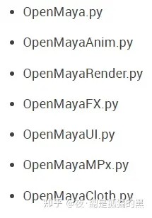

通常OpenMaya模块使用得更多。所以，也先浅谈这个模块。

OpenMaya模块中又包含了以下几种大类：

MFn 开头：该类表示这是一个函数集，里面拥有众多专门处理某一类型的方法。比如MFnMesh,就用来处理网格模型。

MIt 开头：表示该类是一个迭代器，可以对某一类元素进行遍历。比如,MItMeshVertex，可以用来对网格顶点进行遍历。

MPx 开头：表示该类是一个代理类，通常用来写Plugin。比如，写一个自定义节点时，会需要继承一个MPxNode类。

M 开头：表示该类是一个通用类型，可以使用Maya自己的一些数据处理方法或者数学计算方法。比如，MVector,一个矢量类。

  

在Maya里面，想要对一个对象，比如一个NodeEditor里的节点，一个场景里的模型，一个大纲里的Group进行操作。那么就需要先获取该操作对象。通常有两种方式，一是通过选中该对象来获取，二是通过对象名称来获取。但不管通过哪种方式获取对象，Maya都是将其放入了一个选择列表里。如图，想要获取该Sphere对象。首先需要声明一个列表实例。

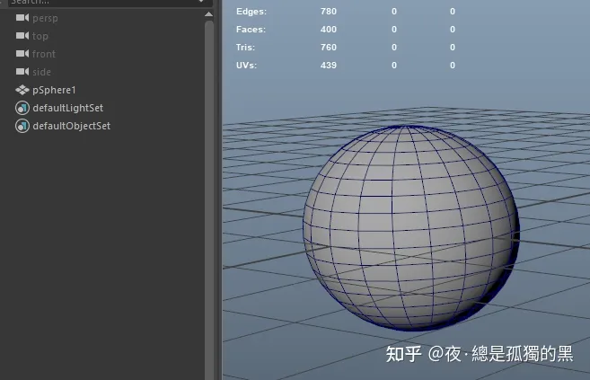

场景中的Sphere

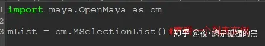

声明一个列表实例

有了列表之后，就可以将对象放进去。

1.通过选中对象放入：

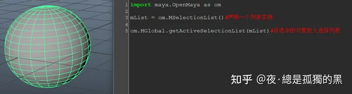

2.通过对象名称放入：

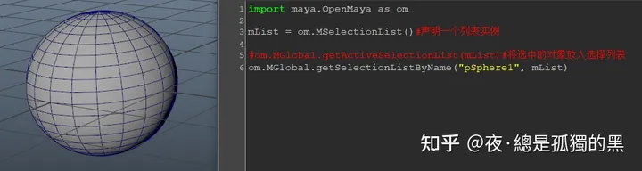

这时，我们可以选择获取MDagPath,或者MObject。MDagPath就是大纲路径，也就是通常所说的大纲视图里的层级关系。MObject是Maya中的通用数据类型，Maya中的任何数据都可以用MObject来表示。通过MObject来表示对象的好处之一就是不用担心重名。如果场景中有重名对象，再通过第二种方式获取对象，就会出错。

1.获取MDagPath：

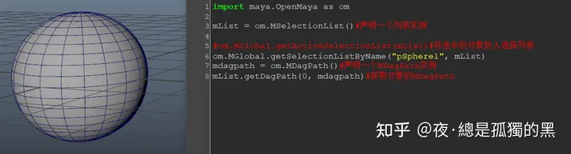

getDagPath()中的第一个参数表示选择列表中元素的索引，索引从0开始。如果选择列表中有两个元素，想要获取第二个元素，那参数就填1。

拿到MDagPath之后，就可以打印一下对象的名字了。

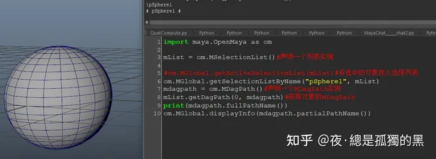

可以使用Python自带的打印函数print(),也可以使用Maya自带的打印函数MGlobal::displayInfo()

fullPathName()会返回从世界层级到当前对象的整个大纲路径，partialPathName()会返回一个表示唯一存在的最短路径。

2.获取MObject:

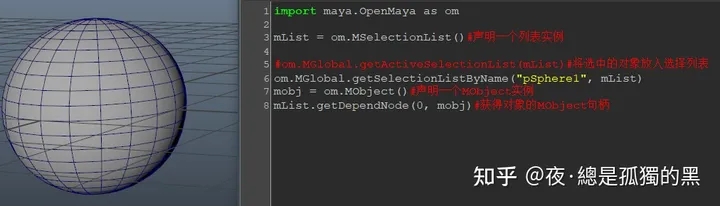

可以将MObject理解为一个句柄或者一把钥匙。有了这把钥匙，就能够开启各种类型的功能宝库。遗憾的是，我们不能只通过MObject就能获得对象的名称。好比警察提取了罪犯的DNA后，也无法只通过DNA就能获取罪犯的名称等一系列信息。也需要通过DNA去对照已有的信息库，才能获得罪犯的信息。虽然MObject无法让我们直接获得该对象的大多信息。但是，却可以让我们获得该对象的节点类型。节点类型？众所周知，Maya是一个节点软件（Doge）。既然是节点软件，那肯定得有各种节点来实现不同的功能吧？所以节点和节点之间也有类型的区别。

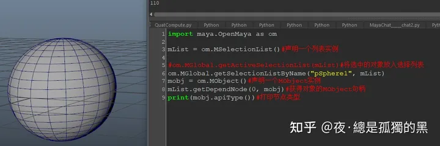

apiType()函数返回了节点类型，不过却是一个int值。阿这.......那我怎么知道这个110代表了个啥啊？？？很简单，翻文档（Doge）...........

或者，可以使用另一个函数，apiTypeStr():

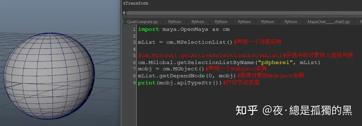

此时，返回了 "kTransform"。没错，返回的是Sphere的Transform节点。顺带一提，Maya中的类型全是k开头。

那为什么有apiTypeStr()了，又还有一个apiType()呢？因为有时候，需要确定节点类型，这个时候直接比较整数肯定比比较字符串省事啊......

说了半天，那MObject怎么才能获得对象名字啊？呃呃，且听下回分解......

  

最后再提一点，既然获取到了对象的各种信息，那么怎么在场景中选中它呢？

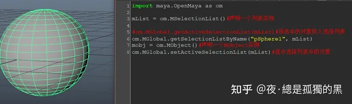

只需使用setActiveSelectionList()函数即可，参数是想要选中的选择列表。