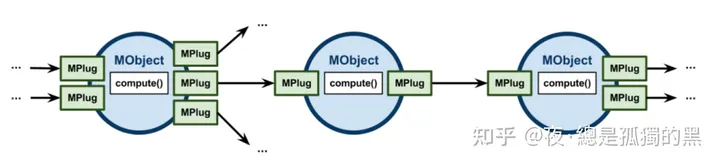
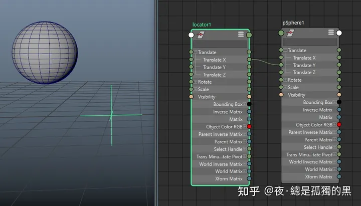
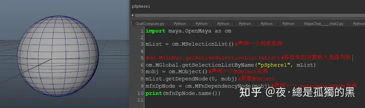
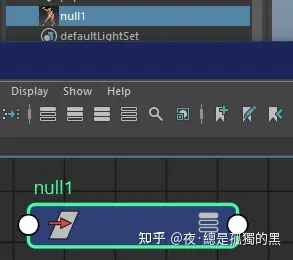
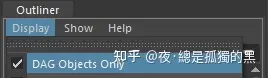
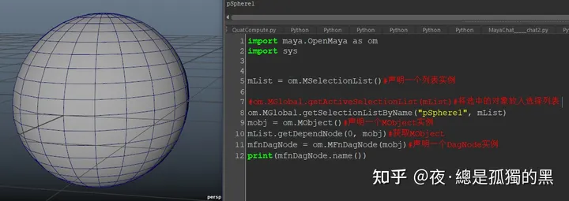

书接上回......

在“浅谈OpenMaya的使用 一”中，我们留下了一个问题。即：在获取一个对象的MObject之后，我们如何获取这个对象的名称？

这里要先介绍一下什么是**Dependency Graph**？翻译过来就是：依赖图。

图来自于官方文档

根据文档的解释，Dependency Graph（依赖图。为了更专业一些，二次出现的专业名称之后都用英文），是一个由众多节点组成的节点网络。那么，我要怎么才能看到这个节点网络呢？很简单，打开你的Node Editor。

举例：

这是一个简单的Dependency Graph，由一个locator的x位移连接到sphere的y位移。数据由locator开始，经过连接关系，再输入给被连接的sphere节点。数据有来源，有终止点，有流通方向。Node Editor中的每一个节点都可以用来组成一个节点网络，即：Dependency Graph。其中的每一个节点都是一个MObject的实例。是的，也就意味着，你可以在Node Editor里看到每一个你想要获取的MObject对象。

每个节点都应有输入属性和输出属性。即：inputPlug、outputPlug，也就是节点上的属性连接点。这些每一个Plug都是MPlug的实例。（关于MPlug的使用，之后的文章会介绍。）

Node Editor中的这些，可以被用来组成Dependency Graph的节点，每一个都是Dependency Node。(我猜，这也就是为什么获取MObject的函数被命名为"getDependNode"?)

OK，知道了什么是Dependency Graph和Dependency Node之后，我们就可以解答之前的问题了。

通过MFnDependencyNode类，我们可以获得一个Dependency Node，也就是MObject在NodeEditor中的实例。再调用MFnDependencyNode::name()即可获得该节点的名字。

MFnDependencyNode类，是一个专门用来处理DependencyNode的方法集合。你可以获取节点名字、创建一个maya已有的节点、查找节点的属性、甚至可以更改节点图标......

由于类众多，每一个类的函数也很多，我也只能讲讲该类的主要功能，更多的函数使用需要自己亲自去翻文档。嗯~强大的自学能力也是成为大佬的必备条件。

既然上面说了Dependency Graph，那就不得不说一下DAG了。DAG全称为：**Directed Acyclic Graph。**翻译过来就是：有向无环图。直白的说就是，这个图，它有从根节点指向子节点的方向，但是不能循环。也就是不能再从子节点指向根节点。DAG是Dependency Graph的子集，而专门用来处理DAG节点的函数集：MFnDagNode，也是MFnDependencyNode的派生类。

就像可以在NodeEditor中可以看到Dependency Graph一样，要怎么才能看到DAG呢？

DAG.....我们不是一开始就已经见过了吗？（Doge）那就是大纲视图啊！

打开你的Outliner的display是不是有一个这个选项？关掉之后是不是出现了很多乱七八糟的节点？

没错，当你开启此选项之后，在Outliner中能看到的所有节点都属于DagNode。而Directed Acyclic Graph就是这些DagNode的层级关系。而这些层级关系，我们可以通过第一篇文章提到的DagPath来处理。

因为sphere的transform节点是一个DagNode，MFnDagNode又是MFnDependencyNode的派生类。所以，我们也可以直接通过声明一个MFnDagNode的实例来调用name()。