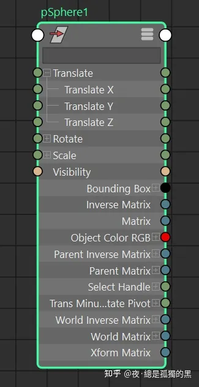
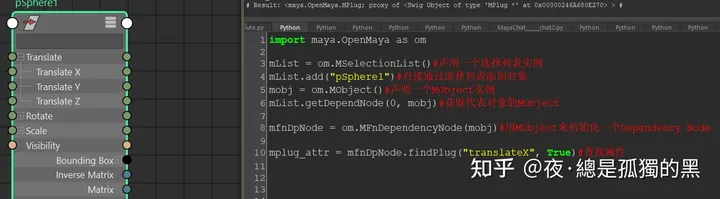
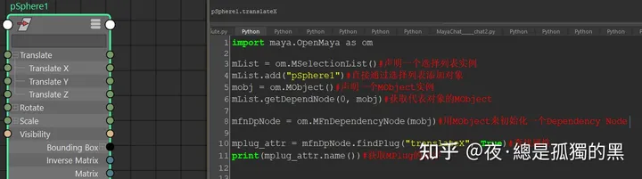
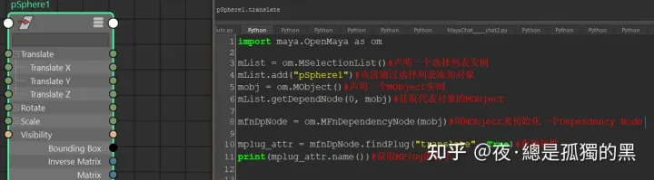
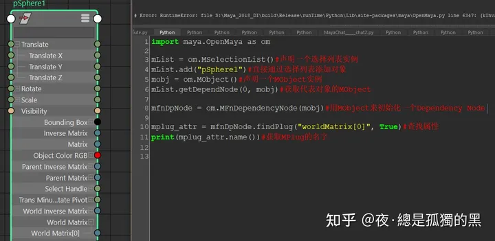
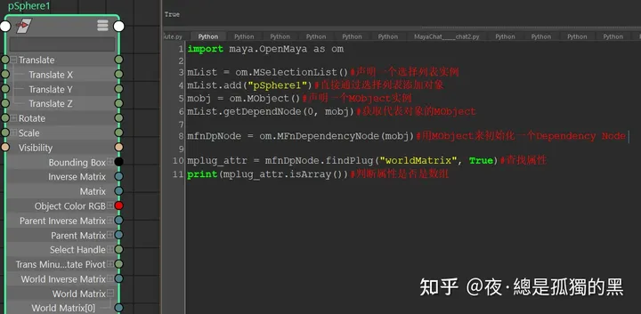
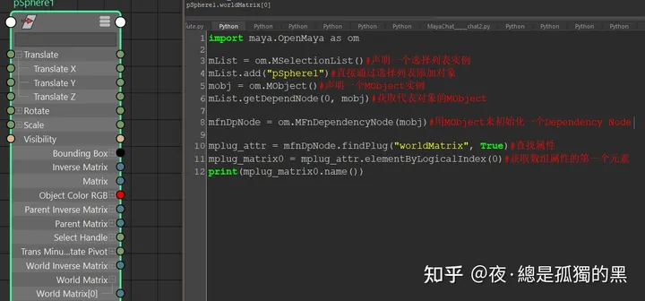
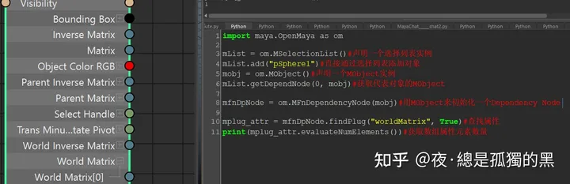
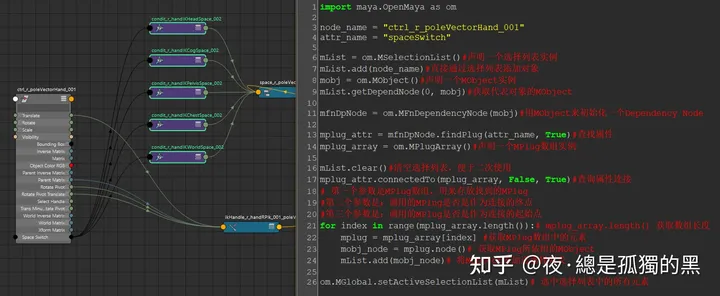

上一篇中，我们讲到，Dependency Graph中的每一个节点都被称作Dependency Node。每一个Dependency Node都是MObject的实例。而每一个Dependency Node都有一个个属性连接点。以我们熟悉的Sphere为例：

无论输入还是输出，这每一个属性连接点，都是一个名为MPlug的类实例。这一篇的主角就是 MPlug。

MPlug是一种特定类型的类，该类一般情况下指代我们通常所说的节点属性。它可以用来获取、设置属性值，查找属性连接的来龙去脉，设置、查询属性状态，获取属性名称，获取属性所依附的节点等等。

一个较为简单获取有效MPlug的方法是，通过MFnDependencyNode::findPlug()函数来获取。例如：

这里使用了一个新的将对象添加进选择列表的方法，MSelectionList::add()。

在获得DependencyNode之后，通过调用MFnDependencyNode::findPlug()函数来获得了代表"pSphere1.translateX"这个属性的MPlug实例。何以见得这个MPlug实例就是"pSphere1.translateX"这个属性呢？我们打印出来看看便知：

通过调用MPlug::name()函数，即可获得MPlug实例所代表的属性名称。

MFnDependencyNode::findPlug()函数的第一个参数显而易见，是需要查找的属性名称。而第二个参数则有点意思。第二个参数是一个Bool值，如果填True,该函数返回一个Networked Plug，意为：网络版。如果填False,则返回Non-networked Plug,意为：非网络版。这两个版本的最大区别是，网络版的处理速度比非网络版的更快。然而！然而！然而！重要的事情说三遍。在写这篇文章时，为了更准确，我去maya论坛查了一下，最后根据官方的回答是：网络版处理速度比非网络版更快这一事实已成了历史，经过代码的优化后，网络版和非网络版并没有多大的区别。所以，这里填True还是False，实际影响都不大。

OK，让我们接着往下。之前在查找属性时，我传入了"translateX",ok,没问题。返回了"pSphere1.translateX"。那如果我传入"translate"呢？

OK，看起来也没问题。那如果我要是找世界矩阵呢？

很好，报错了......让人不经思索，我这里传入的明明是世界矩阵这个属性的名字啊，为什么会报错呢？难道findPlug()函数出错了？注意，这个属性有一个特别的标志"[0]"，这个不就表示数组的索引吗？难道这个属性是......

OK，既然提出了假设，那我们就得去验证一下。现在我们把"worldMatrix[0]"换成"worldMatrix"。然后再调用MPlug::isArray()函数。

返回了True，说明"worldMatrix"这个属性是一个数组属性。而数组属性是不能直接传带有索引的名称来查找的。嗯~这也是我之前学习时遇到的一大深坑。

那如果就想要拿到"worldMatrix[0]"这个属性呢？答案是，可以通过MPlug::elementByLogicalIndex()函数来获取。参数就是数组的索引值，索引从0开始。如下图：

既然是数组，那我理应能获得该数组元素。可以通过MPlug::evaluateNumElements()来获取元素个数。

如下图：

最后，让我们来通过一个简单的案例来结束这篇文章。

有时候，当我们打开Node Editor想找到某个属性连接了哪些节点时，会看到整个连接图跟个盘丝洞似的，看到就让人头大。所以，这个时候就需要一个简单的方法来解决这个问题。我只要输入需要查找的属性名称，然后maya自动帮我选中所有与其直接相连接的节点。代码及效果如下图：

到目前为止，使用OpenMaya所需了解的基本前置知识就差不多讲完了。之后会开始陆续更新OpenMaya的使用案例。案例内容基本是我工作中使用到的功能演示。案例并不高大上，但却是我的使用经验，希望可以帮助需要学习和使用OpenMaya的人尽可能的熟悉和上手。