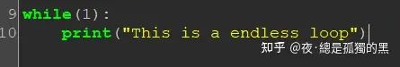
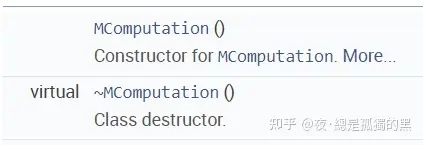
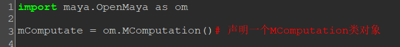
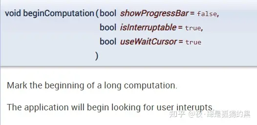
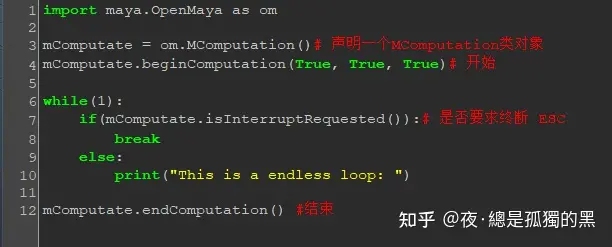
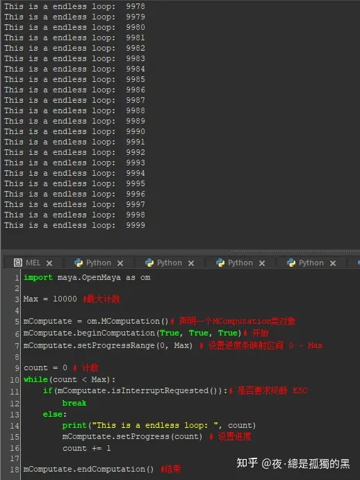
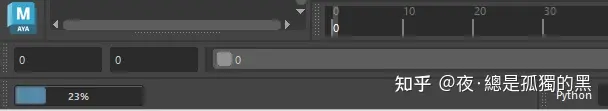

有时候我们写脚本时会用到while循环，但又有时候会不小心写成了死循环。通常我们只能重启Maya。这就很尴尬了，我文件做了一半忘存了怎么办......

这篇文章我们使用一个简单的OpenMaya API来解决这个问题。这个API叫：MComputation。

我们先写一个简单的死循环

然后我们再来康康怎么声明这个对象。

通过翻阅文档发现，它只有一个无参的默认构造函数。OK,那就直接声明即可。

我们再调用一下beginComputation()

这个函数表示程序从这里开始，第一个参数是 是否显示进度条， 第二个参数是 是否可终断执行， 第三个参数是 执行期间鼠标光标是否设置为繁忙状态，即光标转圈圈。

接下来在死循环里加上一个if 。 isInterruptRequested()用来监听用户是否按了ESC键来要求终断执行。如果要求终断，直接break跳出死循环。最后加上endComputation(),表示结束执行。

到这里就可以执行代码测试一下了，此时你会看到editor不断打印"This is a endless loop: "，然后当你按下ESC之后，程序跳出循环。

  

这个API的作用不止于此，我们之前不是在beginComputation()里面要求显示进度条吗？那进度条呢？

只需再添加几行代码

如此，就能在左下角的help line看到进度条了。