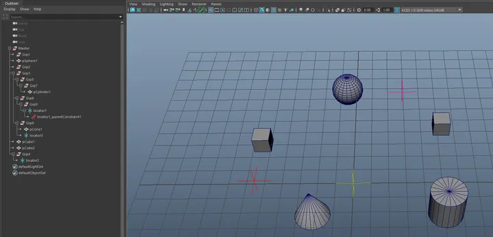
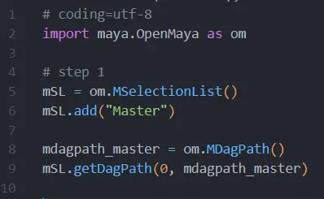
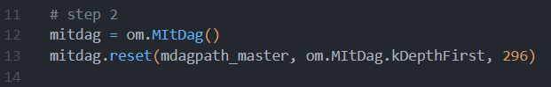
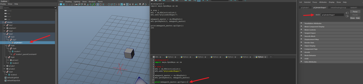
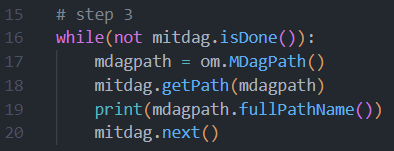
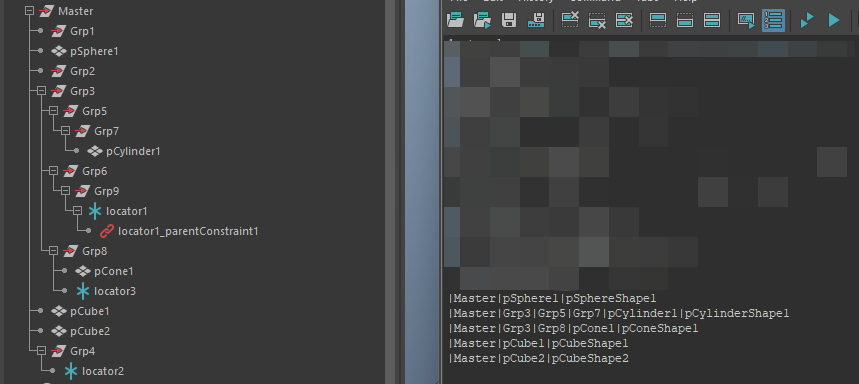
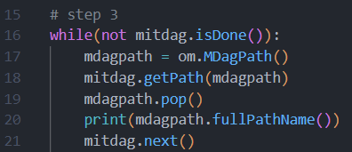
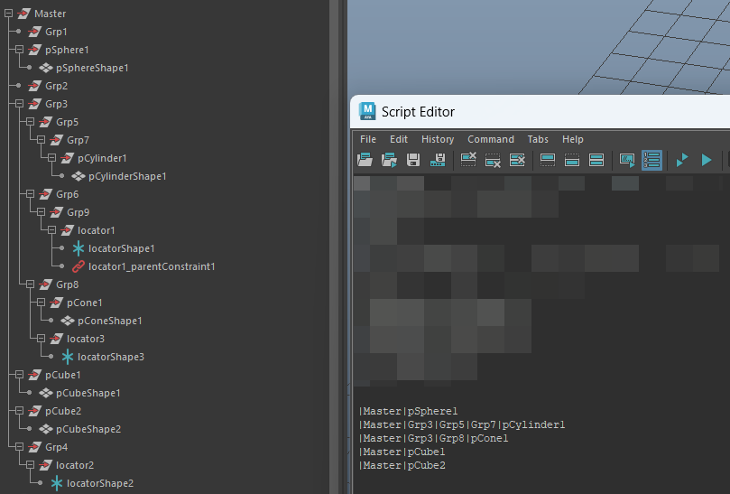
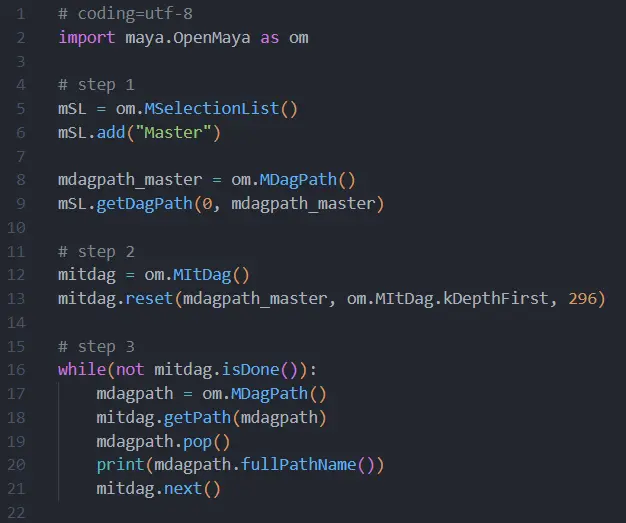

这一篇文章大概内容为：如何使用OpenMaya的MItDag迭代器遍历和过滤Outliner中的Dag Node。

**MItDag:** 顾名思义，它是一个Dag迭代器，可用于遍历和过滤大纲视图中显示的Dag Node。（不清楚Maya中的Dag Node是什么的话，可以去看看 “浅谈OpenMaya的使用 二”）

**示例：**

这是当前场景的大纲视图，其中显示的便是当前场景中的Dag Node。有空组、几何网格（模型）、Locator、约束节点。现在的目标是，**使用MItDag迭代器遍历这个大纲，然后找出其中的几何网格以及这些几何网格的父层级。**

**程序：**

**第一步**，先创建一个选择列表，然后添加Master这个组的名字，将Master这个组添加进选择列表。然后再创建一个DagPath，使用选择列表来获取Master的DagPath。

**第二步**，创建MItDag迭代器对象，使用reset()方法重新设置迭代器状态。

第一个参数表示迭代层级的根，迭代器将会以该对象为根，迭代该对象的所有子层级。

第二个参数表示迭代方向，这里用的是kDepthFirst（深度优先），别的还有 kBreadthFirst（广度优先） 。

第三个参数表示过滤类型，这里填296，表示过滤mesh类型的节点（只遍历mesh）。想要过滤其它类型，可以自己查询相应Dag Node的类型。

至于如何获知节点类型，以下以一个mesh节点为例，该节点是pCylinder1的形节点。可以使用mdagpath_master.apiType()来打印。

**第三步**，使用while循环来遍历迭代器。如果迭代器没有迭代完，isDone()返回false。当迭代器迭代完毕时，结束while循环。**注意**：一定要记得在循环中写上next()，否则将执行死循环。next()函数使迭代器移动到下一个对象，如果不使用这个函数，迭代器将一直处于指向同一个对象的状态，isDnoe()就一直不会返回true。

循环中通过getPath()函数来获取迭代器中当前对象的DagPath。然后打印该DagPath。

完成第一个目标，遍历并且过滤出了大纲中的几何网格。

有了mesh的DagPath之后，找父层级就很简单了。仔细观察发现，父层级就是DagPath路径中的上一层级。在循环中再使用pop()函数，将Dag路径的末端弹出即可得到父层级。

  

**案例完整代码**：

