之前学到了一点小技巧，实现了一个有意思的小效果：

[Maya通讯299 播放 · 1 赞同视频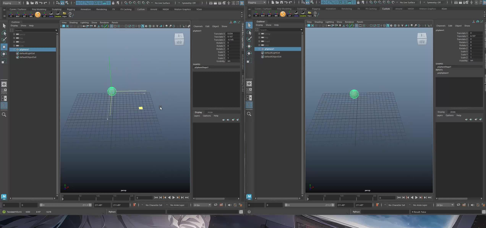​](https://www.zhihu.com/zvideo/1620393744422903809)

除了用到在“[萌新的Maya Python学习笔记：外部程序与Maya通讯](https://zhuanlan.zhihu.com/p/611771920)”这一篇章中用到的socket技术外，还需要用到回调函数。所谓回调函数，个人的理解就是：你通过程序提供的API来执行某些命令，而回调是程序通过你提供的函数来执行某些命令。API给用户调用，回调函数给程序调用。

  

## 属性改变时回调

这个API可用于注册这样的一个回调函数：当DependencyNode的属性发生改变时，调用。

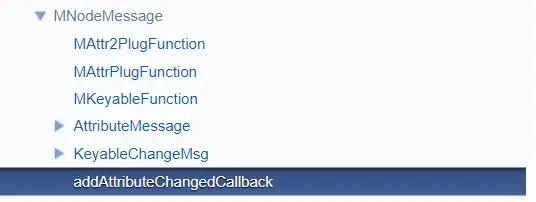

它的第一个参数是需要监测的DependencyNode, 第二个参数是一个函数指针，第三个参数是额外的用户数据，第四个参数是返回状态。

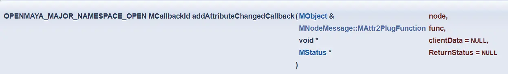

回调函数的参数需要与函数指针类型一致：

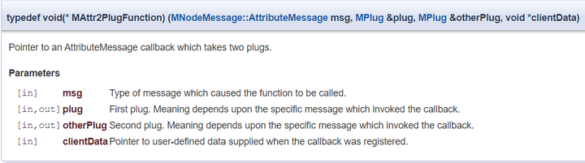

这里的persp就是透视视图的透视摄像机。在调用回调时，获取当前摄像机的空间变换数据，然后将多个mel命令字符串合并成一个字符串。最后由socket发送给另一端的maya。

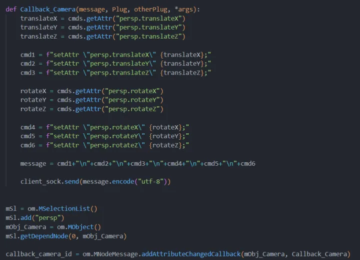

你可以将摄像机"persp"换成别的节点，然后再改变一下节点属性试试。

  

  

## 命令生成时回调

这个API可用于注册这样的一个回调函数：当有执行的命令生成时，调用。比如，ScriptEditor窗口中回显的mel命令。

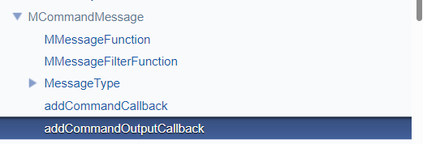

第一个参数是函数指针，第二个参数是额外的用户数据，第三个参数是返回状态。

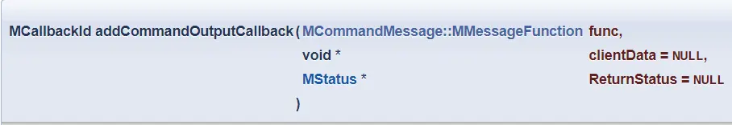

回调函数的参数列表需要与函数指针类型一致：

第一个参数表示返回的字符串命令，第二个参数是返回的消息类型，第三个参数是额外的用户数据。

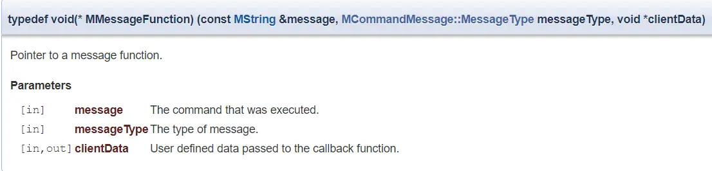

消息类型是一个枚举，

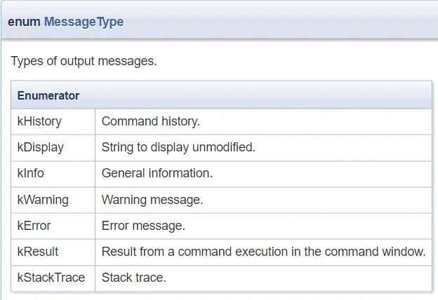

我不需要所有的返回，所以进行了一次消息类型过滤。之后将返回的字符串命令通过socket发送给另一端的maya。

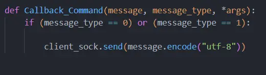

  

## 移除回调

当不需要回调函数时，需要将其移除。每次注册回调函数时，都会返回一个id，当移除时就需要使用这个id来识别移除的回调函数。

找到OpenMaya模块中的MMessage类

找到其中的removeCallback函数

传入回调函数id，即可移除回调。

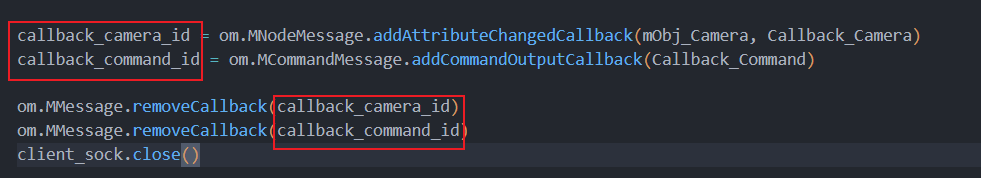

  

  

以下是用户端的完整代码：

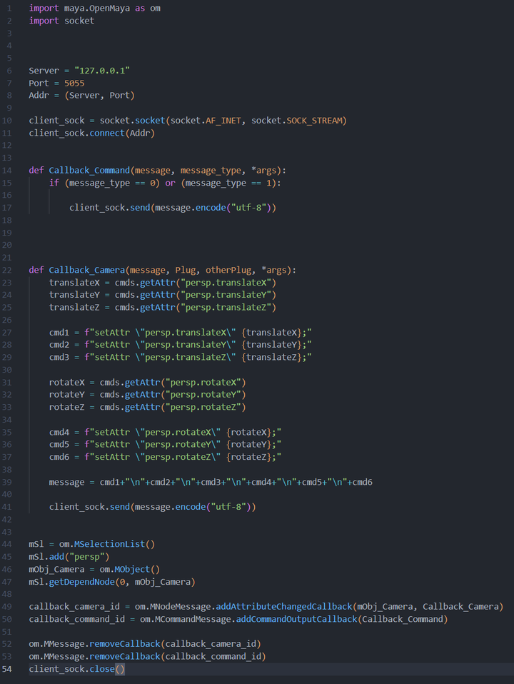