本篇简单记录一下在VisualStudio中使用C++写Maya插件时，应该怎么配置VS。以及一个简单的Maya命令的开发框架是怎样的。

寻常的少量数据搜索、注册回调等功能通过使用Python版的OpenMaya即可实现目的。但是如果是需要写Deformer、Node这些需要快速实时计算的节点，就需要使用C++来编写了。

## 配置Visual Studio

1.创建空项目

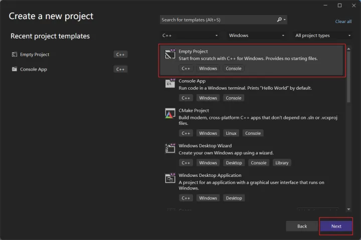

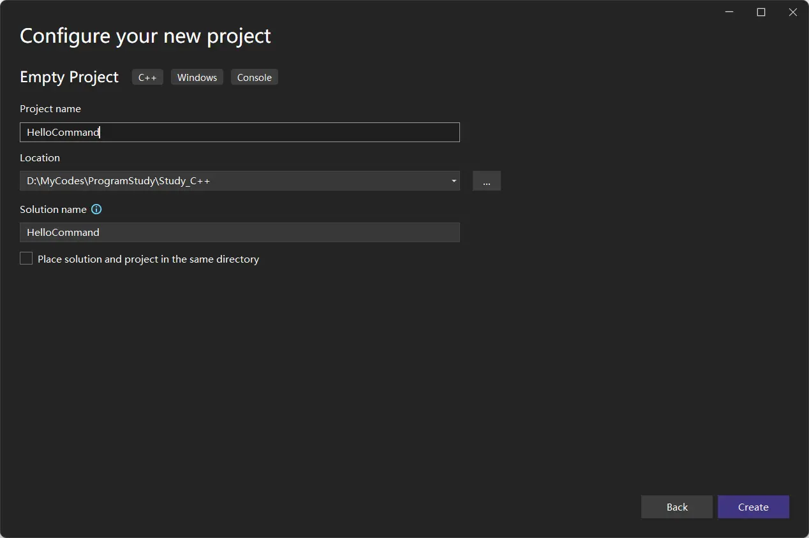

2.创建项目文件

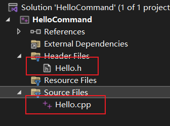

  

3.打开项目设置

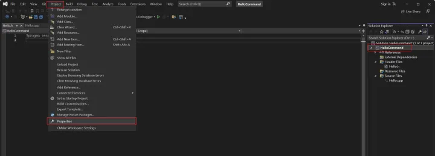

4.将exe换成.dll

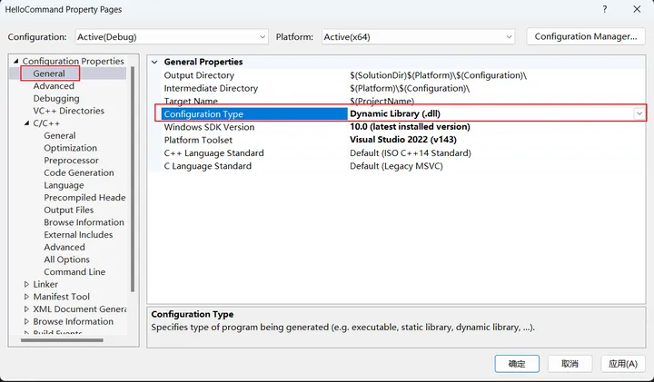

5.修改扩展名为.mll

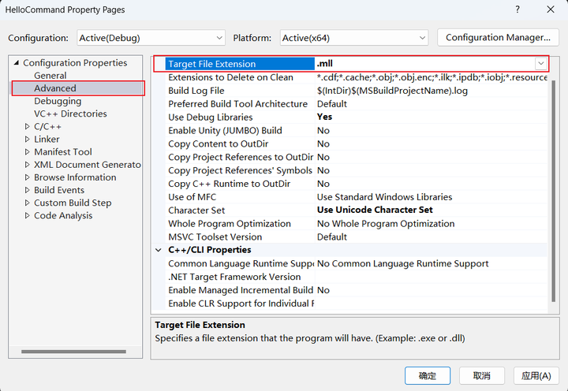

6.添加包含路径

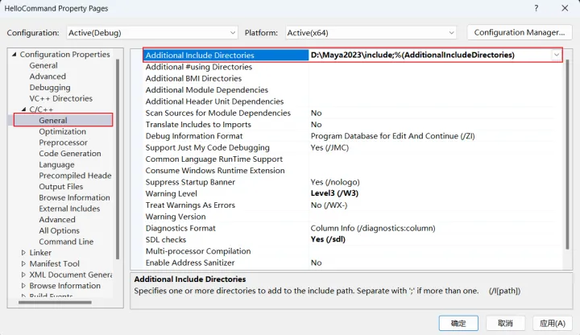

7.添加静态库路径

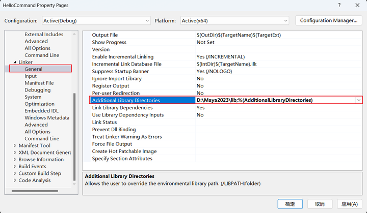

之后点击应用，确定。

  

  

## 简单Maya命令框架

首先来到头文件，包含需要的头文件。

然后显示链接静态库。

最后定义一个命令类（名字可任意）。

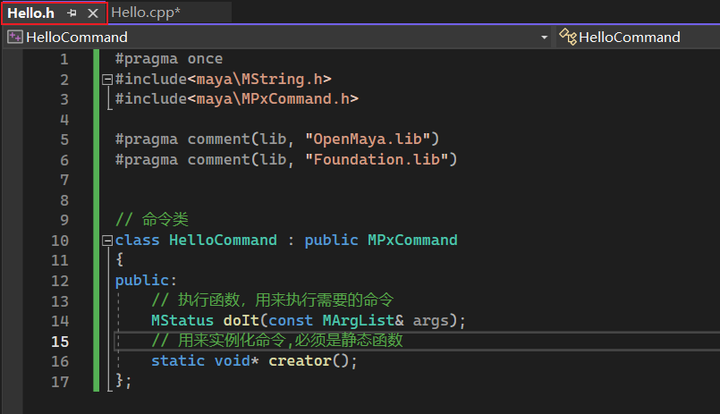

  

来到cpp文件

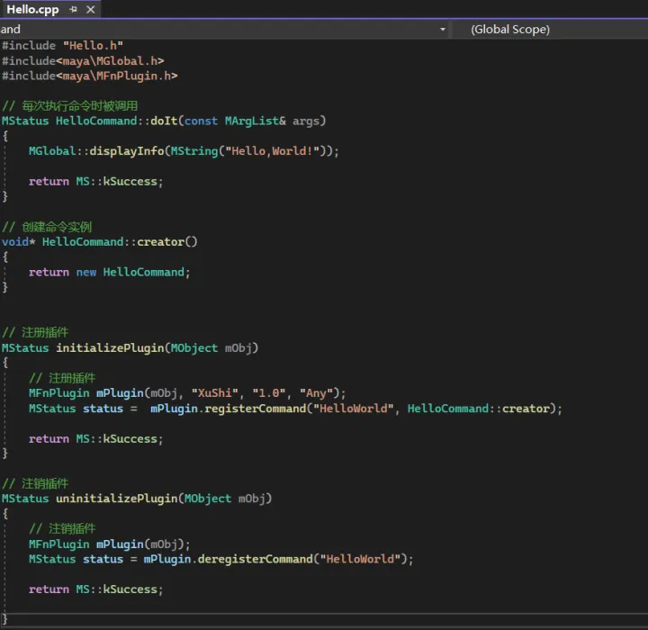

之后编译,然后打开目录文件夹，即可看到.mll文件。

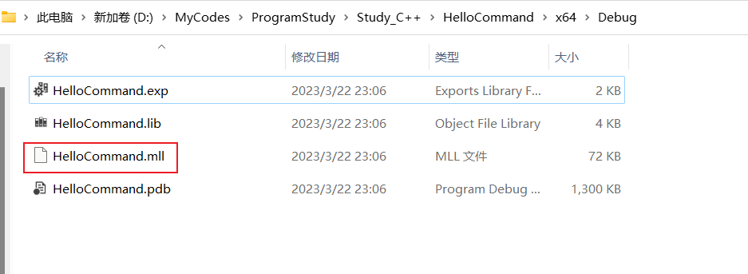

  

## 加载Maya插件

打开Maya的插件管理器

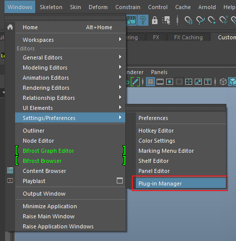

资源管理器中指定.mll文件

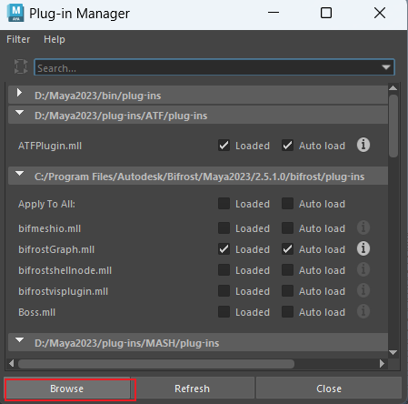

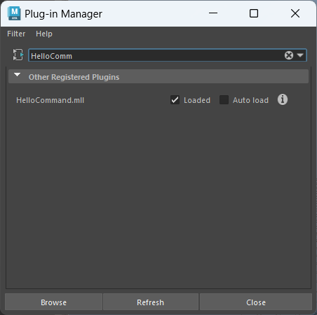

加载成功后即可测试命令

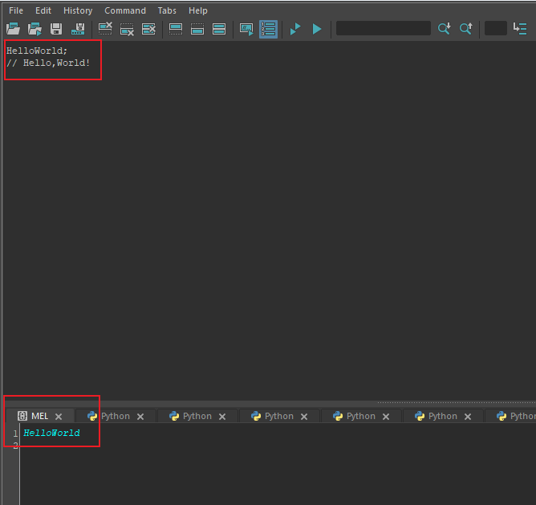

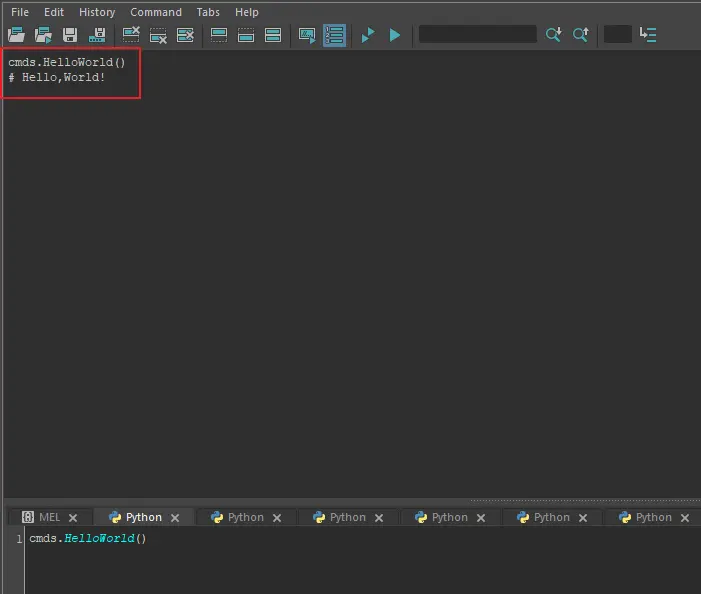

mel和python都可以成功执行。