在上一篇中介绍了如何配置Visual Studio的Maya C++开发配置，然后又介绍了如何写一个最简单的无参命令。

这一篇将介绍如何写一个带参数的命令。最终效果如下：

[Decrypt929 播放 · 1 赞同视频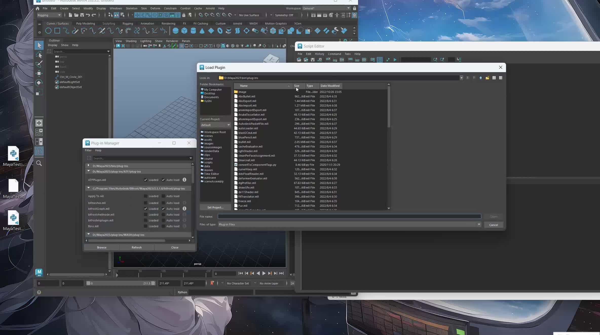​](https://www.zhihu.com/zvideo/1622770246682378240)

  

## 1.加密解密函数

首先需要创建两个文件来写加密和解密功能。

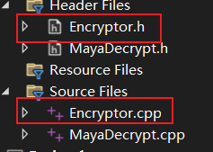

在头文件中定义了一个加密类，然后声明了两个静态成员函数。

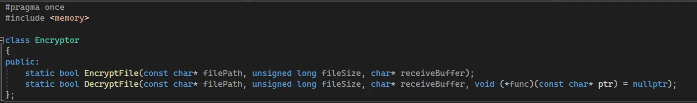

在函数定义部分，加密函数通过打开一个已有的文件，然后读取获取其中的文本内容。加密的计算就只是简单的将字符码的值+3。

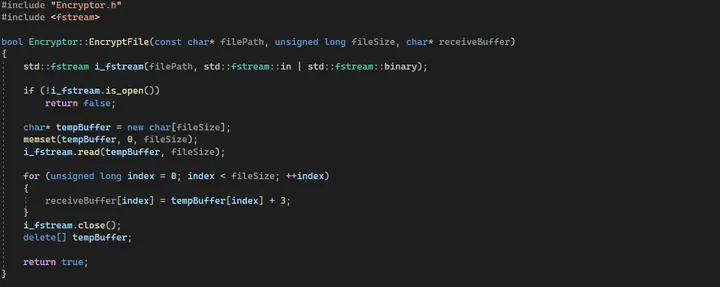

解密部分和加密部分类似，也是通过打开一个已有的文件，然后获取其中的文本内容。解密的计算是加密的逆向操作，所以将字符码的值-3。由于参数使用了一个函数指针，所以需要判断一下函数指针是否有效。

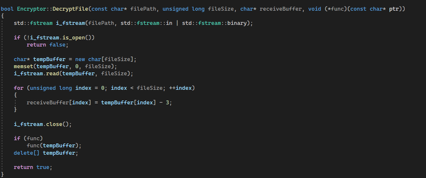

  

## 2.命令类

接着是定义Maya的命令类。

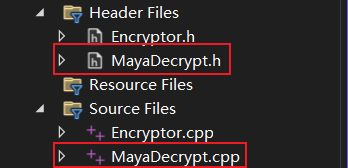

与无参命令不同，有参命令需要添加参数和进行参数解析。

doIt()函数并不是真正执行命令的部分，而是参数解析和变量存储的部分。真正执行命令的是redoIt()。而在Maya中通过按G键可以重复执行命令，也是执行了redoIt()。

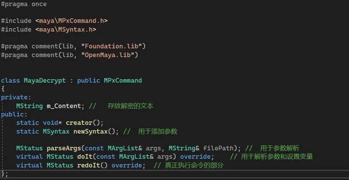

接着实现函数定义

先实现newSyntax()，该函数用来添加命令参数，因为之后要传递的参数是文件路径，所以这里使用字符串类型。

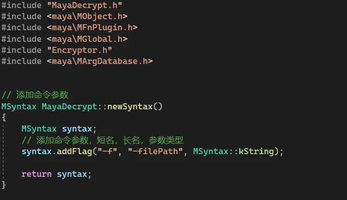

parseArgs()函数用来解析参数，通过判断参数flag然后后获取对应的参数。

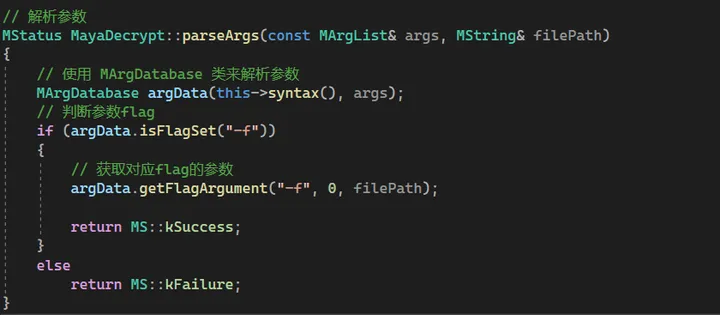

关于如何解析多个重名的flag，可以参考文档解释：

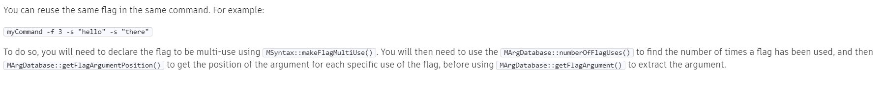

在doIt()函数中调用了parseArgs()函数来执行参数解析。

参数解析完成之后获取文件大小，然后解密文件。通过buffer来获取解密后的文本内容，通过lambda函数来打印未解密的文本内容。

参数解析、变量数据存储后完成后，执行redoIt()来真正执行命令。

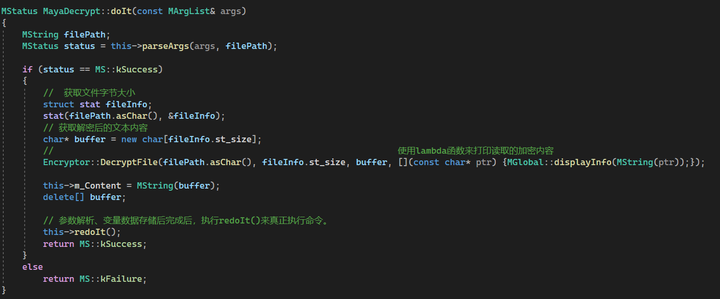

在redoIt()函数中，通过MGlobal::executePythonCommandStringResult()函数来执行字符串形式的Python命令。第二个参数是表示是否回显在ScriptEditor中。

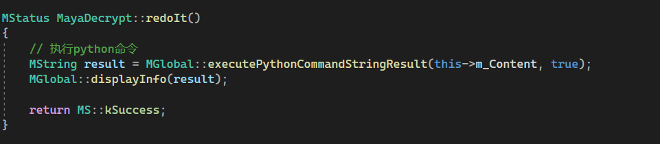

之后的流程就和之前一样，不过在registerCommand()函数中，多了一个参数。

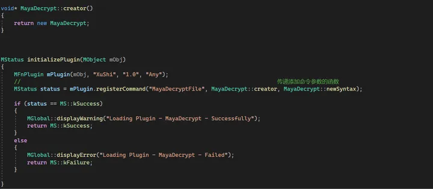

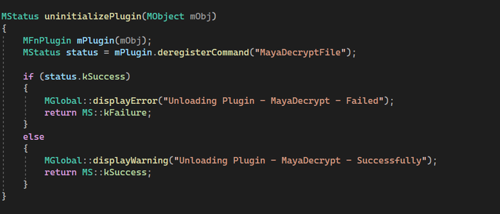

编译之后就获得了一个mll的Maya插件。

  

测试插件：

这是一个简单的创建控制器层级和设置控制器颜色的Python脚本。

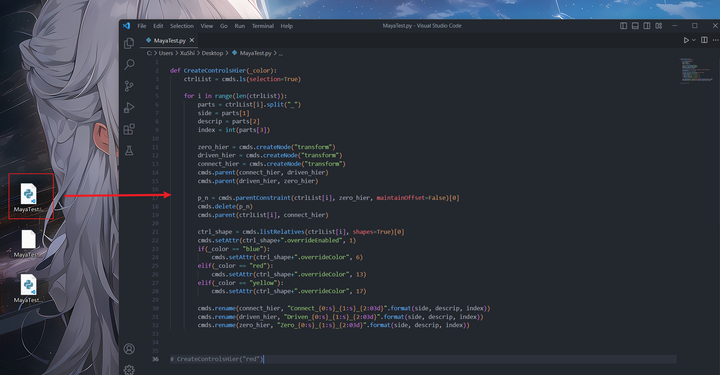

通过简单的字符码值+3后，它长这样：

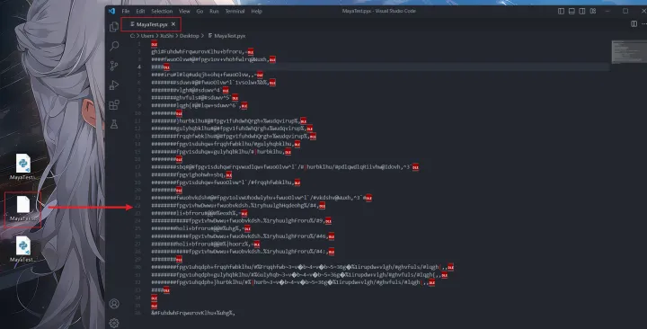

在Maya中加载插件会有如下提示：说明插件加载成功。

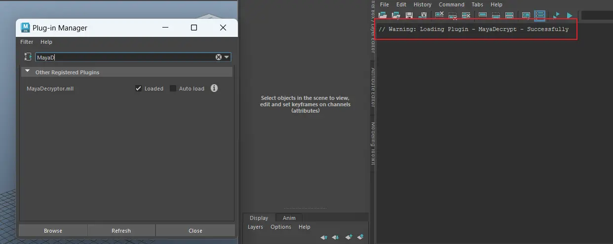

此时执行该命令会直接报错。因为还没有执行Python脚本。

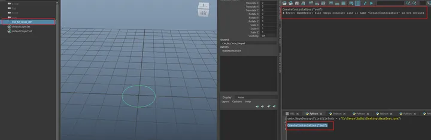

先执行解密的命令：

正如之前写的那样，该命令将加密和解密的文本内容都打印了出来。

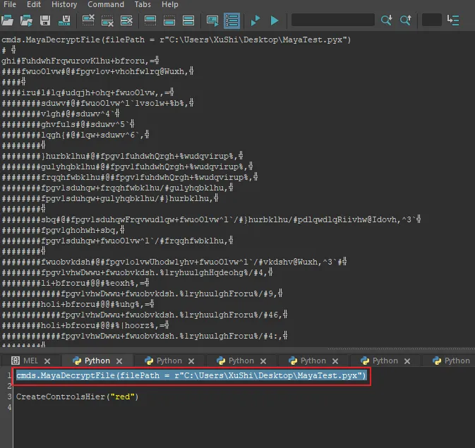

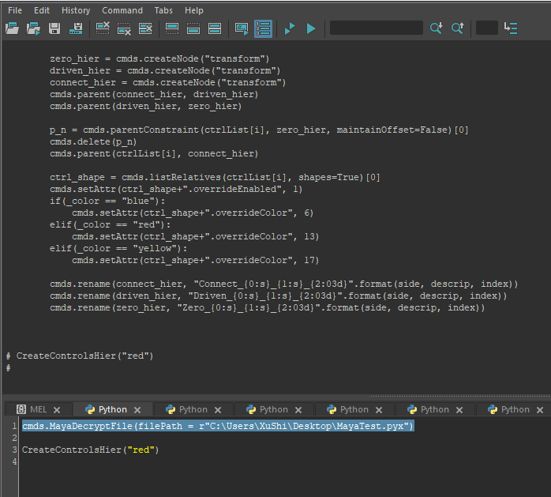

此时Python脚本已被执行，就可以执行刚才的控制器创建函数了：

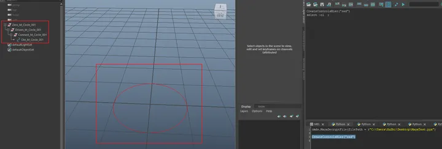