有时候我们在写批量导入导出工具时，必定会遇到关于名称空间的问题。虽然cmds.file()可以指定名称空间，但是如果当前导入的obj和上一个导入的obj的名称空间是一样的，maya会给你自动在当前obj的名称空间加序号。

如：

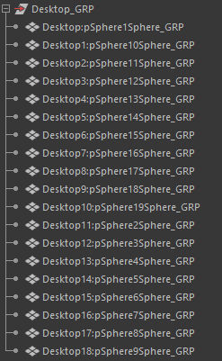

而打开名称空间编辑器，会发现有非常多的名称空间。

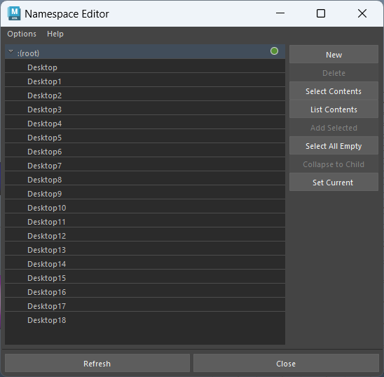

但是，如果不想出现这么多名称空间，只想将同一批次导入的obj指定为相同的名称空间，怎么办？此时，可以使用MNamespace来处理。

首先，可以通过 MNamespace.getNamespaceFromName()来获取指定对象的名称空间。

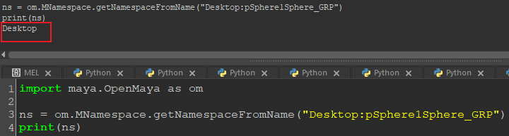

但是，这个方法实际只是简单的做了字符串拆分。如果是这样的话......

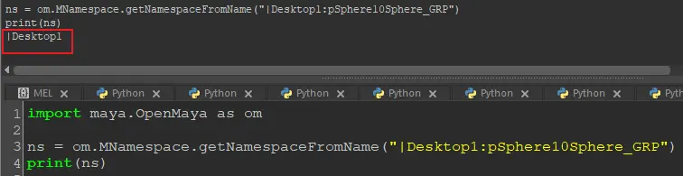

发现在返回的名称空间字符串中依然带有 '|'，可以通过使用MNamespace.namespaceExists()函数来判断名称空间是否存在。结果是，带有 '|'的名称空间是不存在的，而不带 '|'的名称空间是存在的。

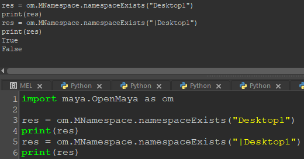

在通过dagpath处理大纲中的节点时，难免会出现这个问题。要么自己手动处理该字符，或者可以使用

MNamespace.validateName()函数来处理。该函数可以处理掉一些奇怪的前缀符号。

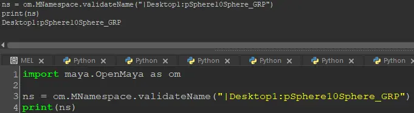

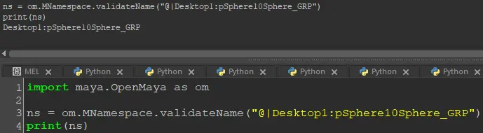

将前面的几个函数混用，就可以得到想要的名称空间了。

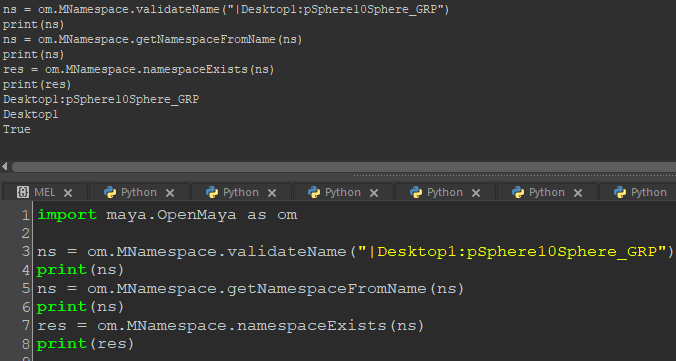

在得到指定对象的名称空间之后，若想将名称空间设为指定的名称。可以使用 MNamespace.moveNamespace()。需要注意的是，指定的名称必须是已经存在的名称空间。

  

使用以上方法，就完成了统一指定名称空间的工作了。

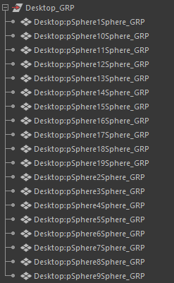

翻阅api文档，它的功能还不知如此。还包括移除名称空间、添加名称空间等等。

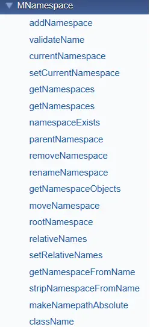

  

----------------------------追更

当我们想要移除名称空间时

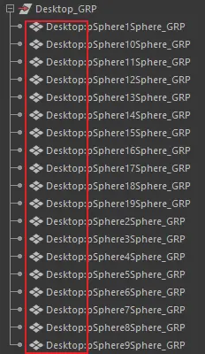

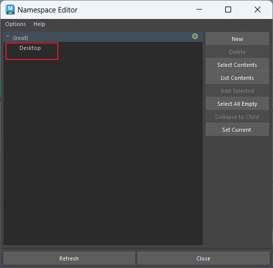

如果直接使用MNamespace.removeNamespace()，会报错。

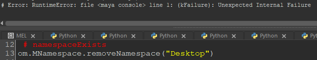

因为要移除的名称空间要么是根名称空间，要么就是有节点正在使用该名称空间，所以不能移除。

想要移除该名称空间，首先需要解除节点对该名称空间的使用。比如：可以先使用MNamespace.moveNamespace()，将欲要移除的名称空间移动到根名称空间。

此时大纲中节点的名称空间已被去除

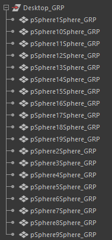

然后再使用MNamespace.removeNamespace()，即可移除名称空间。

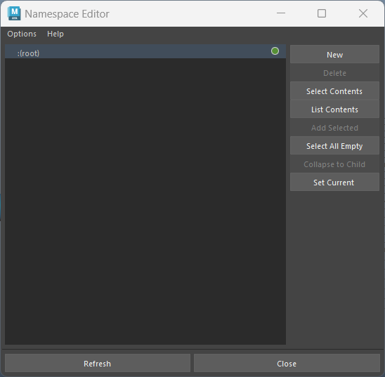