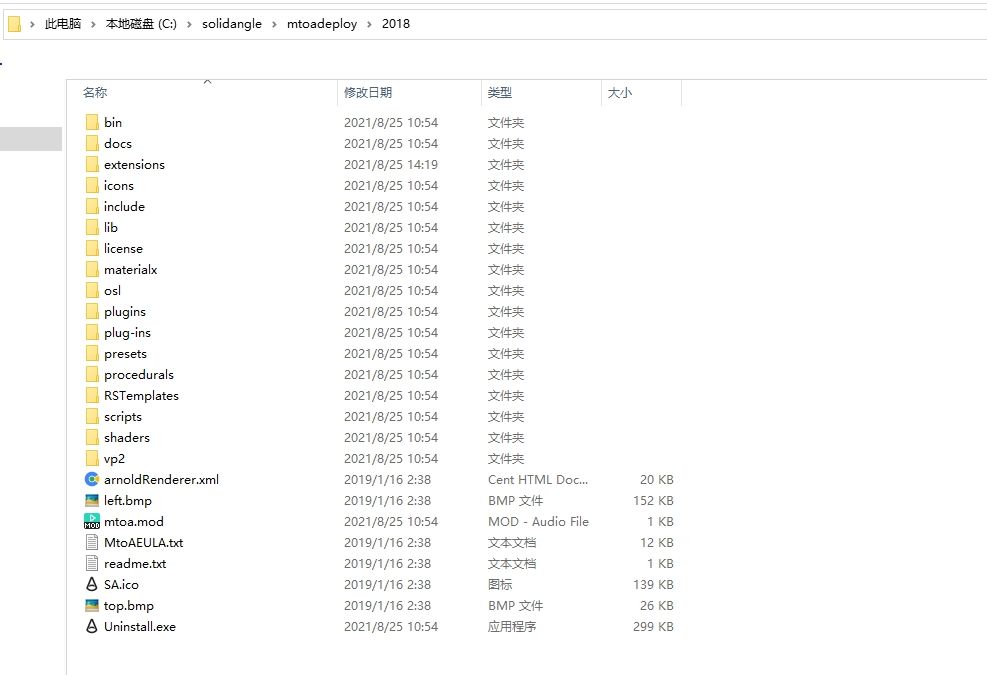
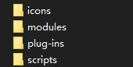
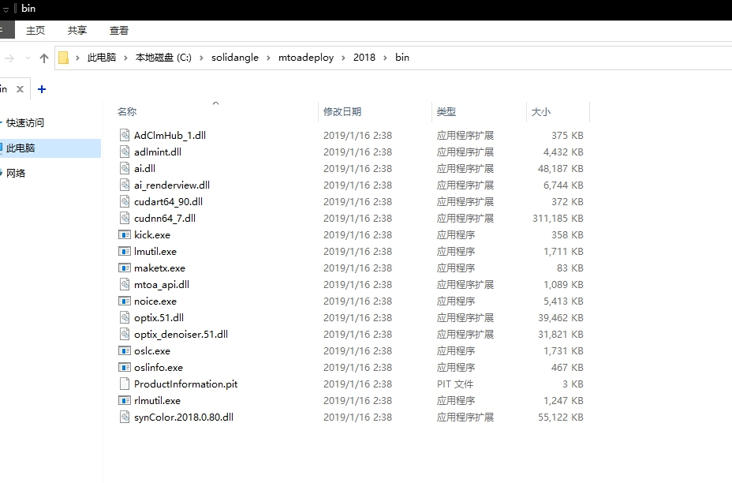
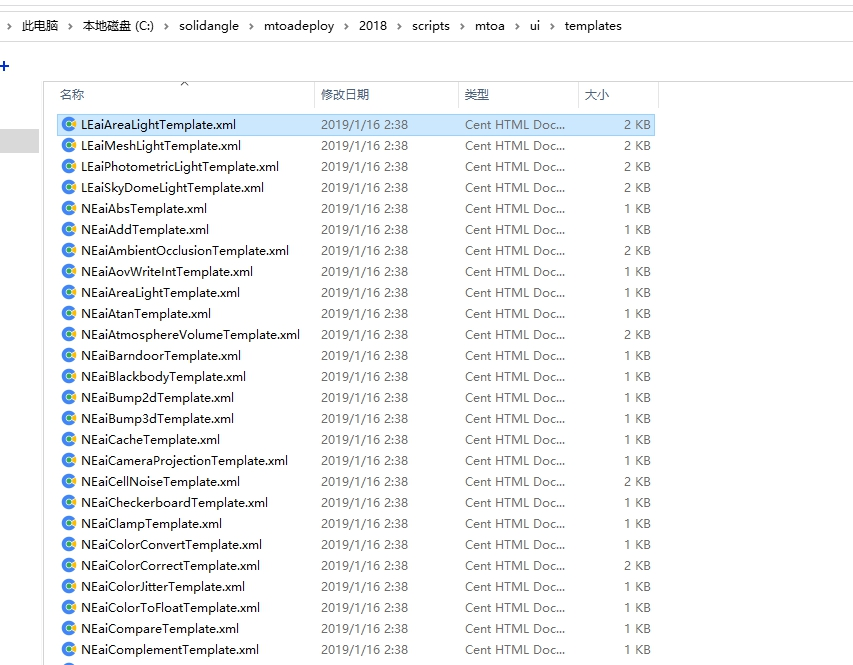
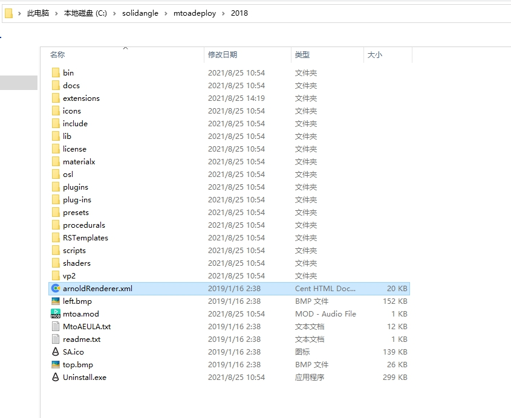
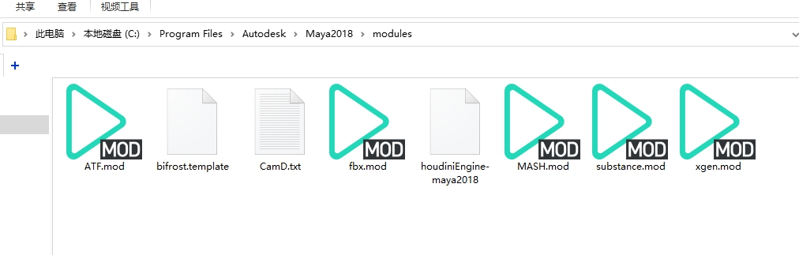
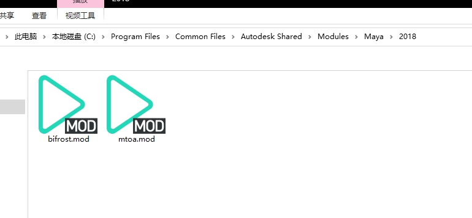

# 用mod文件加载Maya的插件

说到Maya的插件，最先想到的必然是Arnold渲染器插件，最早它本是Solid Angle公司开发的第三方商业渲染器，但几年前被Autodesk公司收购，如今在比较新的Maya版本中已经作为默认渲染器内置在软件安装包中了，默认情况下会跟随Maya软件本体一起安装。

虽然Arnold插件目前几乎算内置插件，但它依旧是独立存在的，可以单独进行安装或者卸载，不会影响到Maya本身，因此，就先来观察一下Arnold插件是怎么加载到Maya中的。

以Maya2018版本为例，在默认安装完Maya后，C盘会多出以下的文件夹。



看文件名就能判断出来，这就是Arnold插件的默认安装目录，不信你点一下那个Uninstall.exe试试。

这和3dsMax也不一样啊，插件怎么没安装到Maya的安装目录下呢？

别急，先看一下`mtoa.mod`这个文件，mtoa是Maya to Arnold的缩写，也就是Maya版本的Arnold插件，同理3dsmax版本的Arnold缩写是MAXtoA，C4D版本的Arnold缩写是C4DtoA，Houdini版本的Arnold是HtoA。
## 插件路径
[Open: Pasted image 20250818161745.png](attachments/abf194fccae56b7dd1307817023e9118_MD5.jpeg)

## mod文件格式
mtoa.mod默认情况下内容如下
```mod
+ mtoa any C:\solidangle\mtoadeploy\2018
PATH +:= bin
MAYA_PLUGINS_PATH +:= /plug-ins 
MAYA_SCRIPT_PATH +:= scripts/mtoa/mel
MAYA_PRESET_PATH +:= /presets
XBMLANGPATH +:= /icons

MAYA_CUSTOM_TEMPLATE_PATH +:= scripts/mtoa/ui/templates
MAYA_RENDER_DESC_PATH += C:\solidangle\mtoadeploy\2018
```
其实这个mod文件就是Maya用来加载插件的关键，可以在[官方文档](https://help.autodesk.com/view/MAYAUL/2016/CHS/?guid=__files_GUID_9E096E39_AD0D_4E40_9B2A_9127A2CAD54B_htm)查看，下面我仔细介绍一下。

- 第一行是要加载的模块的信息，这个模块可以暂时理解为插件，后面会详细说明。一般分为四个部分，中间用空格隔开，并且每一部分中不允许出现空格。

	1. 第一部分固定为`+`号，是个标志位。
	2. 第二部分是添加的模块的名称，这里为mtoa，就是要添加的插件名称。
	3. 第三部分则是要添加的模块的版本，例如1.3等，这里填写的是any，也就是不标明版本。
	4. 最后一部分则要加载的模块存放的路径，这里的路径也就是Arnold插件的安装目录。

- 其中第一部分和第二部分之间可以添加限定符，例如`MAYAVERSION:2018 PLATFORM:win64 LOCALE:zh_CN`表示只有中文64位的Windows系统下的Maya2018版本才能加载该插件，具体可以看[这里](https://help.autodesk.com/view/MAYAUL/2016/CHS/?guid=__files_GUID_130A3F57_2A5D_4E56_B066_6B86F68EEA22_htm)。

- 后面可能有多行，每行为一个环境变量，左侧为环境变量名，右侧为环境变量的值。合起来为一组，而一个mod文件中可以设置多个组，不同组可以用于对应同一插件的不同运行平台或者软件版本等（一般不建议把多个不同插件的mod文件合并成一个mod文件）。而后面的环境变量中，注意每行中间的符号可能有三种形式。

	1. 最简单的符号是`=`，也就是简单的设置环境变量，当已经有同名环境变量存在时，将右侧的值直接覆盖已有的值
	2. 最常见的形式是`+=`，同样是设置环境变量，不过当已经有同名环境变量存在时，将右侧的值添加上到已有的值末尾
	3.  还有一种则是`+:=`，和第二种类似，不过后面的值是相对路径的格式，也就是先将第一行最后一部分的路径和右侧的值拼在一起，再添加到环境变量上。

- 例如，第二行的PATH环境变量就可以改成`PATH += C:\solidangle\mtoadeploy\2018\bin`，两者的效果是一致的。显然当变量的值为插件安装目录的子目录时，使用`+:=`会比较方便，mod文件内容简洁，并且在迁移插件安装路径时，相对路径不变，只需要修改第一行最后一部分的路径即可。

## 环境变量

**PATH**，和3dsMax类似，都是用于加载插件的动态链接库dll文件，例如Arnold的bin目录



要注意的是，PATH环境变量不能缺少，但也不能乱加，应该尽量通过mod文件或者maya.env文件加，只在对应的Maya版本中生效。

例如很多人装Arnold报错`pluginWin.mel line 317: 无法动态加载: mtoa.mll`，原因是PATH环境变量对应的目录中没有找到ai.dll文件，或者第一个找到的ai.dll不是插件所需的版本。

后者原因就是直接在Windows系统环境变量中修改了PATH环境变量，例如在Maya2018和版本2020多个MAYA版本共存时，Maya2020版本的PATH中先找到了2018版本的arnold bin目录，导致找到了错误的ai.dll。

- **MAYA_CUSTOM_TEMPLATE_PATH**，该变量用于覆盖自定义属性编辑器(Attribute Editor)模板所在的目录，也就是让属性编辑器能显示第三方插件的节点的属性，默认情况下该变量指向 Maya 安装目录下的 scripts\AETemplates 文件夹，而Arnold插件的templates目录内容如下。



- **MAYA_SCRIPT_PATH**，该变量用于添加MEL 脚本搜索路径，当运行不提供完整路径的mel脚本时，Maya会在该搜索路径下搜索并运行。

- **MAYA_RENDER_DESC_PATH**，该变量与**MAYA_CUSTOM_TEMPLATE_PATH**类似，指向的同样是xml文件，不过是用于覆盖渲染设置窗口的模板，例如Arnold插件的该变量值为arnoldRenderer.xml文件所在的文件夹，如下图所示。



当使用mod文件时，Maya会自动在模块目录下的icons文件夹下用于搜寻图标文件，在plug-ins文件夹下加载C++或者python开发的插件主体文件（大多为mll格式），在presets文件夹下加载预设，在scripts文件夹下用于搜寻mel或者Python脚本。

而这四个功能其实分别对应四个环境变量，也就是**XBMLANGPATH**、**MAYA_PLUG_IN_PATH**、**MAYA_PRESET_PATH**、**MAYA_SCRIPT_PATH**（对应Python脚本的是**PYTHONPATH**），只不过在使用mod文件时，Maya会自动添加这四组环境变量和对应的默认值。

换言之，只要使用mod文件并且保持这四个文件夹名称和内容格式正确，就可以省略这四个环境变量，**mod文件的实质就是快速简便规范安全地设置插件所需的环境变量**；而如果不想使用mod文件，那么就可以根据需要，只设置必要的环境变量就可以成功加载Maya的插件。

所有的环境变量名称和作用都可以在这个[官方帮助页面](https://knowledge.autodesk.com/zh-hans/support/maya/learn-explore/caas/CloudHelp/cloudhelp/2015/CHS/Maya/files/Environment-Variables-File-path-variables-htm.html)查到。

当然，如果使用mod，但是四个文件夹中某个文件夹路径不符合规范时应该怎么办呢？

最简单的就是直接把对应的环境变量写在mod文件中，例如mtoa.mod文件里面的第三个环境变量**MAYA_SCRIPT_PATH**就是修改了默认的mel文件搜索路径。

或者在mod中用以下形式修改默认的scripts文件夹搜寻路径。
```
scripts: scripts/mtoa/mel
```
注意`:`号后面必须有一个空格，并且默认情况下，Maya只会搜索指定的那个文件夹层级，如果想要搜索路径下的所有子孙层级文件夹的话，可以在开头加上`[r]` ，如下
```
[r] scripts: scripts/mtoa/mel
```
现在回到前面的问题，为什么在介绍mod文件内容时，说的是要加载的模块，而不是插件？

因为mod文件实际是一个用于设置环境变量的配置文件，除了用于加载插件外，也可以用于加载属性模板、图标、预设、脚本等等，使用起来非常灵活，因此把这些可以加载的功能统称为模块（module）。

##  mod文件路径的指定

前面大篇幅地介绍了使用mod文件，也就是设置环境变量，就可以让Maya正确识别到要加载的插件，那么怎么让Maya找到mod文件的路径呢？

其实也很简单，核心是`MAYA_MODULE_PATH`这个环境变量，这个变量的值就是Maya启动时会自动去搜寻mod文件的路径。

那么默认情况下，Maya会搜寻哪些路径呢？

在Maya里用`getenv "MAYA_MODULE_PATH"`这个mel命令就可以打印出这个环境变量的对应值，默认情况下有以下几个路径。
```
C:/Program Files/Autodesk/Maya2018/modules;
C:/Users/yumefx/Documents/maya/2018/modules;
C:/Users/yumefx/Documents/maya/modules;
C:/Program Files/Common Files/Autodesk Shared/Modules/maya/2018
```
其中第一行的路径对应的是Maya的安装路径下的modules文件夹，可以看到很多内置插件的mod文件就放在这里。



第二行和第三行则对应的是**我的文档**里面的Maya用户配置文件夹下面的modules文件夹，当然这个用户配置文件夹的路径也可以通过**MAYA_APP_DIR**环境变量进行修改。

关于这个用户配置文件夹，里面的maya.env文件也值得一说，它也可以用来给Maya设置环境变量，只不过功能更加简单，不能像mod文件那样通过一行模块信息自动添加四个环境变量，只能通过`环境变量名=值`一种方式使用，不够方便灵活，这里就不详细介绍了，直接看[官方文档](https://help.autodesk.com/view/MAYAUL/2016/CHS/?guid=__files_GUID_8EFB1AC1_ED7D_4099_9EEE_624097872C04_htm)即可。

第四行则是Common Files文件夹下的一个文件夹，内容如下



没错，熟悉的mtoa.mod就在这里，内容和插件安装目录下的mtoa.mod文件内容一致，旁边还有同样独立的bifrost插件的mod文件。

那么问题来了，如果要加载其他第三方的插件，mod文件应该放在哪个文件夹里呢？

答案是哪个都不放，mod文件和插件文件一起放到插件服务器上，在启动Maya前，用CMD命令或者Python脚本给`MAYA_MODULE_PATH`环境变量额外添加一个路径指向mod文件所在的文件夹即可。