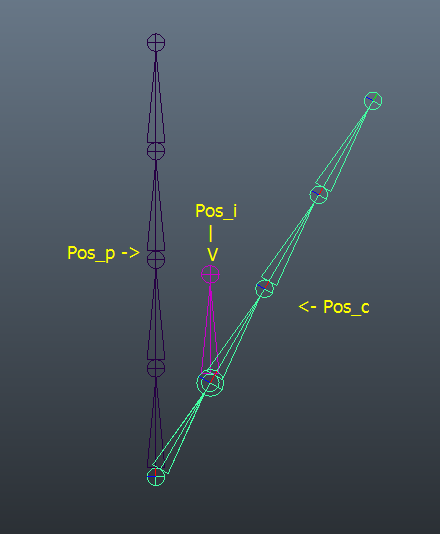
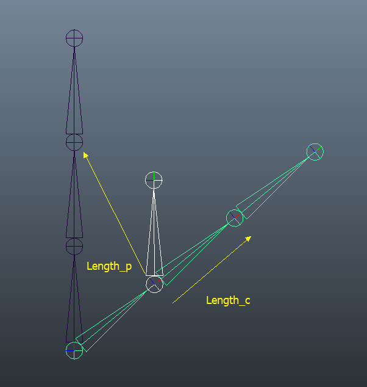
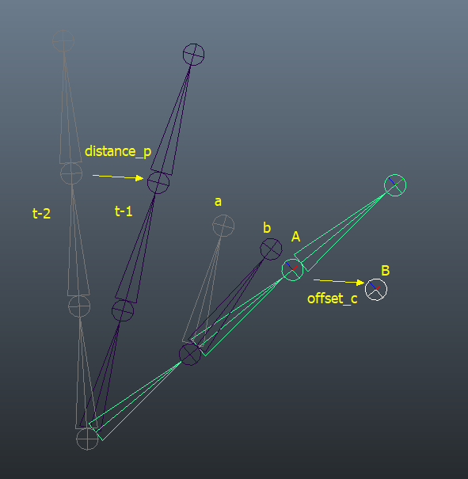
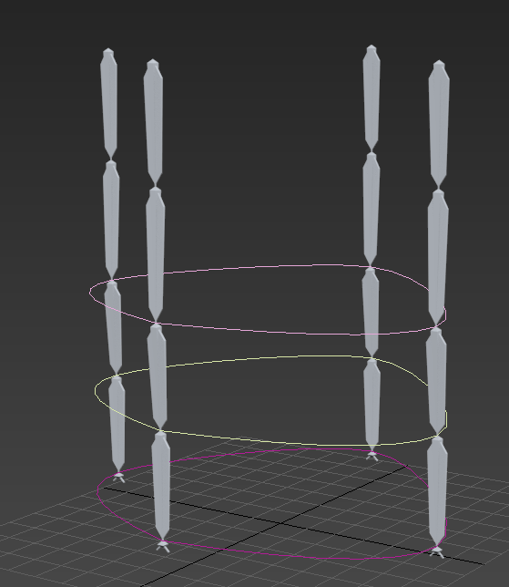
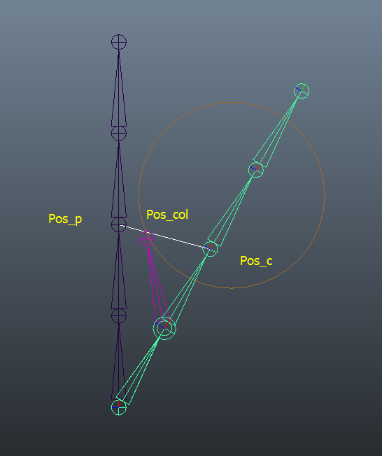
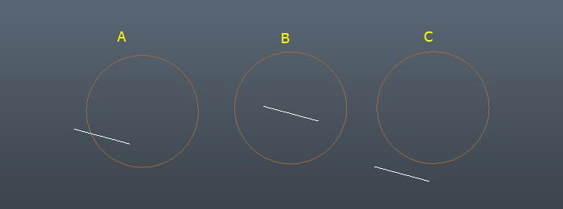
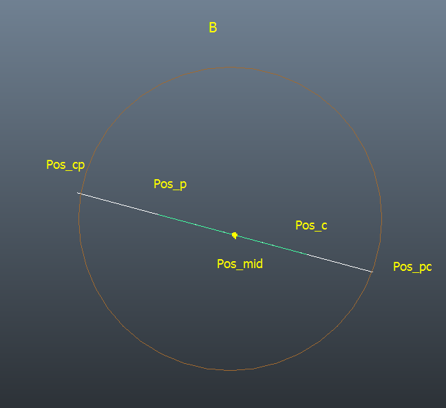
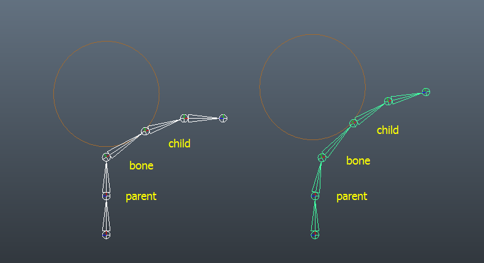

Spring Magic这个飘带工具，都是基于 Lerp 插值算法的思路，利用一个系数，将骨骼当前角度和目标角度之间以一个系数（摆动值和拧转值）来计算出一个中间值。并通过将这个简单计算方法在整个骨骼链上随着时间递进而反复迭代，产生了整体上跟随的效果。  
我将通过这篇文章，来和大家详细讨论 Spring Magic 各个功能的实现原理，帮助大家更好的理解这个工具。

#### 摆动

1. 将上一帧的位置 Pos_p 和当前帧的位置 Pos_c 同时作为瞄准约束（Look At Constraint）的目标点，然后通过摆动系数，来调节两个目标点的权重值，使骨骼最终指向 Pos_i
2. 将此算法在整个骨骼链上随着时间递进而反复迭代，即可产生链条逐级摆动跟随的效果。

这一算法的最大优势在于2点：

1. 摆动幅度可控，Pos_i 始终落后于 Pos_c，而不会超越，在结果上表现为不会过度摆动产生弹簧效果。动画师可以更好的用旋转根骨骼的方式来调节所需效果。
2. 可以通过记录最后一帧的 Pos_i 位置信息并作为第一帧的 Pos_p ，即可产生循环动画，无需为循环做额外特殊处理。

#### **拧转**

通过在骨骼 Y 轴方向上额外放置一个目标点，来作为瞄准约束（Look At Constraint）的 Up Node，并将其根据拧转参数进行和摆动类似的的插值迭代计算，来产生子骨骼在 X 轴方向随父骨骼偏转的效果。由于指定了轴向，所以这也是为什么工具要求必须是 +X 轴指向子骨骼。

#### 伸缩

检测骨骼末端上一帧的位置和当前位置之间的距离 Length_p，并将其除以骨骼自身长度 Length_c，可以获得一个系数来评估骨骼移动速度，并结合用户配置的伸缩系数，来将其子骨骼的 TX 位移值进行一个偏移，产生骨骼链随着运动速度而产生伸缩变化的效果

#### 惯性

设当前帧为 t，记录 t-2 帧（上上帧）和 t-1 帧（上一帧）的骨骼末端位置，来计算出该骨骼上一帧的移动方向和距离 distance_p，并以此来将骨骼原本的目标点 A 推至点 B，使得计算出的骨骼旋转结果也会从 a 偏向 b。同时将 B 在下一帧以一个系数缓慢回复到 A 点，来使骨骼瞄准结果会保持超过 A 一定时间，再回到原本 A 的位置，产生来回摆动的惯性效果。

这个是 1.7 版本新完成的功能，后续还需要测试改进。

#### 姿态拟合

计算前记录计算范围内的骨骼位置，然后再计算时每一帧都将骨骼的默认目标位置 （也就是上图种的 A 点）移至之前记录的动画位置，使计算的结果会偏向原本的动画 Pose

#### 风和爆炸

根据放置的风向物体，每一帧都获取它的方向，并根据风力值，来对骨骼的默认目标位置 （也就是上图种的 A 点）进行一个偏移，来使得整个骨骼链产生一个偏移。

为了模拟风的波动效果，使用了 sin 函数，最大最小风力对应了 sin 的波峰和波谷，频率对应了 sin 的频率

爆炸是将骨骼位置和爆炸点标记体位置间的连线作为风的方向，由于每个骨骼和爆炸点的位置关系不同，便会产生同心方向的偏转，来模拟爆炸效果。

#### 骨骼关联

通过点击关联按钮，根据选择的骨骼生成一条曲线，其中记录了骨骼的关联信息，计算时如果发现场景中有这种类型的曲线存在，便会读取其中的信息，来获知哪些骨骼会互相影响。然后通过将这些骨骼的默认目标位置相互进行位置约束（ Position Constrain ），来产生互相影响目标点偏移的效果，进而互相影响最终的骨骼偏转计算结果，产生相互关联的效果。

#### 碰撞原理

如下图所示，在上一帧位置 Pos_p 和当前帧目标位置 Pos_c 之间生成一个线段 Line_pc，并检测 Line_pc 与 碰撞体是否有交点，如有交点 Pos_col，则先将 Pos_c 的位置更新为 Pos_col 的位置，然后再通过瞄准约束旋转骨骼，即可避免骨骼插入碰撞体。如将 Pos_c 和 Pos_p 都设为 Pos_col，则会产生瞬间吸附的效果，在处理较快移动的碰撞体是效果较好。

- 碰撞体的选择

以胶囊体作为碰撞体，有如下优势：

1. 凸形几何体
2. 计算量小，算法简单成熟
3. 易于贴合动画角色肢体形态

- Line_pc 和胶囊体碰撞的几种状况：

A    一端在胶囊内，一端在外，有一个碰撞点  
B    两端均在内，无碰撞点  
C    两端均在外，无碰撞点  
D    两端均在胶囊体圆柱体边沿，有无数个碰撞点（未在图中标出）  
E    Line_pc 长度为 0，无碰撞点（未在图中标出）

其中状况 D 在实际应用中非常罕见，即使发生也可以轻微调节动画来避免，故不做考虑

状况 E 会被算法认为无碰撞，但由于在实际应用中骨骼链总是跟随着父物体运动，即使父物体只有很细微的运动也足以产生一个线段来计算碰撞，所以不必太过担心。

A 为常规碰撞状况，C 为常规无碰撞状况，在这里需要着重讨论情况 B 的处理

对于 B 的解决方案如图，沿着 Pos_p -> Pos_c 方向和 Pos_c -> Pos_p 方向分别做两条射线，检测这两条射线与胶囊体的碰撞，并获得两个碰撞点 Pos_cp 和 Pos_pc。再通过比较这两点到线段中点 Pos_mid 之前的距离，将 Pos_p 和 Pos_c 都移到距离 Pos_mid 最近的那个点，即可将骨骼偏转到碰撞体外侧。之所以要取最近的那个点，是为了防止骨骼随着时间变化而在碰撞体两侧反复抖动。

如两条射线均无碰撞结果，则表明线段在碰撞体之外，即 C 所示的状况。

用 Pos_mid 来作为距离参照是为了稳定计算结果，减少抖动现象。

- 碰撞的父骨骼处理（张力）

如图可见在引入张力后，骨骼链变形更均匀，且与实际情况更吻合

具体实现方法是，每一帧不光记录下子骨骼 child 的位置，也记录下子骨骼是否有碰撞，如果有碰撞，则在下一帧计算中对骨骼 bone 引入张力。张力即在 bone 的 默认目标位置上按权重叠加一个 child 的位置，使 bone 的默认目标位置朝向 child 产生一个偏移，这样在计算 parent 旋转的时候即会根据偏移值进行一个额外的旋转，产生力量传递的效果  
注：张力的参数调节在 1.7 版本中不可见

- 拆帧

对于移动非常快速的碰撞体，可能在一帧的时间内即穿过骨骼链，使得骨骼链完全无法捕捉碰撞。对此的解决方案为将一帧拆为若干小帧，对每一小帧来计算碰撞，因为帧可以拆分到 1 毫秒，故可以应对任何实际应用情况。  
但如果进行拆帧计算，相应的 spring ratio 和twist ratio值，还有张力值都要按比例缩小，以在正常播放时获得正确效果。拆帧完后会烘焙并清理非整数关键帧。另外，拆帧计算会成线性比例增加计算时间。

#### 结束语

根据本篇的讲解，大家可以体会到，简单的插值算法，通过反复迭代，并且对目标点进行操纵，即可模拟各种复杂的骨骼链随动效果，而且由于惯性，风，碰撞等等这些对目标点的偏移是可以简单叠加的，所以很容易的就能实现各种效果的混合应用，产生非常丰富的计算结果。

希望能抛砖引玉，给大家提供些灵感，来产生更多更好的工具

谢谢！

白严宾  
2021.01.30