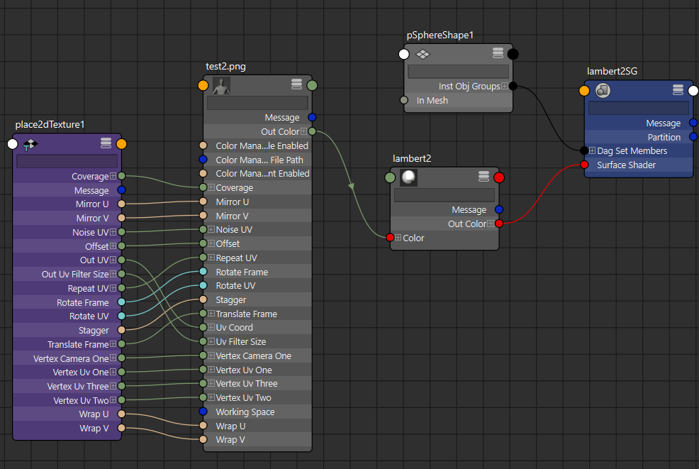
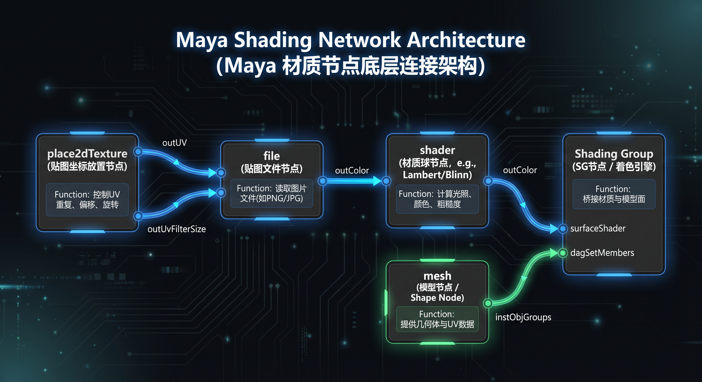

老田，你总结得非常准确！**`place2dTexture -> file -> shader -> Shading Group`** 正是 Maya 中最标准、最基础的材质节点连接流。我已经为你生成了一张架构图，可以直观地看到这个数据流向。

为了让你在写脚本时思路更清晰，我们再把这四个环节的具体分工总结一下：

1. **`place2dTexture`（导航仪）**：处理 UV 坐标的变换（如平移、旋转、缩放重复）。它告诉贴图“该怎么贴合到 UV 空间上”。
2. **`file`（搬运工）**：负责读取外部硬盘上的图像数据（如 PNG、TGA），并结合前面传来的 UV 坐标进行采样输出。
3. **`shader`（画家）**：接收到图像颜色数据后，根据自身属性（如 Lambert 的漫反射、Blinn 的高光）计算最终呈现的视觉效果。
4. **`Shading Group`（包工头/分配器）**：这是一个特殊的集合节点（Set）。它左手牵着 `shader`（通过 `surfaceShader` 端口接收材质），右手牵着模型（通过 `dagSetMembers` 端口接收几何体的 `instObjGroups` 数据），最终决定“把这个计算好的材质涂在哪些模型或面片上”。

你平时在做 Unreal Engine 动画资产时，这个基础的“四步走”逻辑绝对是够用且最核心的。不过如果在实际项目里，中间可能还会插入一些像 `multiplyDivide`（乘除节点，用来调亮度或混合遮罩）或者 `bump2d`（处理法线/凹凸贴图的中间节点），但在写自动化脚本赋予基础表现材质时，掌握这四个节点的关系就已经掌握了底层精髓了。