# 常用节点
## plusMinusAverage 加减平均值节点:

属性：

sum:求和，Subtract:相减，Average：平均

此节点只是属性链接，并非全局，打组之后仍能移动组，不同于约束

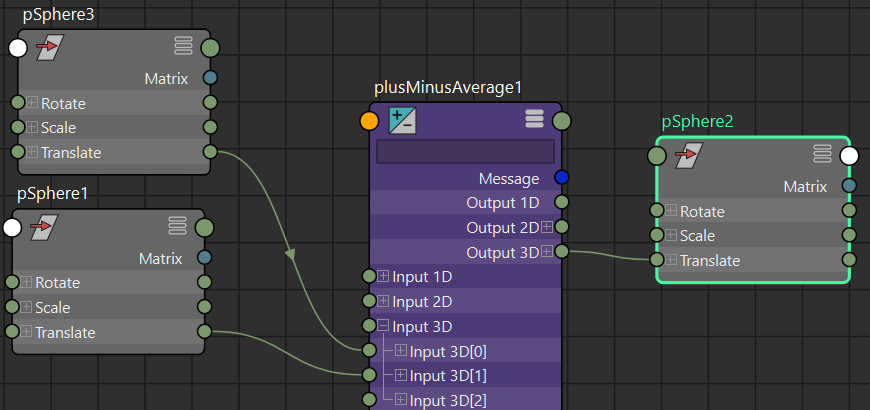

## multiplyDivide：乘除节点

属性：Multiply：相乘，Divide：相除，Power：幂

- clamp:钳制节点

该节点设置最大值和最小值用来限制属性

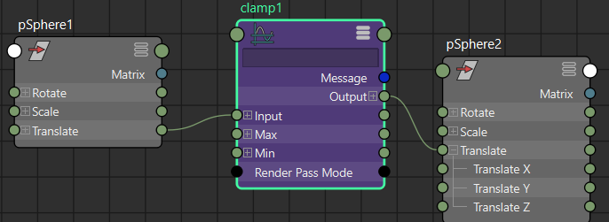

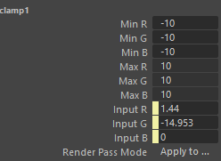

## blendColors：混合颜色节点

属性：blender：混合值，当设置为0时输出值为color2，当设置为1时输出值为color1

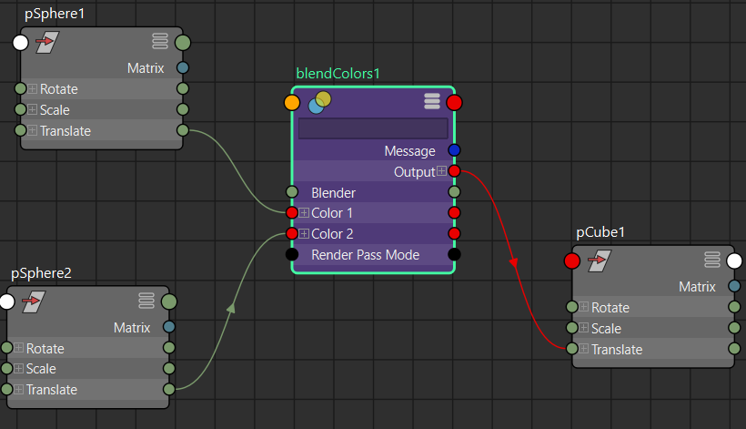

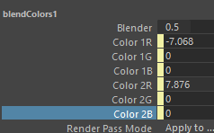

## blendTwoAttr：融合两种属性

属性：Attributes Blender :属性混合

该节点用法类似blendColors，但是只能混合两个属性值，Attributes Blender值可以大于1或者小于0

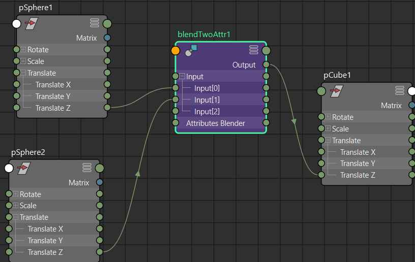

## choice：选择节点

属性：Selector：选择器

该节点，通过选择器值的修改，输出节点值会匹配值到对应输入节点值，选择器值0对应输入0

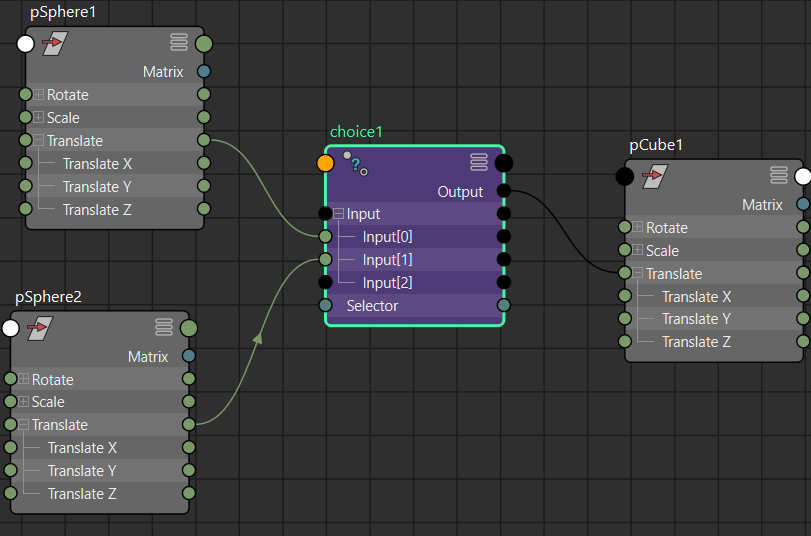

## condition：条件节点

通过比较运算第一项和第二项的布尔输出结果，来执行操作

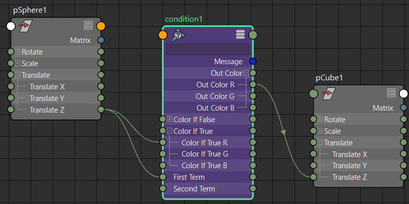

截图案例中，通过比较运算球1的Z轴位移是否大于零，来判断盒子1的Z轴位移是否跟随球1

## setRange：设置范围节点

Set Range 是一个实用程序节点，允许您获取一个范围内的值（OldMin，OldMax），并将它们映射到另一个范围(Min,Max)。通过调整Value值来控制Min，Max之间的值

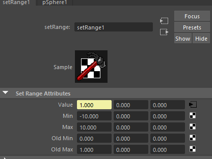

## reverse:反向节点

当输入节点值为1的时候输出节点值为0，反之亦然，常用于IKFK切换时链接约束节点

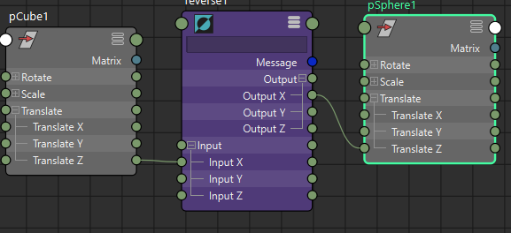

## angleBetween夹角节点

求出两个物体对于世界中心（0，0，0）之间的夹角

求出两个物体对于第三个物体之间的夹角

先求出两个物体对于第三个物体的世界坐标之差，利用这两个差值求出他们之间的夹角

节点原理：

三维向量夹角的计算公式如下：

- 假设两个三维向量分别为：$a=(x_1,y_1,z_1)，b=(x_2,y_2,z_2)$,两个向量的夹角为$θ$.

-  向量的模（norm或module）是指向量 $\vec {AB}$的长度，记作$|AB|$, 空间向量$(x,y,z)$，模长是：$|AB| = \sqrt{x^2+y^2+z^2}$

- 向量a的模：$|a|=√(x1^2+y1^2+z1^2)$。

- 向量b的模：$|b|=√(x2^2+y2^2+z2^2)$。

- 从几何角度看，点积是两个向量的长度与它们夹角余弦的积, $a·b=|a|·|b|·cosθ$.

- 两个向量的点乘：a$·b=(x1x2+y1y2+z1z2)=|a|·|b|·cosθ$。

- 则有：$$cosθ=(x1x2+y1y2+z1z2)/[√(x1^2+y1^2+z1^2)*√(x2^2+y2^2+z2^2)]$$。

上述公式均是以空间三维坐标给出的，如果令坐标中的z=0，则得到平面向量的计算公式。两个向量夹角θ的取值范围是：[0,π]。当夹角为锐角时，cosθ>0；当夹角为钝角时,cosθ<0。

##  distanceBetween :间距节点

节点原理：

设A(x1,y1,z1),B(x2,y2,z2),则A,B之间的距离（模）为

|AB|=√[(x1−x2)^2+(y1−y2)^2+(z1−z2)^2]

##  vectorProduct 向量积节点

- 包含点积，叉积，向量矩阵积，点矩阵积，向量归一化

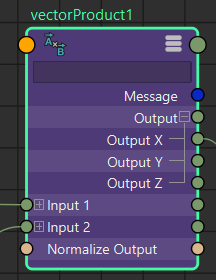

##  pairBlend 配对混合节点

将一对对象的属性进行混合插值，输出给另一个对象

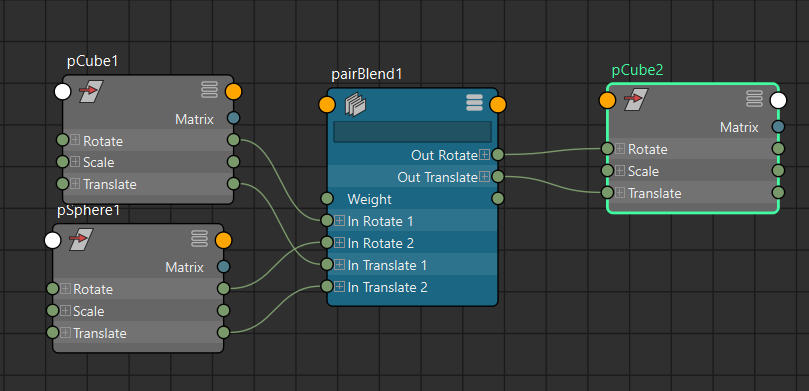

# 矩阵节点
## HoldMatrix 保持矩阵

保持矩阵节点实际上对其矩阵输入不执行任何作;它基本上是 Matrix 数据类型的节点等效项。如果你有一个完全静态的矩阵，你想把它保存在你的设置中，以便通过管道连接到另一个节点，这是最便宜的方法。
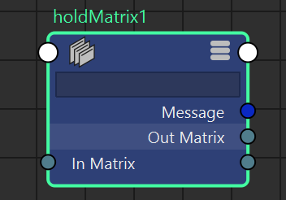
##  composeMatrix：组合矩阵节点

将一个物体的位移，旋转，缩放，斜切，旋转顺序转化成一个矩阵节点

节点属性：

##  decomposeMatrix分解矩阵节点

用于将物体的矩阵分解成平移，旋转，缩放，斜切，四元数等若干属性

节点属性

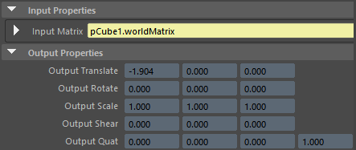

##  inverseMatrix：逆矩阵节点

效果相当于给矩阵*-1，移动，旋转，缩放，斜切全都反向。

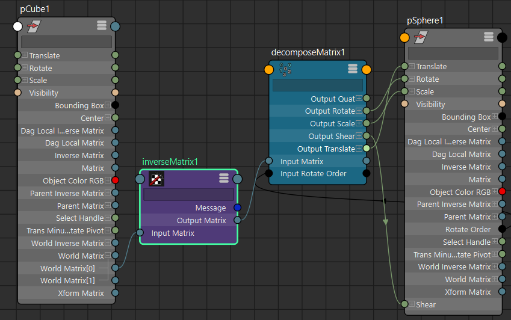

##  multMatrix：多重矩阵，相乘矩阵

下图案例中，将方块世界矩阵和球体父对象逆矩阵相乘，然后分解矩阵输出给球。造成的效果是球完全跟随盒子位移，旋转，缩放，而球的父对象（组group）变换效果被父对象逆矩阵抵消掉，无法控制球体.

注意：矩阵相乘的输入矩阵顺序不能互换，否则结果完全不同，本案例是使用方块世界矩阵乘以球体父对象逆矩阵，不能反过来。

- 案例：矩阵实现父子约束效果0

利用节点属性Offset Parent Matrix，来实现父子约束，

composeMatrix_OffSet组合矩阵节点用来提取pSphere1的世界逆矩阵数值作为约束偏移，先使用decomposeMatrix分解pSphere1的世界逆矩阵，再通过composeMatrix组合成矩阵作为约束偏移

pickMatrix节点可选择约束移动，旋转，缩放，斜切。

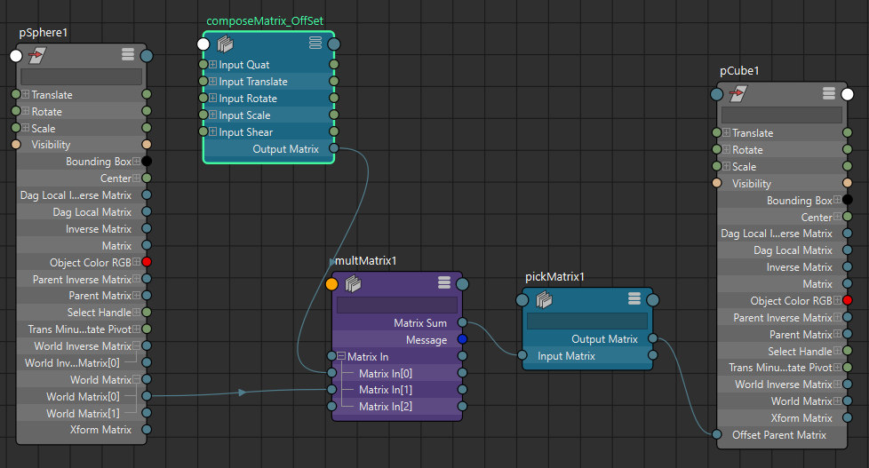

## pickMatrix节点属性

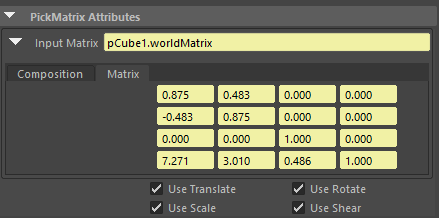

- 案例：矩阵实现父子约束效果1

multMatrix节点，输入0：偏移矩阵。输入1：约束物体的世界矩阵。输入2：被约束物体的父对象逆矩阵。

composeMatrix1节点作为偏移矩阵，此处Z轴位移偏移3个单位

# 四元数节点

四元数在 3D 图形学中非常重要，尤其是在处理旋转时。相比欧拉角（Euler Angles），它们可以避免万向节死锁（Gimbal Lock）的问题，并能提供更平滑的插值。

下面我将逐一解释你提到的每个节点。

### 理解四元数

在我们开始之前，简单理解一下四元数的概念会很有帮助。一个四元数可以表示为一个四维向量

(x,y,z,w)

，它代表了围绕一个特定轴的旋转。

- (x,y,z)
    
    部分代表旋转轴。
    
- w
    
    部分代表旋转量。
    

---

### 四元数运算节点

这些节点用于执行四元数的基本数学运算。

#### 1. **quatAdd**

- **功能**：将两个四元数相加。
    
- **工作原理**：它将两个输入四元数的对应分量（x, y, z, w）进行逐个相加。
    
    - `outputQuat.x = input1Quat.x + input2Quat.x`
        
    - `outputQuat.y = input1Quat.y + input2Quat.y`
        
    - `outputQuat.z = input1Quat.z + input2Quat.z`
        
    - `outputQuat.w = input1Quat.w + input2Quat.w`
        
- **用途**：虽然在数学上直接相加四元数并不代表旋转的叠加，但在某些特定的算法中（例如，对一系列四元数进行平均化处理）可能会用到。
    

#### 2. **quatSub**

- **功能**：将两个四元数相减。
    
- **工作原理**：它将输入四元数1的每个分量减去输入四元数2的对应分量。
    
    - `outputQuat.x = input1Quat.x - input2Quat.x`
        
    - ...以此类推。
        
- **用途**：与 `quatAdd` 类似，它在标准旋转操作中不常用，但在特定的数学或自定义解算器中有其用武之地。
    

#### 3. **quatProd**

- **功能**：计算两个四元数的乘积。
    
- **工作原理**：四元数的乘法是不可交换的（`A * B != B * A`），它代表了旋转的叠加或连接。如果你先应用旋转 B，再应用旋转 A，其效果等同于应用 `A * B` 这个单一旋转。
    
- **用途**：这是四元数操作中最重要的节点之一。它用于将多个旋转组合成一个最终的旋转。例如，你可以用它来叠加一个基础旋转和一个附加的摆动旋转。
    

#### 4. **quatSlerp**

- **功能**：执行球面线性插值（Spherical Linear Interpolation）。
    
- **工作原理**：`Slerp` 可以在两个四元数（即两个旋转姿态）之间创建平滑的球面路径插值。它通过一个 `t` 参数（范围从 0.0 到 1.0）来控制插值的程度。当 `t=0` 时，输出为第一个四元数；当 `t=1` 时，输出为第二个四元数。
    
- **用途**：这是创建平滑旋转动画的关键。例如，当一个角色的头部需要从朝向A平滑地转向朝向B时，`quatSlerp` 是最理想的选择。它能确保旋转以恒定的角速度进行。
    

---

### 四元数属性调整节点

这些节点用于修改单个四元数的属性。

#### 5. **quatConjugate**

- **功能**：计算一个四元数的共轭（Conjugate）。
    
- **工作原理**：它将四元数的向量部分（x, y, z）取反，而w分量保持不变。
    
    - 如果输入是
        
        (x,y,z,w)
        
        ，输出就是
        
        (−x,−y,−z,w)
        
        。
        
- **用途**：共轭在数学上与逆（Inverse）非常相似（对于单位四元数，它们是相同的）。它在某些需要反转旋转方向的计算中很有用。
    

#### 6. **quatInvert**

- **功能**：计算一个四元数的逆。
    
- **工作原理**：一个四元数乘以它的逆，结果是单位四元数（即没有旋转）。对于代表旋转的单位四元数，它的逆与其共轭是相同的。
    
- **用途**：用于“撤销”一个旋转。例如，如果你有一个从父对象继承的旋转，但你希望子对象抵消掉这个旋转，就可以使用该旋转的逆。
    

#### 7. **quatNegate**

- **功能**：对四元数的所有分量取反。
    
- **工作原理**：将四元数的每个分量（x, y, z, w）都乘以 -1。
    
    - 一个四元数
        
        q
        
        和它的负数$$-q$$ 代表的是完全相同的旋转。然而，它们在 `Slerp` 插值中会沿着不同的路径（一个走短路，一个走长路）。
        
- **用途**：主要用于控制 `Slerp` 插值的路径，确保总是沿着最短的路径进行插值。
    

#### 8. **quatNormalize**

- **功能**：将一个四元数归一化（Normalize）。
    
- **工作原理**：它将调整四元数的四个分量，使其长度（模）变为1。一个长度为1的四元数被称为单位四元数。所有代表纯旋转的四元数都必须是单位四元数。
    
- **用途**：在进行一系列数学运算（如乘法、加法）后，四元数可能会因为浮点精度问题而不再是单位长度，这会导致缩放等不期望的变换。`quatNormalize` 可以修正这个问题，确保它仍然是一个纯粹的旋转。
    

---

### 四元数与其它旋转表示法的转换节点

这些节点用于在四元数、欧拉角和轴-角表示法之间进行转换。

#### 9. **eulerToQuat**

- **功能**：将欧拉角（Euler Angles）转换为四元数。
    
- **工作原理**：输入你熟悉的旋转值（例如，`rotateX`, `rotateY`, `rotateZ`），并指定旋转顺序（如 `XYZ`, `YZX` 等），节点会输出一个等效的四元数。
    
- **用途**：这是将 Maya 中标准的欧拉角旋转控制器（比如骨骼或物体的旋转属性）连接到基于四元数的绑定（Rigging）系统中的桥梁。
    

#### 10. **quatToEuler**

- **功能**：将四元数转换为欧拉角。
    
- **工作原理**：它接收一个四元数作为输入，然后输出等效的欧拉角旋转值。同样，你需要指定输出的旋转顺序。
    
- **用途**：当你的绑定系统内部使用四元数进行计算，但最终仍需要驱动一个使用欧拉角的常规旋转属性时，就需要这个节点。
    

#### 11. **axisAngleToQuat**

- **功能**：将轴-角（Axis-Angle）表示法转换为四元数。
    
- **工作原理**：输入一个定义旋转轴的向量（例如，(0, 1, 0) 代表Y轴）和一个旋转角度（例如，90度），节点会输出一个代表该旋转的四元数。
    
- **用途**：当你需要围绕一个任意轴（而不仅仅是X, Y, Z轴）创建旋转时，这种方式非常直观和强大。例如，制作一个绕着斜向杆子旋转的风车。
    

#### 12. **quatToAxisAngle**

- **功能**：将四元数转换为轴-角表示法。
    
- **工作原理**：它接收一个四元数，并将其分解为一个旋转轴向量和一个旋转角度。
    
- **用途**：用于分析或调试一个四元数所代表的旋转。你可以清晰地看到旋转是围绕哪个轴、旋转了多少度。
    

### 总结

|节点|主要功能|常用场景|
|---|---|---|
|**quatProd**|组合/叠加多个旋转|将基础旋转和次级旋转结合起来。|
|**quatSlerp**|在两个旋转间平滑插值|创建流畅的旋转动画，如角色头部转向。|
|**eulerToQuat**|欧拉角 -> 四元数|将控制器的欧拉旋转输入到四元数系统中。|
|**quatToEuler**|四元数 -> 欧拉角|将四元数计算结果输出到物体的旋转属性上。|
|**quatInvert**|反转旋转|抵消父物体的旋转，实现“空间保持”。|
|**quatNormalize**|保持单位长度|在多次运算后修正四元数，避免缩放错误。|
|**axisAngleToQuat**|轴角 -> 四元数|围绕任意自定义轴创建旋转。|
|**quatAdd/Sub**|数学加减法|特定高级算法，不常用于常规绑定。|
|**quatConjugate**|计算共轭|与 `quatInvert` 类似，用于反转旋转。|
|**quatNegate**|所有分量取反|控制 `Slerp` 插值的路径。|
|**quatToAxisAngle**|四元数 -> 轴角|分析和调试一个四元数代表的旋转。|

希望这份详细的解释能帮助你更好地理解和使用 Maya 中的这些强大节点！如果你有关于如何将它们组合使用的具体问题，随时可以提问。