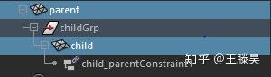
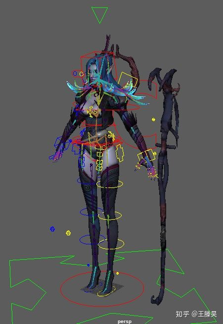
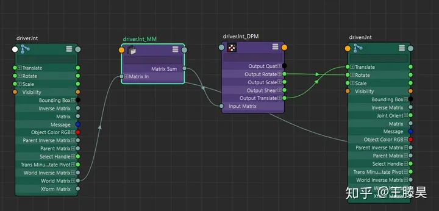
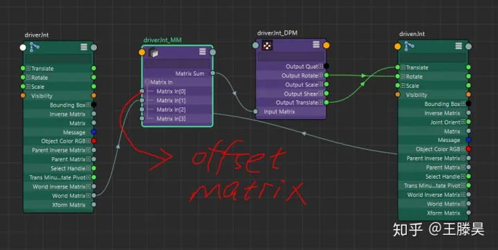
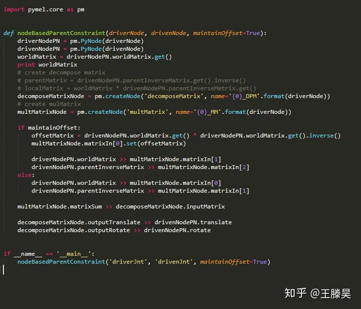
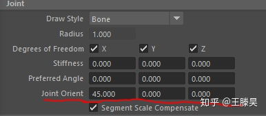
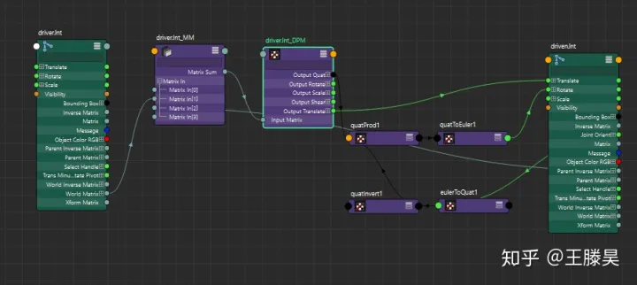
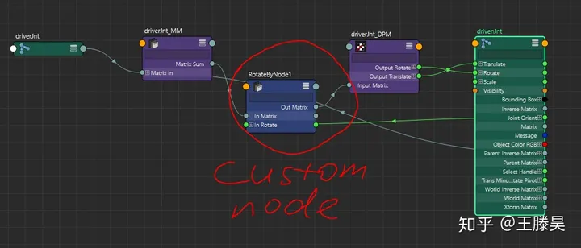

# 基于矩阵运算的父约束

[王滕昊](https://www.zhihu.com/people/wang-teng-hao)[​](https://www.zhihu.com/question/48509984)

"Once you can understand Matrices; I think life in general with CG becomes easier."

作为一名技术美术，无论你是Shading方向，还是Character方向，矩阵运算和线性代数的知识都是你必须掌握的硬技能。在今后的几篇文章里面，我会从矩阵出发，介绍一些大家平时可能不太会关注的，但是如果掌握会有益的知识点。

父约束（Parent Constraint）是一个十分常见的概念，他们在效率上要明显慢于direct attribute connection或者parenting，但是他是唯一可以打破结构上从属关系的方法。

结构上的从属关系

通过“父约束”，child可以无视childGrp而直接被parent约束

通过“父约束”，建立法杖和手的运动从属关系

所以今天的文章要介绍一种基于矩阵运算的父约束，这个方法我认为在效率上是优于Maya自带的Parent Constraint的，但是由于增加多余的节点，可能会导致graph editor的冗余和难于管理。因此对于方法的取舍，完全属于个人喜好。

1. 公式： childWorldMatrix = childLocalMatrix * childParentMatrix

1. 公式：childLocalMatrix = childWorldMatrix * childParentMatrix.inverse()

上述的公式计算是在

1. 公式： offsetMatrix * initParentWorldMatrix = initChildWorldMatrix

1. 公式： offsetMatrix = initChildWorldMatrix * initParentWorldMatrix.inverse()

1. 公式： childWorldMatrix = offsetMatrix * parentWorldMatrix

1. 公式： childLocalMatrix = offsetMatrix *parentMatrix * childParentMatrix.inverse()

对于增加多余的节点，我在以后的文章里面会介绍一种通过特殊的父节点来管理子节点的方法，这在“

代码如下：

最后我要讲一下这个方法在对于骨骼做父约束时存在的一个问题。在Maya的骨骼里面,jointOrient属性是一个单独的矩阵，应用于rotation矩阵之后。

所以要做的就是在我们的矩阵链最后乘以jointOrient的逆矩阵。

如上图，我将jointOrient转换成四元数，求逆，再和原方法求出的四元数做叉乘。这个方法可以很好解决没有偏移差时的结果。但是有偏移差时，上述矩阵链并

**rotateByNode**

[**https://github.com/tenghaowang/Python_Deformer/blob/master/matrixConstraint/rotateByNode.py**](https://link.zhihu.com/?target=https%3A//github.com/tenghaowang/Python_Deformer/blob/master/matrixConstraint/rotateByNode.py)

总结， 使用基于矩阵的父约束，可以完全取代Maya里面内置的parent，point和orient constraints，并且在效率上更佳。这个方法同时也不局限于Maya里，在任何的DCC工具或者引擎里面都可以尝试使用。最关键还是希望大家可以理解其背后的矩阵知识：