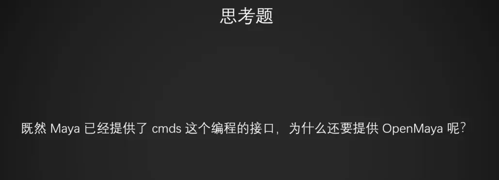
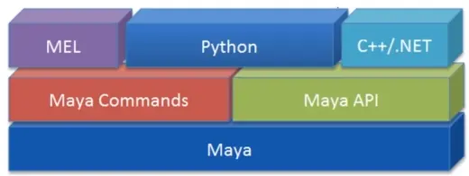
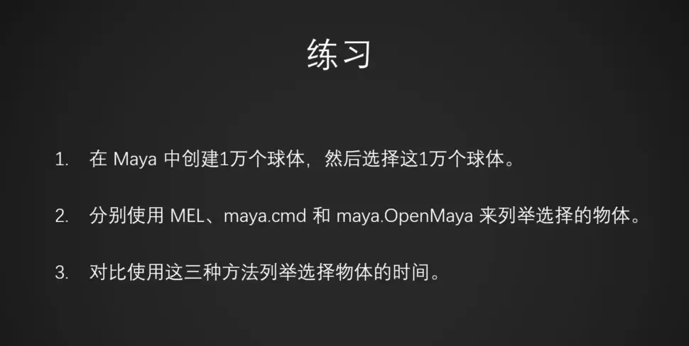
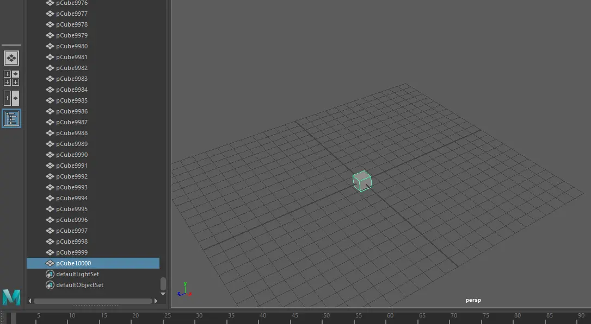
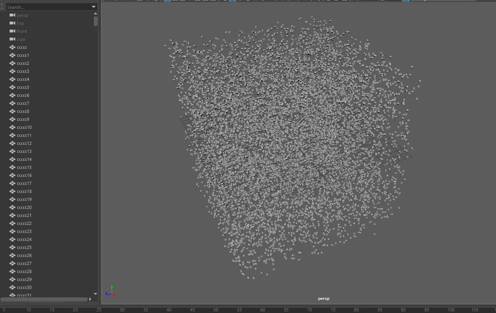
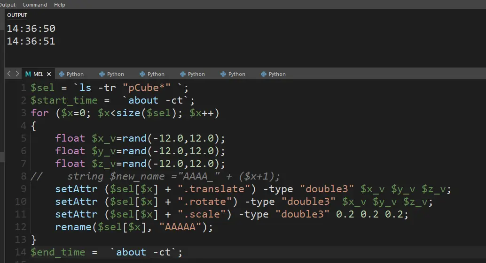
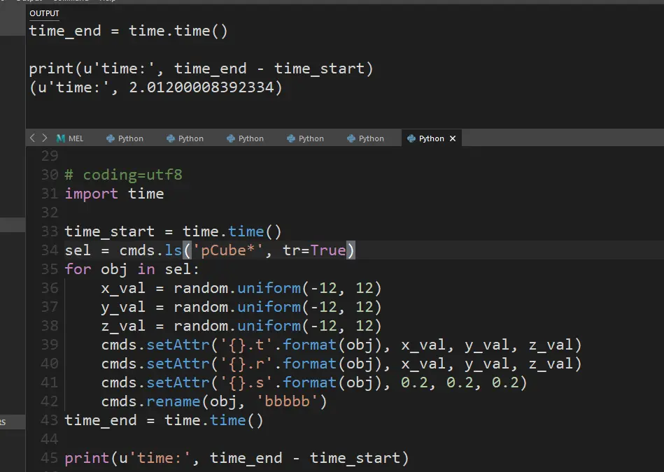
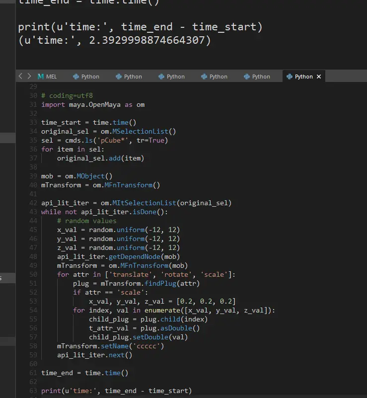

# Maya：第七周


[單壹崽崽](https://www.jianshu.com/u/92cf571d45d7)

关注

2020.01.19 14:50:18字数 189阅读 635



image.png



image.png

OpenMaya 对比 cmds优势：

1.适合插件的开发，因为拥有cmds未公开的功能

2.由于是Maya C++ API的Python库，速度上也会比cmds来的更快

3.在组件级别的对象（点边面），处理的效率会大幅度超越cmds



image.png

测试环境：

对场景中的10000 polyCube 做位置 旋转 随机，缩放统一设置 0.2，并改名字：



image.png



image.png

```python
import maya.cmds as cmds
for i in xrange(0, 10000):
    cmds.polyCube(ch=False)[0]
```

Mel:



image.png

```bash
$sel = `ls -tr "pCube*" `;
$start_time =  `about -ct`;
for ($x=0; $x<size($sel); $x++)
{
    float $x_v=rand(-12.0,12.0);
    float $y_v=rand(-12.0,12.0);
    float $z_v=rand(-12.0,12.0);
//    string $new_name ="AAAA_" + ($x+1);
    setAttr ($sel[$x] + ".translate") -type "double3" $x_v $y_v $z_v;
    setAttr ($sel[$x] + ".rotate") -type "double3" $x_v $y_v $z_v;
    setAttr ($sel[$x] + ".scale") -type "double3" 0.2 0.2 0.2;
    rename($sel[$x], "AAAAA");
}
$end_time =  `about -ct`;
```

由于用的是about -ct 来看的系统时间，可以看到大约是1秒的间隔

Cmds：



image.png

```python
# coding=utf8
import time
time_start = time.time()
sel = cmds.ls('pCube*', tr=True)
for obj in sel:
    x_val = random.uniform(-12, 12)
    y_val = random.uniform(-12, 12)
    z_val = random.uniform(-12, 12)
    cmds.setAttr('{}.t'.format(obj), x_val, y_val, z_val)
    cmds.setAttr('{}.r'.format(obj), x_val, y_val, z_val)
    cmds.setAttr('{}.s'.format(obj), 0.2, 0.2, 0.2)
    cmds.rename(obj, 'bbbbb')
time_end = time.time()
print(u'time:', time_end - time_start)
```

耗时大约2.01秒

Python Api：



image.png

```python
# coding=utf8
import maya.OpenMaya as om
time_start = time.time()
original_sel = om.MSelectionList()
sel = cmds.ls('pCube*', tr=True)
for item in sel:
    original_sel.add(item)
mob = om.MObject()
mTransform = om.MFnTransform()
api_lit_iter = om.MItSelectionList(original_sel)
while not api_lit_iter.isDone():
    # random values
    x_val = random.uniform(-12, 12)
    y_val = random.uniform(-12, 12)
    z_val = random.uniform(-12, 12)
    api_lit_iter.getDependNode(mob)
    mTransform = om.MFnTransform(mob)
    for attr in ['translate', 'rotate', 'scale']:
        plug = mTransform.findPlug(attr)
        if attr == 'scale':
            x_val, y_val, z_val = [0.2, 0.2, 0.2]
        for index, val in enumerate([x_val, y_val, z_val]):
            child_plug = plug.child(index)
            t_attr_val = plug.asDouble()
            child_plug.setDouble(val)
    mTransform.setName('ccccc')
    api_lit_iter.next()
    
time_end = time.time()
print(u'time:', time_end - time_start)
```

大约是2.39秒

结论是看得出常规操作中PythonApi并没有什么优势，

PythonApi。。。未完待续。。。。。。