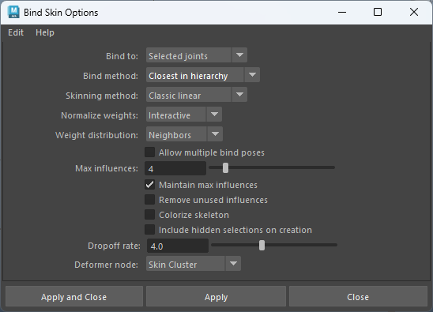
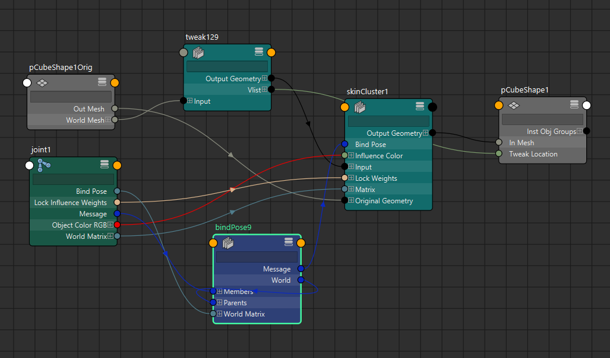

# Joints
## joint 和 transform 之间的区别
- Joint 是 Transform 的“特化子类”，它在 Transform 的所有功能基础上，额外增加了骨骼/关节系统专用的行为和属性，特别是为了支持骨骼动画、蒙皮、IK/FK 等机制而设计的。
- 下面用表格对比最关键的差异（日常 rigging/动画中最常遇到的点）：

| 方面                 | Transform 节点             | Joint 节点（继承自 Transform）                  | 实际影响 / 为什么重要                                           |
| ------------------ | ------------------------ | ---------------------------------------- | ------------------------------------------------------ |
| **节点类型**           | 基础可变换节点                  | transform 的子类型（nodeType = "joint"）       | cmds.nodeType(j, inherited=True) 会看到 joint → transform |
| **旋转的“两套系统”**      | 只有一套：rotate + rotateAxis | 两套：rotate + rotateAxis **+ jointOrient** | jointOrient 是骨骼“本地轴向”的主要控制，rotate 常用于动画                |
| **最终世界矩阵计算**       | [S] × [RO] × [R] × [T]   | [S] × [RO] × [R] × **[JO]** × [IS] × [T] | 多出 JO（jointOrient）和 IS（父 inverse scale）                |
| **段缩放补偿**          | 无                        | 有 segmentScaleCompensate 属性（默认开启）        | 勾选后，父关节缩放时，子关节仍保持原始缩放                                  |
| 冻结变换               | 位移归零，旋转变为世界坐标            | 不冻结位移，旋转移动到JointOrient                   | 做 Orient Joint、Freeze Transformations 时最关键             |
| **IK / FK 系统**     | 一般不直接用作 IK 链             | 是 IKHandle、ikEffector 的核心组成部件            | ikHandle 只能创建在 joint 上                                 |
| **父子 reparent 行为** | 一般不会自动插入 transform       | 如果父子 scale 不一致，常自动插入中间 transform 节点      | 常见 rigging 痛点：reparent 后出现多余 transform1                |
| **preferredAngle** | 无                        | 有（首选角度，用于 IK Solver）                     | IK 求解时的重要参考                                            |


## 骨骼缩放
- 骨骼的缩放并不是骨骼本身的缩放，而是骨骼所影响的顶点的根据蒙皮权重进行缩放。骨骼现实的缩放请使用半径或者调整骨骼显示大小
## GimbalLock（万向锁）
- GimbalLock（万向锁）
	- 骨骼的欧拉旋转基于RotateOrder（旋转顺序），如果旋转顺序是xyz，那么Y轴旋转是X轴旋转的父级，Z轴旋转是XY轴旋转的父级。
	- 
	- 在此情况下如果我们旋转Y轴，那么X轴也会跟着选择换。如果旋转Y轴时X轴和Z轴重合，那么我么就失去了Y轴的控制，这就是万向锁。
	- 
	- 要避免这样的情况出现，就要调整RotateOrder，将最不常用的旋转轴向放置在Y轴。我们无法完全避免万向锁，只能将其出现的程度最小化。 
	- Python： 
```python 
import pymel.core as pm
jnts = pm.selected()
for jnt in jnts:
	jnt.rotateOrder.set(1)
```
- 要排除关节旋转的优先级（用到最多的轴向），将关节旋转的最低优先级轴放在RotateOrder的中间，最高优先级的轴放到RotateOrder的最后，剩下一个轴放在最前面
## 关节方向
- Orientation（关节方向）
	- OrientJoint命令自动对齐骨骼
		- 使用OrientJoint命令来对齐骨骼朝向，末端骨骼没有子骨骼所以使用OrientJointToWorld来对齐父骨骼。
		- 
		- 其中主轴PrimaryAxis是指向子骨骼的轴向，次轴SecondaryAxis和次轴世界方向SecondaryAxisWorldOrientation配合使用来调整关节方向
	- 手动对齐骨骼
		- 
		- 
		- 手动调整骨骼局部旋转轴以后会导致旋转轴和位移轴还有缩放轴朝向不同，因为调整局部旋转轴后会导致旋转轴属性产生数值
		- 
		- 所以要使用Mel或者Python命令来解决这一问题
		- Mel：`joint -e -zso`
		- Python：`cmds.joint(edit = True, zeroScaleOrient = True)`
		- 执行命令后位移轴朝向便与旋转轴朝向相同了
## 分段补偿
- Segment Scale Compensate（分段缩放补偿）
	- 
	- 勾选此选项，缩放父骨骼，其子骨骼不会跟随父骨骼缩放
# Skin
## Bind Skin
### 菜单
- 
	- Binds to ：绑定骨骼选项
		- joint hierarchy：骨骼层级
		- selected joints：选中的骨骼，推荐使用
		- object hierarchy：非骨骼蒙皮
	- Bind Method：蒙皮方法
		- closest distance：距离骨骼最近的顶点，会导致手部骨骼影响腿部模型权重
		- closest in hierarchy：会根据骨骼层级判断最近的点，将影响限制在父对象和子对象之间。避免手部骨骼影响腿部模型权重，推荐使用
		- heat map：热量贴图，使用热量扩散技术分发权重。使用骨骼发射热量，根据热力衰减判断影响范围，如果有骨骼不在模型网格之内，会被忽略。推荐使用。
		- geodesic voxel：测地线体素，一般不使用。
	- skin method：
		- classic linear：经典线性，推荐使用
		- dual quaternion：双四元数
		- weight blended：权重混合，在经典线性和双四元数模式之间权重混合
	- Normalize weight：标准化权重
		- None：不做标准化权重，会导致顶点总权重大于1
		- interactive：交互式标准化权重，每次修改权重都会进行标准化，推荐使用，所见即所得。
		- Post：一旦模型再次变形，进行标准化权重
	- Weight distribution：修改权重时，分配权重。如在平滑权重值时，顶点权重进行自动标准化，增加和减少的权重如何分配。
		- distance：根据距离分配权重
		- Neighbors：根据层级分配权重，推荐使用
### 计算

- 重要信息
	- 原始模型顶点位置（OrigMesh节点储存）
	- 蒙皮后顶点位置调整（tweak节点储存）
	- 关节初始位置(bindpose节点储存)
	- 顶点权重（skinCluster节点储存）
	- 关节实时位置（joint节点储存）
- 算法：
	- Maya 中 SkeletalMesh 顶点的实时位置 = 绑定姿态位置 先“除以”绑定时关节矩阵，再“乘以”当前关节矩阵，最后按权重线性（或双四元数）混合所有影响关节的结果。
## Unbind Skin

- history：如何处理历史（skin cluster）
	- delete history：删除skin cluster
	- keep history：保持skin cluster，下次蒙皮时启用，常用于蒙皮后修改骨骼
	- bake history：将蒙皮bake到模型Pose