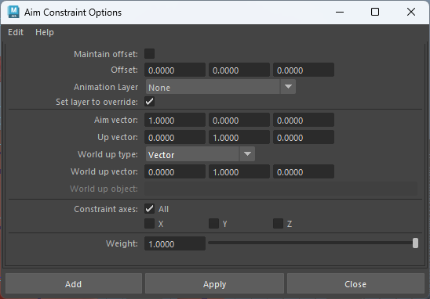

# Connection
## ConnectionEditor
- 将一个属性链接给另一个属性，或者链接到其他许多属性
- 
## NodeEditor

# Constraint

在 Maya 的绑定（rigging）工作中，**parentConstraint** 节点是使用频率最高的一种约束节点之一。它同时约束**平移（translate）**和**旋转（rotate）**，让被约束物体（constrained object）像“子物体”一样跟随一个或多个目标物体（target），但又**不继承缩放（scale）**，也不真正加入层级关系（hierarchy）。

而 **Interpret Type**（也叫 **Interp Type** 或 **Rotation Interpolation Type**）这个属性，**只在有多个目标（multi-target）的情况下才会真正起作用**，它决定 Maya 如何在多个目标的旋转之间进行**插值（interpolation）**。

这个属性位于 parentConstraint 节点的属性编辑器中，通常默认是 **Average**。

### Interpret Type 的四个选项详解（2024-2026 版本 Maya 一致）

| 选项       | 中文常称          | 旋转插值方式                                                                 | 何时最容易出现翻转（flipping）问题 | 实际生产中最常用场景                                                                 | 优缺点简评 |
|------------|-------------------|-------------------------------------------------------------------------------|-------------------------------------|---------------------------------------------------------------------------------------|------------|
| **Average**       | 平均              | 对所有目标的四元数（quaternion）做简单算术平均，然后归一化（normalize）      | 最容易翻转（尤其目标旋转差异大时）   | 多个目标权重接近相等，且旋转不会跨过180°的情况（如多 IK 手柄平均跟随）               | 最直观，但翻转风险最高 |
| **Shortest**      | 最短路径          | 在球面（slerp）上选择“最短弧”路径进行插值，避免翻转                           | 几乎不会翻转                        | **最推荐的默认选项** 手臂/腿/脊椎/脖子/道具的多目标切换（如 IK/FK blend、space switch） | 防翻转效果最好，动画最干净 |
| **Longest**       | 最长路径          | 故意走“最长弧”路径（绕大半圈）                                               | 故意制造翻转                        | 极少数特殊需求（如故意要走长路径的循环动画、机械齿轮等）                             | 基本没人用，除非特意要翻 |
| **Cache**         | 缓存（No Flip）   | 使用上一帧的结果作为参考，尽量保持连续性（类似“no flip”机制）                | 翻转概率最低，但可能出现“卡住”或延迟 | 极长序列动画、模拟跟随、nCloth/布料/头发绑定时防止突然翻转                           | 稳定但有时不精确，适合动态系统 |

### 核心原理（为什么会有翻转问题？）

- Maya 内部 parentConstraint 的旋转部分是用 **四元数（quaternion）** 来计算的（避免欧拉角 gimbal lock）。
- 四元数 q 和 -q 代表**同一个旋转**（方向相反的四元数等价）。
- 当做**平均**时，如果某个目标的四元数符号翻了（q 变成 -q），平均结果就会突然跳到对面，导致被约束物体“瞬间翻转180°”或“跳轴”。
- **Shortest** 会自动检测并选择“最接近前一帧”的符号，极大降低翻转。
- **Cache** 更激进，直接参考历史帧结果，适合连续播放的动态绑定。

### 生产中实际选择建议（2025-2026 主流做法）

场景 | 推荐 Interpret Type | 为什么
---|---|---
单目标 parentConstraint（最常见） | 无所谓（属性不起作用） | 只看 Maintain Offset 是否打开
IK/FK 切换、space switch（多个控制器 blend） | **Shortest**（强烈推荐） | 切换时不会突然翻转，动画曲线最干净
多个 IK 手柄平均跟随（如脊椎多段、尾巴） | **Shortest** 或 **Average**（看情况） | 如果旋转差异小用 Average 更“平均”；差异大必须 Shortest
布料/头发/动态物体跟随骨骼 | **Shortest** 或 **Cache** | 防止播放时突然翻面
故意要“翻转”效果（如机械翻转门） | **Longest** | 很少见

### 小技巧 & 注意事项

1. 创建 parentConstraint 时，在 Option Box 里直接把 **Interp Type** 改成 **Shortest**，养成习惯（尤其是多目标情况）。
2. 如果已经创建好了约束，想改类型 → 选中约束节点 → Attribute Editor → 改 Interpret Type。
3. 当权重快速从一个目标切到另一个目标时（例如 IK/FK switch 从 0→1），**Shortest** 能大幅减少“pop”或翻转。
4. 如果你发现即使设了 Shortest 还是翻 → 检查目标物体的**关节方向（joint orient）**是否一致，或者目标旋转是否本来就接近180°对立。
5. **Cache** 模式下，如果时间轴跳跃很大（比如从第1帧直接跳到第1000帧），可能会丢失连续性，导致意外旋转。

一句话总结：

**在有多个目标的 parentConstraint 中，99% 的情况下把 Interpret Type 设成 Shortest，就能最大程度避免讨厌的旋转翻转，让绑定更稳定、动画更顺滑。**
## AimConstraint
在 Maya 的绑定（rigging）工作中，aimConstraint（瞄准约束）节点是专门用来让一个物体（constrained object）始终“瞄准/指向”另一个物体（或多个物体的平均位置）的旋转约束。它只影响旋转（rotate），不影响平移（translate）和缩放（scale），是创建眼睛、头部、枪管、相机、机械瞄准、IK 极向量辅助、脊椎/尾巴跟随等经典绑定的核心工具。

- 目标约束建议不要开始MaintainOffset，有出错风险
- Maya 用两个向量来完整决定被约束物体的最终朝向：
	- AimVector：被约束对象指向约束对象器的轴向
	- UpVector：被约束对象指向上方的轴向
	
	- WorldUpType：世界向上类型，用于确定UpVector的朝向，常用ObjectUp和ObjectRotationUp，其他的不常用。包含：
		- SceneUp：场景上方
		- ObjectUp：对象作为上方，使得被约束物体的UpVector指向该对象的位置。（通过对象位移来控制ObjectUp）
		- ObjectRotationUp：对象旋转作为上方，使得被约束物体的UpVector等于该对象的某个轴向的向量。（通过对象的选转来控制ObjectUp）
		- Vector：世界向量
		- None：不使用任何外部 Up 参考向量来稳定旋转。对象只保证 Aim 轴对准目标，但不会对“扭转（Twist）”方向做约束。
	- WorldUpVector：世界向上方向，定义“什么叫向上”。

**计算顺序**（官方描述）：
- 先旋转物体，让 aimVector 精确指向目标位置（从 constrained 物体 pivot 到 target 位置的向量）。
- 再围绕这个 aimVector 轴扭转物体，让 upVector 尽量接近 worldUpVector。
- 如果 aimVector 和 upVector 平行（共线），约束会失效或翻转 → 这是最常见的 bug 原因。
### 案例
- 使用SceneUp制作眼睛瞄准约束，当眼睛向上旋转超过90度时会发生翻转跳变，这是因为他想强制执行UpVector。
- 
- 要解决这个问题，将世界向上类型设为ObjectUp，并将控制器作为对象，在角色绑定中可以使用头部控制器。
- 
- 但是这样的话眼睛左右旋转超过一定角度 ，还是会发生偏转
- 
- 所以要使用ObjectrotationUP 并指定对象和向上的轴
- 