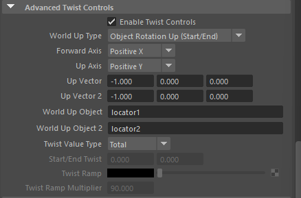

# SingleChainIK、RotatePlaneIK、SpringIK
- 下面用表格对比三者的核心区别、适用场景、优缺点，以及创建方式（基于 Maya 官方文档和 rigging 社区共识，2024-2025 版本行为一致）：

|项目|Single Chain IK (SC Solver)|Rotate Plane IK (RP Solver)|Spring IK (Spring Solver)|
|---|---|---|---|
|**Maya 节点类型**|ikSCsolver|ikRPsolver|ikSpringSolver|
|**创建命令**|ikHandle -sol ikSCsolver|ikHandle -sol ikRPsolver（默认）|ikHandle -sol ikSpringSolver（需先 load plugin）|
|**关节链长度推荐**|2~4 个关节（最适合 2~3 关节，如 elbow-wrist）|2~4 个关节（手臂、腿的标准选择）|3~10+ 个关节（适合长链如脊柱、尾巴、触手）|
|**Pole Vector / 弯曲方向控制**|无（只有 Twist 属性控制整体扭转）|有（Pole Vector 属性 + 操纵器，控制肘/膝指向）|有（Pole Vector + Spring Angle Bias 等额外参数）|
|**末端 effector 目标**|位置 + 方向（尽量匹配 IK Handle 的 rotate）|只位置（方向由 Pole Vector / Twist 决定）|只位置（方向更平滑，由弹簧模拟决定）|
|**弯曲平面稳定性**|容易翻转（flipping / gimbal lock 问题多）|非常稳定（平面固定，Pole Vector 控制弯曲方向）|极稳定（角度均匀分布，像“弹簧”一样自然弯曲）|
|**扭转控制**|Twist 属性（整体链扭转）|Twist Disc 操纵器 + Pole Vector|Twist + Spring Angle Bias（更柔和的扭转）|
|**典型用途**|简单两关节链、尾巴末端、简单手指、旧 rig|手臂、腿、标准 humanoid rigging（最常用）|脊柱、长尾巴、蛇、鞭子、触手、头发链、卡通软体|
|**优点**|计算最简单、最快 适合短链|控制精确、可预测 Pole Vector 直观|长链弯曲自然、不扭曲 角度均匀分布|
|**缺点**|翻转问题严重（尤其动画时） 无 Pole Vector|长链（>4关节）弯曲不均匀、易出现“Z”字形|计算稍慢 需加载插件（默认不加载） 参数较多|
|**翻转问题**|高（常需额外脚本防翻转）|低（Plane 固定）|极低（弹簧模拟天然防翻转）|
|**导出/游戏引擎**|兼容性好（简单）|兼容性好（最标准）|兼容性一般（很多引擎不支持 Spring Solver）|

### 详细说明

1. **Single Chain IK (ikSCsolver)**
    - 最基础的 IK，只求末端尽量到达 IK Handle 的**位置和方向**。
    - 没有 Pole Vector，所以肘/膝的弯曲方向**完全由 Maya 自动决定**，动画过程中容易突然翻转 180°（经典的 "elbow flip" 问题）。
    - 适合：两关节链（如 ankle-to-toe、finger tip）、不需要精确控制弯曲方向的部位。
    - 现在 rigging 中**很少主动用**，除非极简 rig 或特定需求。
2. **Rotate Plane IK (ikRPsolver) – Maya 默认、最常用**
    - 末端 effector **只求位置**，不强制匹配方向 → 旋转更可预测。
    - 引入 **Pole Vector**（极向量）：一个 locator 或 ctrl，控制整个链的弯曲平面（像肘指向哪里、膝盖指向哪里）。
    - 还有 **Twist Disc**（扭曲圆盘）操纵器，可以在 IK Handle 上直接转动链的整体扭转。
    - 适合：手臂（shoulder → elbow → wrist）、腿（hip → knee → ankle）、大多数标准人物绑定。
    - 这是 95% 以上现代 Maya rig 的主力 IK Solver。
3. **Spring IK (ikSpringSolver)**
    - 像“弹簧”一样模拟物理：关节间的**角度尽量均匀分布**，弯曲更自然、平滑。
    - 有 Pole Vector，但额外有 **Spring Angle Bias**（弹簧角度偏置）、**Damping**（阻尼）等参数，能模拟软体/弹性效果。
    - 特别适合**长关节链**（脊柱 8~12 节、尾巴、蛇形、鞭子、触手、长脖子）。
    - 使用前需加载插件：
		- mel：`loadPlugin "ikSpringSolver";`
		- Python：`cmds.loadPlugin('ikSpringSolver')`
    - 缺点：计算开销稍大；导出到游戏引擎时常需 bake 或替换成 RP/Spline。

### 快速选择指南（rigging 时怎么选）

- **手臂 / 腿（3 关节）** → Rotate Plane IK（加 Pole Vector Ctrl）
- **两关节简单链** → Single Chain IK（或 RP 也行）
- **脊柱 / 尾巴 / 长链** → Spring IK（或 Spline IK）
- **如果需要曲线路径** → 用 Spline IK（不在本次讨论，但常与 Spring 对比）

一句话总结：

**SingleChain**：简单但容易翻转，已过时 **RotatePlane**：标准王者，Pole Vector 控制肘膝方向 **Spring**：长链神器，弯曲最自然像弹簧

如果你在做具体部位（如手指、脊柱）的 rig，想知道怎么结合 FK/IK switch 或 Pole Vector 设置，可以继续描述你的关节链，我可以给更针对性的创建步骤和注意事项～
# splineIK、Ribbon

**在 Maya 绑定（rigging）中，Spline IK（ikSplineSolver）和 Ribbon（Ribbon Spine / Ribbon Deformer 系统）** 是两种处理**长链弯曲部位**（如脊柱、尾巴、脖子、触手、鞭子等）的常用方法。它们都能实现平滑的弯曲和扭曲，但底层原理、控制方式、变形质量和适用场景有明显差异。

下面用表格对比两者最关键的区别（基于 Maya 社区、教程和实际生产经验，2025–2026 年主流做法）：

|项目|Spline IK (ikSplineSolver)|Ribbon (Ribbon Spine / NURBS Surface + Follicle)|谁更胜一筹？（常见共识）|
|---|---|---|---|
|**核心机制**|Maya 内置 IK Solver：关节链“跟随”一条 NURBS 曲线（自动生成或自定义）|NURBS 平面（ribbon 表面） + Follicle / uvPin / closestPointOnSurface → 关节“钉”在表面上|—|
|**控制方式**|动曲线的 CVs / clusters / control points|动 ribbon 的控制关节 / locator（通常 3–5 个 ctrl）|Ribbon 更直观（像捏布条）|
|**扭曲（Twist）控制**|有 Advanced Twist Controls（World Up Type、Up Vector、Auto Twist）|极强、自然（ribbon 表面自带连续扭转，无翻转）|Ribbon 明显更好|
|**末端稳定性**|末端关节容易“滑动”或不完全贴合曲线末端（stretch off 时明显）|末端固定钉住，无滑动问题|Ribbon 胜|
|**弯曲平滑度**|非常平滑，跟随曲线参数化分布|极平滑 + 体积保持更好（表面变形更均匀）|Ribbon 略胜（尤其高分辨率网格）|
|**体积保持 / Squash & Stretch**|一般（需额外 stretch 属性 + scale 补偿）|优秀（ribbon 表面天然保持体积，变形更“肉感”）|Ribbon 胜（卡通/有机体）|
|**关节旋转控制**|有（可 FK 混合，但 twist 较难精细）|较弱（纯 IK 式，难以独立旋转单个关节）|Spline IK 胜（如果需要局部旋转）|
|**翻转 / Gimbal 问题**|低（曲线决定路径）|极低（表面方向始终连续）|两者都好，Ribbon 更稳|
|**FK/IK Switch**|容易（blend FK rotate 与 Spline 影响）|较复杂（需额外 blend 或 dual setup）|Spline IK 更容易|
|**Stretch 支持**|原生支持（ikHandle.stretch 属性）|支持，但需额外 setup（scale along surface）|Spline IK 更直接|
|**性能 / 节点数量**|中等（曲线 + clusters + ikHandle）|较高（NURBS surface + 多 follicle + deformers）|Spline IK 更轻量|
|**导出 / 游戏引擎**|一般（常需 bake 成 FK）|较差（follicle 不被多数引擎支持，需 bake）|Spline IK 略好|
|**典型用途**|脊柱、尾巴、触手（需要 stretch + 简单 ctrl 时）|脊柱、脖子、尾巴（追求顶级变形质量、卡通风格）|—|
|**现代趋势（2025+）**|仍常用，但常结合自定义 matrix spline|越来越流行（尤其游戏/影视追求“肉感”变形）|Ribbon 更受欢迎|
### SplineIK的扭曲

### 详细优缺点小结

**Spline IK 的优势**：

- Maya 内置，无需额外插件或复杂节点。
- Stretch 简单开启。
- 适合需要明确“路径跟随”的情况（如蛇沿地面爬、绳子甩动）。
- 与 FK 混合容易（用 blendColors 驱动 rotate）。
- 控制点少，Outliner 干净。

**Spline IK 的缺点**：

- 扭曲控制不够精细（Advanced Twist 虽好，但长链扭转仍可能不均匀）。
- 末端容易“漂”或不紧贴（尤其 scale 非 1 时）。
- 体积压缩/膨胀时变形不够自然（像“骨头拉伸”而非“肉体挤压”）。

**Ribbon 的优势**：

- **扭曲超级自然**（ribbon 表面提供连续的 up-vector 和 tangent，扭转零翻转）。
- 变形质量最高（网格贴合表面，体积保持好，适合卡通/有机生物）。
- 末端固定，整体更稳定。
- 常用于“高端 demo reel”或影视级 rig。

**Ribbon 的缺点**：

- Setup 复杂（创建 NURBS plane → follicle → parent joint → twist deformer 等）。
- 节点爆炸（一个好 ribbon 脊柱可能 20–50+ 节点）。
- Stretch 需要额外处理（用 curveInfo + scale 驱动）。
- FK 混合麻烦（常需 dual joint chain 或 matrix blend）。

### 实际选择建议（2025–2026 年主流做法）

- **标准人物脊柱（humanoid）**：Ribbon 优先（变形更好，动画师爱）。
- **需要强 stretch + 简单控制**：Spline IK（或 hybrid：Ribbon + Spline IK 结合）。
- **游戏导出（Unreal/Unity）**：Spline IK 更友好（bake 后干净）；Ribbon 常 bake 成 FK。
- **超长链（尾巴 15+ 节）**：Ribbon 或自定义 matrix spline（避免内置 Spline 的局限）。
- **混合使用**：很多高级 rig 用 **Ribbon 主驱动 + Spline IK 辅助**（Ribbon 管变形，Spline 管 stretch/path）。

一句话总结：

**Spline IK 是“路径跟随型 IK”，简单直接但扭转和体积一般；Ribbon 是“表面变形型系统”，控制更自然、扭曲顶级、变形最肉，但 setup 复杂。** 现代 rigging 趋势越来越偏向 **Ribbon**（或 Ribbon + matrix 优化），尤其追求高质量变形的项目。
