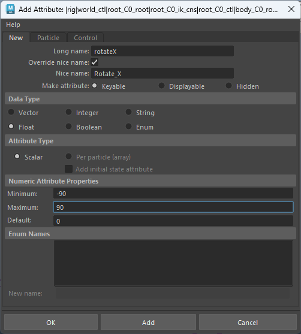
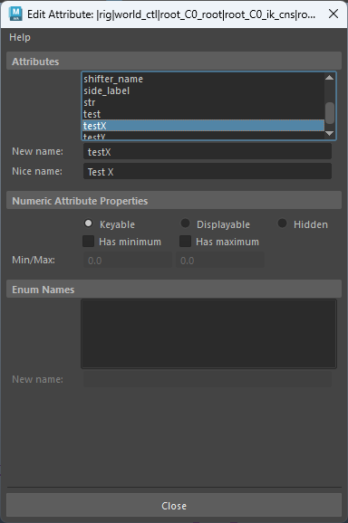
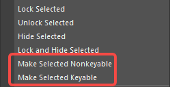

# 控制器的创建
- 创建控制器并将其平移和旋转对齐到骨骼，此时控制器的位移和旋转属性都不为零。我们冻结变换，数值为0，但是发现控制器冻结变换会导致控制器的局部位移轴和局部旋转轴都变为了世界轴向，这不是我们所要的效果。
- 因此我们要在控制器的上层打组Group，使用OffsetGroup作为变换的载体。并将OffsetGroup的变换属性锁定隐藏，使其无法修改。
- 
- 然后再使用控制器来约束骨骼。
# 控制器的合并
- 我们有两个控制器，想要将其合并为一个
- 
- outline中开启shapes，将控制器分解为transform和shape两部分
- 选择方向控制器的shape节点和圆形控制器的transform节点
- 
- 如果直接执行父子关系，会导致子对象多出一个transform节点
- 
- 运行Python：`pm.parent(shape = True, relative = True)`，得到结果
- 
- outline中关闭shapes
- 
# 添加属性
- 添加属性

- LongName：属性长名称，命名规范用驼峰命名：`thisIsAnAntribute`
- NiceName：属性栏显示名称，可自动生成，也可以勾选覆盖来自定义
- Keyable：属性显示在属性栏，可以被剋帧
- Displayable：属性显示在属性栏，不可以被剋帧
- Hidden：属性被隐藏，不可以被剋帧，不显示在属性栏。
# 编辑属性

- 可以属性栏选择属性右键修改属性是否可剋帧
- 
- 添加代理属性，可以在控制器上添加一个属性代理另一个控制上的属性，他们之间是链接的共享属性
```python
pc.addAttr(longName= "IK_FK_Switch", proxy="arm_ikfk_l_ctrl.IK_FK_Switch")
```
- 意思是在当前选择的控制器上添加属性 IK_FK_Switch ，代理的是 arm_ikfk_l_ctrl 控制器的 IK_FK_Switch 属性

# 修改控制器颜色

# 控制器影响另一个控制器形状

- 将大控制器的部分顶点创建Cluster，并作为小控制器子对象，隐藏Cluster。就可以实现控制器影响另一个控制器形状
- 
# 控制器标签和上下选取控制器

- 使用TagAsController为控制器打控制器标签
- 先选择子控制器再选择父控制器使用ParentController来实现控制器使用上下键来快速选取，无视层级关系。
# OffsetParentMatrix 
- 可以将控制器的transform移动到他的OffsetParentMatrix ，就可以不是用偏移组，直接得到0变换的控制器了

- 代码
```python
import pymel.core as pc

objs = pc.selected()

for obj in objs:
	obj.matrix >> obj.offsetParentMatrix
	obj.matrix // obj.offsetParentMatrix
	obj.translate.set([0,0,0])
	obj.rotate.set([0,0,0])
	obj.scale.set([1,1,1])
```