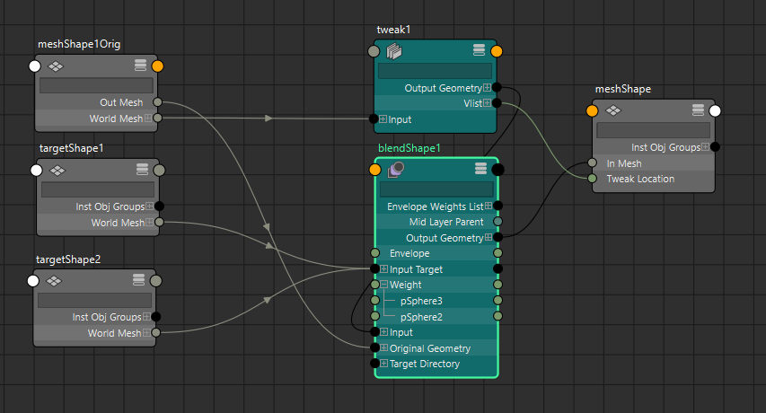
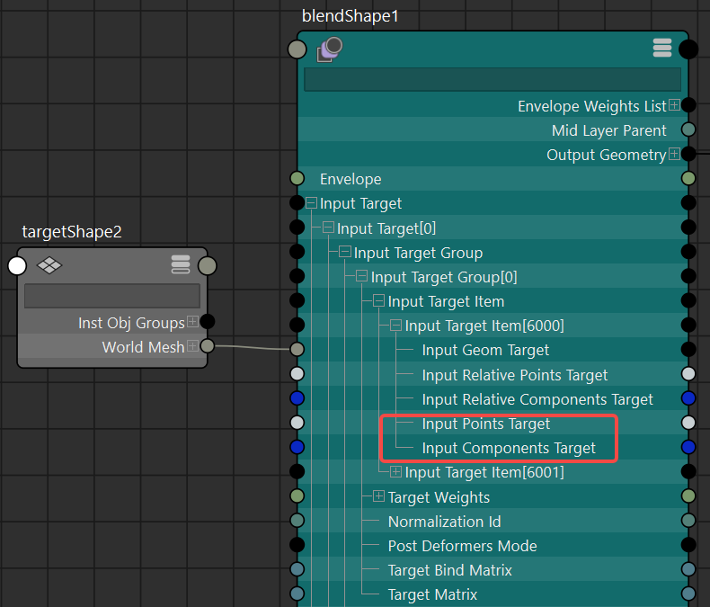
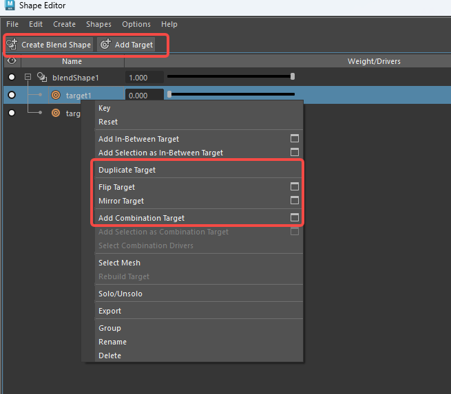

**Blend Shape（融合变形 / 混合形状）** 是 Maya 中最经典、最广泛使用的**形状动画变形器**，尤其在**面部表情、口型同步、肌肉 corrective shape**等领域几乎是行业标准。

下面从概念 → 使用 → 核心原理 → 优缺点 → 注意事项给你完整介绍（基于 Maya 2025-2026 现状）。

其中target连接到 blendshape 节点的 InputGeomTarget 属性，InputPointsTarget是目标顶点相对原始顶点的变换向量，InputComponentTarget是目标顶点的编号

### 1. 基本概念与术语

| 术语（英文）               | 中文常用称呼                | 含义                                      |
| -------------------- | --------------------- | --------------------------------------- |
| **Base Object**      | 基础模型 / 基体             | 被变形的那个原始几何体（通常是中性表情的头）                  |
| **Target Object**    | 目标形状 / 目标体            | 你手工编辑（或 ZBrush 雕）出来的各种表情/口型/矫正形状        |
| **Origin Object**    | 原始模型 / 复制自Base Object | 用来记录原始模型信息                              |
| **Blend Shape Node** | blendShape 节点         | Maya 内部实际计算融合的核心节点（一个节点可管理几十上百个 target） |
| **Weight**           | 权重 / 滑块               | 每个 target 对应的强度（通常 0~1，部分情况可超 1 或负值）    |
| **In-between**       | 中间形状                  | 权重在 0~1 之间的过渡形状                         |
| **Tweak**            | 调整节点                  | 用于在变形后调整原始模型顶点位置                        |

### 2. 创建 Blend Shape 的标准流程（最常用方式）

1. 复制基础模型多次（Duplicate）
2. 对每个复制品分别编辑成想要的表情（smile、frown、A口型、眯眼……）
3. 选择顺序：**所有 target 先选 → 最后 shift+选 base**
4. 执行：**Deform → Blend Shape**（或 Anim Deform → Blend Shape）
5. 结果：在 base 的历史栈中出现一个 **blendShape1** 节点
6. 在 **Channel Box** 或 **Blend Shape Editor** 中出现一堆滑块，每个对应一个 target 的权重

### 3. 核心原理（技术层面怎么算的）

Blend Shape 的本质是**顶点级别的线性插值（Linear Interpolation）**，非常简单粗暴但极其有效。

数学公式（针对单个顶点）：

最终位置 = Base位置 + Σ (Weightᵢ × (Targetᵢ位置 - Base位置))

用更直白的语言：

- Maya 首先记住每个 target 相对于 base 的**顶点偏移量**（delta = target_vertex - base_vertex）
- 当你把某个 target 的 weight 调到 0.7 时，就把这个 delta × 0.7 加到 base 的对应顶点上
- 如果同时开多个 target（比如 smile 0.6 + squint 0.4），就把所有带权重的 delta 向量**相加**
- 最后得到的就是混合后的新顶点位置

**关键特性：**
- 它是**逐顶点独立计算**的（per-vertex）
- 插值是**线性**的（linear），没有考虑体积保持、旋转等非线性因素（这也是为什么有时会塌陷或穿帮）
- 计算发生在 **deformer 历史栈** 的某个位置（通常建议放在 skinCluster 前面）

### 4. Blend Shape 的两大经典使用顺序（变形顺序）

| 顺序               | 推荐场景                               | 优点                                   | 缺点                               |
|--------------------|----------------------------------------|----------------------------------------|------------------------------------|
| **Blend Shape → Skin**（前置，最常见） | 面部表情、口型、大部分角色动画         | 表情相对骨骼独立，容易做 corrective    | 骨骼转动大时可能出现轻微塌陷       |
| **Skin → Blend Shape**（后置）         | corrective blend shape（修复蒙皮塌陷） | 可以针对骨骼变形后的问题做针对性修正   | 权重管理更复杂，性能稍差           |

**现代 pipeline 主流做法**（2025-2026）：
- 主要表情库 → Blend 前置
- 几十个 corrective shapes → Blend 后置 + 用 **Delta Mush** 辅助保持体积

### 5. 优缺点一览

**优点**
- 艺术家友好：直接雕刻想要的样子，不用调骨骼权重
- 可叠加：多个形状任意线性组合
- 支持权重绘制（Paint Blend Shape Weights Tool）
- 支持 in-between targets（中间目标）
- 可用于 corrective、表情、肌肉、布料褶皱等
- Shape Editor 管理非常方便（Maya 2016+）

**缺点**
- **必须拓扑完全一致**（顶点数、顺序相同）
- 线性插值 → 大幅度混合时容易体积丢失、塌陷、穿帮
- 目标形状太多（>50-100个）性能明显下降（尤其是高面数）
- 不支持非线性变形（扭转、弯曲等需要其他 deformer 配合）

### 6. 常见进阶技巧与问题解决（2025 实用）

- 体积塌陷 → 加 **Delta Mush** 或用 **Pose Space Correctives**
- 性能卡顿 → 把主要表情用 Blend，单个高精度 corrective 改用 **Morph deformer**
- 想非线性混合 → 用 **poseInterpolators** 或 Bifrost/Alembic 做非线性 blend
- 导出到游戏引擎 → 常用 FBX + 多个 Blend Shape（Unity/Unreal 支持）
- 负权重 / 超范围 → 打开节点属性中的 **support negative weights**
### 7. ShapeEditor

- CreateBlendShape：创建blendshape节点
- AddTarget：为blendshape节点添加目标体
- DuplicateTarget：复制目标体
- FlipTarget：反转目标体
- MirrorTarget：镜像目标体
- AddCombinationTarget：添加合并目标体
- 使用流程：
	- CreateBlendShape创建blendshape节点
	- AddTarget为blendshape节点添加左侧微笑目标体
	- DuplicateTarget复制左侧微笑目标体
	-  FlipTarget反转该目标体，生成右侧微笑目标体
	- 选择左右侧两个微笑目标体点击AddCombinationTarget，添加合并目标体，用于修正两个微笑时嘴唇中间位置的形变

## 相关笔记

- [9.0-HippyDrome身体articulation参考资料](../进阶/9.0-HippyDrome身体articulation参考资料.md) —— 本篇讲 blendShape 的节点机制，那篇是 Brian Tindall《The Art of Moving Points》的理论体系（Three Curve Principle / the Math of 10）与素模变形参考素材，即「做出什么形状」的审美判断依据
- [11.0-修形CorrectiveShapes能力提升指南](../解决方案/11.0-修形CorrectiveShapes能力提升指南.md) —— blendShape 作为修形手段的实战选型