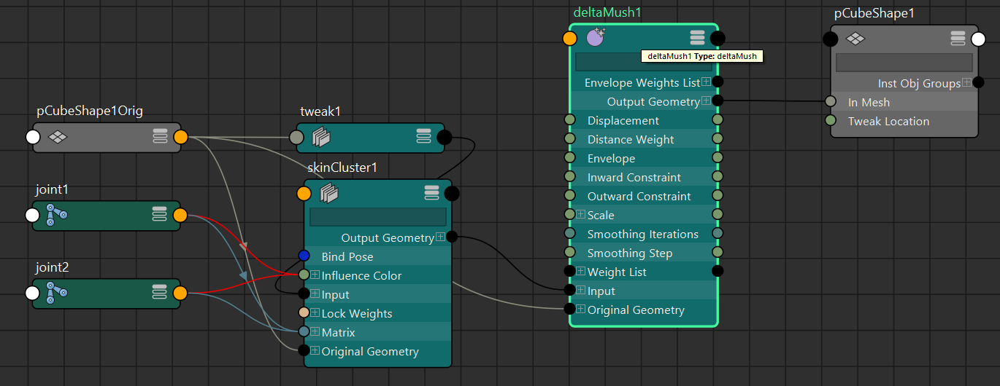

**Delta Mush**（也常写成 DeltaMush 或 delta mush）是 Autodesk Maya 中一个非常实用的**后置平滑/体积保持变形器**，从 Maya 2016 开始正式引入，至今（2025-2026）仍是角色绑定（rigging）和蒙皮（skinning）清理的标配工具之一。

它专门解决蒙皮后常见的**塌陷、鼓包、体积丢失、关节处穿帮**等问题，尤其在肘部、膝盖、肩膀、脖子等大角度弯曲区域特别有效。

### 核心原理（最容易理解的版本）

Delta Mush 的工作方式可以拆成三个步骤：

1. **在参考姿势（通常是 Bind Pose）预先计算并记住“细节偏移”（Deltas）**  
   Maya 先把原始网格做一次平滑（smooth），然后记录每个顶点从“平滑版”到“原始版”的偏移向量（delta = original - smoothed）。  
   → 这步捕捉了模型的**局部高频细节**（皱纹、肌肉线条、指甲等）。

2. **应用其他变形器后（skinCluster、joint 转动等），再次平滑一次**  
   所有前面的变形（比如关节旋转导致的塌陷、拉伸）都先执行完。  
   然后 Maya 用同样的平滑算法再把网格“抹平”一次，把那些坏的变形 artifact（塌陷、鼓包）尽量去掉。

3. **把步骤1记住的细节偏移重新加回去**  
   把预存的 deltas 按权重加回当前平滑后的网格上。  
   → 结果就是：坏的整体变形被平滑掉了，但原来的局部细节（体积感、褶皱）被尽可能保留。

数学上它是一种**低通滤波 + 细节恢复**的过程（low-pass filter + detail preservation），本质是让网格“趋近于原始形状的平滑版本”，同时保留高频细节。

官方论文（SIGGRAPH 2014）：Delta Mush: Smoothing Deformations While Preserving Detail  
核心思想就是“先抹平问题，再把好细节贴回去”。

### 与其他工具的对比（2025-2026 常用视角）

| 项目               | Delta Mush                              | Corrective Blend Shape                  | Pose Space / RBF Correctives            | 谁更常用？                              |
|--------------------|-----------------------------------------|-----------------------------------------|-----------------------------------------|-----------------------------------------|
| 体积保持能力       | 很好（自动）                            | 非常精准（艺术家手动雕）                | 精准 + 姿态依赖                         | Delta Mush 最省力                       |
| 性能开销           | 低（GPU友好）                           | 中等（目标多时卡）                      | 中高                                    | Delta Mush 胜出                         |
| 需要手动工作量     | 很少（调几个参数 + 画权重）             | 高（每个姿势都要雕一个 shape）          | 中等（需设置驱动）                      | Delta Mush 最快上手                     |
| 适用范围           | 全局或局部蒙皮清理                      | 特定关节特定角度的精准修复              | 复杂多维度关节驱动                      | 先 Delta Mush，修不掉再 corrective      |
| 与 Blend Shape 冲突| 如果放在 Blend 后会平滑掉 blend 效果    | 无冲突（常后置）                        | 可结合                                  | 注意顺序！                              |
| 典型位置           | SkinCluster 之后                        | Skin 之后或 Blend 之后                  | 依赖驱动节点                            | —                                       |

### 实际使用最常见的位置与参数（推荐设置）

**推荐变形顺序**（现代 pipeline）：
- Blend Shape（主要表情） → Skin Cluster → Delta Mush → Corrective Blend Shape（少数吃性能的） → Jiggle 等

**创建方式**：
1. 选择网格（或部分顶点）
2. Deform → Delta Mush（或 □ 打开选项）

**关键参数（Attribute Editor）**：
- **Envelope**：整体强度（0~1，默认1）
- **Smoothing Iterations**：平滑次数（默认5-10，越大越平滑，但细节丢失风险高）
- **Distance Weight** / **Point Weight**：控制平滑权重（通常默认就好）
- **Stretch / Compress Resistance**：抗拉伸/压缩（调高可更好保持体积）
- **Pin Border**：固定边界（常开，避免边缘乱飞）

**权重绘制**（Paint Delta Mush Weights Tool）：
- 白 = 完全生效（修复塌陷）
- 黑 = 完全关闭（常用于手指、脸部 blendshape 区，避免平滑掉表情细节）

### 小结一句话

**Delta Mush = “智能平滑 + 细节恢复器”**  
它让蒙皮看起来更自然、更有体积感，同时大大减少手动 corrective blend shape 的数量，是现代 Maya 角色 rigging 的“救命工具”之一。
