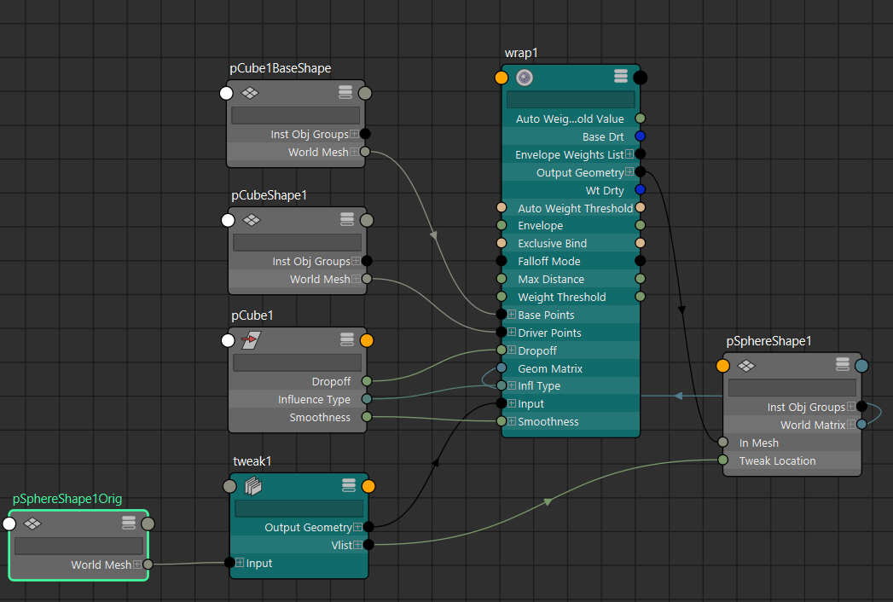

**Wrap Deformer（包裹变形器 / Wrap 变形）** 是 Maya 中一个非常实用的**“跟随式”变形器**，它让一个（或多个）几何体（称为 **influence object / 影响物体**）来驱动另一个几何体（**deformed object / 被变形物体**）的形状变化。

最经典的比喻：  
**Wrap ≈ “用自定义形状的低精度笼子（或表面）来控制高精度模型”**  
它本质上是一个**自定义几何体的 Lattice（晶格）**，但比标准 Lattice 更灵活，因为影响物体的拓扑可以是任意的（NURBS、poly mesh、曲线等）。

### Wrap Deformer vs 其他常见变形器对比（2025-2026 视角）

| 项目              | Wrap Deformer                          | Lattice (晶格)                        | Blend Shape                           | Closest Point / Shrink Wrap          | 谁更适合？                              |
|-------------------|----------------------------------------|---------------------------------------|---------------------------------------|--------------------------------------|-----------------------------------------|
| 核心机制          | 基于距离 + 最近点投影 + 加权影响       | 规则格子空间映射                      | 顶点 delta 线性插值                   | 投影到表面（最近点）                 | —                                       |
| 拓扑要求          | 无（影响物体与被变形物体拓扑可不同）   | 无                                    | 必须完全相同                          | 无                                   | Wrap 胜出（最宽松）                     |
| 性能              | 中等（影响点多时变慢）                 | 很好                                  | 高面数多目标时差                      | 较好                                 | —                                       |
| 典型用途          | 衣服/腰带/绑带跟随身体、low-res 驱 high-res、低精度 sim 驱高精度模型 | 整体有机形变、卡通挤压                | 表情/口型/矫正形状                    | 紧贴表面投影（Shrink Wrap 模式）     | Wrap 最适合“跟随”                       |
| 可多个影响物体    | 支持（可叠加）                         | 不支持（一个 Lattice）                | 支持（多目标）                        | 通常单个                             | Wrap / Blend 强                         |
| 权重控制          | 可画权重（Paint Weights）              | 可画                                  | 每个目标独立滑块                      | 通常无或有限                         | —                                       |

### 核心原理（最直白版）

Wrap 的计算逻辑大致如下（非官方精确公式，但接近真实机制）：

1. **创建时生成 base copy**  
   Maya 会复制一份影响物体（influence object）的当前形状，作为**Wrap Base**（隐藏的参考形状）。

2. **对于被变形物体的每个顶点 v**  
   - 找到影响物体上**离 v 最近的点**（或多个点，取决于 Falloff Mode）  
   - 计算 v 到这些最近点的**相对偏移**（在创建时的 base 状态下）  
   - 当影响物体变形/移动后，计算当前影响物体对应点的**新位置**  
   - 把之前记录的相对偏移应用到新位置上 → 得到 v 的最终位置

3. **加权与衰减**  
   - 距离越远影响越小（Falloff）  
   - 可通过 **Dropoff Distance**、**Smoothness**、**Exclusive Bind** 等参数调整影响范围和质量

简单一句话总结原理：  
**Wrap = “每个被驱动顶点都像被附近的影响点‘牵引’着一起动，牵引强度随距离衰减”**

这让它特别适合**非精确贴合但需要跟随**的场景（不像 Shrink Wrap 那样强制投影到表面）。

### 最常见创建与使用流程

1. 准备：
   - influence object（驱动者）：通常 low-res、低细节（面数少、好操控）
   - deformed object（被驱动者）：high-res、高细节模型

2. 选择顺序（重要！）：
   - 先选 deformed object（要被变形的那个）
   - 再选 influence object（驱动的那个） → Shift+多选如果有多个

3. 执行：Deform → **Wrap**（或 □ 打开选项）

   常见选项：
   - **Falloff Mode**：Volume（体积衰减，最常用） / Distance（纯距离）
   - **Exclusive Bind**：开启 → 性能大幅提升，但变形可能稍硬（推荐高相似度模型时开），开启之后驱动不再使用多点权重，而是一一独占绑定驱动。
   - **Auto Weight Threshold** / **Max Distance**：控制影响范围

4. 创建后：
   - 移动/变形 influence object → deformed 跟随
   - 可在 influence object 上画权重（Paint Weights Tool → Wrap Weights）
   - Attribute Editor 中调 **Dropoff Distance**、**Smoothness**（平滑过渡）

### 典型实战场景（2025-2026 主流用法）

1. **衣服/腰带/绑带/项链跟随身体**  
   用 low-poly 版本的衣服网格做 influence，包裹到 skinned 身体上

2. **高精度模型用低精度驱动**  
   低面数 sim（布料/nCloth/hair） → Wrap 到高面数最终模型（省计算量）

3. **快速 proxy 控制复杂几何**  
   用简单 NURBS 曲线/表面控制头发束、触手等

4. **辅助 nCloth / Bifrost sim**  
   Wrap 一个低精度驱动网格到高精度可视网格

5. **与 Skin/Blend 结合**  
   常见顺序：Blend Shape → Skin → Wrap（让额外元素跟随皮肤）

### 注意事项 & 小技巧

- 影响物体点太少 → 变形粗糙；太多 → 慢
- **Exclusive Bind ON** + 相似拓扑 → 速度最快，质量较好
- 如果变形有穿帮/抖动 → 调高 Smoothness 或用 Volume Falloff
- 子物体（group 下）有时会干扰 → 建议 freeze / history 清理
- 不支持负权重（不像 Blend Shape）

一句话总结：  
**Wrap Deformer = 最灵活的“几何体跟随”工具，用低精度自定义形状驱动高精度模型，原理基于距离加权投影 + 偏移保持。**

你现在是用 Wrap 做衣服跟随、sim 代理，还是其他场景？遇到什么具体问题（比如抖动、穿帮、性能）可以继续说，我可以给针对性调参建议～