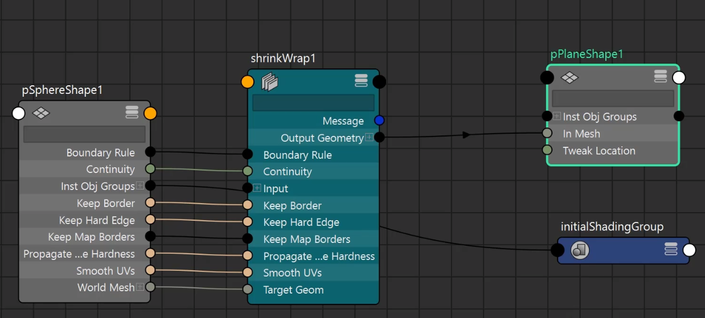

**ShrinkWrap Deformer（收缩包裹变形器 / Shrink Wrap）** 是 Autodesk Maya 中的一个**投影式表面贴合变形器**，专门用于将一个物体（wrapper / 包裹物）“收缩”并贴合到另一个物体（target / 目标表面）的表面上。

它特别适合**硬表面建模**、**快速贴合细节**、**修复拓扑**、**创建紧贴表面的元素**（如贴花、铆钉、面板贴合、衣服初步贴身等），是建模阶段的“神器”之一，尤其在硬表面和机械建模中非常流行。

### ShrinkWrap vs Wrap Deformer 核心对比（2025-2026 现状）

| 项目              | ShrinkWrap Deformer                     | Wrap Deformer                           | 谁更适合？                              |
|-------------------|-----------------------------------------|-----------------------------------------|------------------------------------------|
| 核心机制          | 顶点向目标表面**投影 + 收缩**（像 Shrink Wrap 塑料膜贴合） | 基于距离的**跟随 + 偏移保持**（像被“牵引”） | ShrinkWrap 更“紧贴表面”                 |
| 投影方向          | 支持 Along Axis / Vertex Normals / Closest Point 等 | 无明确投影方向，靠距离权重             | ShrinkWrap 控制更强                     |
| 贴合精度          | 高（可强制贴到表面）                    | 中等（可能有浮动/偏移）                 | ShrinkWrap 胜出                         |
| 拓扑要求          | 无（wrapper 和 target 拓扑可完全不同）  | 无                                      | 两者都灵活                              |
| 性能              | 较好（尤其 target 面数不高时）          | 中等（影响点多时慢）                    | —                                       |
| 典型用途          | 硬表面贴合、投影细节、快速 conform     | 衣服/软体跟随、low-res 驱 high-res      | ShrinkWrap 用于“贴紧”，Wrap 用于“跟随” |
| 动态响应          | target 变形 → wrapper 实时贴合          | target 变形 → wrapper 跟随偏移          | 两者都支持动态                          |
| 常见问题          | 可能翻转法线、拉伸 artifact             | 可能穿帮、抖动                          | —                                       |

### 核心原理（简单版）

ShrinkWrap 的计算逻辑：

1. 对于 wrapper（被变形物体）的**每个顶点**：
   - 根据选择的投影方式（Projection）决定射线方向：
     - **Closest Point**：找目标表面上最近的点（最常用，但可能不均匀）
     - **Along Axis**（X/Y/Z）：沿指定轴投影（适合平面/对称物体）
     - **Vertex Normals**：沿 wrapper 自身顶点法线向内/外投影（常用于有机/曲面贴合）
   - 沿着这个方向“射线”与 target 表面求交
   - 如果有交点 → 把顶点移动到交点位置（+ Offset 偏移量）
   - 如果无交点 → 根据 ClosestIfNoIntersection 选项 fallback 到最近点

2. 额外控制：
   - **Reverse**：反向投影（向外膨胀而不是收缩）
   - **Bidirectional**：双向检测（内外都算）
   - **Shape Preservation**：开启后会迭代平滑 + 保持形状（防过度拉伸/塌陷）
   - **Reprojection**：多步重投影（Steps + Iterations），让贴合更均匀、更干净

本质上：**ShrinkWrap = 顶点沿指定方向向目标表面做射线投影 + 贴合 + 可迭代优化**  
不像 Wrap 是“偏移跟随”，ShrinkWrap 是“强制投影贴表面”。

### 标准创建流程（最常用方式）

1. 准备：
   - **Target**（目标表面）：要贴合到的物体（通常先选）
   - **Wrapper**（要收缩的物体）：要被贴合的网格/曲线

2. 选择顺序：
   - 先选 **wrapper**（被变形物体）
   - 再选 **target**（目标表面） → Shift+多选如果有多个 target

3. 执行：**Deform → Shrink Wrap**（或 □ 打开选项窗口）

   **推荐初始选项**（硬表面贴合常用）：
   - Projection → **Vertex Normals**（最自然）
   - Closest If No Intersection → On
   - Reverse → Off（正常向内收缩）
   - Offset → 微调（如 0.01~0.1 防 Z-fighting）
   - Shape Preservation → Enable（防拉伸）
   - Steps / Iterations Per Step → 拉高（3~10，根据复杂度）
   - Reprojection → Reprojection Per Step（更平滑）

4. 创建后：
   - 在 Attribute Editor 的 **shrinkWrap** 标签下继续微调
   - 可 Paint Weights（但很少用，因为主要是投影而非权重）

### 典型实战场景（2025-2026 主流用法）

1. **硬表面细节贴合**：面板、铆钉、螺丝、贴纸快速 conform 到曲面
2. **衣服/布料初步贴身**：nCloth 前用 ShrinkWrap 快速收紧
3. **曲线贴表面**：如电路板走线、雕刻线沿表面投影
4. **修复/对齐**：把一个平面网格投影到复杂表面做 base
5. **与 Wrap 组合**：先 Wrap 跟随大形变 → 再 ShrinkWrap 强制贴紧细节

### 注意事项 & 常见问题解决

- **拉伸/ artifact** → 开启 Shape Preservation + 提高 Steps/Iterations
- **法线翻转/穿帮** → 试 Reverse 或换 Projection 方式
- **不均匀贴合** → 用 Vertex Normals + 多步 Reprojection
- **性能慢** → 降低 target 面数（用 proxy）或关闭不必要的选项
- **动态使用** → target 变形后 wrapper 会自动更新（适合 rigging preview）

一句话总结：  
**ShrinkWrap Deformer = “强制把物体顶点投影并收缩贴到目标表面的工具”，原理基于射线投影 + 表面求交 + 迭代优化，是硬表面建模的贴合神器。**
