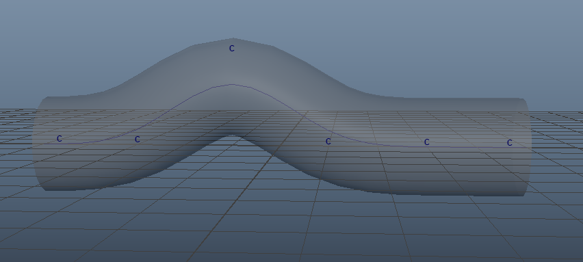
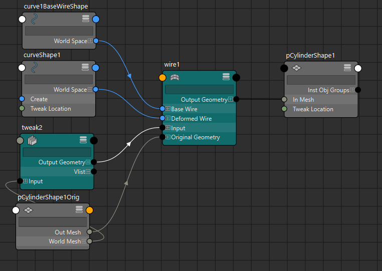

**Wire Deformer（线变形器 / Wire 变形）** 是 Autodesk Maya 中一个基于**NURBS曲线**的经典变形工具，特别适合**局部有机形变**、**面部细节控制**（如嘴唇、眉毛、眼睑）和**可变形线缆/绳索/触手**的建模与动画。

它像雕塑家用的**金属丝骨架（armature）**：你用一根或多根曲线作为“骨架”，弯曲/移动曲线，就能拉扯附近网格的顶点产生平滑、自然的变形。

### Wire Deformer vs 其他曲线/局部变形器对比（2025-2026 现状）

| 项目              | Wire Deformer                          | Curve Warp                             | Cluster (簇)                           | Blend Shape                            | 谁更适合？                              |
|-------------------|----------------------------------------|----------------------------------------|----------------------------------------|----------------------------------------|-----------------------------------------|
| 核心机制          | 基于**基线（base wire）**与**影响线（influence wire）**的径向偏移 | 物体沿曲线路径扭曲/拉伸                | 直接控制一组点                         | 顶点 delta 线性混合                    | Wire 用于“曲线拉扯局部”                 |
| 控制方式          | 弯曲/移动 NURBS 曲线                   | 曲线 + 扭曲参数                        | 操纵柄 / 权重画笔                      | 滑块 / 权重画笔                        | Wire 最直观曲线控制                     |
| 局部精度          | 高（Dropoff Distance 控制影响范围）     | 中等（整体路径）                       | 最高（可精确画权重）                   | 高（但需预雕形状）                     | Wire 平衡好                             |
| 典型用途          | 眉毛/嘴唇/眼睑、螺旋线缆、触手弯曲     | 头发/藤蔓沿路径生长                    | 手指/肌肉局部调整                      | 表情/口型                              | Wire 适合曲线驱动表情细节               |
| 性能              | 很好（曲线 CV 少时极快）               | 好                                     | 极好                                   | 多目标时差                             | —                                       |
| 支持旋转/扭曲     | 有限（大旋转易法线翻转/ artifact）     | 优秀（Twist 参数）                     | 需额外处理                             | 无                                     | Curve Warp 更稳                         |
| 权重控制          | 无逐顶点权重，只有**Set Membership** + Dropoff Distance | 无                                     | 有权重                                 | 有权重                                 | Wire 靠距离衰减                         |

### 核心原理（直白版）

Wire Deformer 的计算基于**“基线 vs 影响线”的相对变化**：

1. **创建时**：
   - Maya 自动复制当前曲线作为 **base wire**（基线，隐藏参考形状，记录“原始”状态）。
   - 当前曲线成为 **influence wire**（影响线，可编辑变形）。

2. **对于被变形网格的每个顶点 v**：
   - 找到 v 距离 influence wire 上**最近的点**（或投影点）。
   - 计算 v 到这个最近点的**径向偏移向量**（在 base wire 状态下）。
   - 当你移动/弯曲 influence wire 时：
     - influence wire 的对应点移动 → 计算新偏移。
     - 把原始径向偏移“贴”到新位置上 → v 跟着移动。
   - 影响强度随**距离衰减**（Dropoff Distance 控制衰减范围）。

本质：**Wire = “网格顶点像被附近曲线点‘磁性牵引’着，牵引方向垂直于曲线，强度随距离指数衰减”**  
这让它产生非常**平滑、自然的局部拉伸/弯曲**，不像 Cluster 那么生硬，也不像 Lattice 那么全局。

### 创建与使用标准流程

1. 准备：
   - 被变形物体（mesh，通常先选）
   - 一条或多条 NURBS 曲线（作为 influence wire）

2. 执行：**Deform → Wire**（或 Deform → Wire □ 选项）

3. 选择顺序：
   - 先选 **deformed object**（网格），按回车
   - 再选 **influence wire**（曲线），按回车

   **常见选项**：
   - **Dropoff Distance**：影响范围（默认 1.0，调大影响更远、更柔和）
   - **Scale**：整体强度（可动画）
   - **Envelope**：总强度（0~1）
   - **Base Wire**：自动创建，可手动编辑（高级用法）

4. 创建后：
   - 编辑曲线的 **CVs / EP** → 网格跟随变形
   - 用 **Paint Set Membership Tool**（Deform 菜单下）添加/移除受影响顶点（黑=不受影响，白=全影响）
   - 调 **Dropoff Distance** 软化边缘

**Wire Tool**（Create → Wire Tool）：
- 先用这个工具画曲线 → 自动创建 Wire deformer（适合快速原型）

### 典型实战场景（主流用法）

1. **面部 rigging**：眉毛上扬、嘴唇撅起、眼睑弧度（最经典！）
2. **螺旋/卷曲线缆**：电话线、耳机线、电源线自然卷曲
3. **触手/藤蔓局部弯曲**：比 Curve Warp 更局部控制
4. **辅助 corrective**：结合 Blend Shape，用 Wire 修特定区域
5. **与 Blend Shape 结合**：Wire 做动态细节，Blend 做大表情

### 注意事项 & 常见问题解决

- **大旋转/整体移动时 artifact**（法线翻转、扭曲怪）→ Wire 不太适合全局 rig 旋转，常需 Bake 或用 Blend Shape 替代
- **变形太生硬** → 加大 Dropoff Distance + 多条平行 Wire
- **影响范围不对** → 用 Paint Set Membership 精确控制哪些顶点参与
- **性能** → 曲线 CV 太多会慢，建议简化曲线
- **导出游戏引擎** → Wire 动画通常 Bake 到顶点动画或 Blend Shape（不直接支持）

一句话总结：  
**Wire Deformer = “用 NURBS 曲线当骨架，拉扯附近网格产生平滑局部形变”，原理基于基线与影响线的径向 delta 偏移 + 距离衰减，是面部细节和可变形曲线的神器。**

你现在是用 Wire 做面部（眼睑/嘴唇）、线缆建模，还是遇到旋转/抖动问题？可以具体说说，我给你调参或组合方案～