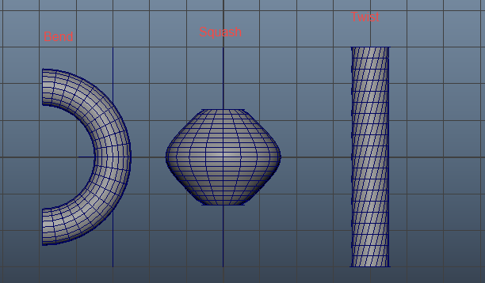

**Nonlinear Deformer（非线性变形器）** 是 Autodesk Maya 中一组非常经典、易用的**函数式变形工具**，它们基于数学函数（如正弦、弯曲、扭曲等）来快速产生周期性或渐变式的形变。

这些变形器通常用于：

- **建模阶段**：快速创建有机形状、波浪、螺旋、弯管等（非破坏性，可随时调整）
- **动画阶段**：制作卡通风格的挤压拉伸、波浪摆动、扭转动画（如蛇、触手、布料飘动、弹跳球等）

它们位于菜单：**Deform → Nonlinear →**（或 Deform → Create Nonlinear Deformer □）

### Maya 当前（2025-2026）包含的 Nonlinear Deformer 完整列表

Maya 的 Nonlinear Deformer 家族一直稳定在 **6 个核心类型**（从 Maya 早期版本到最新版都没有新增或删除）：

| 英文名称       | 中文常用称呼     | 核心数学函数 / 效果                          | 典型使用场景                              | 关键可调参数（Attribute Editor）                  |
|----------------|------------------|----------------------------------------------|--------------------------------------------|---------------------------------------------------|
| **Bend**       | 弯曲             | 沿指定轴向圆弧弯折                           | 手臂/腿弯曲、植物枝条、纸张卷曲、管道弯折 | Curvature（曲率）、Low/High Bound、Bend Direction |
| **Twist**      | 扭曲 / 扭转      | 沿轴向螺旋旋转扭曲                           | 毛巾拧干、钻头、蛇身扭动、电话线           | Start/End Angle、Low/High Bound、Twist Axis       |
| **Sine**       | 正弦波           | 产生正弦波状周期变形                         | 水波、触手/鞭子摆动、旗帜飘动、肌肉蠕动   | Amplitude（振幅）、Wavelength（波长）、Offset、Dropoff |
| **Squash**     | 压扁 & 拉伸      | 沿轴向体积保持的挤压 & 拉伸（经典卡通）      | 弹跳球、Q版角色跳跃、软体落地变形         | Factor（强度）、Expand（膨胀）、Low/High Bound    |
| **Flare**      | 喇叭 / 扩张      | 从中心向外/向内喇叭状扩张或收缩              | 爆炸绽放、花朵开合、裙摆、喇叭形物体      | Start/End Flare X/Z、Curve（曲线控制）、Low/High Bound |
| **Wave**       | 波浪             | 产生圆形涟漪波（从中心向外传播）             | 水面涟漪、冲击波、布料中心波动            | Amplitude、Wavelength、Offset、Speed（动画用）、Dropoff |

### 共同特点与核心原理

- **非线性**：不像线性变换（scale/rotate/translate），它们使用**非线性数学函数**来计算顶点位移 → 产生更有机、自然的变形
- **Handle + Deformer 节点**：创建后会出现一个**操纵柄（Handle）**（如弯曲的圆弧线、波浪线等）和一个 **nonlinear deformer 节点**（如 bend1、sine1）
  - Handle：直观拖拽调整范围、方向、强度
  - Deformer 节点：精确调参（Channel Box / Attribute Editor）
- **Bound 范围控制**：几乎所有都有 **Low Bound** 和 **High Bound**（默认 -1 ~ 1），决定变形在局部轴向上生效的区间（超出范围不变形）
- **Dropoff / Envelope**：边缘衰减（Dropoff）和整体强度（Envelope），让变形更柔和
- **可动画**：所有参数几乎都可 keyframe（如 Amplitude、Offset 动画 → 波浪传播）
- **可叠加**：多个 nonlinear 可以叠加（顺序影响结果，先 sine 再 bend ≠ 先 bend 再 sine）
- **权重支持**：支持 Paint nonlinear deformer weights（画权重），让局部区域强度不同（黑=0，白=1）

### 创建通用流程（最常用方式）

1. 选择要变形的几何体（mesh、NURBS、subdiv 等）
2. Deform → Nonlinear → 选择类型（如 Sine）（或 □ 打开选项窗口预设）
3. 创建后：
   - 拖动 Handle（中键拖动操纵器）
   - 或在 Channel Box / Attribute Editor 调参
   - 想局部？先用 Low/High Bound 限制范围，或 Paint Weights
4. 想永久？Edit → Delete by Type → History（保留形状）或 Freeze Transformations

### 快速记忆口诀（最常用组合）

- **卡通弹跳** → Squash（主） + Sine（次要抖动）
- **波浪/触手** → Sine（主） + Twist（加扭转）
- **植物/藤蔓** → Bend（主弯曲） + Wave（加涟漪）
- **爆炸/绽放** → Flare（主） + Scale 动画

### 注意事项（2025-2026 实用）

- **变形顺序** 很重要：Nonlinear 常放在历史栈前面（建模用）或 Skin 前（动画用）
- 高面数模型 + 多 nonlinear → 性能可能下降（建议用 proxy 低模测试）
- **不适合**：精确肌肉/表情（用 Blend Shape / Delta Mush 更好）；全局扭曲大旋转（易 artifact，用 Curve Warp 或 Wire 替代）
- **与新工具结合**：现代 pipeline 常把 Nonlinear 作为“快速原型” → 后期用 ML Deformer 或 Delta Mush 精修

一句话总结：  
**Nonlinear Deformers = Maya 里基于数学函数的“快速有机变形六兄弟”**（Bend、Twist、Sine、Squash、Flare、Wave），简单、直观、动画友好，是卡通/特效/建模的入门神器。