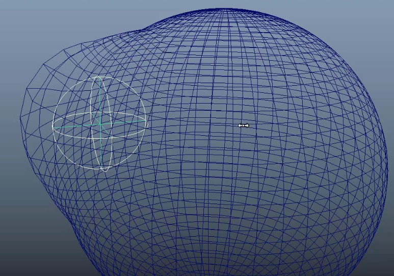

**Sculpt Deformer（雕刻变形器 / Sculpt Deformer）** 是 Autodesk Maya 中一个经典但相对“低调”的**球形影响变形器**，从 Maya 早期版本就存在（至今 2025-2026 仍保留），专门用于创建**圆润、局部、像“按压/挤压/拉伸”**的有机变形效果。

它不像 Nonlinear（Sine/Bend）那样基于函数，也不像 Blend Shape 那样预雕形状，而是用一个**可移动/缩放/旋转的球体（Sculpt Sphere）**作为影响物体，来“推挤”或“拉扯”附近网格，产生柔和的圆形凹陷/凸起。

### Sculpt Deformer vs 其他常见变形器对比（2025-2026 视角）

| 项目              | Sculpt Deformer                        | Lattice (晶格)                        | Cluster                               | Wire Deformer                         | Blend Shape                           | 谁更适合？                              |
|-------------------|----------------------------------------|---------------------------------------|---------------------------------------|---------------------------------------|---------------------------------------|-----------------------------------------|
| 核心机制          | 球体影响 + 投影/拉伸模式               | 格子空间映射                          | 点簇直接控制                          | 曲线径向偏移                          | 顶点 delta 线性混合                   | Sculpt 用于“圆形按压”                   |
| 控制物体          | 球形 Sculpt Sphere + Stretch Origin    | 可编辑格子点                          | 簇柄                                  | NURBS 曲线                            | 目标几何体                            | Sculpt 最简单（球体拖拽）               |
| 变形风格          | 圆润、柔和、局部“按压/鼓包”            | 整体/方形控制                         | 任意局部（需权重）                    | 沿曲线拉扯                            | 任意预雕形状                          | Sculpt 最“肉感/有机”                    |
| 典型用途          | 肌肉鼓起、面部按压、软体凹陷、指印     | 整体有机挤压                          | 手指/局部调整                         | 眉毛/嘴唇/触手                        | 表情/口型                             | Sculpt 适合“手指按面团/肌肉”            |
| 性能              | 很好（简单计算）                       | 好                                    | 极好                                  | 好                                    | 多目标差                              | —                                       |
| 权重控制          | 支持 Paint Weights（但少用）           | 支持                                  | 支持                                  | Set Membership + Dropoff              | 支持                                  | Sculpt 主要靠球体位置/大小              |
| 模式              | Volume / Project                       | —                                     | —                                     | —                                     | —                                     | Volume 最常用                           |

### 核心原理（最直白版）

Sculpt Deformer 有两种主要 **Mode**（模式），决定变形方式：

1. **Volume Mode**（体积模式，默认，最常用）  
   - 像一个“隐形气球”在网格内部/外部挤压。  
   - 球体内部的顶点被**推向球体表面**（或拉向中心，取决于 Inside/Outside）。  
   - 产生**圆润的凹陷或凸起**，边缘自然衰减。  
   - 常用于软体、肌肉、面团按压。

2. **Project Mode**（投影模式）  
   - 把网格顶点**投影到球体表面**上。  
   - 像把物体“贴”到球面上，适合创建圆形隆起或强制圆形变形。  
   - 投影方向可控（Along Axis 或 Closest）。

额外控制：
- **Stretch Origin Locator**（拉伸原点定位器）：在 Stretch 相关设置下，用来定义“拉伸的起点”，移动它可以产生不对称拉扯。
- **Dropoff Distance** / **Falloff**：影响范围衰减（越大越柔和）。
- **Inside / Outside**：决定球体内部还是外部生效。

本质：**Sculpt = “用可控球体作为‘虚拟模具’，把附近顶点推/拉/投影到球面或远离球心”**，计算基于距离 + 球体半径，产生非常自然的圆形有机变形。

### 创建与使用标准流程

1. 选择要变形的几何体（mesh）。
2. Deform → **Sculpt**（或 Deform → Create Sculpt Deformer □ 选项）。
   - **Mode**：Volume（最常用）或 Project。
   - **Inside / Outside**：根据需求选（Inside 常用于凹陷）。
   - **Dropoff Distance**：调大让边缘更软。

3. 创建后：
   - Outliner 中出现：
     - **sculpt*n*Sphere**（球体影响物体） → 移动/缩放/旋转它来变形！
     - **sculpt*n*StretchOrigin**（拉伸原点，可选）。
     - **sculpt*n***（deformer 节点）。
   - 直接在视窗拖动球体 → 实时看到圆润按压/鼓起效果。
   - 想动画？keyframe 球体的 translate/rotate/scale。

4. 进阶：
   - Paint Weights Tool → 画权重控制哪些区域受影响（黑=无，白=全）。
   - Prune Membership（Deform → Prune Membership → Sculpt）→ 清理无效点，提高性能。
   - 多 Sculpt 叠加 → 模拟多指按压或复杂肌肉。

### 典型实战场景（主流用法）

1. **软体/面团/脂肪按压**：手指按面团留下圆形指印（动画经典）。
2. **肌肉鼓起**：肩膀/二头肌在发力时局部隆起。
3. **面部 rigging 辅助**：脸颊鼓起、嘴唇微凸、眼袋按压。
4. **卡通/有机建模**：快速做圆润凹凸原型，后续用 Sculpt 工具精修。
5. **与 Wrap / Lattice 结合**：Sculpt 做局部肉感，Wrap 做跟随。

### 注意事项 & 小技巧

- **球体太小/太大** → 变形 artifact（调 Radius / Dropoff）。
- **多物体** → 可同时选多个物体创建共享 Sculpt。
- **不适合**：尖锐/线性变形（用 Bend/Twist）；大范围精确控制（用 Lattice/Cluster）。
- **性能**：简单高效，但高面数 + 多 Sculpt → 建议用 proxy 测试。
- **导出**：动画后 Bake 到 Blend Shape 或顶点缓存（游戏常用）。

一句话总结：  
**Sculpt Deformer = “用可拖拽球体创建圆润按压/鼓包变形的工具”**，原理基于球面投影/体积推挤 + 距离衰减，是软体/肌肉/有机局部变形的“隐形手指神器”。

你现在是用 Sculpt 做软体动画（像面团/肌肉），还是面部细节？遇到具体问题（凹陷不圆、边缘硬、动画抖）可以继续说，我给你参数或组合建议～