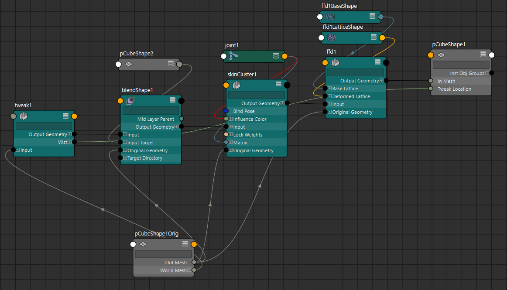
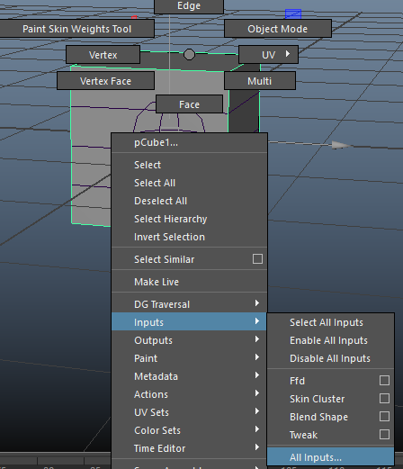
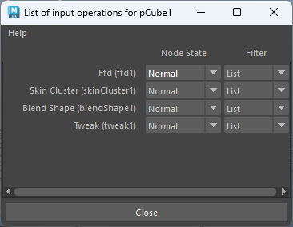

在 Autodesk Maya 的角色绑定体系中，**Deformation Order（变形顺序）**是一个非常核心但经常被低估的概念。它直接决定了模型在多个变形器（Deformer）叠加时的最终形态，是“结果正确与否”的关键因素之一。

---

# 一、Deformation Order 本质是什么？

**定义：**  
Deformation Order 指的是一个模型（Shape）上多个 Deformer 的**计算执行顺序（Evaluation Stack）**。

在 Maya 内部，本质是：

> Shape → Deformer1 → Deformer2 → Deformer3 → … → Final Output

也就是说：

- 每个 Deformer 的输出会作为下一个 Deformer 的输入
    
- 顺序不同，结果通常完全不同
    

---

# 二、常见 Deformer 顺序示例

典型角色绑定中，你会看到类似顺序：

```
BlendShape → SkinCluster → Corrective → Wrap → DeltaMush
```

但注意：**这不是固定规则，而是取决于目的**

---

# 三、不同顺序的技术差异（关键点）

## 1️⃣ BlendShape 在 SkinCluster 之前（Pre-Skin）

```
BlendShape → SkinCluster
```

### 特点：

- BlendShape 在“绑定前空间”（bind pose space）生效
- 结果会被骨骼变换影响
### 优点：

- 面部绑定标准做法
- Morph 不受骨骼扭曲影响
- 可预测性强

### 缺点：

- 无法针对姿态做修正（pose-dependent）

👉 常用于：
- FACS
- 面部表情系统
- ARKit / MetaHuman 流程

---

## 2️⃣ BlendShape 在 SkinCluster 之后（Post-Skin）

```
SkinCluster → BlendShape
```

### 特点：

- 在骨骼变形之后再做修型
### 优点：

- 可做 **Pose Space Deformation（PSD）**
- 可修正肘部、肩部塌陷
### 缺点：

- 需要驱动（通常用 pose reader）
- 管理复杂度高

---

## 3️⃣ Corrective Shape（典型组合）

```
SkinCluster → Corrective BlendShape
```

👉 本质：

- corrective 是 post-skin 的 blendshape
    

---

## 4️⃣ DeltaMush 的位置

```
SkinCluster → DeltaMush
```

### 作用：

- 平滑权重产生的 artifacts
    

### 注意：

- 如果放在 BlendShape 前 → 会破坏 shape 精度
    
- 通常放在最后
    

---

## 5️⃣ Wrap / Lattice 等

这些通常在：

```
(所有主要变形) → Wrap/Lattice
```

用于：

- 高级变形控制
    
- 驱动代理模型
    

---

# 四、为什么顺序如此重要？

因为变形是**非线性叠加的**

举个简单例子：

### 情况 A：

```
先弯曲手臂 → 再 bulge
```

### 情况 B：

```
先 bulge → 再弯曲
```

👉 结果完全不同：

- A：肌肉随弯曲产生
    
- B：bulge 被拉伸，失真
    

---

# 五、Maya 中如何控制 Deformation Order？

## 方法 1：Reorder Deformers（推荐）

```python
cmds.reorderDeformers("deformer1", "deformer2", "mesh")
```

👉 含义：

- 把 deformer1 放到 deformer2 前面
    

---

## 方法 2：Node Editor / Hypergraph

可以看到类似：

```
meshShapeOrig → skinCluster → blendShape → meshShape
```

---

## 方法 3：Inputs 面板
- 选中模型右键菜单

- 可以打开输入菜单
- 
- 这个菜单是一个栈结构，列出所有输入节点，最新新产生的节点会在栈底，后续产生的节点依次往里加
- 在这里可以修改变形顺序，鼠标中键拖拽即可
---

# 六、生产级绑定中的典型策略（很关键）

在实际项目（尤其你这种TA / Rigging pipeline）中，一般会设计明确的分层：

## 推荐结构（角色）

```
[Pre-Deform]
    └─ BlendShape (FACS / corrective base)

[Primary Deform]
    └─ SkinCluster

[Post-Deform]
    ├─ Corrective BlendShape
    ├─ Pose Space Deformation
    ├─ DeltaMush
    └─ Jiggle / Secondary
```

---

# 七、常见坑（你大概率遇到过）

### ❌ 1. BlendShape 顺序错误

→ 表情被拉扯

### ❌ 2. DeltaMush 放太前

→ shape 被“洗掉”

### ❌ 3. corrective 在 pre-skin

→ 完全不起作用

### ❌ 4. 多 skinCluster

→ evaluation 混乱（除非特殊 pipeline）

---

# 八、进阶：Evaluation Graph 角度

在现代 Maya（Parallel Evaluation）中：

- Deformer 仍然是 DAG + DG 混合计算
- 顺序通过 **geometry filter chain** 保证
- GPU deformation 也依赖顺序

👉 顺序错：

- 不只是结果错
- 还可能导致性能问题 / fallback CPU

---

# 九、结合你方向的建议（技术动画）

你如果在做：

### ✔ 面部系统（MetaHuman / FACS）

→ 必须：

```
BlendShape → SkinCluster
```

### ✔ 身体绑定优化

→ 推荐：

```
Skin → Corrective → DeltaMush
```

### ✔ 工具开发（你现在在做的）

建议你做一个：

👉 **Deformer Stack 管理工具**  
功能：

- 可视化 stack
    
- 一键 reorder
    
- 自动验证规则（lint）
    

---

# 总结（核心一句话）

> Deformation Order 决定了“模型是先被谁变形，再被谁修改”，本质是变形管线的执行顺序，而不是简单的节点排列问题。

---

如果你需要，我可以帮你进一步拆：

- Maya 内部 `geometryFilter` 链结构（API级）
    
- 如何写一个自动检测 deformation order 的 pipeline 工具
    
- 或者 UE5 / MetaHuman 中对应的 deformation stack 对比