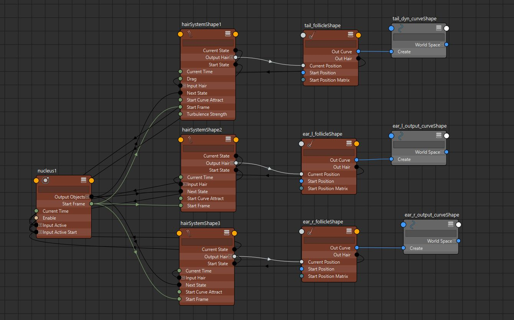

# IK_FK_Switch
- 使用父子约束实现IKFK切换
- 如果尾部骨骼不连接到髋关节可以使用blendColors节点实现IKFK切换，这样做可以使IKFK切换时避免骨骼直线运动。
- 
- 批量脚本
```python 
import pymel.core as pc

main_jnts = pc.selected()


for jnt in main_jnts:
    ctrl_attr = pc.PyNode("tail_root_ctrl").FK_IF_Switch
    ik_jnt_name = f"{jnt.getName()}_ik"
    fk_jnt_name = f"{jnt.getName()}_fk"
    blend_trans = pc.createNode("blendColors", name=f"{jnt.getName()}_trans_blend")
    blend_rotate = pc.createNode("blendColors", name=f"{jnt.getName()}_rotate_blend")

    pc.connectAttr(pc.PyNode(ik_jnt_name).translate, blend_trans.color1)
    pc.connectAttr(pc.PyNode(fk_jnt_name).translate, blend_trans.color2)

    pc.connectAttr(pc.PyNode(ik_jnt_name).rotate, blend_rotate.color1)
    pc.connectAttr(pc.PyNode(fk_jnt_name).rotate, blend_rotate.color2)

    pc.connectAttr(ctrl_attr, blend_trans.blender)
    pc.connectAttr(ctrl_attr, blend_rotate.blender)

    pc.connectAttr(blend_trans.output, jnt.translate)
    pc.connectAttr(blend_rotate.output, jnt.rotate)
```
# 创建splineIK
- 与脊椎类似，取消勾选rootOnCurve，创建SplineIK
- 
- 添加扭曲，仅需要末端控制器X轴旋转属性链接SplineIKHandle的Twist属性
- 
- 添加缩放
- 
- TODO：添加体积守恒
# 创建动态运动
- 创建dynamic控制器，跟FK控制器同理，并设为绿色
- 
- 复制尾巴IK曲线命名为tail_base_dyn_curve
- 选中该曲线执行
- 
- 
- 
- 我们将两条曲线和毛囊移出层级，删除空组
- 
- 这时候曲线可以做动态模拟，但是两端被钉住
- 我们选择毛囊（follicle）找到他的shape节点属性PointLock改为base
- 
- 点击播放
- 
- 现在我们需要骨骼跟随这条模拟曲线，我们使用混合变形来实现
- 选中模拟曲线和IKSpline曲线，执行混合变形
- 
- 当我们将blendshape的值设为1时，IK曲线变形为模拟曲线
- 
# 链接属性
## Simulation属性

- 使用尾巴根控制器的Simulation属性链接曲线混合变形的权重属性
- 
- 这样我们可以使用Simulation属性在IK状态和模拟状态之间切换
## FollowPose属性
- 现在我们链接Simulation控制器
- 我们选择tail_base_dyn_curve曲线，这条曲线是用于创建毛发模拟的曲线，而不是毛发模拟后生成的tail_dyn_curve曲线。
- 这条曲线可以定义模拟开始的初始Pose，我们将曲线上的控制点打簇（Cluster）
- 
- 前两个和后两个控制点打簇，中间的每个点打簇
- 
- 现在我们将簇作为模拟控制器的子对象
- 
- 现在我们可以使用模拟控制器来控制模拟开始的初始Pose
- 链接根控制器FollowPose属性到毛发系统shape节点start curve attract属性（起始曲线吸附）
- 
- 切换工具栏到FX，点击交互式播放，这样我们在播放模拟动画时可以实时控制模拟对象
- 
- 这样当我们打开FollowPose属性为1，模拟会以tail_base_dyn_curve曲线状态为基础模拟。不会垂到下面去，而是跟随tail_base_dyn_curve曲线状态。
## Enable属性
- Enable属性时控制模拟的开关
- 
## 动态结算属性
- 链接动态结算参数属性
- 
- 其中Drag属性相当于阻尼
- turbulence属性是一种扰动，会使尾巴看上去被狂风吹动
# 处理控制器
- pass
# 处理耳朵绑定
- 跟尾巴相同
- 需要注意的是，耳朵和尾巴的动态模拟基于一个全局的nucleus节点，这个nucleus节点有一个Enable属性，是全局的动态模拟开关
- nucleus节点链接不同的hairSystemShape，hairSystemShape再链接follicleShape，follicleShape再驱动曲线。

因此可以在总控制器添加一个Dynamic_Enable属性，用做全局的动态模拟开关
# 碰撞
- 可以使用一个代理模型进行碰撞，比如一个球
- 
- 选中这个球。执行
- 
- 选择当前驱动模拟的nucleus节点
- 
- 现在我们有了一个刚体
- 在需要碰撞的hairSystem节点属性中，启用碰撞
- 
- 现在就可以碰撞了，可以把刚体链接给头部骨骼或控制器实现刚体碰撞。