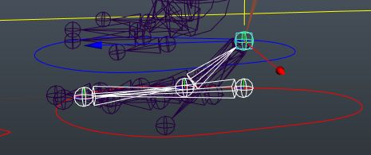

# 处理控制器和骨骼
- 创建`f"{LR}_paw_{FB}_ctrl"`控制器用于控制爪子的Roll和Bank，他们位于脚部IK层级之下
- 
- 为脚部IK添加属性
- 
- 现在腿部的IKFK骨骼也要包含爪子骨骼用于切换，父子约束主骨骼。且IK骨骼要新增脚趾末端骨骼和脚底骨骼用于IK制作
- 
# 绑定FK骨骼
- 给FK骨骼增加控制器，并父子约束FK骨骼，将控制器层级放置于脚部FK控制器之下。
- 
# 绑定IK骨骼
- 创建反转脚骨骼，记得冻结变换骨骼
- 
- 创建单链IK
- 
- 为每个脚趾IKHandle创建偏移组，可以使用脚本实现
- 
```python
import pymel.core as pc

def create_offset_grp:
	sel_objs = pc.selected()
	for obj in sel_objs:
		offset_grp = pc.group(empty=1, name=f"{obj.getName()}_offset")
		pc.matchTransform(offset_grp, obj)
		pc.parent(obj, offset_grp)

create_offset_grp()
```
- 将所有的IKHandle作为脚部IK控制器的子对象
- 
- 移除之前IK脚部骨骼的旋转约束，我们不再需要他，因为IK手柄l_rear_paw_ikHandle已经作为IK脚步控制器的额子对象，他会影响IK脚部骨骼的旋转
## 反转脚控制IK手柄
- 将腿部的主IK手柄从脚部控制器层级之下转移到反转脚l_rear_backcarpus_rev层级之下
- 
- 将所有的脚趾IKHandle转移到l_rear_ball_rev层级下
- 
- 所有的脚趾尖IKHandle转移到反转脚l_rear_tip_rev层级之下
- 
- 最后，将新增骨骼的IKHandle放置于l_rear_backcarpus_rev层级之下
- 
- 为脚趾每一个IKHandle打一个组，并将组的轴心移动到上一节骨骼的位置，该组用于脚趾关节的旋转
- 
## 链接控制器和反转脚
## Roll
- 
	- l_paw_rear_ctrl： RollAndBank 控制器，我们用他的Z轴位移实现Roll
	- multiplyDivide7：*=5，将Z轴位移值放大5倍 = ball的旋转值
	- plusMinusAverage3：25 - ball的旋转值
	- plusMinusAverage4：25 + plusMinusAverage3 用于条件节点
	- multiplyDivide9：plusMinusAverage3 * -1
	- condition4： ball的旋转值 是否小于0，是，返回0。否，返回ball的旋转值
	- condition5：ball的旋转值 是否小于0，是，返回ball的旋转值。否，返回0
	- condition3：控制器的Z轴位移值是否小于5，是，返回condition4的值（ColorIfTrueR）和0（ColorIfTrueG）。否，返回plusMinusAverage4（ColorIfTFalseR）和multiplyDivide9（ColorIfTFalseG）
## Bank

- 
	- multiplyDivide10：取反，*=-1
	- condition6：判断控制器X轴位移大于0。是，则返回旋转值和0。否，则返回0和旋转值
## 链接控制器和属性
- 实现Heeltwist和ToeTwist
- 
- 实现ToeTap和ToeCurl
- 使用控制器属性链接的是IKHandle层级制上的旋转偏移组
- 
- 实现ToeSpread属性，脚趾张开
- 
	- 使用paw spread属性链接脚趾IKHandle的X轴位移，使得他们向两侧移动，
	- 
	- 两侧移动幅度是+-1，中间两条是+-0.5
## 限制控制器
- 使用控制器属性中的Limit来限制控制器
- 
## 修改rear_leg_l_hock_ctrl的约束
rear_leg_l_hock_ctrl之前是被脚部IK控制器约束的，现在我们把约束节点删掉，用反转脚末端骨骼点约束rear_leg_l_hock_ctrl控制器偏移组
