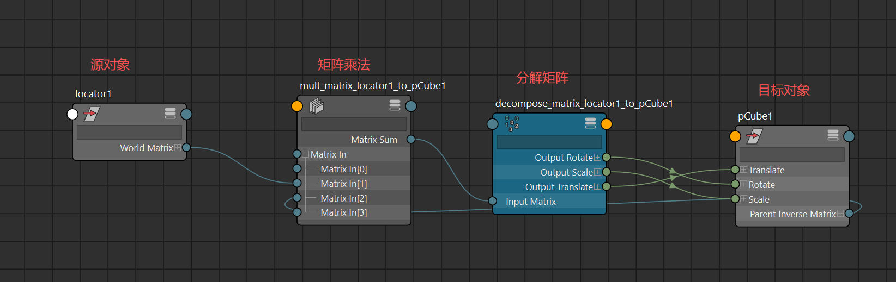
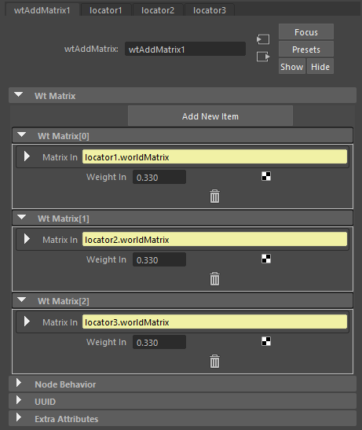
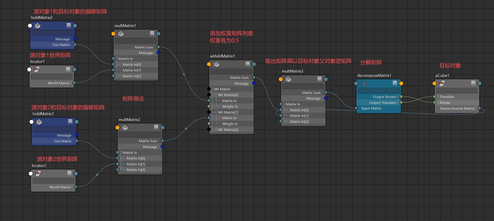

# 概述
使用矩阵约束代替约束节点可 降低性能消耗
## 算法
### 一对一约束
[Open: 1.0-矩阵约束算法-1759200212584.png](attachments/e128bfcc54c0fba81186d17c45727061_MD5.jpg)

- 关键点在于矩阵乘法
	- 对象之间的偏移矩阵 * 源对象的世界矩阵 * 目标对象的父对象逆矩阵
	- 对象之间的偏移矩阵 = 目标对象的世界矩阵 * 源对象的世界逆矩阵
	- 如果要保持目标对象父对象对目标对象的控制可以使用静态的目标对象的父对象逆矩阵，而非动态的连接节点
- 我们可以更进一步实现多个源对象对一个目标对象的约束，通过调整约束权重来实现约束分解
### 多对一约束
- 实现多对一约束要使用wtAddMatrix节点，该节点用于组合一个矩阵的加权列表。
- [Open: 1.0-矩阵约束算法-1759203346567.png](attachments/d8a912ee10c2ca38da05cbd10994952a_MD5.jpg)

- 实现多对一矩阵约束
- [Open: 1.0-矩阵约束算法-1759211572158.png](attachments/6f190aa01d87cd5338bc27e9f8db03c3_MD5.jpg)

>注意：此算法不能连接缩放，因为矩阵加权混合会产生非正交矩阵，**矩阵插值（加权相加）不是线性独立的变换插值**，特别是在涉及旋转时，会“污染”缩放部分。**矩阵的旋转部分是正交矩阵（orthogonal matrix）**，但当你对多个旋转矩阵进行线性插值后，结果矩阵往往会 **失去正交性**，也就是说：当你旋转某个源对象时，目标对象的 scale 属性看起来被“拉伸”或“压缩”了。
>要想解决此问题要使用maya python API 来编写节点实现：
>不是直接混合整个矩阵，可以分开插值：
- 平移用线性插值；
- 旋转用四元数 slerp；
- 缩放用线性插值；  
- 再组合成矩阵。