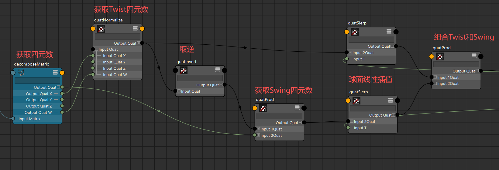
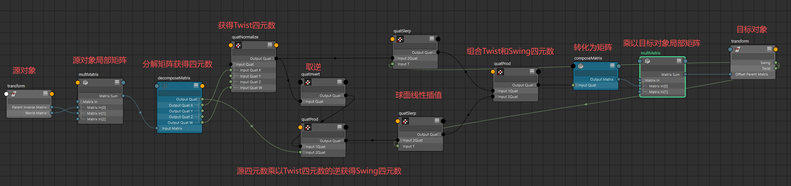
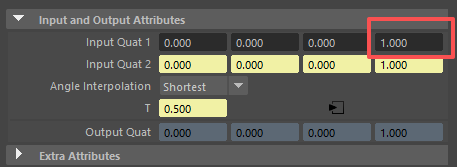
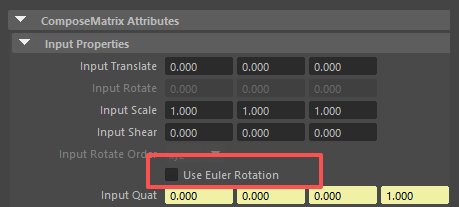

# 概述
- 在绑定中我们经常需要驱动手臂和腿肢体的扭转骨骼（TwistJoints）按照一定的比例进行扭转（Twist）和摆动(Swing)
- 我们可以将旋转转化为四元数，再将四元数分解为Twist和Swing，再将分解出的Twist和Swing进行Slerp球面线性插值
# 算法
## 核心算法
[Open: 2.0-将旋转分解为扭转和摆动-1759215836480.png](attachments/9520c17ea26bf1b72adb0688e0958da7_MD5.jpg)

- 我们当前的Twist轴为X轴，则源对象四元数（X,Y,Z,W）中的（x,0,0,w）为Twist四元数
- 我们用源对象四元数（X,Y,Z,W）乘以Twist四元数的逆，就获得了Swing四元数
- 我们分别对Twist四元数和Swing四元数进行球面线性插值Slerp，通过inputT参数来控制Twist和Swing幅度（0:1）
- 然后再将他们两个相乘组合为一个旋转四元数应用于目标对象
## 完整算法
[Open: 2.0-将旋转分解为扭转和摆动-1759217577367.png](attachments/92789379d44ced30f63600bd489a96a2_MD5.jpg)

- 源对象的世界矩阵 * 父对象逆矩阵 = 源对象本地矩阵
- 源对象本地矩阵 * 源对象本地矩阵逆矩阵（静态） = 源对象本地矩阵变化量
- 源对象本地矩阵变化量分解获得四元数
- 四元数提取（X,0,0,W）获取Twist四元数
- 源对象四元数（X,Y,Z,W）乘以Twist四元数的逆，获取Swing四元数
- 对Twist四元数和Swing四元数进行球面线性插值Slerp，注意Slerp节点的input1QuatW 要设为1

- 组合Twist和Swing四元数
- 转化为矩阵并乘以目标对象局部矩阵，注意转化为矩阵要取消勾选useEulerRotation属性

- 要将被驱动对象放到驱动对象同层级下
# 代码
```python
def connect_twist_swing(
    driver=None,
    driven=None,
    twist: float = 0.0,
    swing: float = 0.0,
    twist_axis: str = "Y",
    driven_is_joint=False,
):
    """
    将扭转和摆动驱动的矩阵连接到给定的对象。
    扭转和摆动值用于驱动四元数在源对象的局部矩阵和目标对象的局部矩阵之间进行插值。
        Args:
            driver (nt.Transform): 用于插值的源对象.
            driven (nt.Transform): 用于插值的目标对象.
            twist (float): 扭转值 (0.0 to 1.0).
            swing (float): 摆动值 (0.0 to 1.0).
            twist_axis (str): 扭转轴向 (X, Y, or Z).
            driven_is_joint (bool): 目标对象是否为骨骼
        Returns:
            None
    """
    # 获取对象
    if not driver or not driven:
        selection = pm.selected()
        if len(selection) < 2:
            pm.warning("请选择至少两个对象：第一个是源对象，第二个是目标对象。")
            return None
        driver, driven = selection[0], selection[1]
    with pm.UndoChunk():
        # 添加属性
        for attr in ["twist", "swing"]:
            if not driven.hasAttr(attr):
                driven.addAttr(
                    attr,
                    type=float,
                    minValue=0,
                    maxValue=1,
                    defaultValue=0,
                    keyable=True,
                )
        driven.twist.set(twist)
        driven.swing.set(swing)
        # 核心逻辑
        ## 计算源对象本地变化量矩阵
        ###计算源对象本地矩阵
        diver_local_matrix_node = pm.createNode(
            "multMatrix", name=f"{driver}_local_matrix"
        )
        driver.worldMatrix[0].connect(diver_local_matrix_node.matrixIn[0])
        driver.parentInverseMatrix[0].connect(diver_local_matrix_node.matrixIn[1])
        ### 计算本地逆矩阵
        driver_world_matrix = driver.worldMatrix[0].get()
        driver_parentInverseMatrix = driver.parentInverseMatrix[0].get()
        inverse_local_matrix = (
            driver_world_matrix * driver_parentInverseMatrix
        ).inverse()
        ### 对象动态本地矩阵 * 本地静态逆矩阵 = 变化量矩阵
        diver_local_matrix_node.matrixIn[2].set(inverse_local_matrix)

        ## 获取Twist四元数
        driver_quat_node = pm.createNode("decomposeMatrix", name=f"{driver}_quat")
        diver_local_matrix_node.matrixSum.connect(driver_quat_node.inputMatrix)
        driver_twist_node = pm.createNode("quatNormalize", name=f"{driver}_twist_quat")
        driver_quat_node.outputQuatW.connect(driver_twist_node.inputQuatW)
        driver_quat_node.attr(f"outputQuat{twist_axis}").connect(
            driver_twist_node.attr(f"inputQuat{twist_axis}")
        )
        ## 获取Swing四元数
        twist_invert_node = pm.createNode("quatInvert", name=f"{driver}_twist_invert")
        driver_twist_node.outputQuat.connect(twist_invert_node.inputQuat)
        driver_swing_node = pm.createNode("quatProd", name=f"{driver}_swing")
        twist_invert_node.outputQuat.connect(driver_swing_node.input1Quat)
        driver_quat_node.outputQuat.connect(driver_swing_node.input2Quat)
        ## 设置Twist和Swing的四元数插值
        twist_slerp_node = pm.createNode("quatSlerp", name=f"{driver}_twist_slerp")
        twist_slerp_node.input1QuatW.set(1)
        twist_slerp_node.inputT.set(twist)
        driven.twist.connect(twist_slerp_node.inputT)
        driver_twist_node.outputQuat.connect(twist_slerp_node.input2Quat)

        swing_slerp_node = pm.createNode("quatSlerp", name=f"{driver}_swing_slerp")
        swing_slerp_node.input1QuatW.set(1)
        swing_slerp_node.inputT.set(swing)
        driven.swing.connect(swing_slerp_node.inputT)
        driver_swing_node.outputQuat.connect(swing_slerp_node.input2Quat)

        slerp_quat_node = pm.createNode("quatProd", name=f"{driver}_slerp_quat")
        twist_slerp_node.outputQuat.connect(slerp_quat_node.input1Quat)
        swing_slerp_node.outputQuat.connect(slerp_quat_node.input2Quat)
        ## 计算目标对象偏移矩阵
        slerp_matrix_node = pm.createNode(
            "composeMatrix", name=f"{driver}_slerp_matrix"
        )
        slerp_matrix_node.useEulerRotation.set(0)
        slerp_quat_node.outputQuat.connect(slerp_matrix_node.inputQuat)

        driven_offset_matrix_node = pm.createNode(
            "multMatrix", name=f"{driven}_offset_matrix"
        )
        driven_worldMatrix = driven.worldMatrix[0].get()
        driven_parentInverseMatrix = driven.parentInverseMatrix[0].get()
        driven_local_matrix = driven_worldMatrix * driven_parentInverseMatrix

        slerp_matrix_node.outputMatrix.connect(driven_offset_matrix_node.matrixIn[0])
        driven_offset_matrix_node.matrixIn[1].set(driven_local_matrix)
        ## 连接最终计算出的矩阵到目标父偏移矩阵
        final_rotation_node = pm.createNode(
            "decomposeMatrix", name=f"{driven}_final_rotation"
        )
        driven_offset_matrix_node.matrixSum.connect(final_rotation_node.inputMatrix)
        final_rotation_node.outputRotate.connect(driven.rotate)
        ## 目标对象是骨骼，则jointOrient置零
        if driven_is_joint:
            for attr in [f"jointOrient{axis}" for axis in "XYZ"]:
                is_locked = driven.attr(attr).isLocked()
                if is_locked:
                    driven.attr(attr).setLocked(False)
                driven.attr(attr).set(0)
                if is_locked:
                    driven.attr(attr).setLocked(True)

```